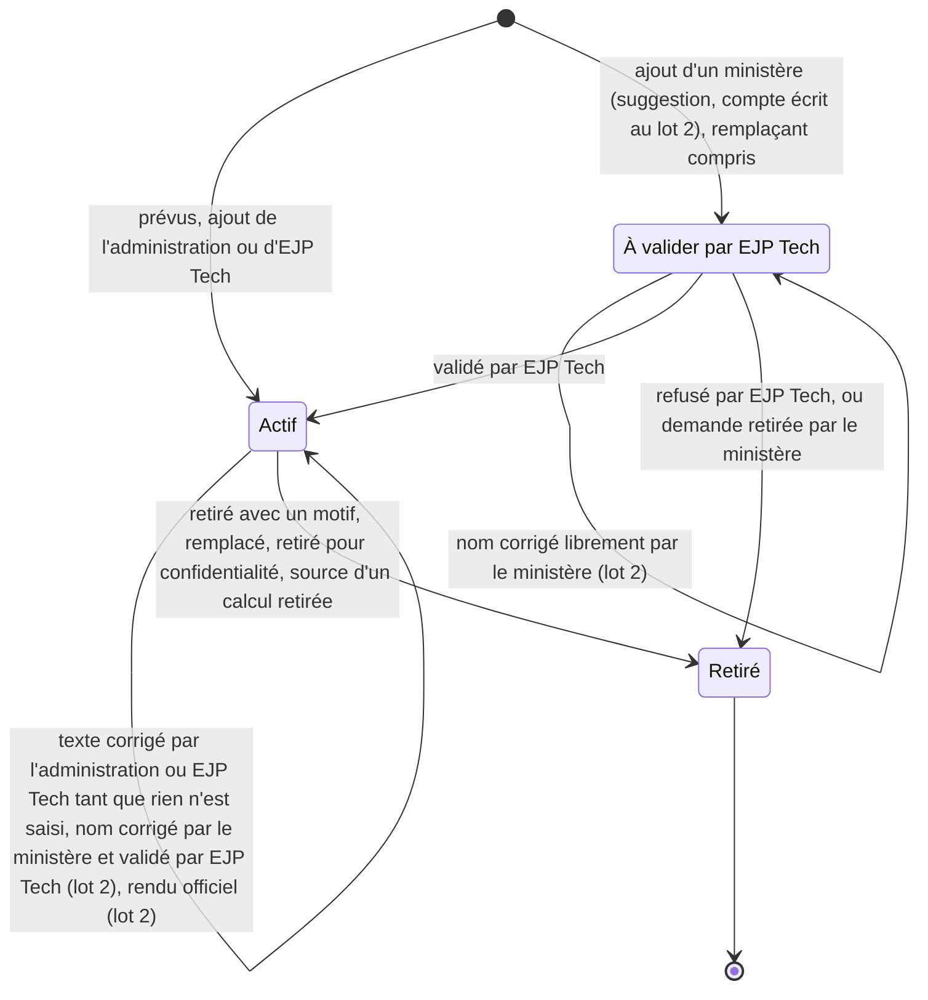

# Configuration des indicateurs

Statut : **Décidé le 6 octobre 2026, construit à l'étape 4** (décision T35 de `docs/decisions.md`,
accord écrit de la personne responsable sur `docs/plan-etape-4.md`) : le lot 1 côté base à
l'étape 4, ses écrans à l'étape 6, le lot 2 après la mise en service. Les questions de la section 10
ont reçu leur réponse (`docs/conception/vague-1-decisions.md`, 2.5), qui fait foi là où elle diffère.
Date : 5 octobre 2026, revue appliquée le même jour, puis alignée sur T30 le même jour, et de
nouveau le 6 octobre 2026.
Revu le 6 octobre 2026 (P45 à P47) : le mois en cours d'un indicateur sensible se saisit ; la
précision et la répartition par catégories sont décrites dans `docs/decisions.md` (P46, P47, T41).

Alignement sur T30 (`docs/conception/validation-metier.md`) et sur les décisions de la personne
responsable du 5 et du 6 octobre 2026 :

- EJP Tech valide **seulement la création** d'un indicateur par un ministère, **suggestions
  comprises** (décidé), ni par l'administration ni sur sa demande écrite (4.3). Les chiffres et les
  événements ne se valident pas ;
- toute création par un ministère porte un texte **« Pourquoi cet indicateur ? »** (10 à 280
  caractères, sans rappel sur les données personnelles : exception voulue par la personne
  responsable, 6 octobre 2026), lu par EJP Tech pour décider, jamais recopié dans le journal (4.3,
  7.3) ;
- tant qu'il attend, l'ajout est **visible du berger et du conseil**, marqué « à valider », il se
  saisit déjà et ses valeurs n'entrent dans aucune somme ; refusé (motif de 10 à 280 caractères),
  il passe dans « Retirés » sans valeur (2, 4.4, 4.5) ;
- **correction du nom** (lot 2) : le ministère corrige librement le nom de son ajout tant qu'il
  attend EJP Tech ; une fois l'ajout validé, sa correction repart à EJP Tech, sans perte de valeur
  ni arrêt des saisies, et l'indicateur garde son nom validé jusqu'à la décision (4.6) ;
- EJP Tech configure sur l'écran Indicateurs comme l'administration, et y décide, dans un bloc
  « À valider » (7.1) ; pour les gestes autres que la validation, la procédure reste une question
  à la coordination (Q13) ;
- la validation vaut relecture : les textes d'indicateur ne passent pas par la Modération (6.3) ;
- l'alerte de valeur inhabituelle devient la confirmation « Vérifiez ce chiffre » du ministère,
  sans validation ni marque (6.2) ;
- les questions auxquelles la personne responsable a répondu sont retirées et la liste est
  renumérotée (section 10).

Là où `validation-metier.md` dit plus (tables `demande_indicateur` et `validation`, bloc « À
valider », chiffres inhabituels), il fait foi.

Numérotation : les numéros de ce document suivent le tableau « Renumérotation du 6 octobre 2026 »
en tête de `docs/decisions.md` (T33 et T34 : anciens T26 et T27 ; T35 : ancien T29 ; T29 : EJP Tech
lit tout).

Sources : `docs/conception/kpi-ministeres.md` (analyse des 185 demandes, annexe et questions),
`docs/sources/kpi-coordination-2026-10.md` (les « lignes » citées sont celles de ce fichier),
`docs/decisions.md` (P06, P07, P15 à P30, T29 à T35), `BRIEF.md` (sections 2 à 4, 6, 7 et 9). Ce
document fait la synthèse de trois conceptions étudiées et de deux évaluations indépendantes
(section 11). Là où `kpi-ministeres.md` (3.7 à 3.9 et 6) diffère, ce document le remplace (T35).

## 1. Besoin et décisions de départ

### Demande d'EJP Tech (5 octobre 2026)

- Un écran de configuration des indicateurs, utilisé par l'administration de l'église et EJP
  Tech. Une première vague par migration est acceptable, l'écran vient ensuite.
- Les ministères peuvent, « dans certaines limites », créer leurs propres indicateurs, de façon
  propre, efficace et réfléchie.
- La première proposition (un formulaire : nom, saisi ou calculé, fréquence, unité, visibilité,
  une case « sensible » et quelques avertissements sur le nom) n'était pas assez mûre.
- EJP Tech voit tous les chiffres, en lecture seule (T29).
- Décisions du 5 et du 6 octobre 2026 (T30) : EJP Tech seul valide la création d'un indicateur
  par un ministère, au vu de son « Pourquoi cet indicateur ? » ; tant qu'un ajout attend, le berger
  et le conseil le voient, marqué « à valider », et il n'entre dans aucun total ; le ministère
  corrige le nom de son ajout selon la règle de 4.6.

### Ce qui existe et ce que cette conception change

| Décision          | Contenu aujourd'hui                                                                                 | Effet de cette conception                                                                                                                                        |
| ----------------- | --------------------------------------------------------------------------------------------------- | ---------------------------------------------------------------------------------------------------------------------------------------------------------------- |
| BRIEF, section 4  | indicateurs propres créés par migration, deux natures, plafond de 9999                              | créés à l'écran après une première vague ; trois rythmes ; plafond par sorte de nombre                                                                           |
| BRIEF, section 11 | « écran de création des indicateurs propres » hors de la V1                                         | rouvert à la demande d'EJP Tech (lot 1)                                                                                                                          |
| P06               | l'administration de l'église ne voit ni les fiches ni les points                                    | elle voit aussi les définitions et l'usage des indicateurs propres (« saisi 4 mois sur 5 »), jamais une valeur                                                   |
| P08               | indicateurs propres créés par EJP Tech par migration, deux natures                                  | première vague par migration, puis l'écran ; trois rythmes                                                                                                       |
| P16               | nature « mois »                                                                                     | reprise : mois en cours et deux précédents à l'écran ; la base borne aussi les mois trop anciens (3.1)                                                           |
| P19               | table `indicateur_calcul` écrite par migration                                                      | remplacée : un calcul est une ligne d'`indicateur` qui ne se saisit pas                                                                                          |
| P22               | indicateurs sensibles, valeur absente du journal                                                    | reprise ; plus aucune valeur d'indicateur propre au journal ; lecture des lignes brutes proposée en 3.7                                                          |
| P29               | migration `journal_administration_chiffres` ; écran de configuration en phase 3                     | migration inutile ; l'écran passe au lot 1                                                                                                                       |
| T33               | colonnes `unite`, `valeur_max`, `groupe`, `sensible`                                                | `unite` et `sensible` gardées ; plafond fixé par sorte de nombre ; pas de `groupe` (3.5) ; ni « jours », ni « minutes » en V1                                    |
| T34               | catalogue `private.indicateur_modele`, matérialisé par un trigger sur `ministere` ; lots successifs | catalogue `private.indicateur_prevu` (5.5) ; un bouton « Créer » remplace le trigger ; plus de lot après la première vague                                       |
| T29               | EJP Tech lit tous les chiffres                                                                      | EJP Tech configure sur l'écran Indicateurs comme l'administration (procédure des gestes autres que la validation : Q13), lit, ne saisit rien                     |
| T30               | EJP Tech seul valide les indicateurs créés par les ministères ; un ajout à valider est visible      | toute création d'un ministère porte un « Pourquoi » et naît « à valider » (4.3) ; visible du berger et du conseil ; refusée, sans valeur ; nom corrigé selon 4.6 |

### Exigences

| Code | Exigence                                                                                                                                                                                                                                                                                                       |
| ---- | -------------------------------------------------------------------------------------------------------------------------------------------------------------------------------------------------------------------------------------------------------------------------------------------------------------- |
| F1   | L'administration ajoute, corrige, remplace et retire les indicateurs de tout ministère à l'écran, sans migration ; EJP Tech aussi (procédure : Q13).                                                                                                                                                           |
| F2   | La première vague (indicateurs prévus par la coordination) s'écrit une fois par migration dans un catalogue, puis se crée en un clic par ministère.                                                                                                                                                            |
| F3   | Un ministère ajoute des indicateurs à lui, dans des limites que la base impose : une suggestion au lot 1, un compte écrit par lui au lot 2 ; chaque ajout porte un « Pourquoi cet indicateur ? » et EJP Tech seul le valide (T30).                                                                             |
| F3b  | Tant qu'un ajout attend, le berger et le conseil le voient, marqué « à valider » ; il se saisit déjà, et ses valeurs n'entrent dans aucune somme (T30).                                                                                                                                                        |
| F4   | Une valeur calculée (taux, moyenne, somme de l'année) ne se saisit jamais.                                                                                                                                                                                                                                     |
| F5   | Une valeur saisie garde pour toujours son sens : libellé et définition ne se corrigent que tant que rien n'est saisi ; ensuite, on remplace l'indicateur. Seule exception (T30, lot 2) : la correction d'une faute dans le nom d'un ajout de ministère, libre tant qu'il attend, validée par EJP Tech ensuite. |
| F6   | Tout total s'affiche avec sa complétude, y compris dans le temps (« 9 mois sur 9 »).                                                                                                                                                                                                                           |
| F7   | Aucun nom ni information personnelle dans un libellé, une définition ou un « Pourquoi » ; les textes d'un ministère sont lus par EJP Tech quand il valide l'ajout ou la correction.                                                                                                                            |
| F8   | Chaque geste écrit une seule ligne de journal, sans texte libre ni valeur d'indicateur propre.                                                                                                                                                                                                                 |
| F9   | L'administration de l'église voit les définitions et l'usage, jamais la valeur d'un indicateur propre (P06 revue).                                                                                                                                                                                             |
| F10  | Les règles vivent dans la base ; l'écran les interroge au lieu de les recopier.                                                                                                                                                                                                                                |

Non fonctionnelles :

- **Ajout seulement** : `mesure` et `journal` restent en ajout seulement. `indicateur` est une
  table de référence (comme `ministere`) : ses seuls changements sont listés en 5.9, faits par des
  fonctions et tracés au journal. Aucune suppression.
- **Sécurité** : RLS sur toute table exposée, aucun GRANT d'écriture directe, `security definer`
  seulement dans `private`, `exige_aal2()` en tête de chaque fonction de l'API.
- **Dates** : heure de Paris (`private.aujourdhui()`, `private.dimanche_reference()`, et
  `(x at time zone 'Europe/Paris')::date` pour un horodatage), jamais `current_date`.
- **Entretien** : une seule table de définitions, un seul trigger nouveau, aucune table de versions
  ni de cache. L'outil est temporaire et l'équipe est bénévole : ce qui n'est pas nécessaire à la
  mise en service va au lot 2.

## 2. Vue d'ensemble

### Deux lots

Presque toute la complexité vient des libellés libres écrits par les ministères : mots refusés,
limites, validation. Ils passent donc après la mise en service. La validation par EJP Tech, elle,
existe dès le lot 1 pour les suggestions qu'un ministère ajoute (décidé le 6 octobre 2026), avec
leur « Pourquoi cet indicateur ? » : elle est construite avec la validation métier
(`validation-metier.md`, section 7).

| Lot                                      | Quand                                                  | Contenu                                                                                                                                                                                                                                                                                                                                                                                                     |
| ---------------------------------------- | ------------------------------------------------------ | ----------------------------------------------------------------------------------------------------------------------------------------------------------------------------------------------------------------------------------------------------------------------------------------------------------------------------------------------------------------------------------------------------------- |
| Lot 1                                    | avant la mise en service (V1)                          | première vague ; écran Indicateurs (ajouter, calcul, corriger tant que rien n'est saisi, remplacer, retirer, retirer pour confidentialité, usage) ; « Mes indicateurs » du ministère limité aux suggestions, chacune avec son « Pourquoi cet indicateur ? », seul texte libre du lot, et à valider par EJP Tech (T30) ; fiche, sommes, courbes, calculs ; « Chiffres du mois » ; journal sans valeur propre |
| Lot 2                                    | après la mise en service, si EJP Tech le confirme (Q1) | comptes écrits par un ministère (libellé et définition libres), à valider par EJP Tech comme tout ajout : mots refusés aux ministères, limite sur 30 jours, correction du nom (4.6), « Rendre officiel », jeu des 185 libellés (l'alerte de valeur inhabituelle devient la confirmation « Vérifiez ce chiffre » de la validation métier, section 3)                                                         |
| Plus tard, si la coordination le demande | sans date                                              | sorte « minutes » (K22), courbe d'un « à ce jour » et du total de l'église (3.4), calcul sur un chiffre commun (K8)                                                                                                                                                                                                                                                                                         |

Au lot 1, un ministère qui veut un chiffre absent des suggestions le demande à l'administration de
l'église, qui le crée à l'écran le jour même. Le lot 2 s'ajoute par une migration de plus, sans
toucher aux saisies. Les passages qui ne concernent que le lot 2 le disent.

### Les notions

Huit mots suffisent à l'écran :

- **Chiffres communs** : STARs au service, STARs actifs, dont en FIJ. Ils ne se configurent pas.
- **Indicateur** : un nombre entier qu'un ministère saisit. Il a un libellé (ce qu'on compte, 2 à
  60 caractères), une définition (« Ce qu'on compte exactement », 10 à 140 caractères) et un
  rythme.
- **Rythme** : « Chaque dimanche », « Chaque mois » ou « À ce jour ».
- **Sorte de nombre** : un compte (jusqu'à 9 999), un grand compte (jusqu'à 9 999 999) ou des
  euros.
- **Calcul** : un taux ou une moyenne de deux indicateurs du même ministère. Il ne se saisit pas.
- **Prévus** : les indicateurs que la coordination a choisis pour un ministère (première vague).
- **Suggestions** : quelques indicateurs déjà définis, utiles à plusieurs ministères (« Événements
  couverts »), qu'un ministère ajoute en disant pourquoi, puis qu'EJP Tech valide.
- **Retirer** : le geste qui arrête un indicateur ; ses saisies restent.

Mentions affichées : « Ajouté par Kumi le 12 oct. », « Sensible : 1 et 2 s'affichent moins de 3 »,
« Libellé corrigé le 14 oct. », « Retiré le 3 nov. », « À valider par EJP Tech depuis 2 jours »,
« Refusé le 8 oct. » et, pour le ministère seulement, « Correction du nom envoyée le 9 oct. ».

Refusé, parce qu'aucune demande ne l'exige ou qu'une convention suffit : groupe ou rubrique, nature
« semaine », « trimestre », « année » ou « jour », formule libre, plafond libre, ordre manuel,
brouillon, versions, niveaux d'autonomie, suppression, réactivation.

Conventions, sans option à l'écran (nommées R1 à R6 pour ne pas les confondre avec les questions
C1 à C3 de `kpi-ministeres.md`) :

- **R1** : le libellé dit seulement ce qu'on compte, sans « Nombre de », sans période ni unité :
  « Publications », pas « Nombre de publications réalisées ce mois ». L'écran ajoute la période
  (« Publications, septembre 2026 »).
- **R2** : un dispositif se nomme en tête du libellé : « Pages Roses : profils actifs », « Prière
  des Stars : sessions ». Cela remplace les groupes (3.5).
- **R3** : tout indicateur du dimanche ou du mois a sa petite courbe et la somme de ses périodes
  depuis janvier, avec sa complétude. Un stock (membres, inscrits, articles en réserve) se saisit
  « à ce jour » : la somme de ses mois n'aurait pas de sens.
- **R4** : le sens est figé. Rythme, sorte de nombre, ministère, case sensible et calcul ne
  changent jamais. Libellé et définition se corrigent tant que rien n'est saisi, par
  l'administration ou EJP Tech (4.6). Au lot 2, le ministère corrige le nom de ses ajouts :
  librement tant qu'ils attendent EJP Tech, puis par une correction que valide EJP Tech, saisies
  comprises (T30, 4.6).
- **R5** : toute valeur saisie est un entier positif ou nul ; aucune décimale ne se saisit.
- **R6** : la fiche range les indicateurs par rythme, puis par ordre alphabétique : les lignes
  d'un même dispositif se suivent.

### Qui fait quoi

| Geste                                                            | Administration de l'église         | EJP Tech                                                           | Ministère                                                            | Berger et conseil                                                       |
| ---------------------------------------------------------------- | ---------------------------------- | ------------------------------------------------------------------ | -------------------------------------------------------------------- | ----------------------------------------------------------------------- |
| Créer les indicateurs prévus d'un ministère                      | oui                                | oui                                                                | non                                                                  | non                                                                     |
| Ajouter un indicateur (compte, grand compte, euros, sensible)    | oui, sur toute fiche active        | oui (procédure : Q13)                                              | non ; lot 2 : un compte simple, sur sa fiche, à valider              | non                                                                     |
| Ajouter une suggestion                                           | oui                                | oui                                                                | sur sa fiche, dans ses limites, avec son « Pourquoi », à valider     | non                                                                     |
| Ajouter un calcul                                                | oui                                | oui (procédure : Q13)                                              | non (il le demande)                                                  | non                                                                     |
| Corriger un libellé ou une définition, tant que rien n'est saisi | tous, sauf communs et suggestions  | idem                                                               | lot 2 : le nom de ses ajouts qui attendent, librement, même saisis   | non                                                                     |
| Corriger le nom d'un ajout validé, saisies comprises (lot 2)     | non                                | non : il valide la correction                                      | oui, la correction attend EJP Tech ; le nom validé reste d'ici là    | non                                                                     |
| Remplacer ou retirer, avec un motif                              | tous, sauf les communs             | oui (procédure : Q13)                                              | ses ajouts, sauf la source d'un calcul ; un remplaçant est à valider | non                                                                     |
| Retirer pour confidentialité                                     | tous, sauf les communs             | idem                                                               | non                                                                  | non                                                                     |
| Valider ou refuser un ajout ou une correction d'un ministère     | non                                | oui, seul (T30), dans le bloc « À valider » de l'écran Indicateurs | non                                                                  | non ; il voit l'ajout, marqué « à valider »                             |
| Rendre officiel l'ajout d'un ministère (lot 2)                   | oui                                | oui (procédure : Q13)                                              | non                                                                  | non                                                                     |
| Lire le texte d'un ajout avant de décider                        | oui, sans décider                  | oui : la validation vaut relecture                                 | les siens                                                            | oui                                                                     |
| Lire le « Pourquoi cet indicateur ? »                            | non (proposé, V1 de la validation) | oui, pour décider                                                  | les siens                                                            | non (proposé, V1 de la validation)                                      |
| Lire les définitions                                             | toutes                             | toutes                                                             | les communs et les siennes                                           | toutes, ajouts à valider compris                                        |
| Lire les valeurs                                                 | chiffres communs seulement         | toutes, en lecture (T29)                                           | les siennes                                                          | toutes ; marquées pour un ajout à valider ; jamais pour un ajout refusé |
| Lire l'usage (« saisi 4 mois sur 5 », sans valeur)               | oui                                | oui                                                                | le sien                                                              | sur la fiche                                                            |

La validation d'un ajout de ministère revient à EJP Tech seul, sans demande de l'administration
(T30, décidé). Pour les autres gestes qui changent ce qui est suivi (ajouter un grand compte, des
euros, un indicateur sensible ou un calcul, remplacer, retirer, rendre officiel), la base laisse
les deux profils agir, car l'écran est commun. La procédure n'est pas décidée : EJP Tech agit-il
de lui-même, comme l'administration, ou sur sa demande écrite, comme pour P07 (EJP Tech demande,
l'église décide) ? C'est la question Q13. Si la coordination choisit la demande écrite, les
fonctions peuvent réserver ces gestes à l'administration : un contrôle de plus dans chacune, sans
autre changement.

Les chiffres communs, le catalogue et la liste des mots refusés ne changent que par une migration
d'EJP Tech. Écrire une définition n'est pas saisir un chiffre : EJP Tech ne saisit toujours rien au
nom d'un ministère (T29).

### Cycle de vie d'un indicateur



- **Actif** : proposé à la saisie, affiché sur la fiche, compté dans les limites.
- **À valider** (T30) : visible du berger et du conseil, marqué « à valider par EJP Tech » ; il se
  saisit déjà, et ses valeurs s'affichent marquées, sans somme de l'année ni calcul (décidé le 6
  octobre 2026) ; compté dans les limites du ministère. EJP Tech décide dans le bloc « À valider »
  de l'écran Indicateurs (`validation-metier.md`, 5.1), au vu du « Pourquoi ». Validé, toutes ses
  valeurs comptent, périodes passées comprises.
- **Correction du nom à valider** (lot 2) : l'indicateur reste actif sous son nom validé ; les
  saisies continuent et comptent ; seul le ministère voit la correction qui attend. Validée, le nom
  change, avec les mêmes valeurs ; refusée, le nom validé reste.
- **Refusé** : retiré avec le motif de retrait « Refusé », posé par la base, et le motif écrit par
  EJP Tech (une ligne de `validation`). Ses valeurs ne s'affichent plus sur aucune fiche ; le
  ministère, le berger et le conseil lisent la date et le motif sous « Retirés ».
- **Demande retirée** : un ajout retiré par le ministère avant la décision suit la règle d'un
  retrait ordinaire (ci-dessous).
- **Retiré** : définitif, comme un point traité. Plus de saisie ; l'historique reste sur la fiche
  sous « Retirés ». Un indicateur retiré sans aucune saisie disparaît des fiches et des limites (un
  calcul compte les saisies de ses sources), mais sa ligne reste en base : le journal le cite
  toujours. Son libellé redevient libre.
- **Retiré pour confidentialité** : libellé et définition masqués ; l'indicateur disparaît des
  fiches avec ses valeurs (6.3).
- Aucune suppression, aucune réactivation. Pour reprendre un chiffre retiré, on en ajoute un
  nouveau : la courbe repart de zéro. La fenêtre « Retirer » le dit avant de confirmer.

## 3. Les sortes d'indicateurs

### 3.1 Rythmes

| Rythme          | Ce qu'on saisit                        | Date (`date_ref`)                      | Où                                | Demandes (annexe) | Exemples réels                                                                                                                            |
| --------------- | -------------------------------------- | -------------------------------------- | --------------------------------- | ----------------- | ----------------------------------------------------------------------------------------------------------------------------------------- |
| Chaque dimanche | le nombre du dimanche ou de sa semaine | le dimanche, passé ou du jour          | formulaire du dimanche (08)       | 22                | NA (Intégration, l. 16), Cultes captés (MCAD, l. 95), Sainte cène distribuées (MPI, l. 134), Espaces Care (MDS, l. 269)                   |
| Chaque mois     | le total d'un mois                     | le 1er du mois, posé par l'écran       | « Chiffres du mois » (nouveau)    | 74                | Publications (Communication, l. 47), Demandes reçues (Tech, l. 82), Articles vendus (Merch, l. 151), Tâches réalisées (Entretien, l. 213) |
| À ce jour       | où on en est (un stock, des inscrits)  | le jour de la saisie, posé par la base | formulaire du dimanche, prérempli | 25                | Projets en cours (Film, l. 73), Stock disponible (Merch, l. 155), Inscrits (Prodiges Junior, l. 280), Badges actifs (MDS, l. 273)         |

- Une semaine se compte comme un dimanche (la semaine du lundi au dimanche). Une année se calcule.
- **Mois (P16)** : le formulaire propose le mois en cours et les deux précédents ; « Choisir un
  autre mois » ouvre les mois plus anciens, pour un rattrapage (K3). La base refuse un autre jour
  que le 1er, un mois futur, un mois avant le 1er janvier de l'année précédente et, pour un
  indicateur sensible, le mois en cours ; toutes ces bornes se calculent à partir de
  `private.aujourdhui()`. Si la réponse à K3 le demande, la borne devient le 1er janvier de l'année
  de création de l'indicateur. La saisie la plus récente d'un mois fait foi.
- Proposé (Q19) : le mois en cours s'affiche à part (« Octobre en cours : 5 ») ; il n'entre ni
  dans la somme ni dans la complétude, qui ne comptent que les mois finis.

### 3.2 Sortes de nombre et bornes

Chaque valeur est un entier de 0 au plafond de sa sorte. Le plafond n'est pas réglable : trois
sortes couvrent toutes les demandes de la V1.

| Sorte        | Plafond                  | Qui la choisit           | Demandes                                                                                                                     | Affichage   |
| ------------ | ------------------------ | ------------------------ | ---------------------------------------------------------------------------------------------------------------------------- | ----------- |
| Compte       | 9 999                    | tous                     | presque toutes                                                                                                               | « 14 »      |
| Grand compte | 9 999 999                | administration, EJP Tech | 5 (K7) : portée (l. 50), vues et abonnés (l. 52), spectateurs du direct (l. 101), vues cumulées de Film et MCAD (l. 76, 102) | « 12 480 »  |
| Euros        | 9 999 999, à l'euro près | administration, EJP Tech | 2, si K6 : chiffre d'affaires (Merch, l. 150), fonds levés (Social, l. 66)                                                   | « 5 164 € » |

- Les chiffres communs restent des comptes (9 999).
- **Minutes** : pas en V1. Si la coordination retient le retard du début du culte (K22, l. 42),
  une petite migration ajoute la sorte « minutes » (plafond 999) ; proposé : sans somme de
  l'année. Ce qu'on saisit quand le culte commence en avance reste à trancher (Q20).
- Abandonné : l'unité « jours » de T33. Les trois délais demandés (Film l. 77, Tech l. 86,
  Entretien l. 212) se suivent objet par objet ; ils deviennent des comptes ou sont retirés (P21).

### 3.3 Ce qu'on compte exactement

Chaque indicateur a une définition obligatoire, de 10 à 140 caractères, affichée sous le champ de
saisie et, sur la fiche, au clic sur le libellé. Elle répond aux questions de sens de l'analyse :
publications, contenus ou campagnes (K24) ; portions ou personnes servies (K37) ; pic ou moyenne
des spectateurs (K34) ; profil actif des Pages Roses (K43c). Sans elle, deux personnes du même
compte partagé comptent différemment.

- Exemple de forme, pour « Stock disponible » : « Articles du merch en réserve le jour de la
  saisie, toutes tailles confondues. » Le contenu exact vient des réponses des ministères
  (question Q17).
- Pour les chiffres communs, la définition reprend les aides de l'écran 08 (« Les STARs qui ont
  servi dans votre ministère ce dimanche. Si personne n'a servi, enregistrez 0. »).

### 3.4 Valeurs calculées

Trois mécanismes, dont deux automatiques :

- **Somme de l'année** (automatique), pour tout indicateur du dimanche ou du mois : somme des
  périodes finies de l'année civile (heure de Paris), avec la complétude. L'écran dit que c'est
  une somme : « Somme des mois depuis janvier : 112 (9 mois sur 9). », « Somme des dimanches
  depuis janvier : 410 (40 dimanches sur 40). ». Pour des personnes, c'est une somme de présences,
  pas un nombre de personnes différentes (P21) : la définition le dit (« Les participantes
  présentes dans le mois ; une même personne compte chaque mois où elle vient. »). Elle couvre les
  7 cumuls demandés : NA et NC (l. 17, 19), Welcome Prodiges (l. 21), baptisés (l. 37), actions
  sociales (l. 65), participants de la Prière des Stars et de la chaîne de prière (l. 124, 130).
- **Petite courbe** (automatique), pour un indicateur du dimanche ou du mois seulement : 10
  dimanches ou 12 mois, trous gardés, et son équivalent texte. Elle couvre 2 des 3 évolutions
  demandées : audience (l. 104) et ventes (l. 158). Un « à ce jour » n'a pas de courbe : la fiche
  montre sa valeur et sa date. Restent pour plus tard, si la coordination les demande :
  l'évolution des STARs actifs (l. 265), qui est la courbe du total de l'église d'un chiffre commun
  (vue de l'église, K12 et K15), et l'évolution des abonnés, vues et portée (l. 50, 52, 56), qui
  demanderait une courbe mensuelle d'un « à ce jour » (valeur en vigueur à la fin de chaque mois).
- **Calcul déclaré** : un taux ou une moyenne de deux indicateurs saisis.
  - Taux : haut sur bas, en %, arrondi à l'entier. « Taux de résolution : 80 % en septembre (16
    sur 20). Depuis janvier : 78 % (9 mois sur 9). »
  - Moyenne : haut par bas, une décimale à l'affichage, unité du haut. « Panier moyen : 23,4 € en
    septembre (1 240 € pour 53 commandes). » (si K6)
  - Sources : deux indicateurs saisis, actifs, distincts, du même ministère, non sensibles, jamais
    un chiffre commun. Même rythme, ou bien un bas « à ce jour » : on prend sa valeur en vigueur à
    la fin de la période, et l'écran affiche sa date quand elle a plus de 30 jours (règle 13).
  - Le calcul prend le rythme de son haut et, pour une moyenne, l'unité de son haut.
  - Deux « à ce jour » (taux de complétion de Formation, l. 251) : le résultat du jour, avec les
    deux dates ; aucune valeur sur l'année.
  - Sur l'année : somme des hauts sur somme des bas, sur les périodes qui ont les deux valeurs,
    jamais une moyenne de taux (comme le pourcentage FIJ, règle 4).
  - « Non calculé » si le bas manque ou vaut 0 : « Non calculé : demandes reçues de septembre non
    saisies. »
  - Couverture : les 6 taux calculables de l'analyse (Film l. 78, Tech l. 88, Formation l. 251,
    Sécurité l. 244, Prodiges Junior l. 282 si K5, Merch l. 153 si K6), et Multilingue (demandes
    satisfaites sur demandes, proposé par EJP Tech).
  - Proposé : pas de chiffre commun comme source. Le « taux de présence des équipiers » de MCAD
    (l. 115) supposerait que les équipiers soient les STARs au service, ce que K8 doit confirmer.
    Si c'est le cas, une migration accepte un chiffre commun comme bas, lu pour le ministère du
    calcul.

**Complétude dans le temps** (règle 13 du BRIEF, à compléter à la confirmation) :

- Une période est finie jusqu'au dimanche de référence, ou si le mois est avant le mois en cours.
- Proposé (Q19) : la somme part de la plus récente de deux dates, le 1er janvier ou la période qui
  contient l'ajout de l'indicateur (`(cree_le at time zone 'Europe/Paris')::date`). Si le
  ministère a rattrapé une période plus ancienne de l'année, le départ recule jusqu'à elle. L'écran
  nomme toujours le départ : « Depuis janvier », « Depuis juillet », « Depuis le dimanche 6
  sept. ».
- Périodes attendues : les périodes finies depuis le départ, où le ministère était actif
  (`private.actif_le`) et l'indicateur pas encore retiré. Saisies : celles qui ont une valeur.
- Un calcul part de la plus récente des deux dates de départ de ses sources.

### 3.5 Rubriques

Pas de colonne `groupe` (T33). Cinq ministères sur 22 rangent leurs KPI par dispositif (MCAD,
MPI, Kumi, Eagles, MDS). La convention R2 (« Pages Roses : profils actifs ») et l'ordre
alphabétique (R6) suffisent à regrouper ces lignes, sans réglage ni écran de plus. Les intitulés
seuls (« Captation / diffusion », « Audience ») ne deviennent pas des indicateurs.

### 3.6 Activités

Pas de nature « jour » (P17, phase 2 si K57). Les activités se comptent par mois, et la moyenne par
activité se calcule :

- « Welcome Prodiges : sessions » et « Welcome Prodiges : présents » (chaque mois), puis le calcul
  « Welcome Prodiges : présents par session » (moyenne). Même schéma pour la Prière des Stars
  (l. 122, 123) et les baptêmes (l. 36).
- Un rassemblement qui réunit les STARs de plusieurs ministères reste une session « Autre
  rassemblement » déclarée par l'administration (règle 5, D2, K35).

### 3.7 Domaines sensibles

- Case « Domaine sensible », posée par l'administration ou par EJP Tech (procédure : Q13).
  Elle impose le rythme « mois » et la sorte « compte », et interdit tout calcul sur l'indicateur.
  La base impose qu'un indicateur qui en remplace un sensible soit sensible.
- 11 demandes : Santé (prises en charge, interventions, incidents avec intervention, orientations,
  l. 140 à 143), Social (bénéficiaires, personnes accompagnées, nouveaux bénéficiaires, l. 61 à
  63), Call your sister (Kumi, l. 194), la plate-forme d'écoute (Eagles, l. 206), nouveaux enfants
  et enfants déjà venus (Prodiges Junior, l. 279 et 284).
- Saisie du mois, **mois en cours compris** (P45, qui remplace « mois écoulés seulement » de P22) :
  la base accepte le mois en cours, refuse un mois futur. La fiche montre la valeur du mois, marquée
  « en cours » pour le mois en cours, jamais la suite des saisies ; le journal ne porte aucune valeur
  ni aucune ligne d'indicateur sensible (5.10).
- **Lecture des lignes brutes** (proposé, à confirmer par EJP Tech, Q9) : `kpi-ministeres.md`
  (4.2) prévoyait de fixer à l'étape 4a une lecture par la vue du mois seulement. Cette conception
  propose de laisser les lignes de `mesure` lisibles par l'API pour le ministère, le berger, le
  conseil et EJP Tech, comme pour tout indicateur. Raison : le mois est clos avant toute saisie,
  donc deux saisies du même mois ne montrent qu'une correction, jamais la date d'un fait. Si la
  coordination retient le seuil « moins de 3 » (K5c), l'afficher ne suffit plus : la vue applique
  le seuil et la lecture directe des lignes sensibles se ferme (5.6).
- Lus par le ministère, le berger, le conseil et EJP Tech (T29) ; jamais par l'administration,
  jamais sur la vue de l'église, jamais dans un email (P31).
- Un ministère ne crée jamais un indicateur sensible (4.1) ; tout ce qu'il ajoute est validé par
  EJP Tech (4.3). Proposé (V4 de la validation) : les indicateurs sensibles sont contrôlés comme
  les autres par la confirmation « Vérifiez ce chiffre », qui ne montre au ministère que ses propres
  valeurs ; rien n'est montré à un autre profil (`validation-metier.md`, 3.1).
- Un chiffre jugé sensible après coup (« Interventions » saisi chaque dimanche sans la case) se
  retire pour confidentialité (4.6, 6.3).

### 3.8 Chiffres financiers

Pas de marque à part : la sorte « euros » suffit. Elle est réservée à l'administration et à EJP
Tech (procédure : Q13), avec les mêmes lecteurs que tout indicateur propre ; l'administration ne voit
pas la valeur, sauf si K6b le décide (P23). La marge (l. 157) attend des coûts que personne ne
saisit ; le budget de Production (l. 166) devient un point d'attention. La comptabilité de l'église
fait foi.

### 3.9 Hors périmètre

| Demande                                                                         | Nombre | Pourquoi, et où elle va                                                                                                  |
| ------------------------------------------------------------------------------- | ------ | ------------------------------------------------------------------------------------------------------------------------ |
| Comptages d'événements (Coordination, MDS)                                      | 7      | lus dans `evenement_etat`, sans configuration : phase 2 (P20)                                                            |
| Grands graphiques                                                               | 7      | petites courbes seulement (K15)                                                                                          |
| Textes, listes, classements (Merch l. 154, Production l. 166, Entretien l. 216) | 3      | points d'attention                                                                                                       |
| Suivi de personnes, délais par objet                                            | 11     | remplacés par des comptes agrégés (P21)                                                                                  |
| Courbe d'un « à ce jour » ou du total de l'église (l. 50, 52, 56, 265)          |        | plus tard, si la coordination la demande (3.4)                                                                           |
| Taux entre deux rythmes sur l'année (conversion NA vers FIJ)                    |        | ratio de totaux à confirmer (K4a)                                                                                        |
| Chiffres par département (Coordo FIJ)                                           |        | phase 3 (P27)                                                                                                            |
| Total de l'église d'un indicateur propre                                        |        | pas en V1 ; en phase 3 si la coordination le demande (K12), avec les règles de complétude et de double compte (kpi, 4.5) |
| Calcul sur un chiffre commun (MCAD l. 115)                                      |        | si K8 le confirme (3.4)                                                                                                  |
| Connexion aux plateformes, formules à plus de deux termes                       |        | saisie à la main (P24) ; deux termes au plus                                                                             |

### 3.10 Couverture des 185 demandes

| Destination (annexe) | Nombre  | Ce que cette conception en fait                                                                                                  |
| -------------------- | ------- | -------------------------------------------------------------------------------------------------------------------------------- |
| Actuel               | 31      | indicateurs du dimanche ou à ce jour ; pour la ligne 52, la valeur sans son évolution                                            |
| Mois                 | 68      | indicateurs du mois, dont 10 sensibles                                                                                           |
| Calculé              | 23      | 15 servis (7 sommes de l'année, 2 courbes, 6 calculs déclarés), 7 comptages d'événements en phase 2, 1 courbe plus tard (l. 265) |
| Activité             | 3       | comptes du mois et une moyenne                                                                                                   |
| À préciser           | 27      | entrent sans changer le modèle, une fois la réponse connue                                                                       |
| Commun               | 12      | rien à créer ; refusés à un ministère par la base au lot 2 (6.1)                                                                 |
| Remplacé             | 11      | comptes agrégés                                                                                                                  |
| Courbe               | 7       | petites courbes ; la portée de la ligne 56 est un « à ce jour », sans courbe                                                     |
| Hors mesures         | 3       | points d'attention                                                                                                               |
| **Total**            | **185** | 117 servis directement, 50 sans changement de modèle, 18 hors configuration                                                      |

Au lot 1, tout cela passe par les prévus, les suggestions et l'administration. Le lot 2 ne sert pas
plus de demandes : il rend les ministères autonomes.

## 4. Indicateurs créés par un ministère

### 4.1 Ce qui est permis

Depuis « Mes indicateurs », un ministère ajoute :

- **une suggestion** (lot 1), en disant pourquoi : un indicateur déjà défini, commun à plusieurs
  ministères (5.11). Son libellé et sa définition sont ceux du catalogue et ne se corrigent pas sur
  une fiche : le même chiffre garde le même sens dans tous les ministères. Proposé : cela rendrait
  possible une comparaison entre ministères, si la coordination la demande un jour (aucune question
  ne la pose aujourd'hui) ;
- **son propre compte** (lot 2), en quatre champs : pourquoi, ce qu'il compte (libellé), ce qu'il
  compte exactement (définition) et le rythme. Sorte « compte » seulement, jusqu'à 9 999.

Il ne crée jamais un indicateur sensible, un grand compte, des euros ni un calcul : ceux-là se
demandent à l'administration de l'église, en dehors de l'outil comme aujourd'hui. Au lot 1, il
demande de la même façon un chiffre absent des suggestions.

Chaque ajout d'un ministère porte un « Pourquoi cet indicateur ? », naît « à valider », et EJP
Tech seul le valide ou le refuse (4.3, T30). Au lot 2, le ministère corrige une faute dans le nom
de son ajout : librement tant qu'il attend EJP Tech ; une fois l'ajout validé, par une correction
que valide EJP Tech, sans perte de valeur ni arrêt des saisies (4.6, décision du 6 octobre 2026).
Ainsi, ce qu'EJP Tech a validé ne change pas sans lui.

### 4.2 Limites et raisons

Toutes sont vérifiées par la base, sous un verrou `for update` sur la ligne du ministère (deux
personnes du compte partagé peuvent cliquer en même temps). Les dates se calculent à l'heure de
Paris.

| Limite                                                                 | Lot | Valeur proposée | Raison                                                                                                          | Message                                                                                                       |
| ---------------------------------------------------------------------- | --- | --------------- | --------------------------------------------------------------------------------------------------------------- | ------------------------------------------------------------------------------------------------------------- |
| Ajouts du ministère actifs ou à valider                                | 1   | 3               | la charge de saisie ; avec les 6 prévus au plus (K13), la saisie reste courte                                   | « Votre ministère a déjà 3 indicateurs à lui. Retirez-en un pour en ajouter un autre. »                       |
| Indicateurs d'une fiche, actifs ou à valider, calculs compris          | 1   | 12              | la lecture du berger ; MCAD demande 19 KPI, Kumi 13, MPI et MDS 12                                              | « Votre fiche compte déjà 12 indicateurs. Demandez à l'administration de l'église d'en retirer un. »          |
| Source d'un calcul                                                     | 1   | non retirable   | un calcul de l'administration ne disparaît pas sans elle                                                        | « Ce chiffre sert au calcul « Taux de résolution » : demandez à l'administration de l'église de le retirer. » |
| Sorte de nombre                                                        | 1   | compte          | les grands nombres et les montants demandent un choix de l'église                                               | aucun : le choix n'est pas proposé                                                                            |
| Ajouts du ministère sur 30 jours, retirés compris, refusés non compris | 2   | 3               | ajouter puis retirer en boucle casse les courbes ; un refus d'EJP Tech ne coûte pas de place au ministère (T30) | « Vous avez ajouté 3 indicateurs ces 30 derniers jours. Vous pourrez en ajouter un autre à partir du 4 nov. » |
| Mots refusés aux ministères                                            | 2   | 6.1             | 6.1                                                                                                             | message de la famille de mots                                                                                 |

La date « à partir du 4 nov. » est celle du plus ancien des trois ajouts, plus 30 jours, à l'heure
de Paris. Ces valeurs sont des choix, pas des mesures (question Q2). L'administration et EJP Tech ne
sont tenus que par la limite de 12 par fiche. Un remplacement ne compte pas l'indicateur qu'il
remplace (5.8).

### 4.3 Validation par EJP Tech (T30)

Décidé par la personne responsable le 5 octobre 2026, précisé le 6 octobre : **EJP Tech seul
valide la création d'un indicateur par un ministère**, ni l'administration, ni sur sa demande. EJP
Tech ne valide rien d'autre : ni les chiffres, ni les événements. La revue précédente proposait une
validation par l'administration dans quatre cas à risque (ministère d'un domaine sensible, prévus
pas encore créés, mot de la famille « sensible ») et laissait les autres ajouts actifs tout de
suite : ces conditions et les options qui les comparaient sont abandonnées.

- **Ce qui naît « à valider »** : toute création par un ministère, suggestion comprise (décidé),
  compte écrit par lui (lot 2) et remplaçant (lot 2). Un indicateur ajouté par l'administration ou
  par EJP Tech est actif tout de suite.
- **« Pourquoi cet indicateur ? »** : champ obligatoire de chaque création par un ministère, 10 à
  280 caractères, sans rappel sur les données personnelles (exception voulue par la personne
  responsable, 6 octobre 2026). EJP Tech le lit pour décider ; il n'est jamais recopié dans le
  journal ; seuls le ministère et EJP Tech le lisent (V1 de la validation, décidé). Il vit dans une demande (`demande_indicateur`,
  `validation-metier.md`, 6.2), pas dans `indicateur`.
- **Tant qu'il attend** : visible du berger et du conseil, marqué « à valider par EJP Tech » ; il
  se saisit déjà, et ses valeurs s'affichent marquées, hors de toute somme et de tout calcul ; il
  compte dans les limites du ministère (4.2). Le ministère n'attend donc pas EJP Tech pour suivre
  son chiffre.
- **Où se décide** : proposé (V3 de la validation), dans un bloc « À valider » en tête de l'écran
  Indicateurs (7.1, `validation-metier.md`, 5.1), sans onglet à part. L'administration y lit
  l'attente, sans bouton et sans « Pourquoi ».
- **Ce que regarde EJP Tech** : le « Pourquoi », l'utilité pour le ministère, pas de doublon d'un
  chiffre commun ou d'un autre indicateur, libellé et définition clairs, aucun nom, pas un domaine
  sensible. Les indices de `verifier_libelle` l'aident (« Libellé proche : Activités réalisées,
  dans les suggestions » ; un mot de la famille « sensible »). La validation vaut relecture : ces
  textes ne passent pas par la Modération (6.3).
- **Validé** : actif ; toutes ses valeurs entrent dans les sommes, périodes passées comprises.
  **Refusé** : retiré avec le motif de retrait « Refusé », posé par la base, et le motif écrit par
  EJP Tech, de 10 à 280 caractères ; ses valeurs ne s'affichent plus ; un refus ne compte pas dans
  la limite sur 30 jours (4.2).
- **Correction du nom** (lot 2) : voir 4.6.
- **Attente longue** : aucune décision automatique ; au-delà de 7 jours, la ligne dit « en retard »
  et l'administration lit « 1 ajout attend EJP Tech depuis plus de 7 jours. Prévenez EJP Tech. »
  (`validation-metier.md`, 2.6).
- **Coût à la mise en service** : la file peut recevoir jusqu'à 66 ajouts la première semaine (3 par
  ministère, 22 ministères), une borne haute, chacun avec son « Pourquoi » à lire.

Le berger peut lire le libellé d'un ajout avant la décision d'EJP Tech : c'est le risque que le
BRIEF accepte déjà pour les points d'attention, ici réduit par un texte plus court, filtré (6.1) et
lu par EJP Tech dans la semaine.

### 4.4 Visibilité

| Profil                     | Définition d'un ajout                                                                      | Valeurs                                                                            |
| -------------------------- | ------------------------------------------------------------------------------------------ | ---------------------------------------------------------------------------------- |
| Le ministère lui-même      | oui, dans tous les états                                                                   | oui                                                                                |
| Berger, conseil            | oui, ajouts à valider compris (marqués) ; un ajout refusé sous « Retirés », avec son motif | oui, sur la fiche ; marquées pour un ajout à valider ; jamais pour un ajout refusé |
| EJP Tech                   | oui                                                                                        | oui, en lecture (T29)                                                              |
| Administration de l'église | oui, avec l'usage                                                                          | non (P06)                                                                          |
| Autres ministères          | non : ni le libellé ni la valeur                                                           | non                                                                                |
| Vue de l'église, emails    | jamais (P30, P31)                                                                          | jamais                                                                             |

Aujourd'hui, un ministère lit les libellés des indicateurs propres de tous les autres : la lecture
se resserre aux communs et aux siens (question Q3). Le « Pourquoi cet indicateur ? » d'un ajout
n'est lu que par le ministère qui l'a écrit et par EJP Tech (proposé, V1 de la validation).

### 4.5 Ce que voit le berger

Sur la fiche du ministère (04), un ajout du ministère s'affiche comme les autres indicateurs, à sa
place dans le rythme, avec la mention discrète « Ajouté par Kumi le 12 oct. ». Il a sa valeur, sa
courbe, sa somme de l'année et sa complétude. Un ajout à valider apparaît à sa place, marqué « à
valider par EJP Tech depuis 2 jours », avec ses valeurs s'il en a, sans somme de l'année, sans
courbe ni calcul : il n'entre dans aucun total (T30). Un ajout refusé passe sous « Retirés », avec
« Refusé le 8 oct. : « motif ». », sans valeur. Une correction du nom qui attend EJP Tech (lot 2)
ne se voit pas : le berger lit le nom validé jusqu'à la décision, puis « Libellé corrigé le 10
oct. ». Rien ne change dans « Cette semaine », la phrase de la fiche ni la vue de l'église.

### 4.6 Faire évoluer : corriger, remplacer, retirer, rendre officiel

| Geste                                           | Qui                                                                                                                                                          | Effet                                                                                                                                                                                                                                                                                                                                                                                                                               |
| ----------------------------------------------- | ------------------------------------------------------------------------------------------------------------------------------------------------------------ | ----------------------------------------------------------------------------------------------------------------------------------------------------------------------------------------------------------------------------------------------------------------------------------------------------------------------------------------------------------------------------------------------------------------------------------- |
| Corriger le libellé et la définition            | l'administration et EJP Tech pour tous, sauf les communs et les suggestions                                                                                  | permis tant qu'aucune valeur n'est saisie (pour un calcul : aucune valeur de ses sources), donc aucune saisie ne change de sens. Sur un ajout à valider, EJP Tech décide sur le texte actuel. « Libellé corrigé le 14 oct. » sur la fiche                                                                                                                                                                                           |
| Corriger le nom de son ajout (lot 2)            | le ministère, pour ses ajouts (jamais une suggestion, un prévu ni l'ajout d'un autre ministère) ; proposé, la définition aussi (V2 de la validation)         | tant que l'ajout attend EJP Tech : correction immédiate, même avec des valeurs, et EJP Tech décide sur le nom actuel. Une fois l'ajout validé : la correction attend EJP Tech ; d'ici là, l'indicateur garde son nom validé, les saisies continuent et comptent ; validée, le nom change avec les mêmes valeurs ; refusée, le nom validé reste. Une correction plus récente remplace celle qui attend (`validation-metier.md`, 2.4) |
| Remplacer                                       | l'administration et EJP Tech (procédure : Q13) ; lot 2 : le ministère pour ses ajouts non officiels, et le remplaçant est à valider                          | pour changer de rythme, de sorte ou de sens, ou de texte après une saisie : un nouvel indicateur et le retrait de l'ancien dans la même transaction. Deux courbes, jamais fusionnées : « Remplace « Problèmes signalés » (chaque dimanche, jusqu'au 31 oct.) » (K45a)                                                                                                                                                               |
| Retirer, avec un motif                          | l'administration et EJP Tech (procédure : Q13) ; le ministère pour ses ajouts, sauf la source d'un calcul (pour un ajout à valider : « Retirer la demande ») | plus de saisie ; historique gardé ; un calcul qui en dépend est retiré avec lui                                                                                                                                                                                                                                                                                                                                                     |
| Retirer pour confidentialité                    | administration, EJP Tech                                                                                                                                     | pour un chiffre jugé sensible après coup : libellé et définition masqués (« [retiré pour confidentialité] »), indicateur retiré et absent des fiches avec ses valeurs, une seule ligne de journal (6.3)                                                                                                                                                                                                                             |
| Rendre officiel (lot 2)                         | l'administration et EJP Tech (procédure : Q13)                                                                                                               | l'ajout devient un indicateur de l'église : il ne compte plus dans les 3 ajouts du ministère, et le ministère ne peut plus le retirer. Valeurs et sens inchangés                                                                                                                                                                                                                                                                    |
| Proposer comme suggestion à tous les ministères | EJP Tech, par migration, sur demande de l'administration                                                                                                     | une ligne de plus au catalogue ; les indicateurs existants ne changent pas                                                                                                                                                                                                                                                                                                                                                          |

Motifs de retrait (liste fermée) : « N'est plus suivi », « Doublon d'un autre chiffre », « Créé
par erreur » (tous) ; « Se calcule à partir d'autres chiffres », « Déjà compté par un chiffre
commun », « Domaine sensible : à créer par l'administration », « Hors des règles de l'outil »
(administration et EJP Tech). Quatre motifs sont posés par la base : « Remplacé »,
« Confidentialité », « Chiffre source retiré » et « Refusé » (par `valider_indicateur`, T30, avec
le motif écrit par EJP Tech dans `validation`). « Texte masqué par EJP Tech » disparaît : un texte
validé qui pose problème se retire pour confidentialité (6.3). Un « Pourquoi » ou un motif de refus
se masque, lui, par `masquer_texte` (`validation-metier.md`, 2.2).

## 5. Modèle de données

### 5.1 Migrations

Toutes nouvelles ; aucune migration suivie par git n'est modifiée. La migration T29 (lecture des
chiffres par EJP Tech) passe avant.

| Migration                   | Lot | Contenu                                                                                                                                                                                                                                            | Tests pgTAP principaux                                                                                            |
| --------------------------- | --- | -------------------------------------------------------------------------------------------------------------------------------------------------------------------------------------------------------------------------------------------------- | ----------------------------------------------------------------------------------------------------------------- |
| `indicateurs_definition`    | 1   | colonnes et contraintes d'`indicateur` (5.2) ; définitions des communs ; contrôle de `mesure.valeur` ; `private.normaliser` ; trigger `controler_indicateur` ; `controler_mesure` réécrit                                                          | sens figé même pour le propriétaire, structure seulement, aucune suppression, plafonds, mois, calcul jamais saisi |
| `indicateurs_lexique`       | 1   | table `private.terme`, fonction `private.verifier_texte`, fonction publique `verifier_libelle`                                                                                                                                                     | familles de l'administration, voisins acceptés, contrôle de l'appelant                                            |
| `indicateurs_catalogue`     | 1   | table `private.indicateur_prevu`, vues `v_catalogue` et `v_suggestions`                                                                                                                                                                            | catalogue illisible en direct, vues réservées aux bons profils                                                    |
| `indicateurs_lectures`      | 1   | `v_mesure_periode`, `v_indicateur_suivi`, `v_calcul`, `v_usage_indicateurs`, `limites_indicateurs`                                                                                                                                                 | sommes, complétude dans le temps, « Non calculé », usage sans valeur                                              |
| `indicateurs_fonctions`     | 1   | fonctions du lot 1 (5.8), politiques, journal (5.10)                                                                                                                                                                                               | matrice, limites, correction, retrait, remplacement, confidentialité, journal sans texte ni valeur                |
| `indicateurs_vague_1`       | 1   | lignes du catalogue validées par la coordination (5.11)                                                                                                                                                                                            | création des prévus d'un ministère, sans doublon                                                                  |
| `validation_indicateurs`    | 1   | de la validation (`validation-metier.md`, 6.1) : tables `demande_indicateur` et `validation`, état « en attente », « Pourquoi » obligatoire, `valider_indicateur` par EJP Tech, motif « Refusé », lecture de l'attente par le berger et le conseil | ajout d'un ministère à valider, avec son « Pourquoi », saisi, validé, refusé ; une seule ligne de journal         |
| `indicateurs_ajouts_libres` | 2   | colonne `officiel_le` (5.2), fonctions et politiques du lot 2 (compte écrit par un ministère, à valider ; limite sur 30 jours ; « Rendre officiel »)                                                                                               | compte écrit à valider, mots des ministères, 185 libellés, limite sur 30 jours                                    |
| `validation_corrections`    | 2   | de la validation (`validation-metier.md`, 6.1) : « Pourquoi » d'un compte écrit, `corriger_indicateur` ouvert au ministère, correction du nom validée par EJP Tech                                                                                 | correction libre en attente, correction à valider après la validation, saisies continues, valeurs gardées         |

### 5.2 La table `indicateur`

Esquisse de `indicateurs_definition` (rien n'est écrit). Les contraintes s'ajoutent après le
remplissage des lignes existantes, sinon les trois communs les violeraient :

```sql
alter table public.indicateur
  drop constraint indicateur_nature_check,
  add constraint indicateur_nature_check check (nature in ('dimanche', 'mois', 'a_ce_jour')),
  drop constraint indicateur_ministere_id_libelle_key,
  add column definition text,
  add column unite text not null default 'nombre' check (unite in ('nombre', 'grand_nombre', 'euros')),
  add column sensible boolean not null default false,
  add column calcul text check (calcul in ('taux', 'moyenne')),
  add column haut_id uuid references public.indicateur,
  add column bas_id uuid references public.indicateur,
  add column origine text,
  add column modele_code text,          -- ligne du catalogue (prévu ou suggestion), sinon null
  add column remplace_id uuid unique references public.indicateur,
  add column etat text not null default 'actif' check (etat in ('actif', 'retire')),
  add column cree_le timestamptz not null default now(),
  add column cree_par uuid references public.compte (user_id),   -- null : Système (migration)
  add column texte_le timestamptz not null default now(),        -- dernière écriture des textes
  add column texte_par uuid references public.compte (user_id),  -- auteur des textes actuels
  add column retire_le timestamptz,
  add column retrait_motif text;                                  -- liste fermée de 4.6, ou motif posé par la base
-- la migration pose origine ('commun' si ministere_id est nul, sinon 'eglise') et la définition
-- de chaque ligne existante (les trois communs), puis :
alter table public.indicateur
  alter column origine set not null,
  alter column origine set default 'eglise',
  alter column definition set not null,
  add check (origine in ('commun', 'eglise', 'ministere')),
  add check (char_length(definition) between 10 and 140),
  add check ((origine = 'commun') = (ministere_id is null)),
  add check (actif = (etat = 'actif')),
  add check ((etat = 'retire') = (retire_le is not null) and (retire_le is null) = (retrait_motif is null)),
  add check (not sensible or (nature = 'mois' and unite = 'nombre' and calcul is null)),
  add check ((calcul is null) = (haut_id is null) and (calcul is null) = (bas_id is null));
create unique index indicateur_libelle_actif on public.indicateur (ministere_id, private.normaliser(libelle))
  where etat <> 'retire';
alter table public.mesure drop constraint mesure_valeur_check,
  add constraint mesure_valeur_check check (valeur between 0 and 9999999);
```

Dès le lot 1, la migration `validation_indicateurs` de la validation ajoute l'état « à valider » :

```sql
alter table public.indicateur
  drop constraint indicateur_etat_check,
  add constraint indicateur_etat_check check (etat in ('en_attente', 'actif', 'retire')),
  add check (etat <> 'en_attente' or origine = 'ministere');
```

Au lot 2, `indicateurs_ajouts_libres` ajoute seulement :

```sql
alter table public.indicateur
  add column officiel_le timestamptz,                       -- posé par rendre_officiel
  add check (officiel_le is null or origine = 'eglise');
```

- La demande du ministère (avec son « Pourquoi ») est une ligne de `demande_indicateur`, la
  décision d'EJP Tech une ligne de `validation` (`validation-metier.md`, 6.2) : ni colonne
  `valide_le`, ni colonne `ne_en_attente`, ni colonne `pourquoi` sur `indicateur`. Un ajout refusé
  est un retiré dont `retrait_motif` vaut « Refusé ». Une correction du nom qui attend vit dans
  `demande_indicateur` : `indicateur.libelle` ne change qu'à sa validation.
- `actif` reste : les tests existants le lisent. La politique d'ajout de `mesure` accepte un
  indicateur actif ou à valider (`etat in ('actif', 'en_attente')`, décidé le 6 octobre 2026).
- `private.normaliser(text)`, `immutable` : minuscules, accents retirés par `translate`, tout signe
  qui n'est ni une lettre ni un chiffre remplacé par une espace, espaces réduits, « nombre de » de
  tête retiré. « Nombre de projets en cours » et « Projets en cours » se confondent ; un libellé
  retiré peut renaître. Les contrôles qui ont besoin des signes (« @ », « % », « € », 6.1) lisent
  le texte brut avant.
- `texte_par` : l'auteur des textes actuels. Une correction vient de l'administration ou d'EJP
  Tech, et ne passe pas en relecture (règle 9, Q10) ; au lot 2, elle vient aussi du ministère pour
  le nom de ses ajouts : `texte_par` est alors le compte du ministère qui l'a écrite, et `texte_le`
  l'heure de la correction immédiate ou de la validation par EJP Tech (T30).
- `ordre` ne sert plus qu'aux communs : les autres se rangent par rythme et par ordre alphabétique.

### 5.3 Les saisies : `controler_mesure` réécrit

Le trigger `before insert` de `mesure` (une nouvelle version, même nom) refuse, dans l'ordre :

1. un indicateur qui n'est ni actif ni à valider : « « Problèmes signalés » n'est plus proposé à
   la saisie. »
   (le message nomme l'indicateur ; comme l'envoi est un seul insert, l'écran recharge le
   formulaire en gardant les valeurs tapées) ;
2. un calcul : « Ce chiffre se calcule : il ne se saisit pas. » (la politique d'ajout exige aussi
   `i.calcul is null`) ;
3. une valeur au-dessus du plafond de sa sorte : « Entre 0 et 9 999. » ou « Entre 0 et 9 999 999. » ;
4. pour un mois : un autre jour que le 1er, un mois après `private.mois_courant()` (nouvelle aide :
   le 1er du mois de `private.aujourdhui()`), un mois avant le 1er janvier de l'année précédente
   (« Ce mois est trop ancien pour être saisi. »). Le mois en cours d'un indicateur sensible est
   accepté, comme celui de tout indicateur du mois (P45) ; aucun message « mois fini » n'existe.

Les règles du dimanche et du « à ce jour » ne changent pas.

### 5.4 Le sens figé : trigger `controler_indicateur`

Un seul trigger nouveau, `before insert or update or delete` sur `indicateur`, actif pour tous les
rôles (migrations et jeu d'exemple compris). Il ne contrôle que la structure : les familles de mots
vivent dans `private.verifier_texte`, appelée par les fonctions de l'API (5.8). Une migration ou
`seed.sql` peuvent donc écrire « NA » ou l'ancien « Visuels livrés ce mois ».

- **À l'ajout** : libellé de 2 à 60 caractères après `btrim` et réduction des espaces ; définition
  de 10 à 140 ; cohérences (sensible, sorte, calcul) ; sources d'un calcul du même ministère, de
  rythme compatible, ni communes ni sensibles ; un calcul prend le rythme de son haut ; le
  remplaçant d'un indicateur sensible est sensible.
- **À la mise à jour**, seuls passent :
  - `actif` vers `retire`, et `en_attente` vers `actif` (validé) ou `retire` (refusé, ou demande
    retirée), avec `retire_le` et le motif ;
  - lot 2 : `origine` de `ministere` vers `eglise`, avec `officiel_le` ;
  - un nouveau libellé ou une nouvelle définition, contrôlés comme à l'ajout, si aucune valeur
    n'est saisie pour l'indicateur (pour un calcul : pour ses sources) et si son modèle n'est pas
    une suggestion ; `texte_le` prend l'heure et `texte_par` le compte ;
  - lot 2 (T30), même avec des valeurs saisies, pour un ajout d'un ministère (origine
    `ministere`) qui n'est pas une suggestion : le nouveau nom d'un ajout `en_attente`, écrit par
    `corriger_indicateur` pour ce ministère ; le nouveau nom d'un ajout `actif`, seulement si
    `valider_indicateur` a posé le réglage local `pilotage.validation` dans la transaction
    (correction validée) ;
  - le masquage : les deux textes remplacés par « [retiré pour confidentialité] », seulement si le
    retrait pour confidentialité a posé dans la transaction
    `set_config('pilotage.masquage', 'oui', true)`, avec le passage à « retiré » dans la même
    mise à jour (`masquer_texte` ne vise plus `indicateur`, 6.3) ;
  - dans une migration seulement, qui pose `set_config('pilotage.migration', 'oui', true)`, le
    libellé ou la définition d'un chiffre commun.
- **Tout le reste est refusé** : ministère, code, rythme, sorte, sensible, calcul, sources,
  `remplace_id`, `modele_code`, `cree_le`, `cree_par`.
- **À la suppression** : toujours refusée.

Aucun GRANT `insert`, `update` ni `delete` sur `indicateur` : tout passe par les fonctions (5.8).
Aucun client ne peut poser ces réglages : l'API n'expose ni `set_config` ni le schéma
`private`, et `private.verifier_texte` refuse de toute façon un texte qui imite le masquage (6.1).

### 5.5 Le catalogue

```sql
create table private.indicateur_prevu (     -- jamais exposée, écrite par migration
  code text primary key,                     -- « kumi_activites », « suggestion_evenements_couverts »
  modele text not null,                      -- nom normalisé du ministère de la liste, ou « suggestion »
  libelle text not null check (char_length(libelle) between 2 and 60),
  definition text not null check (char_length(definition) between 10 and 140),
  nature text not null, unite text not null default 'nombre', sensible boolean not null default false,
  calcul text, haut_code text, bas_code text, -- calcul : codes de ses deux sources, même modèle
  ordre smallint not null
);
```

- `v_catalogue` (administration et EJP Tech) et `v_suggestions` (ministère pour sa fiche,
  administration, EJP Tech) le lisent par une fonction `private`, comme `v_textes_a_relire`.
  `v_suggestions` écarte une suggestion dont le libellé normalisé est déjà sur la fiche : un prévu
  qui porte le libellé et la définition d'une suggestion (« Activités réalisées » de Kumi) suffit,
  sans colonne de plus.
- Un indicateur créé depuis le catalogue garde son `modele_code` : un second appel ne crée pas de
  doublon, et l'écran sait ce qui reste à créer.
- `creer_indicateurs_prevus` vérifie que `p_modele` existe dans le catalogue, ou vaut « aucun »
  (un ministère sans prévu, comme Protocole) : aucun texte libre n'entre dans le journal.
- Aucun trigger sur `ministere` : l'administration choisit le modèle et clique « Créer » (7.2).
  L'écran propose le modèle dont le nom normalisé égale celui du ministère, sinon une liste. Le
  rattachement ne dépend plus d'un nom tapé à l'écran 13.
- La liste des mots refusés vit dans `private.terme` (terme normalisé, famille, pour tous ou pour
  les ministères), changée par une petite migration.

### 5.6 Les lectures

Toutes les vues sont `security_invoker` et lisent `mesure` sous RLS : un profil qui ne lit pas une
valeur obtient `null`.

- `v_mesure_periode` : la saisie la plus récente par indicateur, ministère et période (elle étend
  `v_mesure_dimanche` au mois).
- `v_indicateur_suivi` : pour chaque indicateur lisible, la dernière valeur et sa période, la
  valeur du mois en cours (sauf sensible), la série (10 dimanches ou 12 mois, trous à `null`), la
  somme de l'année, son départ, les périodes saisies et attendues, et l'alerte « plus de 30 jours »
  d'un « à ce jour » (règle 13). Elle écarte un retiré sans saisie, un retiré pour
  confidentialité et un ajout refusé ; elle garde un calcul retiré dont les sources ont des
  saisies. Pour un ajout à valider, elle rend les valeurs et l'état « à valider », sans somme de
  l'année (T30).
- `v_calcul` : pour chaque calcul, la dernière période finie (haut, bas, date du bas « à ce jour »,
  résultat) et l'année, avec la complétude.
- `v_usage_indicateurs` (administration et EJP Tech, par une fonction `private`) : périodes
  saisies, périodes attendues, date de la dernière saisie, « jamais saisi ». Jamais une valeur.
- `public.limites_indicateurs(p_ministere_id)` : `exige_aal2()` en tête ; un ministère n'interroge
  que sa fiche, sinon 42501 avec le message d'un objet absent (un autre ministère n'apprend
  rien de ses limites) ; l'administration et EJP Tech interrogent toute fiche ; le berger et le
  conseil sont refusés. Elle rend les ajouts actifs ou à valider, le total de la fiche et, au lot
  2, les ajouts des 30 derniers jours (refusés non compris) et la date de la prochaine place
  (heure de Paris). Le panneau d'ajout s'en sert au lieu de recopier les limites.
- **Seuil K5c**, s'il est retenu : appliqué dans `v_mesure_periode`, qui lit alors les lignes
  sensibles par une fonction `private` ; la politique de lecture de `mesure` ne rend plus ces
  lignes qu'à EJP Tech (export de fin de vie, P13).

### 5.7 Intégrité de l'historique

- `mesure.indicateur_id` ne change pas, et la base fige le sens de l'indicateur : libellé et
  définition ne changent plus dès qu'une valeur est saisie. Une saisie garde son sens pour
  toujours, sans colonne de version sur `mesure`.
- Un changement de sens, ou de texte après une saisie, passe par un remplacement, qui ouvre une
  nouvelle série et laisse l'ancienne intacte. Seule exception (T30, lot 2) : la correction d'une
  faute dans le nom d'un ajout de ministère, libre tant qu'il attend, validée par EJP Tech ensuite,
  qui garde la série : EJP Tech vérifie qu'elle ne change pas ce qu'on compte.
- Aucune suppression : le journal, qui cite l'indicateur par `cible_id` sans clé étrangère, le
  retrouve toujours. `v_journal` affiche le libellé actuel, masqué s'il l'a été, et rien pour un
  lecteur qui ne lit pas l'indicateur.
- Un ministère désactivé garde ses indicateurs ; ses périodes ne sont plus attendues après sa
  désactivation (règle 13).

### 5.8 Les fonctions de l'API

Chacune existe en deux parties : `private.<nom>` en `security definer`, `set search_path = ''`,
`exige_aal2()` en tête, et `public.<nom>` d'une ligne en `security invoker`. Un refus de droit lève
42501 avec le même message qu'un objet absent ; une erreur de saisie lève l'exception par défaut,
affichée telle quelle. Aucun SQL dynamique.

| Fonction                                                                                                                                           | Lot                     | Appelant                                                                                                   | Écrit                                                                                                                                                |
| -------------------------------------------------------------------------------------------------------------------------------------------------- | ----------------------- | ---------------------------------------------------------------------------------------------------------- | ---------------------------------------------------------------------------------------------------------------------------------------------------- |
| `creer_indicateur(p_ministere_id, p_libelle, p_definition, p_nature, p_unite, p_sensible, p_pas_sensible, p_remplace_id, p_pourquoi) returns uuid` | 1 (2 pour un ministère) | administration, EJP Tech ; lot 2 : ministère sur sa fiche (compte, non sensible, « Pourquoi » obligatoire) | `indicateur` (actif ; à valider pour un ministère, avec sa demande), retrait de l'ancien si remplacement, journal                                    |
| `ajouter_suggestion(p_ministere_id, p_code, p_pourquoi) returns uuid`                                                                              | 1                       | ministère sur sa fiche (« Pourquoi » obligatoire), administration, EJP Tech                                | `indicateur` actif ; à valider pour un ministère, avec sa demande (`demande_indicateur`) ; journal                                                   |
| `creer_calcul(p_libelle, p_definition, p_type, p_haut_id, p_bas_id, p_remplace_id) returns uuid`                                                   | 1                       | administration, EJP Tech                                                                                   | `indicateur` (calcul), retrait de l'ancien si remplacement, journal                                                                                  |
| `creer_indicateurs_prevus(p_ministere_id, p_modele) returns integer`                                                                               | 1                       | administration, EJP Tech                                                                                   | les lignes manquantes du modèle, tout ou rien ; une ligne de journal s'il en crée au moins une, ou pour « aucun » la première fois ; rien sinon      |
| `corriger_indicateur(p_indicateur_id, p_libelle, p_definition) returns text`                                                                       | 1 (2 pour un ministère) | administration, EJP Tech ; au lot 2, le ministère pour le nom de ses ajouts (T30)                          | rend `corrige` ou `envoye` : textes, `texte_le`, `texte_par` et journal ; pour un ajout validé d'un ministère, une demande de correction seulement   |
| `retirer_indicateur(p_indicateur_id, p_motif) returns integer`                                                                                     | 1                       | selon 4.6 ; motif « confidentialité » réservé à l'administration et à EJP Tech                             | état, textes masqués pour la confidentialité, journal ; rend le nombre de calculs retirés avec lui                                                   |
| `verifier_libelle(p_libelle, p_nature, p_ministere_id) returns table (famille, message, bloquant)`                                                 | 1                       | ministère sur sa fiche, administration, EJP Tech (contrôles de `limites_indicateurs`)                      | rien                                                                                                                                                 |
| `valider_indicateur(p_demande_id, p_decision, p_motif) returns void`                                                                               | 1 (avec la validation)  | EJP Tech seul (T30)                                                                                        | `validation` ; état (actif, ou retiré avec le motif « Refusé ») ou, au lot 2, nom corrigé ; une seule ligne de journal (`validation-metier.md`, 6.4) |
| `rendre_officiel(p_indicateur_id) returns void`                                                                                                    | 2                       | administration, EJP Tech (procédure : Q13)                                                                 | origine, journal                                                                                                                                     |

Contrôles d'un ajout (`creer_indicateur`, `ajouter_suggestion`, `creer_calcul`), dans l'ordre :

1. `exige_aal2()` ; profil : administration ou EJP Tech et ministère actif ; pour un ministère,
   compte actif et fiche à lui (42501) ;
2. verrou `for update` sur la ligne du ministère ;
3. remplacement : `p_remplace_id` désigne un indicateur du même ministère, non commun, actif ou en
   attente ; pour un ministère, un de ses ajouts non officiels (`origine = 'ministere'`,
   `officiel_le` nul). Sinon 42501, avec le message d'un objet absent. Le remplaçant d'un
   indicateur sensible doit être sensible ;
4. limites (12 par fiche ; pour un ministère, 3 ajouts et, au lot 2, 3 sur 30 jours), comptées
   sans l'indicateur remplacé : un ministère à 3 ajouts, ou une fiche à 12, peut remplacer ;
5. textes : `private.verifier_texte` (6.1). Pour l'administration et EJP Tech, un mot de la
   famille « sensible » bloque, sauf si `p_sensible` est vrai ou si `p_pas_sensible` confirme que
   ce n'est pas un domaine sensible ;
6. doublon normalisé sur la fiche, l'indicateur remplacé mis à part ;
7. rythme et sorte ;
8. retrait de l'indicateur remplacé (motif « Remplacé »), insertion (à valider pour un ministère,
   4.3), une ligne de journal.

Contrôles d'un ajout par un ministère : en plus, `p_pourquoi` de 10 à 280 caractères après
`btrim` (« Expliquez pourquoi en 10 caractères au moins. »), écrit dans `demande_indicateur` et
jamais dans le journal.

Contrôles d'une correction : par l'administration ou EJP Tech, aucune valeur saisie (pour un
calcul, de ses sources), pas une suggestion, `private.verifier_texte`. Par un ministère (lot 2) :
son ajout (`origine = 'ministere'`), ni suggestion ni retiré, sinon 42501 ; nom contrôlé comme à
l'ajout et libre sur la fiche ; ajout à valider : correction immédiate, valeurs saisies comprises ;
ajout validé : une demande de correction, l'indicateur inchangé, et une correction qui attendait
sort sans décision (`validation-metier.md`, 2.4).
Contrôles d'un retrait par un ministère : son ajout non officiel, qui n'est pas la source d'un
calcul actif ; pour un ajout à valider, la fonction l'appelle « demande retirée ».

### 5.9 Ce qui change sur `indicateur`, et seulement cela

`indicateur` n'est pas dans la liste des tables en ajout seulement (règle 1), mais ses
changements restent bornés, faits par les fonctions ci-dessus et tracés au journal : l'état (d'à
valider vers actif ou retiré, d'actif vers retiré), au lot 2 l'origine (vers « église »), le
masquage des deux textes par le retrait pour confidentialité, la correction d'un texte par
l'administration ou EJP Tech tant que rien n'est saisi et, au lot 2, la correction du nom d'un
ajout de ministère (immédiate s'il attend, à la validation d'EJP Tech s'il est validé). Le trigger
de 5.4 refuse tout le reste, même au propriétaire.

### 5.10 Journal

| Code                             | Lot | Libellé (écran 06)             | `cible`, `cible_id` | `detail` (codes et nombres seulement)                                                                          | Détail affiché (exemple)                                                         |
| -------------------------------- | --- | ------------------------------ | ------------------- | -------------------------------------------------------------------------------------------------------------- | -------------------------------------------------------------------------------- |
| `indicateur_cree`                | 1   | A ajouté un indicateur         | indicateur          | `{"nature", "unite", "origine", "remplace"}`, et pour un ajout d'un ministère `"attente": true` et `"demande"` | « Publications, chaque mois » ; « à valider »                                    |
| `indicateurs_prevus_crees`       | 1   | A créé les indicateurs prévus  | ministere           | `{"modele", "nombre": 6}` (code du catalogue, ou « aucun »)                                                    | « 6 indicateurs prévus pour Kumi » ; « aucun indicateur prévu pour Protocole »   |
| `indicateur_corrige`             | 1   | A corrigé un indicateur        | indicateur          | `{"champs": ["libelle"]}` ; au lot 2, `"attente": true` pour un ajout d'un ministère qui attend                | « Publications, libellé corrigé »                                                |
| `indicateur_valide`              | 1   | A validé un indicateur         | indicateur          | `{"demande", "objet": "ajout"}` ou, au lot 2, `{"demande", "objet": "correction"}`                             | « Pages Roses : ateliers » ; « Pages Roses : ateliers, nom corrigé »             |
| `indicateur_refuse`              | 1   | A refusé un indicateur         | indicateur          | idem                                                                                                           | « Pages Roses : ateliers » ; « ..., correction refusée »                         |
| `indicateur_correction_demandee` | 2   | A demandé une correction       | indicateur          | `{"demande", "champs": ["libelle"]}`                                                                           | « Pages Rose : ateliers, correction envoyée »                                    |
| `indicateur_retire`              | 1   | A retiré un indicateur         | indicateur          | `{"motif", "avec_saisies": true, "calculs": 1}`                                                                | « Projets réalisés, motif : n'est plus suivi » ; « retiré pour confidentialité » |
| `indicateur_officiel`            | 2   | A rendu officiel un indicateur | indicateur          | `{}`                                                                                                           | « Campagnes »                                                                    |

- `ministere_id` est celui de l'indicateur. Le ministère lit les lignes de sa fiche, le berger et
  le conseil toutes, l'administration toutes (`journal_lisible_administration` accepte ces codes,
  qui ne portent aucune valeur), EJP Tech toutes dans le journal technique (ces codes s'ajoutent à
  la liste de sa politique de lecture). Comme toute action d'un compte de ministère, un ajout fait
  par le ministère compte pour sa fraîcheur (règle 6).
- `detail` ne contient jamais un libellé ni une définition : l'écran lit le texte actuel par
  `cible_texte`, que `v_journal` (`security_invoker`) calcule sous la RLS du lecteur. Le berger et
  le conseil lisent aussi le texte d'un ajout à valider (T30). Jamais le « Pourquoi » ni le motif
  d'un refus.
- **Décision d'EJP Tech** : codes `indicateur_valide` et `indicateur_refuse`, une seule ligne par
  décision (`validation-metier.md`, 2.7) ; les codes `element_valide` et `element_refuse` de la
  version du 5 octobre disparaissent avec la validation des chiffres et des événements, et un refus
  n'écrit pas de ligne `indicateur_retire`. Une décision est écrite au nom du compte EJP Tech : la
  fraîcheur du ministère ne bouge pas.
- **Saisies** : `journaliser_mesures` n'écrit plus la valeur d'un indicateur propre, seulement
  `indicateur_id` et `date_ref` (« Publications (septembre) »). Les chiffres communs gardent leur
  valeur. L'administration peut donc lire toutes les lignes `mesure_saisie` :
  `journal_lisible_administration` se simplifie, la migration `journal_administration_chiffres`
  (P29) devient inutile et le cas sensible du journal (P22) disparaît. Le berger lit les valeurs
  sur la fiche (Q16).
- **Modération** : `texte_relu` et `texte_masque` ne gagnent pas la cible `indicateur`. EJP Tech
  lit les textes d'un ministère, « Pourquoi » compris, en validant l'ajout ou la correction (4.3) ;
  un texte validé qui pose problème se retire pour confidentialité (6.3). Le « Pourquoi » et le
  motif d'un refus se masquent par `masquer_texte` (couples `demande_indicateur`, `pourquoi` et
  `validation`, `motif`).

### 5.11 Première vague, suggestions et jeu d'exemple

- **Prévus** (`indicateurs_vague_1`) : un modèle par ministère de la liste (Protocole n'en a pas),
  au plus 6 indicateurs saisis par modèle (K13), choisis par la coordination parmi les quelque 90
  candidats de l'analyse (section 7), sensibles compris, plus les calculs retenus, chacun avec sa
  définition. Exemple pour Kumi : « Activités réalisées », « Participantes », « Nouvelles
  participantes » (chaque mois), « Pages Roses : prestataires inscrites », « Pages Roses : profils
  actifs » (à ce jour), « Call your sister : prises en charge » (chaque mois, sensible).
- **Suggestions** (même migration) : « Événements couverts » (MCAD, Santé, Production, Multilingue
  et Sécurité le demandent), « Demandes reçues », « Demandes traitées », « Projets en cours »,
  « Personnes formées », « Activités réalisées », « Participants », « Nouveaux participants » et
  « Projets réalisés ». Pas les incidents : un incident technique, de sécurité ou de traduction
  n'est pas la même chose. Un prévu qui correspond à une suggestion en porte le libellé et la
  définition : « Activités réalisées » de Kumi et d'Eagles ; la suggestion ne leur est donc plus
  proposée (5.5).
- Après cette vague, tout passe par l'écran : plus de lot de migration, sauf pour une suggestion
  nouvelle ou un mot refusé.
- **`seed.sql`** : un exemple par cas, sans trigger à couper, chaque indicateur avec sa définition.
  L'ancien « Visuels livrés ce mois » (Communication, à ce jour) est gardé, retiré avec le motif
  « Remplacé » par « Visuels livrés » (chaque mois) : le trigger ne contrôlant que la structure,
  son libellé passe. Puis « NA » (Intégration, dimanche) ; « Abonnés YouTube » (Communication,
  grand compte, à ce jour) ; « Demandes reçues » et « Demandes traitées » (Tech) avec leur taux ;
  « Nouveaux enfants » (Prodiges Junior, sensible) ; une suggestion ajoutée par Social et validée
  par EJP Tech, une autre à valider, chacune avec son « Pourquoi » ; « Interventions » (Sécurité,
  retiré pour confidentialité) ; un indicateur retiré avec des saisies ; un ajout refusé avec son
  motif. Au lot 2 : « Colis distribués » (Social, écrit par le ministère, validé, avec une
  correction du nom à valider) et « Goûters servis » (Prodiges Junior, à valider, avec une valeur
  saisie).

## 6. Garde-fous

### 6.1 Imposés par la base

La base refuse, par le trigger de 5.4 (structure) et par `private.verifier_texte`, appelée par les
fonctions de 5.8 (mots), donc aussi contre un appel direct à l'API. La comparaison se fait en deux
temps :

- **dans le texte brut**, avant toute normalisation : « @ », « http », « www », « [ », « texte
  masqué », « % » (famille calcul) et « € » (famille argent) ; les chiffres se comptent après
  retrait des espaces, des points et des tirets (« 06 12 34 56 78 » fait 10 chiffres de suite) ;
- **sur le texte normalisé** (5.2), dont on retire d'abord les noms connus des dispositifs
  (« Prière des Stars », « Welcome Prodiges », « Pages Roses », « Call your sister ») : un terme
  d'un ou plusieurs mots est trouvé quand ses mots se suivent dans le texte, chacun seul ou suivi
  de « e », « s », « es » ou « x ». « accompagné » trouve « accompagnées », « mobilisé » trouve
  « mobilisées », « prise en charge » trouve « Prises en charge » ; « moyenne » ne trouve pas
  « Moyens techniques ».

| Contrôle                                                                                                                                                                                                                                                  | Pour qui                                  | Lot | Message                                                                                                                                                                                                                                                |
| --------------------------------------------------------------------------------------------------------------------------------------------------------------------------------------------------------------------------------------------------------- | ----------------------------------------- | --- | ------------------------------------------------------------------------------------------------------------------------------------------------------------------------------------------------------------------------------------------------------ |
| Libellé de 2 à 60 caractères, définition de 10 à 140                                                                                                                                                                                                      | tous (trigger)                            | 1   | « Donnez un libellé de 2 à 60 caractères. », « Expliquez ce qu'on compte en 10 à 140 caractères. »                                                                                                                                                     |
| « @ », « http », « www », 5 chiffres ou plus de suite, civilité suivie d'un mot en majuscule (« Mme Durand », « Frère Paul »)                                                                                                                             | tous, libellé, définition et « Pourquoi » | 1   | « N'écrivez aucun nom ni information personnelle. »                                                                                                                                                                                                    |
| « [ » ou « texte masqué »                                                                                                                                                                                                                                 | tous                                      | 1   | « Les crochets et « texte masqué » sont réservés à la modération. »                                                                                                                                                                                    |
| Calcul : taux, pourcentage, %, moyenne, ratio, évolution, par événement, par session, par personne, délai moyen, temps moyen, panier moyen                                                                                                                | tous                                      | 1   | « Un taux, une moyenne ou une évolution se calcule : ne le saisissez pas. »                                                                                                                                                                            |
| Cumul : cumul, cumulé, depuis le début, de l'année, depuis janvier, sur l'année (accepté en « à ce jour » : « Vues cumulées YouTube »)                                                                                                                    | tous                                      | 1   | « La somme de l'année s'affiche toute seule : saisissez le chiffre de la période. »                                                                                                                                                                    |
| Période : ce mois, du mois, par mois, chaque mois, mensuel, mensuelle, par semaine, chaque semaine, cette semaine, de la semaine, hebdomadaire, chaque dimanche, du dimanche, par dimanche, ce dimanche, par an, par année, cette année, annuel, annuelle | tous                                      | 1   | « Inutile d'écrire la période : choisissez le rythme plus bas. »                                                                                                                                                                                       |
| Doublon normalisé sur la fiche, ou libellé d'un chiffre commun                                                                                                                                                                                            | tous                                      | 1   | « Votre fiche a déjà « Publications ». »                                                                                                                                                                                                               |
| Domaine sensible : santé, soin, médical, malade, maladie, hôpital, hospitalisation, prise en charge, PEC, écoute, accompagné, accompagnement, bénéficiaire, orientation, orienté, enfant, mineur, bébé, handicap, deuil, intervention, victime, détresse  | administration, EJP Tech                  | 1   | bloquant sauf case « Domaine sensible » cochée ou « Ce n'est pas un domaine sensible » confirmé : « Ce chiffre semble sensible : cochez « Domaine sensible », ou confirmez que ce n'est pas le cas. »                                                  |
| Domaine sensible (même liste)                                                                                                                                                                                                                             | ministère                                 | 2   | pas de refus : avertissement « Ce chiffre semble toucher la santé, l'accompagnement ou les enfants. Un domaine sensible se demande à l'administration de l'église. EJP Tech vérifiera votre ajout. » ; EJP Tech voit l'indice dans « À valider » (4.3) |
| Libellé d'une suggestion                                                                                                                                                                                                                                  | ministère                                 | 2   | « Ce chiffre est dans les suggestions : ajoutez-le depuis la liste, il aura la même définition que dans les autres ministères. »                                                                                                                       |
| Argent : euro, €, argent, don, offrande, fonds, chiffre d'affaires, budget, marge, devis, coût, dépense, prix, montant                                                                                                                                    | ministère                                 | 2   | « Un montant se demande à l'administration de l'église. »                                                                                                                                                                                              |
| Chiffres communs : STAR (hors « Prière des Stars »), mobilisé, bénévole, équipier, au service, en service, en FIJ                                                                                                                                         | ministère                                 | 2   | « Ce chiffre est déjà compté par « STARs au service » ou « STARs actifs ». »                                                                                                                                                                           |
| Suivi de personnes : nom, prénom, liste, unique, parcours, revenu, déjà venu, retour, satisfaction                                                                                                                                                        | ministère                                 | 2   | « L'outil compte, il ne suit pas les personnes : saisissez un total. »                                                                                                                                                                                 |
| Limites de 4.2, sorte de nombre, rythme, ministère actif, remplacement (5.8)                                                                                                                                                                              | ministère                                 | 1   | messages de 4.2 ; 42501 pour un remplacement interdit                                                                                                                                                                                                  |
| Sensible hors du mois, calcul entre deux ministères, sur un sensible, sur un chiffre commun ou entre rythmes incompatibles                                                                                                                                | administration, EJP Tech                  | 1   | « Un indicateur sensible se saisit chaque mois. », « Ces deux chiffres ne se calculent pas ensemble. »                                                                                                                                                 |
| Plafond par sorte, mois au 1er, mois futur, mois trop ancien, mois en cours si sensible, calcul jamais saisi                                                                                                                                              | toute saisie                              | 1   | 5.3                                                                                                                                                                                                                                                    |

La famille « commun » couvre les 12 demandes « Commun » de l'annexe (P26, K8). Les familles
« calcul » et « cumul » couvrent les 18 demandes de la catégorie « Valeur calculée ». Les résultats
attendus sur les 185 libellés sont en 8.2.

### 6.2 Signalés par l'écran, sans bloquer

`verifier_libelle` rend aussi des avertissements (`bloquant = false`), affichés pendant la frappe,
400 ms après la dernière touche :

- libellé qui commence par « Nombre de » : « Écrivez seulement ce que vous comptez : « Tournages ». » ;
- mot en majuscule hors du début et hors des noms connus (noms des ministères, NA, NC, FIJ, STAR,
  Welcome Prodiges, Prière des Stars, Pages Roses, Call your sister, Care, YouTube, Instagram) :
  « « Marie » ressemble à un prénom. Vérifiez avant d'ajouter. » ;
- pour l'administration et EJP Tech seulement : un libellé proche dans un autre ministère (« Film
  suit déjà « Vues cumulées » : un chiffre, une source (K7). »). La fonction ne cherche cet indice
  que si `private.mon_type()` est `admin_eglise` ou `admin_plateforme` : un ministère ne le reçoit
  jamais.

À la saisie, l'avertissement de valeur inhabituelle que prévoyait le lot 2 (une fonction pure de
l'interface, sans suite) est remplacé par une règle de la base, construite après la mise en
service : la confirmation « Vérifiez ce chiffre » avant l'envoi, pour le ministère seulement
(`validation-metier.md`, 3). Le ministère confirme ou corrige, puis le chiffre compte normalement :
EJP Tech ne valide aucun chiffre, et aucun profil ne voit de marque. L'écran ne recopie plus de
règle.

### 6.3 Données personnelles

Quatre couches, de la plus tôt à la plus tard :

1. Le rappel, une seule fois, sous le premier champ libre de chaque panneau (ajout, correction,
   calcul, remplacement). Pour un ministère, « Pourquoi cet indicateur ? » (7.3) n'a **aucun
   rappel** (exception voulue par la personne responsable, 6 octobre 2026) : dans la suggestion,
   c'est le seul champ libre et il reste sans rappel ; dans un indicateur écrit, le rappel « N'écrivez
   aucun nom ni information personnelle. Les champs libres sont relus par EJP Tech. » se place sous
   le premier champ, le nom, pas sous « Pourquoi ». Pour l'administration : « N'écrivez aucun nom ni
   information personnelle. » (règle 9 : ses textes ne passent pas en relecture). Proposé, pour
   EJP Tech : la même phrase que l'administration, car EJP Tech est le relecteur ; la règle 9 ne le
   nomme pas (Q10).
2. Les refus de la base (6.1) et l'avertissement « ressemble à un prénom » (6.2).
3. La validation par EJP Tech de tout ajout d'un ministère (4.3, T30), qui vaut relecture : EJP
   Tech lit le libellé, la définition et le « Pourquoi » en décidant. Une fois l'ajout validé, le
   nom ne change plus sans lui : la correction du ministère repasse par EJP Tech (4.6). La file de
   la Modération (écran 15) ne reçoit donc aucun texte d'indicateur : `private.textes_a_relire` et
   `marquer_relu` ne changent pas. Seule exception, acceptée : le nom d'un ajout qui attend se
   corrige librement, et EJP Tech décide sur le nom actuel.
4. Le retrait pour confidentialité (ci-dessous), pour un texte validé qui pose problème après
   coup : le libellé et la définition sont masqués ensemble, et l'indicateur est retiré.

**Retirer pour confidentialité** (lot 1, administration et EJP Tech) : pour un chiffre jugé
sensible après coup, comme « Interventions » saisi chaque dimanche sans la case. Le geste masque
le libellé et la définition par « [retiré pour confidentialité] », retire l'indicateur et écrit une
seule ligne de journal (motif « Confidentialité »). Ses valeurs ne s'affichent plus sur aucune
fiche (`v_indicateur_suivi` l'écarte). Proposé (Q11) : la politique de lecture de `mesure` écarte
aussi ses lignes, sauf pour EJP Tech (export de fin de vie, P13).

Pas de liste de prénoms : trop fragile.

### 6.4 Doublons et chiffres communs

- Sur une fiche : un libellé normalisé est unique parmi les indicateurs non retirés (index).
- Avec les communs : un libellé commun est refusé à tous (6.1) ; au lot 2, la famille « commun »
  refuse aussi au ministère les STARs, mobilisés et bénévoles. MDS ne saisit pas un deuxième total
  de l'église (P26).
- Entre ministères : invisibles au ministère ; signalés à l'administration et à EJP Tech seulement
  (6.2). Les suggestions donnent un même libellé et une même définition aux chiffres partagés.

## 7. Écrans

Aucun de ces écrans n'a de maquette : les écarts s'écrivent dans `LISEZMOI.md` à l'étape qui les
construit. Panneaux de 460 px à partir de 600 px, page entière en dessous ; tableaux en listes sur
téléphone ; cibles de 44 px ; boutons jamais grisés, l'erreur s'affiche sous le champ. Les durées
(« depuis 2 jours ») et les dates se comptent à l'heure de Paris.

### 7.1 Indicateurs (administration et EJP Tech)

- **But** : voir et régler les indicateurs de tous les ministères, sans aucune valeur.
- **Adresse** : `/indicateurs`, nouvel onglet après « Sessions » (administration) et après
  « Modération » (EJP Tech).
- **Contenu** :
  - phrase : « 94 indicateurs actifs pour 22 ministères, dont 7 ajoutés par les ministères. » ;
    s'il y a lieu, « 1 ajout attend la validation d'EJP Tech. » ; au-delà de 7 jours, pour
    l'administration, « 1 ajout attend EJP Tech depuis plus de 7 jours. Prévenez EJP Tech. » ;
  - bloc « À valider », sous la phrase, s'il y a lieu (proposé, V3 de la validation) : les ajouts
    et, au lot 2, les corrections du nom, du plus ancien au plus récent, avec le « Pourquoi » pour
    EJP Tech seulement ; EJP Tech y décide (« Valider », « Refuser » avec un motif),
    l'administration le lit sans bouton. Contenu, fenêtre « Refuser » et états :
    `validation-metier.md`, 5.1. Il n'y a pas d'onglet « À valider » à part ;
  - tableau : Ministère ; Indicateurs (« 8 sur 12, dont 1 ajouté par Kumi ») ; Prévus
    (« 6 à créer » et bouton « Créer », « Créés », « Aucun prévu » ou « À choisir ») ; Saisie
    (« 2 peu saisis » en orange avec le mot) ; Dernier changement (« 12 oct. »).
- **Actions** : « Créer », ouvrir un ministère.
- **États** : chargement ; aucun ministère (« Aucun ministère. Créez d'abord les ministères dans
  Ministères et comptes. ») ; rien à valider (la phrase disparaît).
- L'écran 13 : la colonne « Indicateurs propres » devient un nombre et un lien vers cet écran ;
  la phrase « faites une demande à EJP Tech » est retirée.

### 7.2 Indicateurs d'un ministère (administration et EJP Tech)

- **Adresse** : `/indicateurs/:id`.
- **Contenu** :
  - phrase : « Kumi suit 7 indicateurs sur 12 au plus : 6 prévus par la coordination et 1 ajouté
    par Kumi. » ;
  - bloc « Prévus par la coordination » tant qu'il en reste à créer : la liste et le bouton
    « Créer ces 6 indicateurs » ; si le nom n'est pas reconnu, le choix « Choisir dans la liste de
    la coordination », avec « Aucun prévu » en dernier ;
  - sections « Chaque dimanche », « Chaque mois », « À ce jour », « Calculs », puis « Retirés »
    (repliée) ;
  - chaque ligne : libellé, définition, mentions (« grand compte », « en euros », « sensible : mois
    écoulés seulement », « ajouté par Kumi le 12 oct. », « à valider par EJP Tech depuis 2
    jours », avec le lien « Voir dans À valider », vers le bloc de 7.1) et
    usage (« Saisi 4 mois sur 5, dernier le 2 oct. », « Jamais saisi », « Peu saisi : 1 mois sur
    4 ») ;
  - pour EJP Tech seulement, le lien « Voir la fiche » (valeurs, T29).
- **Actions** : « Ajouter un indicateur », « Ajouter un calcul » ; sur chaque ligne « Corriger »
  (tant que rien n'est saisi, jamais sur une suggestion), « Remplacer », « Retirer », « Retirer pour
  confidentialité » et, au lot 2, « Rendre officiel » (ajout d'un ministère).
- **Panneau « Ajouter un indicateur »** : « Ce que vous comptez » (60, compteur, et dessous
  « N'écrivez aucun nom ni information personnelle. ») ; « Ce qu'on compte exactement » (140) ;
  « Quand le saisir » (trois boutons radio : « Chaque dimanche, avec les chiffres du dimanche »,
  « Chaque mois, le total d'un mois », « À ce jour, où on en est aujourd'hui ») ; « Sorte de
  nombre » (trois boutons radio : « Un compte (jusqu'à 9 999) » coché, « Un grand compte (jusqu'à
  9 999 999) », « Des euros ») ; case « Domaine sensible (santé, accompagnement, enfants) » avec sa
  conséquence (« Saisi chaque mois, mois en cours compris. ») ; si le libellé touche la famille
  sensible sans la case, le refus de 6.1 et une case « Ce n'est pas un domaine sensible » ;
  contrôles pendant la frappe ; aperçu (« Publications, septembre 2026 : __ ») ; bouton « Ajouter
  l'indicateur ».
- **Panneau « Ajouter un calcul »** : « Nom du calcul » (60, et dessous « N'écrivez aucun nom ni
  information personnelle. »), « Ce qu'on calcule » (140), « Chiffre du haut », « Chiffre du bas »
  (listes limitées aux sources compatibles : même ministère, saisies, non sensibles, jamais un
  commun), « Afficher » (« En pourcentage », « En moyenne ») ; aperçu avec des nombres d'exemple
  (« Par exemple : 16 sur 20, soit 80 % »), puisque l'administration ne lit pas les valeurs ;
  bouton « Ajouter le calcul ».
- **Panneau « Corriger »** : champs préremplis, le rappel de l'administration sous le premier,
  « Vous pouvez corriger le libellé et la définition tant que rien n'est saisi. Ensuite, remplacez
  l'indicateur. » ; bouton « Enregistrer la correction ».
- **Fenêtre « Retirer »** : « Retirer « Publications » ? », motif en boutons radio, « Il ne sera
  plus proposé à la saisie. Ses 9 valeurs restent sur la fiche. Un indicateur retiré ne revient
  pas. », s'il y a lieu « Le calcul « Taux de résolution » sera retiré aussi. », bouton « Retirer
  l'indicateur ». Sans saisie : « Il n'a aucune saisie : il disparaîtra de la fiche. ».
- **Fenêtre « Retirer pour confidentialité »** : « Retirer « Interventions » pour confidentialité ?
  Le libellé et la définition seront masqués. L'indicateur et ses 5 valeurs disparaîtront de toutes
  les fiches. Cette action est définitive. », bouton « Retirer pour confidentialité ». Réussite :
  « Indicateur retiré pour confidentialité. »
- **Fenêtre « Rendre officiel »** (lot 2) : « Rendre officiel « Campagnes » ? Il ne comptera plus
  dans les 3 ajouts de Communication, et seuls l'administration et EJP Tech pourront le retirer. », bouton
  « Rendre officiel ».
- **Panneau « Remplacer »** : celui de l'ajout, prérempli, avec « Remplace « Problèmes signalés »
  (chaque dimanche). Ses saisies restent sous l'ancien indicateur. » ; pour un indicateur sensible,
  la case « Domaine sensible » cochée et non modifiable ; bouton « Remplacer l'indicateur ».
- **États** : « Aucun indicateur pour Protocole. Il saisit les chiffres communs. » ; réussites
  (« Indicateur ajouté. », « 6 indicateurs prévus créés. », « Indicateur retiré, ses saisies
  restent sur la fiche. »).

### 7.3 Mes indicateurs (ministère) et le parcours d'ajout

- **But** : voir ce que le ministère suit et ajouter ou retirer ses propres indicateurs.
- **Adresse** : `/ma-fiche/indicateurs`, ouverte par le lien « Gérer mes indicateurs » sous les
  chiffres de « Ma fiche » (pas de cinquième onglet).
- **Contenu** :
  - phrase : « Communication suit 7 indicateurs : 5 prévus par la coordination et 2 ajoutés par
    vous. Vous pouvez en ajouter 1 autre. » ;
  - liste par rythme : libellé, origine, usage (« Saisi 4 mois sur 5 ») et état (« À valider par
    EJP Tech depuis 2 jours. Vous pouvez déjà le saisir : le berger voit ses valeurs, marquées « à
    valider ». » ; au lot 2, « Correction du nom envoyée le 9 oct. : « Pages Roses : ateliers ».
    En attendant, le nom validé reste et vos saisies continuent. » ; sous « Retirés », « Refusé le
    8 oct. : « motif ». »).
- **Actions** : « Ajouter un indicateur » ; sur un ajout à valider, « Retirer la demande » et, au
  lot 2, « Corriger le nom » (immédiat) ; sur ses ajouts validés, « Retirer » (motif : n'est plus
  suivi, doublon, créé par erreur ; pour la source d'un calcul, le message de 4.2 à la place) et,
  au lot 2, « Corriger le nom » (la correction attend EJP Tech : panneau prérempli, « EJP Tech
  validera la correction. En attendant, l'indicateur garde son nom et vos saisies continuent. »,
  bouton « Envoyer la correction ») et « Remplacer » (le remplaçant est à valider). Jamais sur une
  suggestion, dont le nom est celui du catalogue (T30, décision du 6 octobre 2026).
- **Parcours d'ajout** (panneau) :
  1. Si une limite est atteinte, le panneau ne montre que l'explication et ce qu'il faut faire
     (messages de 4.2). Le bouton qui l'ouvre reste actif.
  2. « Suggestions » : les suggestions absentes de la fiche, avec rythme et définition, et un
     bouton « Choisir » chacune, qui ouvre le champ « Pourquoi cet indicateur ? » (280, compteur,
     aide « Ce que ce chiffre vous aidera à voir ou à décider. EJP Tech le lit avant de valider. »,
     et aucun rappel dessous : exception voulue) et le bouton « Envoyer pour validation ». Le message dépend du rythme :
     « « Demandes reçues » envoyé pour validation : vous pouvez déjà le saisir dans vos chiffres du
     mois. » ou « ... dans le formulaire du dimanche. » (dimanche et à ce jour).
  3. Au lot 1, dessous : « Rien ne convient ? Demandez un indicateur à l'administration de
     l'église. » Au lot 2, ce lien devient « Rien ne convient ? Écrire votre indicateur », qui ouvre
     quatre champs : « Pourquoi cet indicateur ? » (280, compteur, l'aide ci-dessus, sans
     rappel dessous) ; « Ce que vous comptez » (60, compteur, avec dessous le rappel, qui ne
     s'écrit qu'une fois, exemples
     « Publications, Demandes reçues, Projets en cours ») ; « Ce qu'on compte exactement » (140,
     aide « Ce qui compte et ce qui ne compte pas, pour que tout le ministère compte pareil. ») ;
     « Quand le saisir » (trois boutons radio et leur aide).
  4. Lot 2 : contrôles pendant la frappe (`verifier_libelle`) : un refus s'affiche en rouge sous le
     champ avec son message, un avertissement en orange.
  5. Lot 2 : aperçu selon le rythme : « Dans le formulaire du mois : Publications, septembre 2026 »
     et « Sur votre fiche : Septembre 2026 : 14. Somme des mois depuis janvier : 112 (9 mois sur
     9). »
  6. Lot 2 : texte « Le berger, le conseil et EJP Tech verront ce chiffre, marqué « à valider »
     jusqu'à la décision d'EJP Tech. Taux, moyennes et sommes de l'année se calculent tout seuls.
     Pour la santé, l'accompagnement, les enfants ou l'argent, demandez à l'administration de
     l'église. »
  7. Lot 2 : bouton « Envoyer pour validation », avec la phrase « EJP Tech vérifie chaque ajout.
     En attendant, vous pouvez déjà le saisir. Vous pourrez corriger une faute dans le nom :
     librement avant la validation, puis avec l'accord d'EJP Tech. » (et, pour un mot de la
     famille sensible, l'avertissement de 6.1).
  8. Réussite selon le rythme : « Envoyé pour validation. Vous pouvez déjà le saisir dans vos
     chiffres du mois. » ou « ... dans le formulaire du dimanche. »
- **États** : « Votre ministère n'a pas encore d'indicateur à lui. Les STARs au service, actifs et
  en FIJ se saisissent déjà chaque dimanche. » ; « Toutes les suggestions sont déjà sur votre
  fiche. ».

### 7.4 Saisies

- **Dimanche (08)** : les communs, puis les indicateurs « dimanche » (vides) et « à ce jour »
  (préremplis), par ordre alphabétique. Sous chaque champ : la définition, « Dimanche dernier : 9 »
  et l'unité en suffixe (« € »). Erreur selon la sorte : « Entre 0 et 9 999. » ou « Entre 0 et
  9 999 999. ». Un seul insert. Si un indicateur a été retiré pendant la saisie, le message de 5.3
  le nomme et le formulaire se recharge en gardant les valeurs tapées.
- **Chiffres du mois** (`/saisir/mois`, nouveau, même composant que 08) :
  - titre : le dernier mois fini non saisi, sinon le mois en cours (« Chiffres de septembre 2026 ») ;
    lien « Choisir un autre mois » (« Octobre 2026, en cours », « Août 2026 (déjà saisi) », puis
    les mois plus anciens, jusqu'à janvier de l'année précédente) ;
  - champs vides, aide « Le total du mois. Si rien, enregistrez 0. » et la définition ;
  - sur le mois en cours, un indicateur sensible a son champ comme les autres (P45) ; le message
    « Se saisit une fois le mois fini. » est retiré ;
  - « Déjà saisi : 14, le 2 oct. Votre saisie la remplacera. » ; après la mise en service, la
    confirmation « Vérifiez ce chiffre » (`validation-metier.md`, 3.5), pour le ministère
    seulement ; un seul insert ; bouton « Enregistrer les chiffres du mois ».
- **« Vos saisies »** (accueil du ministère) gagne la ligne « Chiffres de septembre », « À faire »
  du 1er octobre jusqu'à ce que chaque indicateur du mois ait sa valeur de septembre.
- Un calcul n'est jamais dans un formulaire. Un indicateur à valider y est, avec la mention « à
  valider par EJP Tech » (décidé le 6 octobre 2026) ; un indicateur dont la correction du nom
  attend y garde son nom validé.

### 7.5 Fiche du ministère et vue du berger

- **Écrans** : 04 (berger et conseil), 12 (le ministère), et la fiche en lecture pour EJP Tech
  (T29). La phrase de la fiche ne change pas : elle ne parle que des communs.
- **Section « Indicateurs du ministère »**, après les chiffres communs, rangée par rythme puis par
  ordre alphabétique. Chaque ligne :
  - la valeur avec son unité et sa période : « Septembre 2026 : 14 », « Dimanche 27 sept. : 12 »,
    « Saisi le 24 sept. : 3 » ;
  - pour le dimanche et le mois, la petite courbe et son équivalent texte (« Douze derniers mois :
    9, 12, 14 ») ;
  - « Somme des mois depuis janvier : 112 (9 mois sur 9). Octobre en cours : 5. » ;
  - la définition au clic sur le libellé (bouton avec `aria-expanded`) ;
  - mentions discrètes : « Ajouté par Kumi le 12 oct. », « Libellé corrigé le 14 oct. »,
    « Remplace « Problèmes signalés » ».
- Un calcul tient sur une ligne : « Taux de résolution : 80 % en septembre (16 sur 20). Depuis
  janvier : 78 % (9 mois sur 9). » Avec un bas « à ce jour » de plus de 30 jours : « Taux de
  complétion : 40 % (12 sur 30 inscrits, relevé le 12 août). »
- Un indicateur sensible : la valeur du mois, marquée « en cours » pour le mois en cours (« Octobre
  en cours : moins de 3 »), avec le seuil « moins de 3 » pour le berger, le conseil et EJP Tech.
- Un ajout à valider : à sa place, avec « à valider par EJP Tech depuis 2 jours » ; ses valeurs,
  marquées, sans somme de l'année, sans courbe ni calcul (T30).
- « Retirés (2) », replié, garde les valeurs ; un retiré sans saisie ou retiré pour confidentialité
  n'y figure pas ; un calcul retiré y figure si ses sources ont des saisies ; un ajout refusé y
  figure sans valeur, avec « Refusé le 8 oct. : « motif ». ».
- Le ministère (12) a en plus « Saisir les chiffres du mois » et « Gérer mes indicateurs ».
- **États** : « Pas encore saisi. » ; « Non calculé : demandes reçues de septembre non saisies. » ;
  aucun indicateur : « Ce ministère ne suit pas encore d'indicateur à lui. » (berger), « Votre
  ministère ne suit pas encore d'indicateur à lui. » (ministère).

### 7.6 Journal et modération

- **Journal (06)** : les lignes de 5.10 ; « A saisi des chiffres » affiche « Publications
  (septembre) » sans valeur pour un indicateur propre ; les décisions d'EJP Tech (« A validé un
  indicateur », « A refusé un indicateur ») et, au lot 2, « A demandé une correction », sans le
  motif ni le « Pourquoi ».
- **Modération (15)** : aucun type d'élément « Indicateur » ; la validation vaut relecture (6.3).
  En tête, s'il y a lieu : « 2 indicateurs attendent votre validation, le plus ancien depuis 4
  jours. » et le lien « Ouvrir les indicateurs à valider » (`validation-metier.md`, 5.1).

### 7.7 États et messages

| Situation                                    | Texte                                                                                                                                                              |
| -------------------------------------------- | ------------------------------------------------------------------------------------------------------------------------------------------------------------------ |
| Ajout envoyé (ministère)                     | « Envoyé pour validation. Vous pouvez déjà le saisir dans vos chiffres du mois. » (mois) ; « ... dans le formulaire du dimanche. »                                 |
| Ajout réussi (administration, EJP Tech)      | « Indicateur ajouté. »                                                                                                                                             |
| « Pourquoi » trop court ou trop long         | « Expliquez pourquoi en 10 caractères au moins. » ; « 280 caractères au plus. »                                                                                    |
| Décision d'EJP Tech                          | « Indicateur validé. » ; refus : « Indicateur refusé. Kumi verra le motif. » ; au lot 2, « Correction validée. », « Correction refusée. Kumi verra le motif. »     |
| Correction du nom par un ministère (lot 2)   | ajout qui attend : « Nom corrigé. » ; ajout validé : « Correction envoyée à EJP Tech. En attendant, l'indicateur garde son nom validé et vos saisies continuent. » |
| Correction d'une suggestion par un ministère | « Une suggestion garde le nom qu'elle a dans tous les ministères. »                                                                                                |
| Retrait                                      | « Indicateur retiré, ses saisies restent sur la fiche. » ; sans saisie : « Indicateur retiré. »                                                                    |
| Retrait pour confidentialité                 | « Indicateur retiré pour confidentialité. »                                                                                                                        |
| Retrait d'une source par un ministère        | « Ce chiffre sert au calcul « Taux de résolution » : demandez à l'administration de l'église de le retirer. »                                                      |
| Correction refusée                           | « Cet indicateur a déjà une valeur saisie : il ne se corrige plus. Pour compter autre chose, remplacez-le. »                                                       |
| Saisie au-dessus du plafond                  | « Entre 0 et 9 999. » (compte) ; « Entre 0 et 9 999 999. » (grand compte, euros)                                                                                   |
| Saisie d'un mois futur                       | « Ce mois n'est pas encore commencé. »                                                                                                                             |
| Saisie d'un mois trop ancien                 | « Ce mois est trop ancien pour être saisi. »                                                                                                                       |
| Page réservée (ministère sur `/indicateurs`) | « Cette page n'est pas disponible avec votre compte. », aucune requête                                                                                             |

Nouvelles adresses, à ajouter au tableau du BRIEF avec leur garde : `/indicateurs` et
`/indicateurs/:id` (administration, EJP Tech), `/ma-fiche/indicateurs` et `/saisir/mois`
(ministère).

## 8. Sécurité, droits et tests

### 8.1 Matrice des droits

| Objet                                              | Ministère                                                                       | Berger, conseil                                                       | Administration                         | EJP Tech                                   | `aal1`, anonyme |
| -------------------------------------------------- | ------------------------------------------------------------------------------- | --------------------------------------------------------------------- | -------------------------------------- | ------------------------------------------ | --------------- |
| `indicateur` (lecture)                             | les communs et les siens, tous états                                            | tous, ajouts à valider compris (T30)                                  | tous                                   | tous                                       | rien            |
| `indicateur` (écriture)                            | par fonctions seulement (4.6)                                                   | rien                                                                  | par fonctions                          | par fonctions                              | rien            |
| `mesure` (ajout)                                   | le sien, indicateur actif ou à valider, non calculé                             | rien                                                                  | rien                                   | rien                                       | rien            |
| `mesure` (lecture)                                 | inchangée                                                                       | inchangée                                                             | communs seulement                      | tout (T29)                                 | rien            |
| `v_mesure_periode`                                 | comme `mesure`                                                                  | comme `mesure`                                                        | communs seulement                      | tout                                       | rien            |
| `v_indicateur_suivi`, `v_calcul`                   | les communs et les siens, avec valeurs                                          | lignes lisibles d'`indicateur`, avec valeurs ; un ajout refusé écarté | toutes les lignes, valeurs des communs | toutes les lignes, avec valeurs            | rien            |
| `v_catalogue`                                      | rien                                                                            | rien                                                                  | oui                                    | oui                                        | rien            |
| `v_suggestions`                                    | pour sa fiche                                                                   | rien                                                                  | oui                                    | oui                                        | rien            |
| `v_usage_indicateurs`                              | rien                                                                            | rien                                                                  | oui                                    | oui                                        | rien            |
| `limites_indicateurs`, `verifier_libelle`          | sa fiche seulement, sans indice entre ministères                                | refusé (42501)                                                        | toute fiche, avec indices              | toute fiche, avec indices                  | refusé          |
| fonctions d'écriture (5.8)                         | selon 4.6 ; `corriger_indicateur` au lot 2, pour le nom de ses ajouts seulement | refusé (42501)                                                        | selon 2 ; jamais `valider_indicateur`  | selon 2 ; `valider_indicateur`, seul (T30) | refusé          |
| `demande_indicateur`, `validation` (lecture)       | les siennes                                                                     | `validation` seulement (motifs des refus)                             | `validation` seulement                 | toutes                                     | rien            |
| `journal`, codes `indicateur_*` et `indicateurs_*` | lignes de sa fiche                                                              | toutes, ajouts à valider compris                                      | toutes (aucune valeur)                 | toutes (journal technique)                 | rien            |
| `private.indicateur_prevu`, `private.terme`        | rien                                                                            | rien                                                                  | rien (vue `v_catalogue`)               | rien (vue `v_catalogue`)                   | rien            |

Politique restrictive `aal2` sur `indicateur` comme ailleurs ; aucun GRANT `insert`, `update`,
`delete` ni `truncate` sur `indicateur` ; rien pour `anon` ; chaque fonction commence par
`exige_aal2()`. Les vues sur fonction suivent leur propre contrôle et ne rendent rien hors `aal2`
ou hors des profils prévus. Chaque ligne de ce tableau entre dans la matrice écrite en données des
tests pgTAP.

### 8.2 Tests pgTAP

Lot 1 :

- **Matrice en données** : chaque ligne de 8.1, par les sept profils et l'anonyme, en `aal1` et
  `aal2` ; ajout, mise à jour et suppression directs refusés partout ; chaque fonction refusée en
  `aal1`.
- **Sens figé** : `controler_indicateur` refuse un changement de rythme, de sorte, de ministère, de
  case sensible ou de source, et toute suppression, même au propriétaire ; correction refusée dès
  la première valeur saisie (pour un calcul, dès la première valeur d'une source) et sur une
  suggestion ; `corriger_indicateur` avec « [retiré pour confidentialité] » refusé ; textes masqués
  sans retrait refusés ; définition d'un commun modifiable par une migration seulement ; « NA » et
  « Visuels livrés ce mois » acceptés par le trigger.
- **Ajouts d'un ministère** : suggestion acceptée sur sa fiche, refusée sur une autre (42501) ;
  suggestion sans « Pourquoi », ou avec 9 ou 281 caractères, refusée ; suggestion ajoutée par un
  ministère née à valider, saisissable, lue par le berger et le conseil avec son état, son
  « Pourquoi » illisible pour eux ; `creer_indicateur` et `creer_calcul` refusés au ministère
  (42501, jusqu'au lot 2) ; `corriger_indicateur` refusé au ministère au lot 1 (42501) ; 4e ajout et
  13e indicateur de la fiche refusés, ajouts à valider compris ; retrait d'une source de calcul
  refusé ; berger, conseil et anonyme refusés ; `limites_indicateurs` et `verifier_libelle` refusés
  sur la fiche d'un autre ministère, et sans indice entre ministères. La validation elle-même est
  testée avec la validation (`validation-metier.md`, 6.6).
- **Remplacement** : un ministère ne remplace ni un prévu, ni l'ajout d'un autre ministère, ni un
  commun (42501) ; l'administration ne remplace pas un indicateur d'une autre fiche ; le remplaçant
  d'un sensible est sensible ; limites comptées sans l'indicateur remplacé (une fiche à 12 et un
  ministère à 3 ajouts remplacent) ; même libellé permis ; d'un seul tenant.
- **Administration** : mot sensible sans la case refusé, accepté avec la case ou avec
  `p_pas_sensible`.
- **Retrait** : saisies gardées, nouvelle saisie refusée ; retiré sans saisie absent de
  `v_indicateur_suivi` ; calcul dépendant retiré ; calcul retiré présent parmi les retirés si ses
  sources ont des saisies ; prévu non retirable par le ministère ; commun non retirable ; retrait
  pour confidentialité : deux textes masqués, absent des fiches, une seule ligne de journal,
  refusé au ministère.
- **Catalogue** : `p_modele` inconnu refusé ; « aucun » accepté ; prévus créés tout ou rien ;
  second appel sans doublon et sans ligne de journal ; limite de 12 respectée ; calculs créés avec
  leurs sources ; tables privées illisibles.
- **Saisies** : 10 000 refusé pour un compte, accepté pour un grand compte ; 15 du mois, mois
  futur, mois avant le 1er janvier de l'année précédente et mois en cours d'un sensible refusés ;
  bascule du mois le 31 octobre 2026 à 23 h 30 UTC (déjà le 1er novembre à Paris) ; calcul refusé
  par le trigger et par la politique ; indicateur retiré : le message le nomme.
- **Lectures** : somme et complétude d'un indicateur ajouté en cours d'année, d'un rattrapage qui
  recule le départ, d'un retiré, d'un ministère désactivé ; « Non calculé » (bas absent, bas nul) ;
  deux « à ce jour » sans valeur sur l'année ; bas « à ce jour » de plus de 30 jours signalé ;
  l'administration ne lit aucune valeur propre mais lit l'usage ; EJP Tech lit les valeurs et ne
  peut rien saisir.
- **Journal et données personnelles** : une seule ligne par geste ; aucun libellé, aucune
  définition, aucun « Pourquoi » ni valeur propre dans `detail` ; `p_modele` du journal toujours un
  code du catalogue ;
  un marqueur placé dans un libellé et une définition, une fois retirés pour confidentialité, ne se
  trouve plus nulle part (`indicateur`, `journal`).

Lot 2 :

- **Mots** : chaque famille refusée avec son message ; voisins acceptés (« Moyens techniques »,
  « Vues cumulées YouTube » en à ce jour, « Personnes bénéficiant de la traduction »,
  « Participants de la nuit du samedi au dimanche », « Prière des Stars : sessions ») ; formes
  féminines et plurielles trouvées (« Personnes accompagnées », « Personnes mobilisées », « Femmes
  mobilisées », « Personnes actives mobilisées », « Prises en charge ») ; « 06 12 34 56 78 »,
  « 30 % » et « 50 € » refusés ; doublon normalisé (« Nombre de projets en cours » contre « Projets
  en cours »), libellé commun et libellé de suggestion refusés.
- **Jeu des 185 libellés** : une table de test reprend chaque demande de l'annexe (colonne
  « Demande »), son rythme proposé et le résultat attendu quand un ministère la tape telle quelle :
  acceptée (donc à valider par EJP Tech, avec ou sans l'indice « domaine sensible »), ou la famille
  qui la refuse. Attendus d'après 6.1, vérifiés sur une maquette de la fonction : 100 refusées et
  85 acceptées, dont 9 avec l'indice « domaine sensible ».
  - Les 18 « Valeur calculée » et les 12 « Commun » sont refusées.
  - Les « Conforme » hors communs sont acceptées, sauf, en connaissance de cause : lignes 16, 18,
    134, 164 et 269, refusées pour leur période (le ministère écrit « NA » et choisit « Chaque
    dimanche ») ; lignes 73, 165 et 169, renvoyées vers les suggestions. Une demande qui contient
    un mot de période est refusée, jamais nettoyée sans le dire.
  - Les « Non conforme » sont refusées, sauf les lignes 154 (« Articles les plus vendus ») et 216
    (« Besoins en matériels ») : un classement et une liste ne se reconnaissent pas à leurs mots ;
    la définition obligatoire et la validation par EJP Tech les arrêtent.
  - Les « Domaine sensible » sont acceptées avec l'indice « domaine sensible », sauf les lignes 194
    et 206, refusées pour leur période ; « Interventions » de Sécurité (l. 241) porte aussi
    l'indice.
- **Comptes écrits** : un compte écrit par un ministère naît à valider, quel que soit le
  ministère, et sans « Pourquoi » il est refusé ; saisie acceptée en attente, valeurs hors des
  sommes ; validé : actif ; refusé : retiré avec le motif « Refusé », valeurs absentes de
  `v_indicateur_suivi` pour le berger et le conseil ; remplacement par le ministère : le remplaçant
  naît à valider, avec son « Pourquoi ».
- **Correction du nom** : immédiate sur un ajout qui attend, valeurs saisies comprises ; sur un
  ajout validé, une demande, le nom validé gardé et les saisies acceptées jusqu'à la décision, puis
  le nom changé avec les mêmes lignes de `mesure` ; refusée sur une suggestion, un prévu ou l'ajout
  d'un autre ministère (`validation-metier.md`, 6.6).
- **Limite sur 30 jours** : 4e ajout en 30 jours refusé (un retiré compris, un refusé non compris),
  date de la prochaine place calculée à l'heure de Paris.

### 8.3 Tests existants à reprendre

`integrite` et `rls-chiffres-saisies` (« Visuels livrés » au 1er d'un mois fini, codes d'erreur
revus), `jeu-exemple` (nombre d'envois de Communication), `structure`, `rls-chiffres-matrice`
(matrice d'EJP Tech, T29) et les tests du journal qui attendent une valeur d'indicateur propre.

### 8.4 Vitest et parcours e2e

- **Vitest** : libellés des périodes (« Depuis juillet », « Octobre en cours »), phrases d'usage,
  message de réussite selon le rythme, plafond selon la sorte, schémas Zod (longueurs et rythmes
  seulement : les mots restent dans la base), « Pourquoi » compris (10 à 280) ; mention « à valider
  par EJP Tech depuis 2 jours ».
- **E2E** (1440, 834 et 390 px, audit axe), lot 1 :
  1. l'administration crée les prévus de Kumi, ajoute un calcul pour Tech, retire un indicateur
     avec un motif et en retire un autre pour confidentialité ;
  2. Communication, qui n'a aucun ajout dans le jeu d'exemple, envoie les suggestions « Demandes
     reçues », « Événements couverts » et « Projets réalisés », chacune avec son « Pourquoi », lit
     le refus d'un quatrième ajout, saisit les chiffres de septembre ; le berger lit les ajouts « à
     valider », sans leur « Pourquoi » ; EJP Tech les valide dans le bloc « À valider » de l'écran
     Indicateurs ; Communication retrouve « 1 mois sur 1 » sur sa fiche ;
  3. le berger lit un calcul et la mention « Ajouté par Communication » ;
  4. un ministère qui ouvre `/indicateurs` ne reçoit aucune donnée.
- **E2E**, lot 2 :
  - Communication écrit « Campagnes », tente « Taux d'engagement » et lit le refus ;
  - Kumi envoie « Pages Rose : ateliers » et le saisit ; il corrige le nom en « Pages Roses :
    ateliers » ; le berger le lit « à valider » ; EJP Tech le valide dans « À valider » ; un autre
    ajout refusé passe sous « Retirés » sans valeur ;
  - Social corrige le nom de « Colis distribués », déjà validé : le berger lit l'ancien nom et la
    valeur saisie entre-temps ; EJP Tech valide ; le berger lit le nouveau nom, avec les mêmes
    valeurs ;
  - EJP Tech retire pour confidentialité un libellé validé : l'indicateur passe dans « Retirés ».

## 9. Chemin et phasage

| Moment                                     | Contenu                                                                                                                                          | Effort (jours de travail d'EJP Tech avec Claude Code) |
| ------------------------------------------ | ------------------------------------------------------------------------------------------------------------------------------------------------ | ----------------------------------------------------- |
| Après l'étape 3                            | migration T29, déjà décidée                                                                                                                      | déjà prévu                                            |
| Étape 4a, nouvelle (lot 1)                 | les six migrations du lot 1 (5.1), `seed.sql`, pgTAP du lot 1, types, `src/data/`                                                                | 4 à 5                                                 |
| Étape 4, fiche et saisies                  | fiche par rythme, sommes et complétude dans le temps, calculs, « Chiffres du mois », « Vos saisies », définitions sous les champs                | 3 à 4                                                 |
| Étape 6, administration                    | écran Indicateurs et ses panneaux, usage, retrait pour confidentialité, journal, colonne de l'écran 13                                           | 2 à 3                                                 |
| Étape 6, ou juste après la mise en service | « Mes indicateurs » : suggestions et retrait                                                                                                     | 1                                                     |
| Étape 8, déploiement                       | ordre ci-dessous ; recette en préproduction avec 22 ministères fictifs                                                                           | compris                                               |
| Après la mise en service (lot 2, si Q1)    | `indicateurs_ajouts_libres`, comptes écrits par les ministères (à valider), mots refusés, limite sur 30 jours, « Rendre officiel », 185 libellés | 3 à 4                                                 |

- **Total** : lot 1, 10 à 13 jours avant la mise en service (9 à 12 si « Mes indicateurs » vient
  juste après) ; lot 2, 3 à 4 jours ensuite. La validation des ajouts (état « à valider »,
  « Pourquoi », bloc « À valider ») et la correction du nom se comptent avec la validation métier
  (`validation-metier.md`, section 7 : 1 jour à l'étape 4a, 1 à 1,5 jour à l'étape 6, 1 jour avec
  le lot 2) ; la relecture des textes d'indicateur et l'alerte de valeur inhabituelle sortent du
  lot 2, d'où 3 à 4 jours au lieu de 4 à 6. Le plan de
  P29 (lots de migration, sans écran) coûtait 6 à 9 jours : le lot 1 en coûte 3 à 4 de plus avant
  la mise en service. L'estimation précédente (13 à 17 jours, dont 11 à 14 avant la mise en
  service) mettait presque tout avant.
- **Repli** : lot 1 sans « Mes indicateurs » ; les ministères demandent tout à l'administration.
- **Ordre de l'étape 8** : les migrations ; puis l'administration crée les 22 ministères ; puis
  « Créer » (ou « Aucun prévu ») sur chaque ligne de l'écran Indicateurs, de préférence avant
  l'activation des comptes des ministères. Cet ordre n'est plus une protection, puisque tout ajout
  d'un ministère est à valider (4.3) ; il évite seulement qu'EJP Tech reçoive des suggestions qu'un
  prévu couvre déjà, et limite la file de la première semaine. Si l'écran n'était pas prêt,
  une migration ponctuelle appellerait la même fonction interne pour les ministères existants
  (noms normalisés), comme le « à défaut » de T34.
- **Section 13 du BRIEF** : « 4a » s'ajoute entre 3 et 4 si T35 est confirmée ; 4 et 6 gagnent le
  contenu du lot 1 ; le lot 2 devient une étape après la mise en service ; la section 11 retire
  « écran de création des indicateurs propres ».
- **Entretien ensuite** : une nouvelle suggestion ou un mot refusé, par une petite migration
  (une demi-journée avec la recette) ; tout le reste à l'écran. À la fin de vie (P13), l'export
  final inclut les définitions et les motifs de retrait.

## 10. Risques et questions

### Risques

| Risque                                                                                                    | Parade                                                                                                                                                                           |
| --------------------------------------------------------------------------------------------------------- | -------------------------------------------------------------------------------------------------------------------------------------------------------------------------------- |
| La liste de mots refuse à tort (« écoute » pour un chœur) ou laisse passer (« PEC » mal écrit, un prénom) | lot 2 seulement ; la famille sensible avertit sans refuser ; avertissement « prénom » ; validation par EJP Tech ; liste changée par migration                                    |
| Le berger lit un libellé avant la validation d'EJP Tech (T30)                                             | même risque que les points d'attention, accepté par le BRIEF ; texte plus court et filtré ; EJP Tech décide dans la semaine (alerte de 7 jours)                                  |
| Compte partagé : un ajout ou un retrait n'est imputable à personne                                        | limites, motif obligatoire, journal ; le ministère ne retire que ses ajouts                                                                                                      |
| Désordre : 22 fiches de 12 lignes                                                                         | limites, usage et « peu saisi » visibles, suggestions communes                                                                                                                   |
| Pas de notification : une validation attend qu'EJP Tech ouvre l'écran Indicateurs                         | phrase en tête de la Modération, son accueil ; l'ajout se saisit déjà ; alerte à l'administration après 7 jours ; second compte EJP Tech conseillé (`validation-metier.md`, 2.6) |
| Une définition précisée après la première saisie demande un remplacement (deux courbes)                   | écrire les définitions de la vague 1 à partir des réponses K17 à K55 ; corriger avant la première saisie                                                                         |
| Un retrait par erreur coupe une série (pas de réactivation)                                               | fenêtre de confirmation qui le dit ; l'ancienne série reste lisible sous « Retirés »                                                                                             |
| Saisir le mois en cours puis le corriger donne des sommes provisoires                                     | le mois en cours reste hors de la somme et de la complétude                                                                                                                      |
| Les tests de base ne tournent qu'en CI                                                                    | un seul trigger nouveau, fonctions sur le modèle de `marquer_traite`, matrice écrite en données                                                                                  |
| 10 à 13 jours pour un outil temporaire (question C1 de `kpi-ministeres.md`)                               | lot 2 après la mise en service, seulement s'il est confirmé ; repli sans « Mes indicateurs »                                                                                     |

### Questions pour EJP Tech

Retirées le 5 octobre 2026, parce que la personne responsable y a répondu (T30) : l'ancienne Q2
(validation seulement dans les cas à risque : remplacée par la validation de tout ajout, par EJP
Tech seul), et, pour la coordination, les anciennes Q14 (acceptation par l'administration avant
d'être visible) et Q22 (ministère sensible sans indicateur sensible). La liste est renumérotée ;
les questions propres à la validation sont V1 à V8 de `validation-metier.md` (réécrites le 6
octobre 2026). Le 6 octobre, la personne responsable a aussi tranché : suggestions comprises dans
la validation, champ « Pourquoi cet indicateur ? », correction du nom par le ministère.

- **Q1** : lot 1 avant la mise en service (ajouts des ministères limités aux suggestions, chacune
  avec son « Pourquoi », à valider par EJP Tech), lot 2 (comptes écrits par les ministères, et
  correction de leur nom) après, s'il reste utile : d'accord ? Ou tout avant la mise en service, ou
  pas de lot 2 ?
- **Q2** : limites de 3 ajouts par ministère et de 12 indicateurs par fiche, ajouts à valider
  compris (lot 1), et de 3 ajouts par 30 jours, retirés compris et refusés non compris (lot 2) ?
- **Q3** : un ministère ne lit plus que les définitions des communs et des siennes ?
- **Q4** : plafond fixé par sorte de nombre (compte, grand compte, euros), sans unité « jours » ni
  colonne `groupe`, et « minutes » seulement si K22 (modifie T33) ?
- **Q5** : bouton « Créer » des prévus au lieu du trigger sur `ministere` (modifie T34) ?
- **Q6** : retrait sans suppression ni réactivation, même sans saisie ?
- **Q7** : libellé et définition corrigés seulement tant que rien n'est saisi, par
  l'administration ou EJP Tech, puis par remplacement ? (Le ministère, lui, corrige le nom de ses
  ajouts selon 4.6, décidé le 6 octobre 2026 ; la définition suit la même règle si V2 de la
  validation reçoit oui.)
- **Q8** : « Mes indicateurs » (suggestions) avec l'étape 6, ou juste après la mise en service ?
- **Q9** : les lignes brutes de `mesure` d'un indicateur sensible restent lisibles par l'API (3.7),
  tant que la coordination ne retient pas le seuil « moins de 3 » (K5c) ?
- **Q10** : les textes écrits par EJP Tech sur l'écran Indicateurs ne passent pas en relecture,
  comme ceux de l'administration (la règle 9 ne nomme que l'administration) ?
- **Q11** : un indicateur retiré pour confidentialité disparaît aussi de la lecture de `mesure` par
  l'API, sauf pour EJP Tech (export de fin de vie) ?

### Questions pour la coordination

- **Q12** : les ministères peuvent-ils ajouter jusqu'à 3 indicateurs à eux, visibles du berger et
  du conseil avec la mention « Ajouté par le ministère », marqués « à valider » jusqu'à la
  décision d'EJP Tech (questions C2 et C3 de `kpi-ministeres.md`) ?
- **Q13** : la validation des ajouts des ministères revient à EJP Tech seul (décidé, T30). Pour les
  autres gestes qui changent ce qui est suivi (retirer, remplacer, rendre officiel, indicateur
  sensible ou en euros, calcul), EJP Tech agit-il de lui-même, comme l'administration, ou
  seulement sur sa demande écrite (P07 : EJP Tech demande, l'église décide) ?
- **Q14** : un indicateur prévu par la coordination peut-il être retiré ou remplacé par
  l'administration de l'église sans votre accord ?
- **Q15** : l'administration de l'église voit les définitions et l'usage (« saisi 4 mois sur 5 »),
  jamais les valeurs : d'accord (P06) ?
- **Q16** (aussi pour EJP Tech) : le journal ne montre plus aucune valeur d'indicateur propre ; le
  berger y lit « A saisi des chiffres : Publications (septembre) » et trouve la valeur sur la
  fiche. D'accord (P29) ?
- **Q17** : qui écrit « Ce qu'on compte » des indicateurs prévus : la coordination, chaque
  ministère, ou EJP Tech à partir des réponses K17 à K55 ?
- **Q18** : la liste des suggestions de 5.11 convient-elle ?
- **Q19** : la somme de l'année part du 1er janvier ; pour un indicateur ajouté en cours d'année,
  de son ajout, ou du plus ancien mois de l'année rattrapé ; le mois en cours n'y entre qu'une fois
  fini. D'accord (K2, K3) ?
- **Q20** : si le retard du début du culte est retenu (K22), que saisit-on quand le culte commence
  en avance : 0, ou une avance comptée à part ?
- **Q21** : avant la vague 1, les réponses aux questions C1 à C3, K1, K5, K6, K7, K8, K13, K22 et
  K56 de `kpi-ministeres.md` (section 8) restent nécessaires : quand peut-on les avoir ?

## 11. Comparaison des trois conceptions étudiées

Trois conceptions indépendantes ont été écrites, puis notées par deux évaluations. Toutes deux ont
retenu la première comme base (24 points sur 30 chacune, contre 20 et 21 pour les autres).

| Angle                                             | Idées gardées                                                                                                                                                                                                                                          | Idées écartées, et pourquoi                                                                                                                                                                                                                                                                                 |
| ------------------------------------------------- | ------------------------------------------------------------------------------------------------------------------------------------------------------------------------------------------------------------------------------------------------------ | ----------------------------------------------------------------------------------------------------------------------------------------------------------------------------------------------------------------------------------------------------------------------------------------------------------- |
| Simplicité (« Trois rythmes, deux gestes »), base | une seule table ; sens figé par un trigger ; plafond par sorte ; calcul comme ligne d'`indicateur` ; somme et courbe automatiques ; conventions de libellé ; journal sans valeur propre ; catalogue créé par un bouton ; limites sous verrou           | la suppression d'un indicateur sans saisie (un `DELETE`, exception à l'ajout seulement) : remplacée par un retrait qui le cache ; « mois saisi une fois fini pour tous » : changeait P16 et empêchait le suivi au fil du mois ; aucune correction possible d'une faute de frappe ; pas de définition        |
| Qualité des chiffres                              | la définition « Ce qu'on compte » ; le motif fermé au retrait ; le remplacement lié (`remplace_id`) ; la complétude sans les périodes de retrait ; l'avertissement de valeur inhabituelle ; une validation pour les cas à risque                       | la table `indicateur_version` et sa recopie par trigger (fragile, testée seulement en CI) ; `mesure.version_definition` (change la table centrale) ; deux clés pour tout (un seul compte d'administration, aucune notification) ; la porte de complétude à 75 % (pousse à saisir des 0) ; 17 à 23 jours     |
| Autonomie des ministères                          | `verifier_libelle` partagé entre l'écran et la base ; le jeu de test des 185 libellés ; les suggestions partagées ; la limite par 30 jours ; l'usage sans valeur pour l'administration ; la validation des domaines sensibles, ici déduite de la fiche | trois niveaux d'autonomie réglés par ministère (trop de notions) ; cache et versions ; modèles modifiables qui se propagent ; une case sensible qui passe de faux à vrai et cache le passé ; une RLS à part pour les mesures sensibles ; cinq plafonds différents ; une quinzaine de fonctions et huit vues |

Défauts communs aux trois, et réponse de cette synthèse :

- **Ajout seulement** : aucune suppression, aucun cache ; les seuls changements d'`indicateur` sont
  listés en 5.9 et contrôlés par un trigger.
- **Lecture par l'administration** : définitions et usage, jamais une valeur (4.4, Q15).
- **Complétude d'un indicateur ajouté en cours d'année** : règle unique, départ toujours nommé à
  l'écran (3.4).
- **Désordre et nettoyage** : usage et « peu saisi » visibles par l'administration, retrait avec
  motif, export des définitions à la fin de vie.
- **Effort** : cette synthèse gardait elle aussi une quinzaine de fonctions et six vues. La revue
  du 5 octobre l'a découpée en deux lots : le lot 1 (huit fonctions) avant la mise en service, le
  lot 2 (texte libre des ministères) seulement s'il est confirmé (section 9).
- **Validation** : les trois conceptions confiaient la validation à l'administration, dans
  certains cas. Depuis les décisions de la personne responsable (T30, 5 et 6 octobre 2026), tout
  ajout d'un ministère porte un « Pourquoi cet indicateur ? », est validé par EJP Tech seul, et
  reste visible du berger et du conseil pendant l'attente (4.3) ; le ministère corrige le nom de
  son ajout selon 4.6 ; aucun chiffre ni aucun événement n'est validé par EJP Tech.
