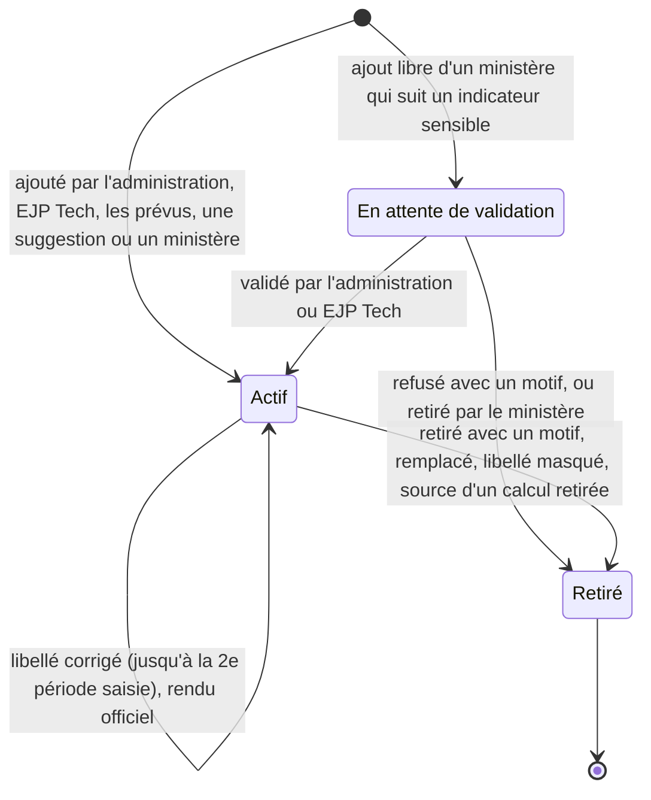

# Configuration des indicateurs

Statut : **à l'étude, non appliqué** (décision T29 de `docs/decisions.md`). Rien n'est codé, aucune
migration n'est écrite, `BRIEF.md` n'est pas modifié. Une session ne construit rien à partir de ce
document tant qu'EJP Tech et la coordination n'ont pas répondu aux questions de la section 10.
Date : 5 octobre 2026.

Sources : `docs/conception/kpi-ministeres.md` (analyse des 185 demandes, annexe et questions),
`docs/sources/kpi-coordination-2026-10.md` (les « lignes » citées sont celles de ce fichier),
`docs/decisions.md` (P15 à P30, T26 à T28), `BRIEF.md` (sections 2 à 4, 6, 7 et 9). Ce document
fait la synthèse de trois conceptions étudiées et de deux évaluations indépendantes (section 11).

## 1. Besoin et décisions de départ

### Demande d'EJP Tech (5 octobre 2026)

- Un écran de configuration des indicateurs, utilisé par l'administration de l'église et EJP
  Tech. Une première vague par migration est acceptable, l'écran vient ensuite.
- Les ministères peuvent, « dans certaines limites », créer leurs propres indicateurs, de façon
  propre, efficace et réfléchie.
- La première proposition (un formulaire : nom, saisi ou calculé, fréquence, unité, visibilité,
  une case « sensible » et quelques avertissements sur le nom) n'était pas assez mûre.
- EJP Tech voit tous les chiffres, en lecture seule (T28).

### Ce qui existe et ce que cette conception change

| Décision          | Contenu aujourd'hui                                                                           | Effet de cette conception                                                                                                                          |
| ----------------- | --------------------------------------------------------------------------------------------- | -------------------------------------------------------------------------------------------------------------------------------------------------- |
| BRIEF, section 4  | indicateurs propres créés par migration, deux natures, plafond de 9999                        | créés à l'écran après une première vague ; trois rythmes ; plafond par sorte de nombre                                                             |
| BRIEF, section 11 | « écran de création des indicateurs propres » hors de la V1                                   | rouvert à la demande d'EJP Tech                                                                                                                    |
| P16               | nature « mois »                                                                               | reprise telle quelle : mois en cours et deux précédents, mois écoulés seulement pour un indicateur sensible                                        |
| P19               | table `indicateur_calcul` écrite par migration                                                | remplacée : un calcul est une ligne d'`indicateur` qui ne se saisit pas                                                                            |
| P22               | indicateurs sensibles, valeur absente du journal                                              | reprise ; le cas du journal disparaît, car aucune valeur d'indicateur propre n'y est plus écrite                                                   |
| P29               | migration `journal_administration_chiffres`                                                   | inutile pour la même raison                                                                                                                        |
| T26               | colonnes `unite`, `valeur_max`, `groupe`, `sensible`                                          | `unite` et `sensible` gardées ; plafond fixé par sorte de nombre au lieu d'un plafond libre ; pas de `groupe` (convention, 3.5) ; pas de « jours » |
| T27               | catalogue privé, matérialisé par un trigger sur `ministere` ; un lot de migration par demande | catalogue gardé ; un bouton « Créer » remplace le trigger ; plus de lot après la première vague                                                    |
| T28               | EJP Tech lit tous les chiffres                                                                | EJP Tech configure sur l'écran Indicateurs, lit les valeurs sur les fiches, ne saisit rien                                                         |

### Exigences

| Code | Exigence                                                                                                                                            |
| ---- | --------------------------------------------------------------------------------------------------------------------------------------------------- |
| F1   | L'administration et EJP Tech ajoutent, corrigent, remplacent et retirent les indicateurs de tout ministère à l'écran, sans migration.               |
| F2   | La première vague (indicateurs prévus par la coordination) s'écrit une fois par migration dans un catalogue, puis se crée en un clic par ministère. |
| F3   | Un ministère ajoute ses propres comptes simples, dans des limites que la base impose.                                                               |
| F4   | Une valeur calculée (taux, moyenne, total de l'année) ne se saisit jamais.                                                                          |
| F5   | Une saisie garde pour toujours le sens qu'elle avait : le sens d'un indicateur ne change jamais.                                                    |
| F6   | Tout total s'affiche avec sa complétude, y compris dans le temps (« 9 mois sur 10 »).                                                               |
| F7   | Aucun nom ni information personnelle dans un libellé ou une définition ; les textes écrits par un ministère sont relus par EJP Tech.                |
| F8   | Chaque geste écrit une seule ligne de journal, sans texte libre ni valeur d'indicateur propre.                                                      |
| F9   | L'administration de l'église voit les définitions et l'usage, jamais la valeur d'un indicateur propre (P06).                                        |
| F10  | Les règles vivent dans la base ; l'écran les interroge au lieu de les recopier.                                                                     |

Non fonctionnelles :

- **Ajout seulement** : `mesure` et `journal` restent en ajout seulement. `indicateur` est une
  table de référence (comme `ministere`) : ses seuls changements sont listés en 5.9, faits par des
  fonctions et tracés au journal. Aucune suppression.
- **Sécurité** : RLS sur toute table exposée, aucun GRANT d'écriture directe, `security definer`
  seulement dans `private`, `exige_aal2()` en tête de chaque fonction de l'API.
- **Dates** : heure de Paris (`private.aujourdhui()`, `private.dimanche_reference()`).
- **Entretien** : une seule table de définitions, un seul trigger nouveau, aucune table de versions
  ni de cache. L'outil est temporaire et l'équipe est bénévole.

## 2. Vue d'ensemble

### Les notions

Huit mots suffisent à l'écran :

- **Chiffres communs** : STARs au service, STARs actifs, dont en FIJ. Ils ne se configurent pas.
- **Indicateur** : un nombre entier qu'un ministère saisit. Il a un libellé (ce qu'on compte, 60
  caractères au plus), une définition (« Ce qu'on compte exactement », 140 caractères au plus) et
  un rythme.
- **Rythme** : « Chaque dimanche », « Chaque mois » ou « À ce jour ».
- **Sorte de nombre** : un compte (jusqu'à 9 999), un grand compte (jusqu'à 9 999 999), des euros
  ou des minutes.
- **Calcul** : un taux ou une moyenne de deux indicateurs du même ministère. Il ne se saisit pas.
- **Prévus** : les indicateurs que la coordination a choisis pour un ministère (première vague).
- **Suggestions** : quelques indicateurs déjà définis, utiles à plusieurs ministères (« Événements
  couverts »), qu'un ministère ajoute en un clic.
- **Retirer** : le geste qui arrête un indicateur ; ses saisies restent.

Mentions affichées : « Ajouté par Kumi le 12 oct. », « Sensible : mois écoulés seulement », « En
attente de validation », « Libellé corrigé le 14 oct. », « Retiré le 3 nov. ».

Refusé, parce qu'aucune demande ne l'exige ou qu'une convention suffit : groupe ou rubrique, nature
« semaine », « trimestre », « année » ou « jour », formule libre, plafond libre, ordre manuel,
brouillon, versions, niveaux d'autonomie, suppression.

Conventions, sans option à l'écran :

- **C1** : le libellé dit seulement ce qu'on compte, sans « Nombre de », sans période ni unité :
  « Publications », pas « Nombre de publications réalisées ce mois ». L'écran ajoute la période
  (« Publications, septembre 2026 »).
- **C2** : un dispositif se nomme en tête du libellé : « Pages Roses : profils actifs », « Prière
  des Stars : sessions ». Cela remplace les groupes (3.5).
- **C3** : tout indicateur du dimanche ou du mois a sa petite courbe et son total de l'année, avec
  sa complétude.
- **C4** : le sens est figé. Rythme, sorte de nombre, ministère, case sensible et calcul ne
  changent jamais. Libellé et définition se corrigent jusqu'à la deuxième période saisie (4.6).
- **C5** : toute valeur saisie est un entier positif ou nul ; aucune décimale ne se saisit.
- **C6** : la fiche range les indicateurs par rythme, puis par ordre alphabétique : les lignes
  d'un même dispositif se suivent.

### Qui fait quoi

| Geste                                                               | Administration de l'église  | EJP Tech                 | Ministère                      | Berger et conseil       |
| ------------------------------------------------------------------- | --------------------------- | ------------------------ | ------------------------------ | ----------------------- |
| Créer les indicateurs prévus d'un ministère                         | oui                         | oui                      | non                            | non                     |
| Ajouter un indicateur de toute sorte, sensible compris              | oui, sur toute fiche active | oui                      | non                            | non                     |
| Ajouter une suggestion ou un compte simple                          | oui                         | oui                      | sur sa fiche, dans ses limites | non                     |
| Ajouter un calcul                                                   | oui                         | oui                      | non (il le demande)            | non                     |
| Valider ou refuser un ajout en attente                              | oui                         | oui                      | non                            | non                     |
| Corriger un libellé ou une définition, jusqu'à la 2e période saisie | tous, sauf les communs      | idem                     | ses ajouts                     | non                     |
| Rendre officiel l'ajout d'un ministère                              | oui                         | oui                      | non                            | non                     |
| Remplacer ou retirer, avec un motif                                 | tous, sauf les communs      | idem                     | ses ajouts                     | non                     |
| Relire ou masquer le texte d'un ministère                           | non                         | oui (modération)         | non                            | non                     |
| Lire les définitions                                                | toutes                      | toutes                   | les communs et les siennes     | toutes, sauf en attente |
| Lire les valeurs                                                    | chiffres communs seulement  | toutes, en lecture (T28) | les siennes                    | toutes                  |
| Lire l'usage (« saisi 4 mois sur 5 », sans valeur)                  | oui                         | oui                      | le sien                        | sur la fiche            |

Les chiffres communs, le catalogue et la liste des mots refusés ne changent que par une migration
d'EJP Tech. Écrire une définition n'est pas saisir un chiffre : EJP Tech ne saisit toujours rien au
nom d'un ministère (T28).

### Cycle de vie d'un indicateur



- **Actif** : proposé à la saisie, affiché sur la fiche, compté dans les limites.
- **En attente** : ni saisi ni lu par le berger et le conseil ; compté dans les limites du
  ministère. Une fois validé, le ministère rattrape les périodes passées depuis l'ajout.
- **Retiré** : définitif, comme un point traité. Plus de saisie ; l'historique reste sur la fiche
  sous « Retirés ». Un indicateur retiré sans aucune saisie disparaît des fiches et des limites,
  mais sa ligne reste en base : le journal le cite toujours. Son libellé redevient libre.
- Aucune suppression, aucune réactivation. Pour reprendre un chiffre retiré, on en ajoute un
  nouveau : la courbe repart de zéro.

## 3. Les sortes d'indicateurs

### 3.1 Rythmes

| Rythme          | Ce qu'on saisit                        | Date (`date_ref`)                      | Où                                | Demandes (annexe) | Exemples réels                                                                                                                            |
| --------------- | -------------------------------------- | -------------------------------------- | --------------------------------- | ----------------- | ----------------------------------------------------------------------------------------------------------------------------------------- |
| Chaque dimanche | le nombre du dimanche ou de sa semaine | le dimanche, passé ou du jour          | formulaire du dimanche (08)       | 22                | NA (Intégration, l. 16), Cultes captés (MCAD, l. 95), Sainte cène distribuées (MPI, l. 134), Espaces Care (MDS, l. 269)                   |
| Chaque mois     | le total d'un mois                     | le 1er du mois, posé par l'écran       | « Chiffres du mois » (nouveau)    | 74                | Publications (Communication, l. 47), Demandes reçues (Tech, l. 82), Articles vendus (Merch, l. 151), Tâches réalisées (Entretien, l. 213) |
| À ce jour       | où on en est (un stock, des inscrits)  | le jour de la saisie, posé par la base | formulaire du dimanche, prérempli | 25                | Projets en cours (Film, l. 73), Stock disponible (Merch, l. 155), Inscrits (Prodiges Junior, l. 280), Badges actifs (MDS, l. 273)         |

- Une semaine se compte comme un dimanche (la semaine du lundi au dimanche). Une année se calcule.
- **Mois (P16)** : le formulaire propose le mois en cours et les deux précédents ; « Choisir un
  autre mois » ouvre les autres mois de l'année, pour un rattrapage (K3). La base refuse un autre
  jour que le 1er, un mois futur et, pour un indicateur sensible, le mois en cours. La saisie la
  plus récente d'un mois fait foi.
- Le mois en cours s'affiche à part (« Octobre en cours : 5 ») : il n'entre ni dans le total ni
  dans la complétude, qui ne comptent que les mois finis.

### 3.2 Sortes de nombre et bornes

Chaque valeur est un entier de 0 au plafond de sa sorte. Le plafond n'est pas réglable : quatre
sortes couvrent toutes les demandes.

| Sorte        | Plafond                  | Qui la choisit           | Demandes                                                                                                                     | Affichage   |
| ------------ | ------------------------ | ------------------------ | ---------------------------------------------------------------------------------------------------------------------------- | ----------- |
| Compte       | 9 999                    | tous                     | presque toutes                                                                                                               | « 14 »      |
| Grand compte | 9 999 999                | administration, EJP Tech | 5 (K7) : portée (l. 50), vues et abonnés (l. 52), spectateurs du direct (l. 101), vues cumulées de Film et MCAD (l. 76, 102) | « 12 480 »  |
| Euros        | 9 999 999, à l'euro près | administration, EJP Tech | 2, si K6 : chiffre d'affaires (Merch, l. 150), fonds levés (Social, l. 66)                                                   | « 5 164 € » |
| Minutes      | 999                      | administration, EJP Tech | 1, si K22 : retard du début du culte (Coordination, l. 42)                                                                   | « 12 min »  |

- Les chiffres communs restent des comptes (9 999).
- Les minutes ne s'additionnent jamais : pas de total de l'année, seulement la valeur et la courbe.
- Abandonné : l'unité « jours » de T26. Les trois délais demandés (Film l. 77, Tech l. 86,
  Entretien l. 212) se suivent objet par objet ; ils deviennent des comptes ou sont retirés (P21).

### 3.3 Ce qu'on compte exactement

Chaque indicateur a une définition obligatoire, de 10 à 140 caractères, affichée sous le champ de
saisie et, sur la fiche, au clic sur le libellé. Elle répond aux questions de sens de l'analyse :
publications, contenus ou campagnes (K24) ; portions ou personnes servies (K37) ; pic ou moyenne
des spectateurs (K34) ; profil actif des Pages Roses (K43c). Sans elle, deux personnes du même
compte partagé comptent différemment.

- Exemple de forme, pour « Stock disponible » : « Articles du merch en réserve le jour de la
  saisie, toutes tailles confondues. » Le contenu exact vient des réponses des ministères
  (question Q15).
- Pour les chiffres communs, la définition reprend les aides de l'écran 08 (« Les STARs qui ont
  servi dans votre ministère ce dimanche. Si personne n'a servi, enregistrez 0. »).

### 3.4 Valeurs calculées

Trois mécanismes, dont deux automatiques :

- **Total de l'année** (automatique), pour tout indicateur du dimanche ou du mois, sauf les
  minutes : somme des périodes finies de l'année civile (heure de Paris), avec la complétude.
  « Depuis janvier : 112 (9 mois sur 9). » Il couvre les 7 cumuls demandés : NA et NC (l. 17,
  19), Welcome Prodiges (l. 21), baptisés (l. 37), actions sociales (l. 65), participants de la
  Prière des Stars et de la chaîne de prière (l. 124, 130).
- **Petite courbe** (automatique) : 10 dimanches ou 12 mois, trous gardés, et son équivalent
  texte. Elle couvre les 3 évolutions demandées : audience (l. 104), ventes (l. 158), STARs actifs
  (l. 265).
- **Calcul déclaré** : un taux ou une moyenne de deux indicateurs saisis.
  - Taux : haut sur bas, en %, arrondi à l'entier. « Taux de résolution : 80 % en septembre (16
    sur 20). Depuis janvier : 78 % (9 mois sur 9). »
  - Moyenne : haut par bas, une décimale à l'affichage, unité du haut. « Panier moyen : 23,4 € en
    septembre (1 240 € pour 53 commandes). »
  - Sources : deux indicateurs saisis, actifs, distincts, du même ministère, non sensibles. Même
    rythme, ou bien un bas « à ce jour » (on prend sa valeur en vigueur à la fin de la période).
    Deux « à ce jour » s'affichent avec leurs deux dates.
  - Sur l'année : somme des hauts sur somme des bas, sur les périodes qui ont les deux valeurs,
    jamais une moyenne de taux (comme le pourcentage FIJ, règle 4).
  - « Non calculé » si le bas manque ou vaut 0 : « Non calculé : demandes reçues de septembre non
    saisies. »
  - Couverture : les 6 taux calculables de l'analyse (Film l. 78, Tech l. 88, Formation l. 251,
    Sécurité l. 244, Prodiges Junior l. 282 si K5, Merch l. 153 si K6), et Multilingue (demandes
    satisfaites sur demandes, proposé par EJP Tech).

**Complétude dans le temps** (règle 13 du BRIEF, à compléter à la confirmation) :

- Une période est finie jusqu'au dimanche de référence, ou si le mois est avant le mois en cours.
- Le total part de la plus récente de deux dates : le 1er janvier, ou la période qui contient
  l'ajout de l'indicateur. Si le ministère a rattrapé une période plus ancienne de l'année, le
  départ recule jusqu'à elle. L'écran nomme toujours le départ : « Depuis janvier », « Depuis
  juillet », « Depuis le dimanche 6 sept. ».
- Périodes attendues : les périodes finies depuis le départ, où le ministère était actif
  (`private.actif_le`) et l'indicateur pas encore retiré. Saisies : celles qui ont une valeur.
- Un calcul part de la plus récente des deux dates de départ de ses sources.

### 3.5 Rubriques

Pas de colonne `groupe` (T26). Cinq ministères sur 22 rangent leurs KPI par dispositif (MCAD,
MPI, Kumi, Eagles, MDS). La convention C2 (« Pages Roses : profils actifs ») et l'ordre
alphabétique (C6) suffisent à regrouper ces lignes, sans réglage ni écran de plus. Les intitulés
seuls (« Captation / diffusion », « Audience ») ne deviennent pas des indicateurs.

### 3.6 Activités

Pas de nature « jour » (P17, phase 2 si K57). Les activités se comptent par mois, et la moyenne par
activité se calcule :

- « Welcome Prodiges : sessions » et « Welcome Prodiges : présents » (chaque mois), puis le calcul
  « Welcome Prodiges : présents par session » (moyenne). Même schéma pour la Prière des Stars
  (l. 122, 123) et les baptêmes (l. 36).
- Un rassemblement qui réunit les STARs de plusieurs ministères reste une session « Autre
  rassemblement » déclarée par l'administration (règle 5, D2, K35).

### 3.7 Domaines sensibles

- Case « Domaine sensible », posée par l'administration ou EJP Tech seulement. Elle impose le
  rythme « mois » et la sorte « compte », et interdit tout calcul sur l'indicateur.
- 11 demandes : Santé (prises en charge, interventions, incidents avec intervention, orientations,
  l. 140 à 143), Social (bénéficiaires, personnes accompagnées, nouveaux bénéficiaires, l. 61 à
  63), Call your sister (Kumi, l. 194), la plate-forme d'écoute (Eagles, l. 206), nouveaux enfants
  et enfants déjà venus (Prodiges Junior, l. 279 et 284).
- Saisie des mois écoulés seulement (P22) : la base refuse le mois en cours. La fiche montre la
  valeur du mois, jamais la suite des saisies ; le journal ne porte aucune valeur (5.10). Comme le
  mois est fini, deux saisies du même mois ne révèlent aucune date : aucune règle de lecture
  particulière n'est nécessaire.
- Lus par le ministère, le berger, le conseil et EJP Tech (T28) ; jamais par l'administration,
  jamais sur la vue de l'église, jamais dans un email (P14).
- Seuil « moins de 3 » : une règle d'affichage, branchée si la coordination la veut (K5c).
- Un ministère qui suit au moins un indicateur sensible fait valider ses ajouts libres (4.3).

### 3.8 Chiffres financiers

Pas de marque à part : la sorte « euros » suffit. Elle est réservée à l'administration et à EJP
Tech, avec les mêmes lecteurs que tout indicateur propre ; l'administration ne voit pas la valeur,
sauf si K6b le décide (P23). La marge (l. 157) attend des coûts que personne ne saisit ; le budget
de Production (l. 166) devient un point d'attention. La comptabilité de l'église fait foi.

### 3.9 Hors périmètre

| Demande                                                                         | Nombre | Pourquoi, et où elle va                                       |
| ------------------------------------------------------------------------------- | ------ | ------------------------------------------------------------- |
| Comptages d'événements (Coordination, MDS)                                      | 7      | lus dans `evenement_etat`, sans configuration : phase 2 (P20) |
| Grands graphiques                                                               | 7      | petites courbes seulement (K15)                               |
| Textes, listes, classements (Merch l. 154, Production l. 166, Entretien l. 216) | 3      | points d'attention                                            |
| Suivi de personnes, délais par objet                                            | 11     | remplacés par des comptes agrégés (P21)                       |
| Taux entre deux rythmes sur l'année (conversion NA vers FIJ)                    |        | ratio de totaux à confirmer (K4a)                             |
| Chiffres par département (Coordo FIJ)                                           |        | phase 3 (P27)                                                 |
| Total de l'église d'un indicateur propre                                        |        | jamais additionné entre ministères (K12, P30)                 |
| Connexion aux plateformes, formules à plus de deux termes                       |        | saisie à la main (P24) ; deux termes au plus                  |

### 3.10 Couverture des 185 demandes

| Destination (annexe) | Nombre  | Ce que cette conception en fait                                                                     |
| -------------------- | ------- | --------------------------------------------------------------------------------------------------- |
| Actuel               | 31      | indicateurs du dimanche ou à ce jour                                                                |
| Mois                 | 68      | indicateurs du mois, dont 10 sensibles                                                              |
| Calculé              | 23      | 16 servis (7 totaux de l'année, 3 courbes, 6 calculs déclarés), 7 comptages d'événements en phase 2 |
| Activité             | 3       | comptes du mois et une moyenne                                                                      |
| À préciser           | 27      | entrent sans changer le modèle, une fois la réponse connue                                          |
| Commun               | 12      | rien à créer ; refusés à un ministère par la base (6.1)                                             |
| Remplacé             | 11      | comptes agrégés                                                                                     |
| Courbe               | 7       | petites courbes                                                                                     |
| Hors mesures         | 3       | points d'attention                                                                                  |
| **Total**            | **185** | 118 servis directement, 50 sans changement de modèle, 17 hors configuration                         |

## 4. Indicateurs créés par un ministère

### 4.1 Ce qui est permis

Depuis « Mes indicateurs », un ministère ajoute :

- **une suggestion**, en un clic : un indicateur déjà défini, commun à plusieurs ministères
  (5.11). Son libellé et sa définition sont ceux du catalogue ; il se comparera aux autres
  ministères en phase 3 (K12), sans jamais s'additionner ;
- **ou son propre compte**, en trois champs : ce qu'il compte (libellé), ce qu'il compte
  exactement (définition) et le rythme. Sorte « compte » seulement, jusqu'à 9 999.

Il ne crée jamais un indicateur sensible, un grand compte, des euros, des minutes ni un calcul :
ceux-là se demandent à l'administration de l'église, en dehors de l'outil comme aujourd'hui.

### 4.2 Limites et raisons

Toutes sont vérifiées par la base, sous un verrou `for update` sur la ligne du ministère (deux
personnes du compte partagé peuvent cliquer en même temps).

| Limite                                                                                                | Valeur proposée | Raison                                                                        | Message                                                                                                       |
| ----------------------------------------------------------------------------------------------------- | --------------- | ----------------------------------------------------------------------------- | ------------------------------------------------------------------------------------------------------------- |
| Ajouts du ministère actifs ou en attente                                                              | 3               | la charge de saisie ; avec les 6 prévus au plus (K13), la saisie reste courte | « Votre ministère a déjà 3 indicateurs à lui. Retirez-en un pour en ajouter un autre. »                       |
| Ajouts du ministère sur 30 jours, retirés compris                                                     | 3               | ajouter puis retirer en boucle casse les courbes                              | « Vous avez ajouté 3 indicateurs ces 30 derniers jours. Vous pourrez en ajouter un autre à partir du 4 nov. » |
| Indicateurs d'une fiche, actifs ou en attente, calculs compris                                        | 12              | la lecture du berger ; MCAD demande 19 KPI, Kumi 13, MPI et MDS 12            | « Votre fiche compte déjà 12 indicateurs. Demandez à l'administration de l'église d'en retirer un. »          |
| Sorte de nombre                                                                                       | compte          | les grands nombres, montants et durées demandent un choix de l'église         | aucun : le choix n'est pas proposé                                                                            |
| Mots de calcul, de période, de domaine sensible, d'argent, de chiffres communs, de suivi de personnes | refusés         | 6.1                                                                           | message de la famille de mots                                                                                 |

Ces valeurs sont des choix, pas des mesures (question Q3). L'administration et EJP Tech ne sont
tenus que par la limite de 12 par fiche.

### 4.3 Validation ou non

| Option                                                                        | Pour                                                                                                | Contre                                                                                                                                           |
| ----------------------------------------------------------------------------- | --------------------------------------------------------------------------------------------------- | ------------------------------------------------------------------------------------------------------------------------------------------------ |
| A. Aucune validation, relecture après coup par EJP Tech                       | rien n'attend ; peu de code                                                                         | un libellé anodin peut être sensible dans son contexte : « Interventions » l'est chez Santé, pas chez Sécurité ; la liste de mots ne le voit pas |
| **B. Validation seulement pour un ministère qui suit un indicateur sensible** | protège les cinq domaines de P22 ; aucun réglage : la base le déduit de la fiche ; file très courte | une file à ouvrir, sans notification ; un état de plus                                                                                           |
| C. Validation de tout ajout                                                   | rien n'est lu avant d'être vu                                                                       | file sur le seul compte de l'administration ; le BRIEF exclut les notifications, une demande attendrait sans que personne la voie                |
| D. Aucun ajout pour un ministère sensible                                     | le plus simple                                                                                      | Kumi et Eagles perdent toute autonomie pour des chiffres anodins (Pages Roses, activités)                                                        |

**Recommandation : B.** Un ministère « suit un domaine sensible » s'il a au moins un indicateur
sensible, actif ou retiré : Santé, Social, Kumi, Eagles et Prodiges Junior une fois la première
vague créée. Pour lui :

- une **suggestion** s'ajoute tout de suite (sa définition est déjà relue) ;
- un **ajout libre** naît « En attente de validation ». Il n'est ni saisi ni lu par le berger et le
  conseil. L'administration ou EJP Tech le valide ou le refuse, avec un motif, depuis l'écran
  Indicateurs ; la Modération d'EJP Tech affiche « 1 ajout attend une validation », ce qui le met
  dans la relecture hebdomadaire. Le ministère rattrape ensuite les périodes passées : rien n'est
  perdu si la validation arrive dans la semaine.

Pour tous les autres ministères, l'ajout est actif tout de suite et EJP Tech relit son libellé et
sa définition dans la file de modération (écran 15). Le berger peut lire le libellé avant la
relecture : c'est le risque que le BRIEF accepte déjà pour les points d'attention, ici réduit par
un texte plus court et filtré (6.1). Alternative si EJP Tech veut moins de code : A, avec la
famille de mots « sensible » refusée aux ministères (questions Q1 et Q2).

### 4.4 Visibilité

| Profil                     | Définition d'un ajout            | Valeurs               |
| -------------------------- | -------------------------------- | --------------------- |
| Le ministère lui-même      | oui, dans tous les états         | oui                   |
| Berger, conseil            | oui, sauf en attente             | oui, sur la fiche     |
| EJP Tech                   | oui                              | oui, en lecture (T28) |
| Administration de l'église | oui, avec l'usage                | non (P06)             |
| Autres ministères          | non : ni le libellé ni la valeur | non                   |
| Vue de l'église, emails    | jamais (P30, P14)                | jamais                |

Aujourd'hui, un ministère lit les libellés des indicateurs propres de tous les autres : la lecture
se resserre aux communs et aux siens (question Q6).

### 4.5 Ce que voit le berger

Sur la fiche du ministère (04), un ajout du ministère s'affiche comme les autres indicateurs, à sa
place dans le rythme, avec la mention discrète « Ajouté par Kumi le 12 oct. ». Il a sa valeur, sa
courbe, son total de l'année et sa complétude. Un ajout en attente n'apparaît pas. Rien ne change
dans « Cette semaine », la phrase de la fiche ni la vue de l'église.

### 4.6 Faire évoluer : corriger, rendre officiel, remplacer, retirer

| Geste                                           | Qui                                                                                     | Effet                                                                                                                                                                                                                                   |
| ----------------------------------------------- | --------------------------------------------------------------------------------------- | --------------------------------------------------------------------------------------------------------------------------------------------------------------------------------------------------------------------------------------- |
| Corriger le libellé et la définition            | le ministère pour ses ajouts ; l'administration et EJP Tech pour tous, sauf les communs | permis tant qu'au plus une période est saisie : une faute se répare sans couper la courbe, et une seule valeur au plus porte le nouveau texte. Le texte repasse en relecture. « Libellé corrigé le 14 oct. » sur la fiche               |
| Rendre officiel                                 | administration, EJP Tech                                                                | l'ajout devient un indicateur de l'église : il ne compte plus dans les 3 ajouts du ministère, et le ministère ne peut plus le retirer. Valeurs et sens inchangés                                                                        |
| Remplacer                                       | le ministère pour ses ajouts ; l'administration et EJP Tech                             | pour changer de rythme, de sorte ou de sens : un nouvel indicateur et le retrait de l'ancien dans la même transaction. Deux courbes, jamais fusionnées : « Remplace « Problèmes signalés » (chaque dimanche, jusqu'au 31 oct.) » (K45a) |
| Retirer, avec un motif                          | le ministère pour ses ajouts ; l'administration et EJP Tech                             | plus de saisie ; historique gardé ; un calcul qui en dépend est retiré avec lui                                                                                                                                                         |
| Proposer comme suggestion à tous les ministères | EJP Tech, par migration, sur demande de l'administration                                | une ligne de plus au catalogue ; les indicateurs existants ne changent pas                                                                                                                                                              |

Motifs de retrait (liste fermée) : « N'est plus suivi », « Doublon d'un autre chiffre », « Créé
par erreur » (tous) ; « Se calcule à partir d'autres chiffres », « Déjà compté par un chiffre
commun », « Domaine sensible : à créer par l'administration », « Hors des règles de l'outil »
(administration et EJP Tech, aussi pour un refus). Trois motifs sont posés par la base :
« Remplacé », « Texte masqué par EJP Tech », « Chiffre source retiré ».

## 5. Modèle de données

### 5.1 Migrations

Toutes nouvelles ; aucune migration suivie par git n'est modifiée. La migration T28 (lecture des
chiffres par EJP Tech) passe avant.

| Migration                | Contenu                                                                                                                                                                                   | Tests pgTAP principaux                                                                        |
| ------------------------ | ----------------------------------------------------------------------------------------------------------------------------------------------------------------------------------------- | --------------------------------------------------------------------------------------------- |
| `indicateurs_definition` | colonnes et contraintes d'`indicateur` (5.2) ; définitions des communs ; contrôle de `mesure.valeur` ; `private.normaliser` ; trigger `controler_indicateur` ; `controler_mesure` réécrit | sens figé même pour le propriétaire, aucune suppression, plafonds, mois, calcul jamais saisi  |
| `indicateurs_lexique`    | table `private.terme`, fonction `private.verifier_texte`, fonction publique `verifier_libelle`                                                                                            | chaque famille refusée, voisins acceptés, jeu des 185 libellés                                |
| `indicateurs_catalogue`  | table `private.indicateur_prevu`, vues `v_catalogue` et `v_suggestions`                                                                                                                   | catalogue illisible en direct, vues réservées aux bons profils                                |
| `indicateurs_lectures`   | `v_mesure_periode`, `v_indicateur_suivi`, `v_calcul`, `v_usage_indicateurs`, `limites_indicateurs`                                                                                        | totaux, complétude dans le temps, « Non calculé », usage sans valeur                          |
| `indicateurs_fonctions`  | fonctions de l'API (5.8), politiques, journal (5.10), modération                                                                                                                          | matrice, limites, validation, correction, retrait, remplacement, journal sans texte ni valeur |
| `indicateurs_vague_1`    | lignes du catalogue validées par la coordination (5.11)                                                                                                                                   | création des prévus d'un ministère, sans doublon                                              |

### 5.2 La table `indicateur`

Esquisse de `indicateurs_definition` (rien n'est écrit) :

```sql
alter table public.indicateur
  drop constraint indicateur_nature_check,
  add constraint indicateur_nature_check check (nature in ('dimanche', 'mois', 'a_ce_jour')),
  drop constraint indicateur_ministere_id_libelle_key,
  add column definition text check (char_length(definition) between 10 and 140),
  add column unite text not null default 'nombre'
    check (unite in ('nombre', 'grand_nombre', 'euros', 'minutes')),
  add column sensible boolean not null default false,
  add column calcul text check (calcul in ('taux', 'moyenne')),
  add column haut_id uuid references public.indicateur,
  add column bas_id uuid references public.indicateur,
  add column origine text not null default 'eglise' check (origine in ('commun', 'eglise', 'ministere')),
  add column modele_code text,          -- ligne du catalogue (prévu ou suggestion), sinon null
  add column remplace_id uuid unique references public.indicateur,
  add column etat text not null default 'actif' check (etat in ('en_attente', 'actif', 'retire')),
  add column cree_le timestamptz not null default now(),
  add column cree_par uuid references public.compte (user_id),   -- null : Système (migration)
  add column texte_le timestamptz not null default now(),        -- dernière écriture des textes
  add column officiel_le timestamptz,
  add column retire_le timestamptz,
  add column retrait_motif text,                                  -- liste fermée de 4.6
  add check (actif = (etat = 'actif')),
  add check ((etat = 'retire') = (retire_le is not null) and (retire_le is null) = (retrait_motif is null)),
  add check (not sensible or (nature = 'mois' and unite = 'nombre' and calcul is null)),
  add check ((calcul is null) = (haut_id is null) and (calcul is null) = (bas_id is null)),
  add check ((origine = 'commun') = (ministere_id is null)),
  add check (etat <> 'en_attente' or origine = 'ministere'),
  add check (officiel_le is null or origine = 'eglise');
-- la migration remplit la définition des trois communs, puis :
alter table public.indicateur alter column definition set not null;
create unique index indicateur_libelle_actif on public.indicateur (ministere_id, private.normaliser(libelle))
  where etat <> 'retire';
alter table public.mesure drop constraint mesure_valeur_check,
  add constraint mesure_valeur_check check (valeur between 0 and 9999999);
```

- `actif` reste : la politique d'ajout de `mesure` et les tests existants le lisent.
- `private.normaliser(text)`, `immutable` : minuscules, accents retirés par `translate`,
  ponctuation et espaces réduits, « nombre de » de tête retiré. « Nombre de projets en cours » et
  « Projets en cours » se confondent ; un libellé retiré peut renaître.
- `ordre` ne sert plus qu'aux communs : les autres se rangent par rythme et par ordre alphabétique.

### 5.3 Les saisies : `controler_mesure` réécrit

Le trigger `before insert` de `mesure` (une nouvelle version, même nom) refuse, dans l'ordre :

1. un indicateur qui n'est pas actif : « Cet indicateur n'est plus proposé à la saisie. » ;
2. un calcul : « Ce chiffre se calcule : il ne se saisit pas. » (la politique d'ajout exige aussi
   `i.calcul is null`) ;
3. une valeur au-dessus du plafond de sa sorte : « Entre 0 et 9 999. » ;
4. pour un mois : un autre jour que le 1er, un mois après `private.mois_courant()` (nouvelle aide :
   le 1er du mois de `private.aujourdhui()`), et le mois en cours pour un indicateur sensible
   (« Ce chiffre se saisit une fois le mois fini. »).

Les règles du dimanche et du « à ce jour » ne changent pas.

### 5.4 Le sens figé : trigger `controler_indicateur`

Un seul trigger nouveau, `before insert or update or delete` sur `indicateur`, actif pour tous les
rôles (migrations et jeu d'exemple compris) :

- **À l'ajout** : libellé de 3 à 60 caractères après `btrim` et réduction des espaces ; définition
  de 10 à 140 ; mots refusés à tous (6.1) ; cohérences (sensible, sorte, calcul, sources du même
  ministère et de rythme compatible).
- **À la mise à jour**, seuls passent :
  - `en_attente` vers `actif` ou `retire`, et `actif` vers `retire`, avec `retire_le` et le motif ;
  - `origine` de `ministere` vers `eglise`, avec `officiel_le` ;
  - un libellé ou une définition remplacé par « [texte masqué par EJP Tech] » ;
  - un nouveau libellé ou une nouvelle définition, contrôlés comme à l'ajout, si l'indicateur a au
    plus une période saisie ; `texte_le` prend l'heure.
- **Tout le reste est refusé** : ministère, code, rythme, sorte, sensible, calcul, sources,
  `remplace_id`, `modele_code`, `cree_le`, `cree_par`.
- **À la suppression** : toujours refusée.

Aucun GRANT `insert`, `update` ni `delete` sur `indicateur` : tout passe par les fonctions (5.8).

### 5.5 Le catalogue

```sql
create table private.indicateur_prevu (     -- jamais exposée, écrite par migration
  code text primary key,                     -- « kumi_activites », « suggestion_evenements_couverts »
  modele text not null,                      -- nom normalisé du ministère de la liste, ou « suggestion »
  libelle text not null check (char_length(libelle) <= 60),
  definition text not null check (char_length(definition) between 10 and 140),
  nature text not null, unite text not null default 'nombre', sensible boolean not null default false,
  calcul text, haut_code text, bas_code text, -- calcul : codes de ses deux sources, même modèle
  reprend text,                              -- code d'une suggestion dont ce prévu reprend les textes
  ordre smallint not null
);
```

- `v_catalogue` (administration et EJP Tech) et `v_suggestions` (tous les profils, lignes
  « suggestion » seulement) le lisent par une fonction `private`, comme `v_textes_a_relire`.
- Un indicateur créé depuis le catalogue garde son `modele_code` : un second appel ne crée pas de
  doublon, et l'écran sait ce qui reste à créer.
- Aucun trigger sur `ministere` : l'administration choisit le modèle et clique « Créer » (7.2).
  L'écran propose le modèle dont le nom normalisé égale celui du ministère, sinon une liste. Le
  rattachement ne dépend plus d'un nom tapé à l'écran 13.
- La liste des mots refusés vit dans `private.terme` (terme normalisé, famille, pour tous ou pour
  les ministères), changée par une petite migration.

### 5.6 Les lectures

Toutes les vues sont `security_invoker` et lisent `mesure` sous RLS : un profil qui ne lit pas une
valeur obtient `null`.

- `v_mesure_periode` : la saisie la plus récente par indicateur, ministère et période (elle étend
  `v_mesure_dimanche` au mois).
- `v_indicateur_suivi` : pour chaque indicateur lisible, la dernière valeur et sa période, la
  valeur du mois en cours (sauf sensible), la série (10 dimanches ou 12 mois, trous à `null`), le
  total de l'année, son départ, les périodes saisies et attendues, et l'alerte « plus de 30 jours »
  d'un « à ce jour » (règle 13).
- `v_calcul` : pour chaque calcul, la dernière période finie (haut, bas, résultat) et l'année, avec
  la complétude.
- `v_usage_indicateurs` (administration et EJP Tech, par une fonction `private`) : périodes
  saisies, périodes attendues, date de la dernière saisie, « jamais saisi ». Jamais une valeur.
- `public.limites_indicateurs(p_ministere_id)` : ajouts actifs ou en attente, ajouts des 30
  derniers jours et date de la prochaine place, total de la fiche, validation requise ou non. Le
  panneau d'ajout s'en sert au lieu de recopier les limites.

### 5.7 Intégrité de l'historique

- `mesure.indicateur_id` ne change pas, et la base fige le sens de l'indicateur : une saisie garde
  son sens pour toujours, sans colonne de version sur `mesure`.
- Une correction de texte ne touche qu'une période au plus ; un changement de sens passe par un
  remplacement, qui ouvre une nouvelle série et laisse l'ancienne intacte.
- Aucune suppression : le journal, qui cite l'indicateur par `cible_id` sans clé étrangère, le
  retrouve toujours. `v_journal` affiche le libellé actuel, masqué s'il l'a été.
- Un ministère désactivé garde ses indicateurs ; ses périodes ne sont plus attendues après sa
  désactivation (règle 13).

### 5.8 Les fonctions de l'API

Chacune existe en deux parties : `private.<nom>` en `security definer`, `set search_path = ''`,
`exige_aal2()` en tête, et `public.<nom>` d'une ligne en `security invoker`. Un refus de droit lève
42501 avec le même message qu'un objet absent ; une erreur de saisie lève l'exception par défaut,
affichée telle quelle. Aucun SQL dynamique.

| Fonction                                                                                                               | Appelant                                                                 | Écrit                                                                            |
| ---------------------------------------------------------------------------------------------------------------------- | ------------------------------------------------------------------------ | -------------------------------------------------------------------------------- |
| `creer_indicateur(p_ministere_id, p_libelle, p_definition, p_nature, p_unite, p_sensible, p_remplace_id) returns uuid` | administration, EJP Tech ; ministère sur sa fiche (compte, non sensible) | `indicateur` (actif ou en attente), retrait de l'ancien si remplacement, journal |
| `ajouter_suggestion(p_ministere_id, p_code) returns uuid`                                                              | ministère sur sa fiche, administration, EJP Tech                         | `indicateur` actif, journal                                                      |
| `creer_calcul(p_libelle, p_definition, p_type, p_haut_id, p_bas_id) returns uuid`                                      | administration, EJP Tech                                                 | `indicateur` (calcul), journal                                                   |
| `creer_indicateurs_prevus(p_ministere_id, p_modele) returns integer`                                                   | administration, EJP Tech                                                 | les lignes manquantes du modèle, tout ou rien, une ligne de journal              |
| `valider_indicateur(p_indicateur_id, p_decision, p_motif) returns void`                                                | administration, EJP Tech                                                 | état, journal                                                                    |
| `corriger_indicateur(p_indicateur_id, p_libelle, p_definition) returns void`                                           | selon 4.6                                                                | textes, `texte_le`, journal                                                      |
| `rendre_officiel(p_indicateur_id) returns void`                                                                        | administration, EJP Tech                                                 | origine, journal                                                                 |
| `retirer_indicateur(p_indicateur_id, p_motif) returns integer`                                                         | selon 4.6 ; rend le nombre de calculs retirés avec lui                   | état, journal                                                                    |
| `verifier_libelle(p_libelle, p_nature, p_ministere_id) returns table (famille, message, bloquant)`                     | tout profil autorisé sur cette fiche                                     | rien                                                                             |
| `masquer_texte`, `marquer_relu`, `v_textes_a_relire`                                                                   | EJP Tech                                                                 | gagnent la cible `indicateur` (libellé, définition)                              |

Contrôles d'un ajout par un ministère, dans l'ordre : compte de ministère actif et fiche à lui
(42501) ; verrou sur le ministère ; limite de 12, de 3 ajouts, de 3 sur 30 jours ; textes et mots
refusés (`private.verifier_texte`, la même que `verifier_libelle`) ; doublons ; rythme. Puis
l'insertion, « en attente » si le ministère suit un indicateur sensible, et la ligne de journal.

### 5.9 Ce qui change sur `indicateur`, et seulement cela

`indicateur` n'est pas dans la liste des tables en ajout seulement (règle 1), mais ses
changements restent bornés, faits par les fonctions ci-dessus et tracés au journal : l'état (vers
actif ou retiré), l'origine (vers « église »), le masquage d'un texte, et la correction d'un texte
jusqu'à la deuxième période saisie. Le trigger de 5.4 refuse tout le reste, même au propriétaire.

### 5.10 Journal

| Code                       | Libellé (écran 06)             | `cible`, `cible_id` | `detail` (codes et nombres seulement)                         | Détail affiché (exemple)                                     |
| -------------------------- | ------------------------------ | ------------------- | ------------------------------------------------------------- | ------------------------------------------------------------ |
| `indicateur_cree`          | A ajouté un indicateur         | indicateur          | `{"nature", "unite", "origine", "attente": true, "remplace"}` | « Publications, chaque mois » ; « en attente de validation » |
| `indicateurs_prevus_crees` | A créé les indicateurs prévus  | ministere           | `{"modele", "nombre": 6}`                                     | « 6 indicateurs prévus pour Kumi »                           |
| `indicateur_valide`        | A validé un indicateur         | indicateur          | `{"decision": "valide"}` ou `{"decision": "refuse", "motif"}` | « Pages Roses : ateliers, refusé : domaine sensible »        |
| `indicateur_corrige`       | A corrigé un indicateur        | indicateur          | `{"champs": ["libelle"]}`                                     | « Publications, libellé corrigé »                            |
| `indicateur_officiel`      | A rendu officiel un indicateur | indicateur          | `{}`                                                          | « Campagnes »                                                |
| `indicateur_retire`        | A retiré un indicateur         | indicateur          | `{"motif", "avec_saisies": true, "calculs": 1}`               | « Projets réalisés, motif : n'est plus suivi »               |

- `ministere_id` est celui de l'indicateur. Le ministère lit les lignes de sa fiche, le berger et
  le conseil toutes, l'administration toutes ; EJP Tech les lit dans le journal technique. Comme
  toute action d'un compte de ministère, un ajout fait par le ministère compte pour sa fraîcheur
  (règle 6).
- `detail` ne contient jamais un libellé ni une définition : l'écran lit le texte actuel par
  `cible_texte`.
- **Saisies** : `journaliser_mesures` n'écrit plus la valeur d'un indicateur propre, seulement
  `indicateur_id` et `date_ref` (« Publications (septembre) »). Les chiffres communs gardent leur
  valeur. L'administration peut donc lire toutes les lignes `mesure_saisie` :
  `journal_lisible_administration` se simplifie, la migration `journal_administration_chiffres`
  (P29) devient inutile et le cas sensible du journal (P22) disparaît. Le berger lit les valeurs
  sur la fiche.
- **Modération** : `texte_relu` et `texte_masque` gagnent la cible `indicateur`. Masquer un
  libellé retire l'indicateur dans la même transaction, en une seule ligne
  (`{"champ": "libelle", "motif", "retire": true}`) ; masquer la définition ne le retire pas.

### 5.11 Première vague, suggestions et jeu d'exemple

- **Prévus** (`indicateurs_vague_1`) : un modèle par ministère de la liste (Protocole n'en a pas),
  au plus 6 indicateurs saisis par modèle (K13), choisis par la coordination parmi les quelque 90
  candidats de l'analyse (section 7), sensibles compris, plus les calculs retenus, chacun avec sa
  définition. Exemple pour Kumi : « Activités réalisées », « Participantes », « Nouvelles
  participantes » (chaque mois), « Pages Roses : prestataires inscrites », « Pages Roses : profils
  actifs » (à ce jour), « Call your sister : prises en charge » (chaque mois, sensible).
- **Suggestions** (même migration) : « Événements couverts » (MCAD, Santé, Production, Multilingue
  et Sécurité le demandent), « Demandes reçues », « Demandes traitées », « Projets en cours »,
  « Personnes formées », « Activités réalisées », « Participants », « Nouveaux participants » et
  « Projets réalisés ». Pas les incidents : un incident technique, de sécurité ou de traduction
  n'est pas la même chose. Un prévu qui correspond à une suggestion la reprend (colonne
  `reprend`) : « Activités réalisées » de Kumi et d'Eagles a le libellé et la définition de la
  suggestion, qui ne leur est donc plus proposée.
- Après cette vague, tout passe par l'écran : plus de lot de migration, sauf pour une suggestion
  nouvelle ou un mot refusé.
- **`seed.sql`** : un exemple par cas, sans trigger à couper. « Visuels livrés » (Communication,
  chaque mois, remplace « Visuels livrés ce mois ») ; « NA » (Intégration, dimanche) ; « Abonnés
  YouTube » (Communication, grand compte, à ce jour) ; « Demandes reçues » et « Demandes traitées »
  avec leur taux ; « Nouveaux enfants » (Prodiges Junior, sensible) ; « Colis distribués » (Social,
  ajouté par le ministère) ; « Goûters servis » (Prodiges Junior, ajout en attente) ; un indicateur
  retiré avec des saisies.

## 6. Garde-fous

### 6.1 Imposés par la base

La base refuse, par le trigger de 5.4 et les fonctions de 5.8, donc aussi contre un appel direct à
l'API. Les mots se comparent sur le texte normalisé, en mots entiers, avec ou sans « s » final.

| Contrôle                                                                                                                                                         | Pour qui                    | Message                                                                                                       |
| ---------------------------------------------------------------------------------------------------------------------------------------------------------------- | --------------------------- | ------------------------------------------------------------------------------------------------------------- |
| Libellé de 3 à 60 caractères, définition de 10 à 140                                                                                                             | tous                        | « Donnez un libellé de 3 à 60 caractères. », « Expliquez ce qu'on compte en 10 à 140 caractères. »            |
| « @ », « http », « www », 5 chiffres de suite, civilité suivie d'un mot en majuscule (« Mme Durand », « Frère Paul »)                                            | tous, libellé et définition | « N'écrivez aucun nom ni information personnelle. »                                                           |
| Calcul dans un indicateur saisi : taux, pourcentage, %, moyenne, moyen, ratio, évolution, par événement, par session                                             | tous                        | « Un taux, une moyenne ou une évolution se calcule : ne le saisissez pas. »                                   |
| Cumul : cumul, cumulé, depuis le début, de l'année (accepté en « à ce jour » : « Vues cumulées YouTube »)                                                        | tous                        | « Le total de l'année s'affiche tout seul : saisissez le chiffre de la période. »                             |
| Période dans le libellé : ce mois, du mois, par mois, mensuel, par semaine, hebdomadaire, chaque dimanche, du dimanche, par dimanche, par an                     | tous                        | « Inutile d'écrire la période : choisissez le rythme plus bas. »                                              |
| Doublon normalisé sur la fiche, ou libellé d'un chiffre commun                                                                                                   | tous                        | « Votre fiche a déjà « Publications ». »                                                                      |
| Libellé d'une suggestion                                                                                                                                         | ministère                   | « Ce chiffre est dans les suggestions : ajoutez-le depuis la liste, il se comparera aux autres ministères. »  |
| Domaine sensible : santé, soin, médical, malade, prise en charge, écoute, accompagné, accompagnement, bénéficiaire, orientation, enfant, mineur, handicap, deuil | ministère                   | « Ce chiffre touche la santé, l'accompagnement ou les enfants : demandez-le à l'administration de l'église. » |
| Argent : euro, €, argent, don, offrande, fonds, chiffre d'affaires, budget, marge, devis                                                                         | ministère                   | « Un montant se demande à l'administration de l'église. »                                                     |
| Chiffres communs : STAR, mobilisé, bénévole, au service, en service, en FIJ                                                                                      | ministère                   | « Ce chiffre est déjà compté par « STARs au service » ou « STARs actifs ». »                                  |
| Suivi de personnes : noms, prénoms, liste, uniques, parcours, revenus, déjà venus                                                                                | ministère                   | « L'outil compte, il ne suit pas les personnes : saisissez un total. »                                        |
| Limites de 4.2, sorte de nombre, rythme, ministère actif                                                                                                         | ministère                   | messages de 4.2                                                                                               |
| Sensible hors du mois, calcul entre deux ministères, sur un sensible ou entre rythmes incompatibles                                                              | administration, EJP Tech    | « Un indicateur sensible se saisit chaque mois. », « Ces deux chiffres ne se calculent pas ensemble. »        |
| Plafond par sorte, mois au 1er, mois futur, mois en cours si sensible, calcul jamais saisi                                                                       | toute saisie                | 5.3                                                                                                           |

Ce que la famille « commun » couvre : les 12 demandes « Commun » de l'annexe (P26, K8). Ce que la
famille « calcul » couvre : les 18 demandes de la catégorie « Valeur calculée ». Le test pgTAP des
185 libellés (8.2) protège la liste de mots contre les régressions.

### 6.2 Signalés par l'écran, sans bloquer

`verifier_libelle` rend aussi des avertissements (`bloquant = false`), affichés pendant la frappe,
400 ms après la dernière touche :

- libellé qui commence par « Nombre de » : « Écrivez seulement ce que vous comptez : « Tournages ». » ;
- mot en majuscule hors du début et hors des noms connus (noms des ministères, NA, NC, FIJ, STAR,
  Welcome Prodiges, Prière des Stars, Pages Roses, Call your sister, Care, YouTube, Instagram) :
  « « Marie » ressemble à un prénom. Vérifiez avant d'ajouter. » ;
- pour l'administration et EJP Tech : un mot de domaine sensible sans la case cochée (« Ce chiffre
  semble sensible : cochez « Domaine sensible ». ») ; un libellé proche dans un autre ministère
  (« Film suit déjà « Vues cumulées » : un chiffre, une source (K7). »).

À la saisie, une fonction pure de l'interface (testée par Vitest) avertit sans bloquer :

- valeur plus de trois fois au-dessus de la médiane des 6 dernières périodes (3 au moins) : « C'est
  beaucoup plus que d'habitude (12 en général). Vérifiez avant d'enregistrer. » ;
- 0 après 6 valeurs non nulles : « 0 alors que les 6 dernières valeurs ne l'étaient pas. Vérifiez
  avant d'enregistrer. ».

### 6.3 Données personnelles

Quatre couches, de la plus tôt à la plus tard :

1. Le rappel, une seule fois, sous le premier champ libre : « N'écrivez aucun nom ni information
   personnelle. Les champs libres sont relus par EJP Tech. »
2. Les refus de la base (6.1) et l'avertissement « ressemble à un prénom » (6.2).
3. La validation pour un ministère qui suit un domaine sensible (4.3).
4. La relecture par EJP Tech de tout libellé et de toute définition écrits par un ministère (écran
   15), y compris après une correction ; « Masquer le texte » sur un libellé retire l'indicateur,
   ses saisies restent sous « [texte masqué par EJP Tech] ».

Les textes écrits par l'administration et EJP Tech suivent la consigne sans relecture (règle 9).
Pas de liste de prénoms : trop fragile.

### 6.4 Doublons et chiffres communs

- Sur une fiche : un libellé normalisé est unique parmi les indicateurs non retirés (index).
- Avec les communs : la famille « commun » refuse au ministère les STARs, mobilisés et bénévoles ;
  MDS ne saisit pas un deuxième total de l'église (P26).
- Entre ministères : invisibles au ministère ; signalés à l'administration (6.2). Les suggestions
  donnent un même libellé et une même définition aux chiffres partagés.

## 7. Écrans

Aucun de ces écrans n'a de maquette : les écarts s'écrivent dans `LISEZMOI.md` à l'étape qui les
construit. Panneaux de 460 px à partir de 600 px, page entière en dessous ; tableaux en listes sur
téléphone ; cibles de 44 px ; boutons jamais grisés, l'erreur s'affiche sous le champ.

### 7.1 Indicateurs (administration et EJP Tech)

- **But** : voir et régler les indicateurs de tous les ministères, sans aucune valeur.
- **Adresse** : `/indicateurs`, nouvel onglet après « Sessions » (administration) et après
  « Modération » (EJP Tech).
- **Contenu** :
  - phrase : « 94 indicateurs actifs pour 22 ministères, dont 7 ajoutés par les ministères. Un
    ajout attend une validation. » ;
  - bloc « À valider (1) », s'il y a lieu : libellé, ministère, rythme, définition, « depuis 3
    jours », contrôles (« Libellé proche : Événements couverts, dans les suggestions ») ;
  - tableau : Ministère ; Indicateurs (« 8 sur 12, dont 1 ajouté par Kumi ») ; Prévus
    (« 6 à créer » et bouton « Créer », ou « Créés ») ; Saisie (« 2 peu saisis » en orange avec le
    mot) ; Dernier changement (« 12 oct. »).
- **Actions** : « Valider », « Refuser » (motif en boutons radio), « Créer », ouvrir un ministère.
- **États** : chargement ; aucun ministère (« Aucun ministère. Créez d'abord les ministères dans
  Ministères et comptes. ») ; rien à valider (le bloc disparaît).
- L'écran 13 : la colonne « Indicateurs propres » devient un nombre et un lien vers cet écran ;
  la phrase « faites une demande à EJP Tech » est retirée.

### 7.2 Indicateurs d'un ministère (administration et EJP Tech)

- **Adresse** : `/indicateurs/:id`.
- **Contenu** :
  - phrase : « Kumi suit 7 indicateurs sur 12 au plus : 6 prévus par la coordination et 1 ajouté
    par Kumi. Ses ajouts passent par une validation (domaine sensible). » ;
  - bloc « Prévus par la coordination » tant qu'il en reste à créer : la liste et le bouton
    « Créer ces 6 indicateurs » ; si le nom n'est pas reconnu, le choix « Choisir dans la liste de
    la coordination » ;
  - sections « Chaque dimanche », « Chaque mois », « À ce jour », « Calculs », puis « Retirés »
    (repliée) ;
  - chaque ligne : libellé, définition, mentions (« grand compte », « en euros », « sensible : mois
    écoulés seulement », « ajouté par Kumi le 12 oct. », « en attente depuis 2 jours ») et usage
    (« Saisi 4 mois sur 5, dernier le 2 oct. », « Jamais saisi », « Peu saisi : 1 mois sur 4 ») ;
  - pour EJP Tech seulement, le lien « Voir la fiche » (valeurs, T28).
- **Actions** : « Ajouter un indicateur », « Ajouter un calcul » ; sur chaque ligne « Corriger »
  (si permis), « Rendre officiel » (ajout d'un ministère), « Remplacer », « Retirer ».
- **Panneau « Ajouter un indicateur »** : « Ce que vous comptez » (60, compteur, rappel sur les
  données personnelles) ; « Ce qu'on compte exactement » (140) ; « Quand le saisir » (trois
  boutons radio : « Chaque dimanche, avec les chiffres du dimanche », « Chaque mois, le total d'un
  mois », « À ce jour, où on en est aujourd'hui ») ; « Sorte de nombre » (quatre boutons radio,
  « Un compte » coché) ; case « Domaine sensible (santé, accompagnement, enfants) » avec sa
  conséquence (« Saisi chaque mois, une fois le mois fini. ») ; contrôles pendant la frappe ;
  aperçu (« Publications, septembre 2026 : __ ») ; bouton « Ajouter l'indicateur ».
- **Panneau « Ajouter un calcul »** : « Nom du calcul », « Ce qu'on calcule », « Chiffre du
  haut », « Chiffre du bas » (listes limitées aux sources compatibles), « Afficher » (« En
  pourcentage », « En moyenne ») ; aperçu avec des nombres d'exemple (« Par exemple : 16 sur 20, soit 80 % »),
  puisque l'administration ne lit pas les valeurs ; bouton « Ajouter le calcul ».
- **Fenêtre « Retirer »** : « Retirer « Publications » ? », motif en boutons radio, « Il ne sera
  plus proposé à la saisie. Ses 9 valeurs restent sur la fiche. Un indicateur retiré ne revient
  pas. », s'il y a lieu « Le calcul « Taux de résolution » sera retiré aussi. », bouton « Retirer
  l'indicateur ». Sans saisie : « Il n'a aucune saisie : il disparaîtra de la fiche. ».
- **Fenêtre « Rendre officiel »** : « Rendre officiel « Campagnes » ? Il ne comptera plus dans les
  3 ajouts de Communication, et seuls l'administration et EJP Tech pourront le retirer. », bouton
  « Rendre officiel ».
- **Panneau « Remplacer »** : celui de l'ajout, prérempli, avec « Remplace « Problèmes signalés »
  (chaque dimanche). Ses saisies restent sous l'ancien indicateur. » ; bouton « Remplacer
  l'indicateur ».
- **États** : « Aucun indicateur pour Protocole. Il saisit les chiffres communs. » ; réussites
  (« Indicateur ajouté. », « 6 indicateurs prévus créés. », « Indicateur retiré, ses saisies
  restent sur la fiche. »).

### 7.3 Mes indicateurs (ministère) et le parcours d'ajout

- **But** : voir ce que le ministère suit et ajouter, corriger ou retirer ses propres indicateurs.
- **Adresse** : `/ma-fiche/indicateurs`, ouverte par le lien « Gérer mes indicateurs » sous les
  chiffres de « Ma fiche » (pas de cinquième onglet).
- **Contenu** :
  - phrase : « Communication suit 7 indicateurs : 5 prévus par la coordination et 2 ajoutés par
    vous. Vous pouvez en ajouter 1 autre. » ;
  - liste par rythme : libellé, origine, usage (« Saisi 4 mois sur 5 »), état (« En attente de
    validation depuis 2 jours : vous pourrez le saisir dès qu'il sera validé, y compris pour les
    périodes passées. », « Refusé le 8 oct. : domaine sensible, à créer par l'administration. »).
- **Actions** : « Ajouter un indicateur » ; sur ses ajouts, « Corriger » (si permis) et
  « Retirer » (motif : n'est plus suivi, doublon, créé par erreur).
- **Parcours d'ajout** (panneau) :
  1. Si une limite est atteinte, le panneau ne montre que l'explication et ce qu'il faut faire
     (messages de 4.2). Le bouton qui l'ouvre reste actif.
  2. « Suggestions » : les suggestions absentes de la fiche, avec rythme et définition, et un
     bouton « Ajouter » chacune.
  3. « Rien ne convient ? Écrire votre indicateur » ouvre trois champs : « Ce que vous comptez »
     (60, compteur, exemples « Publications, Demandes reçues, Projets en cours », rappel sur les
     données personnelles) ; « Ce qu'on compte exactement » (140, aide « Ce qui compte et ce qui
     ne compte pas, pour que tout le ministère compte pareil. ») ; « Quand le saisir » (trois
     boutons radio et leur aide).
  4. Contrôles pendant la frappe (`verifier_libelle`) : un refus s'affiche en rouge sous le champ
     avec son message, un avertissement en orange.
  5. Aperçu : « Dans le formulaire du mois : Publications, septembre 2026 » et « Sur votre fiche :
     Septembre 2026 : 14. Depuis janvier : 112 (9 mois sur 9). »
  6. Texte : « Le berger, le conseil et EJP Tech verront ce chiffre. Taux, moyennes et totaux de
     l'année se calculent tout seuls. Pour la santé, l'accompagnement, les enfants ou l'argent,
     demandez à l'administration de l'église. »
  7. Bouton « Ajouter l'indicateur », ou « Envoyer pour validation » pour un ministère qui suit un
     domaine sensible, avec la phrase « Kumi suit un domaine sensible : chaque ajout est validé par
     l'administration de l'église ou EJP Tech avant la saisie. »
  8. Réussite : « Indicateur ajouté : il apparaît dans vos chiffres du mois. » ou « Envoyé pour
     validation. Vous pourrez le saisir dès qu'il sera validé. »
- **Panneau « Corriger »** : champs préremplis ; « Vous pouvez corriger le libellé et la définition
  jusqu'à la deuxième période saisie. Pour compter autre chose, retirez cet indicateur et
  ajoutez-en un autre. » ; bouton « Enregistrer la correction ». Après la deuxième période, le
  bouton « Corriger » disparaît.
- **États** : « Votre ministère n'a pas encore d'indicateur à lui. Les STARs au service, actifs et
  en FIJ se saisissent déjà chaque dimanche. » ; « Toutes les suggestions sont déjà sur votre
  fiche. ».

### 7.4 Saisies

- **Dimanche (08)** : les communs, puis les indicateurs « dimanche » (vides) et « à ce jour »
  (préremplis), par ordre alphabétique. Sous chaque champ : la définition, « Dimanche dernier : 9 »
  et l'unité en suffixe (« € », « min »). Erreur « Entre 0 et 9 999. ». Un seul insert.
- **Chiffres du mois** (`/saisir/mois`, nouveau, même composant que 08) :
  - titre : le dernier mois fini non saisi, sinon le mois en cours (« Chiffres de septembre 2026 ») ;
    lien « Choisir un autre mois » (« Octobre 2026, en cours », « Août 2026 (déjà saisi) », puis
    les autres mois de l'année) ;
  - champs vides, aide « Le total du mois. Si rien, enregistrez 0. » et la définition ;
  - sur le mois en cours, un indicateur sensible s'affiche sans champ : « Se saisit une fois le mois
    fini. » ;
  - « Déjà saisi : 14, le 2 oct. Votre saisie la remplacera. » ; avertissements de 6.2 ; un seul
    insert ; bouton « Enregistrer les chiffres du mois ».
- **« Vos saisies »** (accueil du ministère) gagne la ligne « Chiffres de septembre », « À faire »
  du 1er octobre jusqu'à ce que chaque indicateur du mois ait sa valeur de septembre.
- Un calcul ou un indicateur en attente n'est jamais dans un formulaire.

### 7.5 Fiche du ministère et vue du berger

- **Écrans** : 04 (berger et conseil), 12 (le ministère), et la fiche en lecture pour EJP Tech
  (T28). La phrase de la fiche ne change pas : elle ne parle que des communs.
- **Section « Indicateurs du ministère »**, après les chiffres communs, rangée par rythme puis par
  ordre alphabétique. Chaque ligne :
  - la valeur avec son unité et sa période : « Septembre 2026 : 14 », « Dimanche 27 sept. : 12 »,
    « Saisi le 24 sept. : 3 » ;
  - la petite courbe et son équivalent texte (« Douze derniers mois : 9, 12, 14 ») ;
  - « Depuis janvier : 112 (9 mois sur 9). Octobre en cours : 5. » ;
  - la définition au clic sur le libellé (bouton avec `aria-expanded`) ;
  - mentions discrètes : « Ajouté par Kumi le 12 oct. », « Libellé corrigé le 14 oct. »,
    « Remplace « Problèmes signalés » ».
- Un calcul tient sur une ligne : « Taux de résolution : 80 % en septembre (16 sur 20). Depuis
  janvier : 78 % (9 mois sur 9). »
- Un indicateur sensible : la valeur du mois fini seulement, sans « en cours ».
- « Retirés (2) », replié, garde les valeurs ; un retiré sans saisie n'y figure pas.
- Le ministère (12) a en plus « Saisir les chiffres du mois » et « Gérer mes indicateurs ».
- **États** : « Pas encore saisi. » ; « Non calculé : demandes reçues de septembre non saisies. » ;
  aucun indicateur : « Ce ministère ne suit pas encore d'indicateur à lui. » (berger), « Votre
  ministère ne suit pas encore d'indicateur à lui. » (ministère).

### 7.6 Journal et modération

- **Journal (06)** : les lignes de 5.10 ; « A saisi des chiffres » affiche « Publications
  (septembre) » sans valeur pour un indicateur propre.
- **Modération (15)** : nouveau type d'élément « Indicateur de Kumi » (libellé, ce qu'on compte),
  avec « Rien à signaler » et « Masquer le texte » ; champ « Libellé » ou « Définition ». En tête,
  s'il y a lieu : « 1 ajout attend une validation. » et le lien « Ouvrir Indicateurs ».

### 7.7 États et messages

| Situation                                    | Texte                                                                                                       |
| -------------------------------------------- | ----------------------------------------------------------------------------------------------------------- |
| Ajout réussi                                 | « Indicateur ajouté : il apparaît dans vos chiffres du mois. »                                              |
| Ajout en attente                             | « Envoyé pour validation. Vous pourrez le saisir dès qu'il sera validé. »                                   |
| Validation                                   | « Indicateur validé : Kumi peut le saisir. » ; refus : « Indicateur refusé. Kumi verra le motif. »          |
| Retrait                                      | « Indicateur retiré, ses saisies restent sur la fiche. » ; sans saisie : « Indicateur retiré. »             |
| Correction refusée                           | « Cet indicateur a déjà deux périodes saisies : il ne se corrige plus. Retirez-le et ajoutez-en un autre. » |
| Saisie d'un mois futur                       | « Ce mois n'est pas encore commencé. »                                                                      |
| Page réservée (ministère sur `/indicateurs`) | « Cette page n'est pas disponible avec votre compte. », aucune requête                                      |

Nouvelles adresses, à ajouter au tableau du BRIEF avec leur garde : `/indicateurs` et
`/indicateurs/:id` (administration, EJP Tech), `/ma-fiche/indicateurs` et `/saisir/mois`
(ministère).

## 8. Sécurité, droits et tests

### 8.1 Matrice des droits

| Objet                                       | Ministère                                | Berger, conseil       | Administration           | EJP Tech                 | `aal1`, anonyme |
| ------------------------------------------- | ---------------------------------------- | --------------------- | ------------------------ | ------------------------ | --------------- |
| `indicateur` (lecture)                      | les communs et les siens, tous états     | tous, sauf en attente | tous                     | tous                     | rien            |
| `indicateur` (écriture)                     | par fonctions seulement (4.6)            | rien                  | par fonctions            | par fonctions            | rien            |
| `mesure` (ajout)                            | le sien, indicateur actif et non calculé | rien                  | rien                     | rien                     | rien            |
| `mesure` (lecture)                          | inchangée                                | inchangée             | communs seulement        | tout (T28)               | rien            |
| `private.indicateur_prevu`, `private.terme` | rien                                     | rien                  | rien (vue `v_catalogue`) | rien (vue `v_catalogue`) | rien            |
| `v_suggestions`                             | oui                                      | oui                   | oui                      | oui                      | rien            |
| `v_usage_indicateurs`                       | rien                                     | rien                  | oui                      | oui                      | rien            |

Politique restrictive `aal2` sur `indicateur` comme ailleurs ; aucun GRANT `insert`, `update`,
`delete` ni `truncate` sur `indicateur` ; rien pour `anon`. Les vues sur fonction suivent leur
propre contrôle et ne rendent rien hors `aal2` ou hors des profils prévus.

### 8.2 Tests pgTAP

- **Matrice en données** : lecture d'`indicateur` et des trois vues par les sept profils et
  l'anonyme, en `aal1` et `aal2` ; ajout, mise à jour et suppression directs refusés partout ;
  chaque fonction refusée en `aal1`.
- **Sens figé** : `controler_indicateur` refuse un changement de rythme, de sorte, de ministère, de
  case sensible ou de source, et toute suppression, même au propriétaire.
- **Ajouts d'un ministère** : accepté sur sa fiche, refusé sur une autre (42501) ; grand compte,
  euros, minutes, sensible et calcul refusés ; 4e ajout, 4e ajout en 30 jours (un retiré compris)
  et 13e indicateur de la fiche refusés ; berger, conseil et anonyme refusés.
- **Mots** : chaque famille refusée avec son message ; voisins acceptés (« Moyens techniques »,
  « Vues cumulées YouTube » en à ce jour, « Personnes bénéficiant de la traduction »,
  « Participants de la nuit du samedi au dimanche ») ; doublon normalisé (« Nombre de projets en
  cours » contre « Projets en cours »), libellé commun et libellé de suggestion refusés.
- **Jeu des 185 libellés** : une table de test reprend chaque demande de l'annexe, son rythme
  proposé et le résultat attendu quand un ministère la tape telle quelle (accepté, ou la famille
  qui la refuse). Objectif : toutes les « Valeur calculée », « Commun » et « Non conforme »
  refusées ; les communs mis à part, les « Conforme » acceptées.
- **Validation** : ajout libre d'un ministère qui suit un sensible en attente, suggestion active ;
  saisie refusée en attente ; validé, saisie acceptée y compris pour un dimanche passé ; refusé,
  retiré avec son motif ; validation refusée au ministère.
- **Correction** : acceptée avec zéro ou une période saisie, refusée à la deuxième ; le texte
  repasse dans `v_textes_a_relire`.
- **Retrait et remplacement** : saisies gardées, nouvelle saisie refusée ; retiré sans saisie
  absent de `v_indicateur_suivi` ; calcul dépendant retiré ; prévu ou officiel non retirable par le
  ministère ; commun non retirable ; remplacement d'un seul tenant, même libellé permis.
- **Catalogue** : prévus créés tout ou rien, second appel sans doublon, limite de 12 respectée,
  calculs créés avec leurs sources ; tables privées illisibles.
- **Saisies** : 10 000 refusé pour un compte, accepté pour un grand compte ; 15 du mois, mois futur
  et mois en cours d'un sensible refusés ; bascule du mois le 31 octobre 2026 à 23 h 30 UTC (déjà
  le 1er novembre à Paris) ; calcul refusé par le trigger et par la politique.
- **Lectures** : total et complétude d'un indicateur ajouté en cours d'année, d'un rattrapage qui
  recule le départ, d'un retiré, d'un ministère désactivé ; « Non calculé » (bas absent, bas nul) ;
  l'administration ne lit aucune valeur propre mais lit l'usage ; EJP Tech lit les valeurs et ne
  peut rien saisir.
- **Journal et données personnelles** : une seule ligne par geste ; aucun libellé, aucune
  définition ni valeur propre dans `detail` ; un marqueur placé dans un libellé et une définition,
  une fois masqués, ne se trouve plus nulle part (`indicateur`, `journal`, `moderation`).

### 8.3 Tests existants à reprendre

`integrite` et `rls-chiffres-saisies` (« Visuels livrés » au 1er d'un mois fini, codes d'erreur
revus), `jeu-exemple` (nombre d'envois de Communication), `structure`, `rls-chiffres-matrice`
(matrice d'EJP Tech, T28) et les tests du journal qui attendent une valeur d'indicateur propre.

### 8.4 Vitest et parcours e2e

- **Vitest** : libellés des périodes (« Depuis juillet », « Octobre en cours »), phrases d'usage,
  avertissement de valeur inhabituelle, schémas Zod (longueurs et rythmes seulement : les mots
  restent dans la base).
- **E2E** (1440, 834 et 390 px, audit axe) :
  1. l'administration crée les prévus de Kumi, ajoute un calcul pour Tech et retire un indicateur
     avec un motif ;
  2. Communication ajoute la suggestion « Demandes reçues » puis écrit « Campagnes », tente « Taux
     d'engagement » et un quatrième ajout, lit les deux refus, saisit les chiffres de septembre et
     retrouve « 1 mois sur 1 » sur sa fiche ;
  3. Kumi envoie « Pages Roses : ateliers » pour validation, EJP Tech la valide, Kumi la saisit ;
  4. EJP Tech masque un libellé : l'indicateur passe dans « Retirés » ;
  5. le berger lit un calcul et la mention « Ajouté par Kumi », et ne voit pas un ajout en attente ;
  6. un ministère qui ouvre `/indicateurs` ne reçoit aucune donnée.

## 9. Chemin et phasage

| Moment                               | Contenu                                                                                                                                                                                     | Effort (jours de travail d'EJP Tech avec Claude Code) |
| ------------------------------------ | ------------------------------------------------------------------------------------------------------------------------------------------------------------------------------------------- | ----------------------------------------------------- |
| Après l'étape 3                      | migration T28, déjà décidée                                                                                                                                                                 | déjà prévu                                            |
| Étape 4a, nouvelle (nom provisoire)  | les six migrations de 5.1, `seed.sql`, pgTAP (dont les 185 libellés), types, `src/data/`. Le modèle et les fonctions sont complets : les écrans n'ont plus besoin de migration de structure | 5 à 6                                                 |
| Étape 4, fiche et saisies            | fiche par rythme, totaux et complétude dans le temps, calculs, « Chiffres du mois », « Vos saisies », définitions sous les champs, avertissements                                           | 3 à 4 de plus                                         |
| Étape 6, administration              | écran Indicateurs et ses panneaux, validation, usage, modération des textes, journal, colonne de l'écran 13                                                                                 | 3 à 4 de plus                                         |
| Étape 6, ou après la mise en service | « Mes indicateurs » des ministères : suggestions, ajout, correction, retrait                                                                                                                | 2 à 3                                                 |
| Étape 8, déploiement                 | ordre ci-dessous ; recette en préproduction avec 22 ministères fictifs                                                                                                                      | compris                                               |

- **Total** : 13 à 17 jours, dont 11 à 14 avant la mise en service si « Mes indicateurs » vient
  après. Le plan de P29 (lots de migration, sans écran) coûtait 6 à 9 jours : l'écran et
  l'autonomie des ministères coûtent donc 5 jours de plus avant la mise en service, 7 à 8 en tout.
- **Variante minimale** : ni validation, ni suggestions, ni correction, ni ajout par les ministères
  au départ ; écran Indicateurs réduit à la création, au calcul et au retrait. 9 à 12 jours avant
  la mise en service. L'ajout par les ministères s'ajoute ensuite en 3 à 4 jours, par une
  migration de fonctions, sans changer les tables.
- **Ordre de l'étape 8** : les migrations ; puis l'administration crée les 22 ministères ; puis
  « Créer » sur chaque ligne de l'écran Indicateurs (22 clics), **avant** l'activation des comptes
  des ministères, pour que les ministères des domaines sensibles aient déjà leur indicateur
  sensible (4.3). Si l'écran n'était pas prêt, une migration ponctuelle appellerait la même
  fonction interne pour les ministères existants (noms normalisés), comme le « à défaut » de T27.
- **Section 13 du BRIEF** : « 4a » s'ajoute entre 3 et 4 si T29 est confirmée ; 4 et 6 gagnent
  le contenu ci-dessus ; la section 11 retire « écran de création des indicateurs propres ».
- **Entretien ensuite** : une nouvelle suggestion ou un mot refusé, par une petite migration
  (une demi-journée avec la recette) ; tout le reste à l'écran. À la fin de vie (P13), l'export
  final inclut les définitions et les motifs de retrait.

## 10. Risques et questions

### Risques

| Risque                                                                                               | Parade                                                                                                                    |
| ---------------------------------------------------------------------------------------------------- | ------------------------------------------------------------------------------------------------------------------------- |
| La liste de mots refuse à tort (« écoute » pour un chœur) ou laisse passer (« PEC », un prénom seul) | validation des domaines sensibles, avertissement « prénom », relecture, retrait en un geste ; liste changée par migration |
| Le berger lit un libellé avant la relecture d'EJP Tech                                               | même risque que les points d'attention, accepté par le BRIEF ; texte plus court et filtré                                 |
| Compte partagé : un ajout ou un retrait n'est imputable à personne                                   | limites, motif obligatoire, journal ; le ministère ne retire que ses ajouts                                               |
| Désordre : 22 fiches de 12 lignes                                                                    | limites, usage et « peu saisi » visibles, suggestions communes                                                            |
| Pas de notification : une validation attend qu'on ouvre l'écran                                      | file courte (cinq ministères), signalée dans la Modération hebdomadaire ; rattrapage des périodes passées                 |
| Une définition précisée après deux périodes demande un remplacement (deux courbes)                   | écrire les définitions de la vague 1 à partir des réponses K17 à K55                                                      |
| Saisir le mois en cours puis le corriger donne des totaux provisoires                                | le mois en cours reste hors du total et de la complétude                                                                  |
| Les tests de base ne tournent qu'en CI                                                               | un seul trigger nouveau, fonctions sur le modèle de `marquer_traite`, matrice écrite en données                           |
| 13 à 17 jours pour un outil temporaire (C1)                                                          | variante minimale ; écrans sans migration de structure                                                                    |

### Questions pour EJP Tech

- **Q1** : ajouts des ministères actifs tout de suite et relus après coup, sauf pour un ministère
  qui suit un indicateur sensible (validation d'abord) : d'accord ? Sinon, A, C ou D de 4.3 ?
- **Q2** : qui valide : l'administration ou EJP Tech, le premier qui ouvre la file, ou
  l'administration seule (P07) ?
- **Q3** : limites de 3 ajouts par ministère, 3 ajouts par 30 jours et 12 indicateurs par fiche ?
- **Q4** : mêmes droits de configuration pour l'administration et EJP Tech, ou indicateurs
  sensibles et en euros réservés à l'administration ?
- **Q5** : plus aucune valeur d'indicateur propre dans le journal, au lieu de la migration
  `journal_administration_chiffres` (P29) ?
- **Q6** : un ministère ne lit plus que les définitions des communs et des siennes ?
- **Q7** : plafond fixé par sorte de nombre, sans unité « jours » ni colonne `groupe` (modifie T26) ?
- **Q8** : bouton « Créer » des prévus au lieu du trigger sur `ministere` (modifie T27) ?
- **Q9** : retrait sans suppression, même sans saisie ?
- **Q10** : correction du libellé et de la définition jusqu'à la deuxième période saisie, puis plus
  jamais ?
- **Q11** : « Mes indicateurs » avec l'étape 6, ou après la mise en service ?

### Questions pour la coordination

- **Q12** : les ministères peuvent-ils ajouter jusqu'à 3 indicateurs à eux, visibles du berger et
  du conseil avec la mention « Ajouté par le ministère » (C2, C3) ?
- **Q13** : Santé, Social, Kumi, Eagles et Prodiges Junior font-ils valider leurs ajouts ?
- **Q14** : l'administration de l'église voit les définitions et l'usage (« saisi 4 mois sur 5 »),
  jamais les valeurs : d'accord (P06) ?
- **Q15** : qui écrit « Ce qu'on compte » des indicateurs prévus : la coordination, chaque
  ministère, ou EJP Tech à partir des réponses K17 à K55 ?
- **Q16** : la liste des suggestions de 5.11 convient-elle ?
- **Q17** : le total de l'année part-il du 1er janvier avec rattrapage des mois passés, ou de
  l'ajout de l'indicateur (K2, K3) ?
- **Q18** : avant la vague 1, les réponses à C1 à C3, K1, K5, K6, K7, K13, K22 et K56 restent
  nécessaires (`kpi-ministeres.md`, section 8) : quand peut-on les avoir ?

## 11. Comparaison des trois conceptions étudiées

Trois conceptions indépendantes ont été écrites, puis notées par deux évaluations. Toutes deux ont
retenu la première comme base (24 points sur 30 chacune, contre 20 et 21 pour les autres).

| Angle                                             | Idées gardées                                                                                                                                                                                                                                          | Idées écartées, et pourquoi                                                                                                                                                                                                                                                                                 |
| ------------------------------------------------- | ------------------------------------------------------------------------------------------------------------------------------------------------------------------------------------------------------------------------------------------------------ | ----------------------------------------------------------------------------------------------------------------------------------------------------------------------------------------------------------------------------------------------------------------------------------------------------------- |
| Simplicité (« Trois rythmes, deux gestes »), base | une seule table ; sens figé par un trigger ; plafond par sorte ; calcul comme ligne d'`indicateur` ; total et courbe automatiques ; conventions de libellé ; journal sans valeur propre ; catalogue créé par un bouton ; limites sous verrou           | la suppression d'un indicateur sans saisie (un `DELETE`, exception à l'ajout seulement) : remplacée par un retrait qui le cache ; « mois saisi une fois fini pour tous » : changeait P16 et empêchait le suivi au fil du mois ; aucune correction possible d'une faute de frappe ; pas de définition        |
| Qualité des chiffres                              | la définition « Ce qu'on compte » ; le motif fermé au retrait ; le remplacement lié (`remplace_id`) ; la complétude sans les périodes de retrait ; l'avertissement de valeur inhabituelle ; une validation pour les cas à risque                       | la table `indicateur_version` et sa recopie par trigger (fragile, testée seulement en CI) ; `mesure.version_definition` (change la table centrale) ; deux clés pour tout (un seul compte d'administration, aucune notification) ; la porte de complétude à 75 % (pousse à saisir des 0) ; 17 à 23 jours     |
| Autonomie des ministères                          | `verifier_libelle` partagé entre l'écran et la base ; le jeu de test des 185 libellés ; les suggestions partagées ; la limite par 30 jours ; l'usage sans valeur pour l'administration ; la validation des domaines sensibles, ici déduite de la fiche | trois niveaux d'autonomie réglés par ministère (trop de notions) ; cache et versions ; modèles modifiables qui se propagent ; une case sensible qui passe de faux à vrai et cache le passé ; une RLS à part pour les mesures sensibles ; cinq plafonds différents ; une quinzaine de fonctions et huit vues |

Défauts communs aux trois, et réponse de cette synthèse :

- **Ajout seulement** : aucune suppression, aucun cache ; les seuls changements d'`indicateur` sont
  listés en 5.9 et contrôlés par un trigger.
- **Lecture par l'administration** : définitions et usage, jamais une valeur (4.4, Q14).
- **Complétude d'un indicateur ajouté en cours d'année** : règle unique, départ toujours nommé à
  l'écran (3.4).
- **Désordre et nettoyage** : usage et « peu saisi » visibles par l'administration, retrait avec
  motif, export des définitions à la fin de vie.
- **Effort** : variante minimale et écrans sans migration de structure (section 9).
