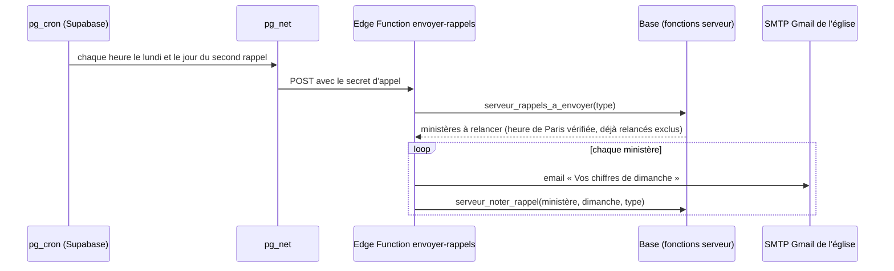

# Rappels de saisie par email

Statut : **proposé**, à valider par EJP Tech (décision P31 de `docs/decisions.md`). Rien n'est codé.
Date : 5 octobre 2026.

## 1. Besoin

Le berger et le conseil lisent chaque semaine des totaux avec leur complétude (« 6 sur 8 »). Un
total incomplet vient presque toujours d'un ministère qui n'a pas encore saisi ses chiffres du
dimanche. Aujourd'hui, rien ne le lui rappelle.

Objectif : faire saisir plus de ministères à temps, **sans nouvelle donnée personnelle, sans
nouveau serveur et sans nouveau sous-traitant**.

Mesure du succès : la part des ministères attendus qui ont saisi « STARs au service » le mercredi
soir, avant et après la mise en service (cible à fixer, question Q6).

## 2. Exigences

### Fonctionnelles

| Code | Exigence                                                                                                                    |
| ---- | --------------------------------------------------------------------------------------------------------------------------- |
| F1   | Le lundi, un email part vers chaque ministère attendu pour le dimanche de référence qui n'a pas saisi « STARs au service ». |
| F2   | Un second rappel part plus tard dans la semaine si la saisie manque toujours (jour et heure : Q1).                          |
| F3   | L'email mène directement à l'écran de saisie du ministère (`/ma-fiche`, étape 4).                                           |
| F4   | Un seul email par ministère, par dimanche et par type de rappel, même si la tâche est relancée.                             |
| F5   | Aucun rappel vers un ministère ou un compte désactivé.                                                                      |
| F6   | Chaque rappel envoyé écrit une ligne au journal, sans adresse email ni texte libre.                                         |
| F7   | En option : rappel quand la dernière valeur « STARs actifs » a plus de 30 jours (Q2).                                       |

### Non fonctionnelles

- **Données** : seulement les adresses des comptes, déjà connues et partagées par ministère.
- **Infrastructure** : Supabase seul (tâche planifiée `pg_cron`, appel `pg_net`, Edge Function)
  et le SMTP Gmail de l'église, déjà utilisé pour les invitations.
- **Dates** : heure de Paris, par `private.aujourdhui()` et `private.dimanche_reference()`.
- **Sécurité** : la fonction d'envoi n'est appelable que par la tâche planifiée, avec un secret ;
  la clé secrète et le mot de passe SMTP restent côté serveur ; rien n'est déclenché depuis le
  navigateur.
- **Volume** : une dizaine d'emails par semaine, très loin des limites de Gmail.
- **Ajout seulement** : les rappels envoyés s'ajoutent, rien ne se modifie.

## 3. Options étudiées

| Option                                                  | Données nouvelles    | Infrastructure              | Conformité                                                                                 | Coût               | Retenue                                |
| ------------------------------------------------------- | -------------------- | --------------------------- | ------------------------------------------------------------------------------------------ | ------------------ | -------------------------------------- |
| Email par Supabase et le SMTP Gmail de l'église         | aucune               | aucune nouvelle             | bonne, sous-traitants déjà déclarés                                                        | nul                | **oui**                                |
| API officielle WhatsApp Cloud (Meta)                    | numéros de téléphone | aucune nouvelle             | possible, mais nouveau sous-traitant et accord de chaque destinataire                      | payant par message | non, pour l'instant                    |
| OpenWA (WhatsApp non officiel)                          | numéros de téléphone | un serveur Docker permanent | déconseillée par le projet lui-même pour un usage réglementé ; risque de blocage du numéro | serveur            | non                                    |
| Message manuel dans le groupe WhatsApp des responsables | aucune               | aucune                      | bonne                                                                                      | temps humain       | en attendant                           |
| Notifications web (application installée)               | abonnements push     | service de notification     | correcte                                                                                   | nul                | non, complexe et peu fiable sur iPhone |

## 4. Conception

- **Heure de Paris** : `pg_cron` compte en UTC et l'heure d'été décale tout d'une heure. La tâche
  tourne donc chaque heure le jour prévu, et la base ne rend des ministères que si l'heure de Paris
  est l'heure choisie (Q1).
- **Sélection** (`private`, `security definer`, appelée par une fonction `public` réservée à
  `service_role`) : ministères actifs le dimanche de référence (`private.actif_le`), sans saisie de
  l'indicateur commun « STARs au service » pour ce dimanche (`v_mesure_dimanche`), avec un compte
  actif, et sans rappel du même type déjà noté.
- **Table `rappel`** (ajout seulement, RLS, aucune lecture par le navigateur) : `ministere_id`,
  `dimanche`, `type`, `envoye_le`, unique sur (`ministere_id`, `dimanche`, `type`). C'est elle qui
  garantit F4.
- **Journal** : nouveau code d'action `rappel_envoye`, détail `{"type", "dimanche"}`, lisible par
  EJP Tech dans le journal technique.
- **Email** : même mise en forme que les emails d'invitation (`supabase/templates`). Objet « Vos
  chiffres de dimanche pour Pilotage EJP », bouton « Saisir les chiffres ». Aucun chiffre, aucun
  nom de personne dans l'email.
- **Secrets** : mot de passe d'application Gmail et secret d'appel en secrets de la fonction,
  posés par la personne responsable dans le tableau de bord.
- **Échec d'envoi** : le rappel n'est pas noté, une ligne d'erreur part dans les journaux de la
  fonction, et le créneau horaire suivant réessaie, au plus jusqu'à la fin de la journée.

## 5. Données personnelles

- **Finalité ajoutée** : rappeler aux ministères de saisir leurs chiffres.
- **Données** : l'adresse email du compte, déjà déclarée ; aucune nouvelle.
- **Sous-traitants** : Supabase et Google, déjà déclarés.
- **Conservation** : la table `rappel` vit autant que l'outil, comme le journal.
- **Page Confidentialité** : une phrase ajoutée dans « À quoi sert l'outil ».

## 6. Tests

- **pgTAP** :
  - la sélection : attendus et manquants, ministère ou compte désactivé, déjà relancé, dimanche de
    référence et heure de Paris ;
  - les droits : seul `service_role` exécute les fonctions, rien pour `anon` ni `authenticated`.
- **Intégration** (Vitest, pile locale, boîte Mailpit de la CLI) :
  - un appel envoie un email à chaque ministère attendu qui n'a pas saisi, et à lui seul ;
  - un second appel n'envoie rien ;
  - le journal est écrit ;
  - un appel sans le bon secret est refusé.
- **Unitaires** : le rendu de l'email.

## 7. Risques et vérifications préalables

| Risque                                                                                                                       | Vérification ou parade                                                                                                                                              |
| ---------------------------------------------------------------------------------------------------------------------------- | ------------------------------------------------------------------------------------------------------------------------------------------------------------------- |
| D'après la documentation de Supabase, les Edge Functions ne peuvent pas ouvrir de connexion sortante sur les ports 25 et 587 | Essai sur la préproduction avec le port 465 de `smtp.gmail.com`. Si l'essai échoue : une API d'envoi d'emails hébergée en Europe, nouveau sous-traitant à déclarer. |
| `pg_cron` et `pg_net` sur l'offre gratuite                                                                                   | Vérifier les extensions disponibles sur la préproduction.                                                                                                           |
| Gmail bloque un envoi automatisé                                                                                             | Volume très faible ; l'échec est journalisé, sans boucle de reprise.                                                                                                |
| Email classé en indésirables                                                                                                 | Expéditeur Gmail lui-même, donc SPF et DKIM corrects ; texte sobre, sans pièce jointe.                                                                              |
| Rappel pendant une semaine sans culte                                                                                        | Q1 : liste de dimanches sans rappel, ou pas de rappel si aucun ministère n'a saisi.                                                                                 |

## 8. Questions pour EJP Tech

- **Q1** : jours et heures des rappels (proposition : lundi 9 h et mercredi 18 h, heure de Paris) ?
  Et les semaines sans culte ?
- **Q2** : rappel « STARs actifs » de plus de 30 jours dès la première version ?
- **Q3** : le ministère FIJ et sa carte des départements sont-ils concernés ?
- **Q4** : un récapitulatif au berger ou à l'administration (« 2 ministères relancés ») ?
- **Q5** : un ministère peut-il demander à ne plus recevoir de rappels ?
- **Q6** : quelle cible de saisie à temps viser ?

## 9. Planification

Après l'étape 4 (fiche ministère et saisies), parce que l'email mène à l'écran de saisie : une
étape « 4 bis », en deux lots parallèles.

- **Lot serveur** : migration, fonctions et pgTAP, Edge Function et tests d'intégration.
- **Lot email et textes** : modèle d'email, page Confidentialité.

Avant ces lots, l'essai du port 465 sur la préproduction tranche le risque principal.
