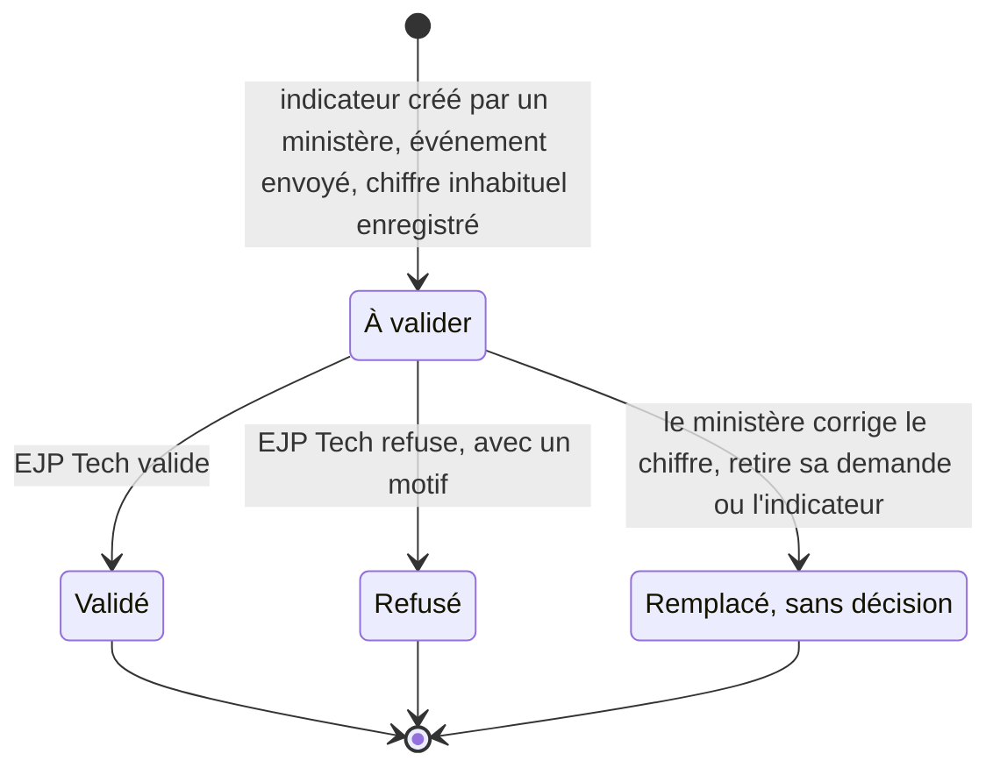
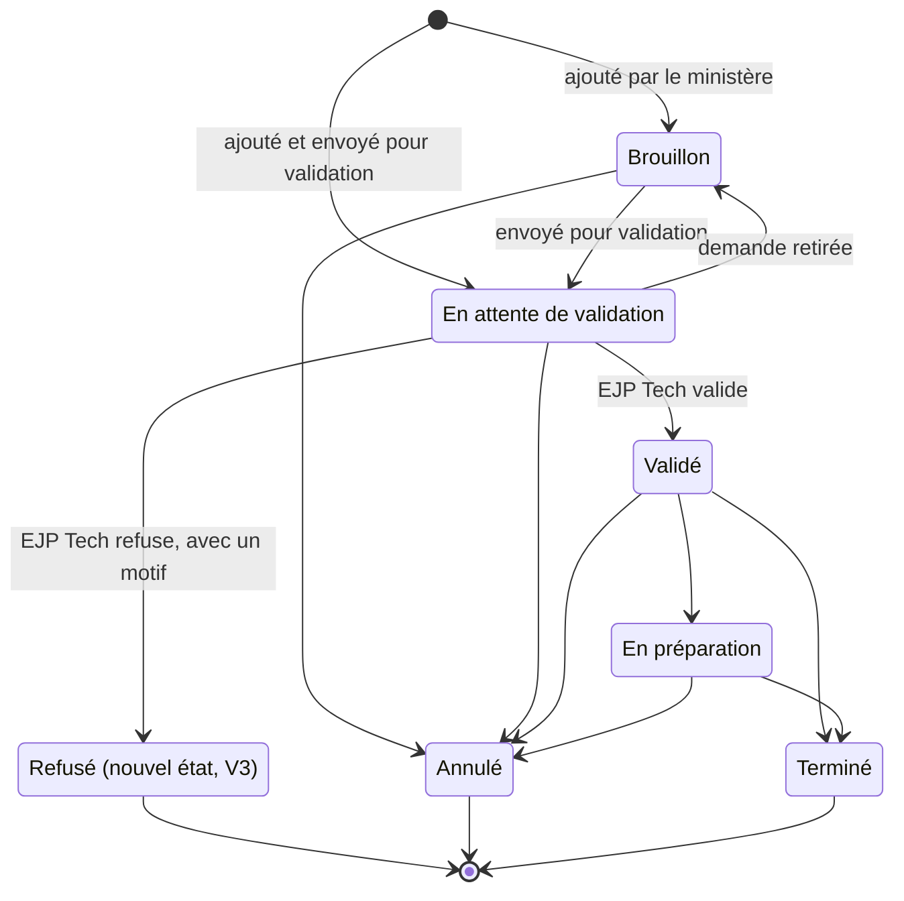

# Validation métier par EJP Tech

Statut : **principe décidé (T30 de `docs/decisions.md`), conception à l'étude, non appliquée**.
Rien n'est codé, aucune migration n'est écrite, `BRIEF.md` n'est pas modifié. Une session ne
construit rien à partir de ce document tant que la personne responsable n'a pas répondu aux
questions de la section 10.
Date : 5 octobre 2026.

Sources : décisions de la personne responsable du 5 octobre 2026 ; `BRIEF.md` (sections 2 à 4, 6,
7, 9, 11 et 13) ; `docs/decisions.md` (P06, P09, P14, P20, P22, T28, T29) ;
`docs/conception/configuration-indicateurs.md` (« la configuration » ci-dessous) ;
`docs/conception/kpi-ministeres.md` (3.6) ; vues de l'étape 3 sur `main`
(`20260930163200_vues_et_lectures.sql` : `v_total_dimanche`, `v_total_a_ce_jour`,
`v_pourcentage_fij`, `v_session_completude`, `v_ecart_dimanche`, `v_ecart_session`) et
`src/lib/metier/completude.ts`, qui met en forme « 6 sur 8 » sans rien recompter.

Numérotation : la branche `etape-droits-ejp-tech` écrit la lecture par EJP Tech sous T29 et le
principe de cette validation sous T30. Sur cette branche, la lecture est T28, la configuration des
indicateurs T29, et cette validation T30. Les deux T30 portent la même décision : à rapprocher à la
fusion.

## 1. Besoin et décisions

### Décisions de la personne responsable (5 octobre 2026)

Elles remplacent tout ce qui, dans les documents plus anciens, dit autre chose.

- EJP Tech (profil `admin_plateforme`) lit tout comme le berger, en lecture seule (T28 sur cette
  branche, construit sur une autre branche).
- La validation métier dans l'outil est faite par **EJP Tech seul** : ni l'administration de
  l'église, ni le berger. EJP Tech ne fait pas que des actions techniques : quand c'est
  nécessaire, il valide ce que les ministères soumettent.
- Ce qui se valide : les indicateurs créés par les ministères, les événements (« En attente de
  validation » devient « Validé » dans l'outil) et les chiffres inhabituels (une saisie loin des
  valeurs habituelles). D'autres candidats sont proposés en 2.2, sans être décidés.
- Tant qu'un élément n'est pas validé, le berger et le conseil le **voient**, marqué « à
  valider », et il **n'entre dans aucun total**. Les totaux gardent une complétude honnête.
- EJP Tech et l'administration de l'église utilisent tous deux l'écran Indicateurs. Pour la
  validation, EJP Tech n'agit plus « sur demande écrite de l'administration ».

### Ce qui change dans le BRIEF

| Section du BRIEF        | Aujourd'hui                                                                                              | Avec T30, à écrire quand la conception est confirmée                                                                  |
| ----------------------- | -------------------------------------------------------------------------------------------------------- | --------------------------------------------------------------------------------------------------------------------- |
| 2, profils et onglets   | EJP Tech : « Modération des champs libres et journal technique. Ne voit aucun chiffre. »                 | EJP Tech lit tout en lecture (T28) et valide ou refuse ce que les ministères soumettent ; nouvel onglet « À valider » |
| 3, règle 1              | liste des tables en ajout seulement                                                                      | `validation` et `chiffre_signale` s'y ajoutent ; aucune exception nouvelle                                            |
| 3, règles 3, 4, 5 et 13 | totaux et complétude sur la saisie la plus récente de chaque ministère                                   | sur les chiffres retenus seulement ; les chiffres à valider se comptent à part (« 5 sur 8, 1 à valider », section 4)  |
| 3, règle 12             | « pour les 6 ministères qui ont saisi les deux fois »                                                    | « pour les 6 ministères comptés les deux fois »                                                                       |
| 3, règle 14             | « la validation se fait en dehors de l'outil » ; le ministère reporte tous les statuts                   | texte proposé ci-dessous                                                                                              |
| 6, modèle               | `statut_evenement` à six valeurs ; codes de journal                                                      | deux tables, état « Refusé » (V3), deux codes de journal, cible `validation`, colonnes ajoutées aux vues (section 8)  |
| 7, sécurité             | matrice, politiques et fonctions                                                                         | lignes et fonctions `valider_*` de la section 8                                                                       |
| 9, écrans               | aide de l'événement « La validation se fait en dehors de l'outil. Ici, on reporte seulement le statut. » | écran « À valider », marques, confirmation d'un chiffre inhabituel, adresse `/a-valider` (section 7)                  |
| 11, hors périmètre      | « validation dans l'outil »                                                                              | retiré de la liste ; « notifications » y reste : tout se signale dans l'interface (7.5)                               |
| 13, plan                | étapes 0 à 8                                                                                             | étape 4b et lot V2 (section 9)                                                                                        |

Règle 14 proposée :

> 14. **Événements** : le ministère qui porte l'événement l'ajoute en brouillon ou l'envoie pour
>     validation (« En attente de validation »). EJP Tech seul le valide ou le refuse, dans l'outil ;
>     un refus porte un motif et il est définitif. Tant qu'il attend, l'événement est visible, marqué
>     « à valider », et n'entre dans aucun comptage. Une fois validé, le ministère reporte sa date et
>     son statut (en préparation, terminé, annulé) à chaque changement ; chaque changement ajoute une
>     ligne d'état et une ligne de journal. Le berger et le conseil lisent les statuts.
>     L'administration ne les change pas : la liste est fixe (`statut_evenement`) et ne change que
>     par une migration d'EJP Tech. Le nom ne change pas : pour renommer, on passe l'événement
>     « Annulé » et on en ajoute un autre.

### Ce qui change dans les décisions et la configuration

| Décision ou passage                     | Aujourd'hui                                                                                 | Avec T30                                                                                                                  |
| --------------------------------------- | ------------------------------------------------------------------------------------------- | ------------------------------------------------------------------------------------------------------------------------- |
| P09                                     | le ministère reporte tous les statuts, « Validé » compris                                   | il ne pose plus « Validé » ; EJP Tech valide ou refuse                                                                    |
| P20                                     | prévus : dernier état « Validé » ou « En préparation »                                      | même règle ; un événement à valider se montre à part, jamais compté (6.4)                                                 |
| P22 et configuration, lot 2             | un ministère d'un domaine sensible fait valider ce qu'il écrit, par l'administration        | toute création d'un ministère est validée, par EJP Tech                                                                   |
| Configuration, 2 (qui fait quoi) et Q15 | valider un ajout : l'administration ; EJP Tech selon Q15                                    | EJP Tech seul. Q15 ne vaut plus que pour les autres gestes (retirer, remplacer, rendre officiel, sensible, euros, calcul) |
| Configuration, 4.3                      | validation seulement dans quatre cas à risque                                               | toute création par un ministère (proposé : suggestions comprises, V1) ; les quatre conditions disparaissent               |
| Configuration, 4.4, 4.5 et 8.1          | un ajout en attente ou jamais validé est caché au berger et au conseil                      | visible, marqué « à valider » ; refusé, il passe dans « Retirés » sans valeur                                             |
| Configuration, 5.2                      | colonnes `ne_en_attente` et `valide_le` (lot 2)                                             | inutiles : la décision est une ligne de `validation`                                                                      |
| Configuration, 5.8 et 5.10              | `valider_indicateur` par l'administration, motif en liste fermée ; code `indicateur_valide` | `valider_indicateur` par EJP Tech, motif libre de 10 à 280 caractères ; codes `element_valide` et `element_refuse`        |
| Configuration, 6.2                      | alerte de valeur inhabituelle calculée dans l'interface, sans suite (lot 2)                 | règle de la base (section 5), confirmation à la saisie, validation par EJP Tech                                           |
| Configuration, 7.1                      | bloc « À valider » sur l'écran Indicateurs, avec des boutons pour l'administration          | une phrase sans bouton ; la décision se prend dans « À valider » d'EJP Tech                                               |

### Ce qui change dans les droits

| Profil                     | Gagne                                                                                                    | Perd                                                                                                |
| -------------------------- | -------------------------------------------------------------------------------------------------------- | --------------------------------------------------------------------------------------------------- |
| EJP Tech                   | valider et refuser, par les fonctions `valider_*` ; la file « À valider » ; masquer un motif de refus    | rien ; il ne saisit toujours rien au nom d'un ministère (T28)                                       |
| Ministère                  | `verifier_chiffres` et `verifier_presence` pour sa fiche ; lecture de l'état et du motif de ses éléments | poser « Validé » sur un événement ; le passer « En préparation » ou « Terminé » avant sa validation |
| Berger, conseil            | lecture des éléments à valider et des motifs de refus                                                    | rien ; aucune action nouvelle                                                                       |
| Administration de l'église | lecture des décisions sur ce qu'elle lit déjà (indicateurs, chiffres communs, présences)                 | valider ou refuser un ajout d'indicateur (configuration, lot 2)                                     |

### Exigences

| Code | Exigence                                                                                                                                  |
| ---- | ----------------------------------------------------------------------------------------------------------------------------------------- |
| F1   | EJP Tech seul valide ou refuse, dans l'outil, les indicateurs créés par un ministère, les événements envoyés et les chiffres inhabituels. |
| F2   | Un refus porte un motif de 10 à 280 caractères. Une validation n'en porte pas.                                                            |
| F3   | Tant qu'un élément attend, le berger et le conseil le voient, marqué « à valider ». Il n'entre dans aucun total.                          |
| F4   | Tout total garde sa complétude et dit combien de chiffres attendent (« 5 sur 8, 1 à valider »).                                           |
| F5   | Un chiffre est inhabituel selon une règle de la base, la même pour l'écran et pour l'enregistrement, explicable en une phrase.            |
| F6   | Le ministère est prévenu avant d'envoyer un chiffre inhabituel, et peut le corriger.                                                      |
| F7   | Une décision est une ligne ajoutée. Elle est définitive, comme un point traité.                                                           |
| F8   | Chaque décision écrit une seule ligne de journal, sans le motif, sans valeur d'indicateur propre et sans email.                           |
| F9   | Rien ne se décide tout seul : un élément qui attend reste visible et compté à part.                                                       |
| F10  | Tous les profils qui lisent un total obtiennent le même total et la même complétude.                                                      |

Non fonctionnelles :

- **Ajout seulement** : `validation` et `chiffre_signale` rejoignent la liste de la règle 1. Un
  trigger `before update or delete` et `before truncate` les rend inaltérables, comme `journal`.
- **Sécurité** : RLS et politique restrictive `aal2` sur les deux tables ; aucun GRANT d'écriture ;
  `security definer` seulement dans `private`, `set search_path = ''`, `exige_aal2()` en tête de
  chaque fonction de l'API ; vues `security_invoker`.
- **Dates** : heure de Paris (`private.aujourdhui()`, `private.dimanche_reference()`, et
  `(x at time zone 'Europe/Paris')::date` pour un horodatage), jamais `current_date`.
- **Entretien** : deux tables, une fonction de règle et ses seuils en un seul endroit, aucune
  colonne d'état mise à jour, aucun cache, aucune tâche planifiée.

## 2. Ce qui se valide

### 2.1 Les trois objets décidés

| Objet                            | Qui le soumet                               | Entre en validation                                                                    | Ce qu'EJP Tech vérifie (proposé)                                                                                                                          | Tant qu'il attend                                                                                     |
| -------------------------------- | ------------------------------------------- | -------------------------------------------------------------------------------------- | --------------------------------------------------------------------------------------------------------------------------------------------------------- | ----------------------------------------------------------------------------------------------------- |
| Indicateur créé par un ministère | le ministère, depuis « Mes indicateurs »    | à sa création : suggestion (lot 1 de la configuration) ou compte écrit par lui (lot 2) | utile au ministère ; ni doublon d'un chiffre commun ni d'un autre indicateur ; libellé et définition clairs ; pas un domaine sensible qui n'a pas sa case | sur la fiche, marqué « à valider », sans saisie possible (V2) ; compté dans les 3 ajouts du ministère |
| Événement                        | le ministère qui le porte                   | quand il passe « En attente de validation », à la création ou depuis un brouillon      | il existe et ce ministère le porte ; date plausible ; pas de doublon ; nom sans donnée personnelle ; accord obtenu hors de l'outil s'il en faut un (6.1)  | statut « En attente de validation », marqué « à valider » ; dans aucun comptage                       |
| Chiffre inhabituel               | le ministère qui saisit, après confirmation | à l'enregistrement, quand la règle de la section 5 le repère                           | ce n'est pas une faute de frappe ; le chiffre a une raison (fête, rattrapage, équipe qui change), au besoin en demandant au ministère hors de l'outil     | sur la fiche avec « à valider » ; hors des totaux, compté à part dans la complétude                   |

Suggestions (V1) : proposé, une suggestion ajoutée par un ministère passe aussi en validation.
Raisons : la décision dit « les indicateurs créés par les ministères », sans exception ; la question
d'EJP Tech (ce chiffre est-il utile à ce ministère, n'est-il pas déjà compté ?) se pose de la même
façon ; une seule règle est plus simple à expliquer et à tester. Coût : un clic d'EJP Tech par
suggestion, et l'état « en attente » passe du lot 2 au lot 1 de la configuration. Alternative :
suggestion active tout de suite, puisque son libellé et sa définition sont déjà relus.

### 2.2 Autres candidats

La personne responsable a demandé une liste argumentée. Rien n'est décidé : « proposé » veut dire
« à ajouter si la personne responsable le confirme », « déconseillé » veut dire « à ne pas
valider ».

| Candidat                                                                                      | Avis                            | Pourquoi                                                                                                                                                                                                                                                                      |
| --------------------------------------------------------------------------------------------- | ------------------------------- | ----------------------------------------------------------------------------------------------------------------------------------------------------------------------------------------------------------------------------------------------------------------------------- |
| Correction tardive : nouvelle saisie d'une période déjà saisie, plus de 4 semaines après elle | proposé, au lot V2 ou plus tard | un total que le berger a déjà lu et discuté change sans bruit ; la règle est objective (période déjà saisie, âge de la période) ; la première saisie d'une période, même ancienne (rattrapage d'un indicateur tout juste validé), reste libre, donc pas d'afflux dans la file |
| Toute présence à une session, et pas seulement l'inhabituelle                                 | déconseillé                     | une session reçoit 8 à 22 saisies le même jour : la file déborderait et le total de la session resterait incomplet plusieurs jours ; les présences inhabituelles sont déjà couvertes (section 5)                                                                              |
| Sessions déclarées par l'administration                                                       | déconseillé                     | l'administration est l'autorité de l'église pour les sessions (règle 5) ; une session non validée bloquerait la saisie de tous les ministères attendus ; une erreur se corrige déjà (modifier, supprimer tant que rien n'est saisi)                                           |
| Points d'attention                                                                            | déconseillé                     | un point urgent doit atteindre le berger tout de suite ; aucun total n'en dépend ; la modération relit déjà les textes après coup                                                                                                                                             |
| Mentions d'un point                                                                           | déconseillé                     | retarder une mention cacherait le point au ministère mentionné, qui doit pouvoir le traiter ; une mention est fixée à la création et ne fait aucun total                                                                                                                      |
| Textes déjà modérés (relus ou masqués)                                                        | déconseillé                     | la relecture est déjà la vérification d'EJP Tech ; valider avant de publier bloquerait chaque texte et doublerait le travail                                                                                                                                                  |
| Prochaine réunion                                                                             | déconseillé                     | simple déclaration du ministère, sans total ; une réunion passée disparaît d'elle-même                                                                                                                                                                                        |
| Carte des FIJ (`fij_departement`)                                                             | déconseillé en V1               | un seul ministère la saisit, avec de très petits nombres (2 à 6 par département) : toute règle d'écart alerterait à tort ; le même mécanisme s'y ajoute plus tard s'il le faut                                                                                                |
| Comptes et ministères (création, désactivation)                                               | déconseillé                     | P07 : l'administration crée les comptes, EJP Tech demande et l'église décide ; valider ses gestes inverserait ce partage et donnerait à une seule personne le contrôle des accès                                                                                              |
| Indicateurs créés par l'administration ou par EJP Tech                                        | déconseillé                     | l'administration décide de ce qui est suivi (configuration, Q15) ; EJP Tech ne se valide pas lui-même                                                                                                                                                                         |
| Changements d'un événement déjà validé (report, préparation, fin, annulation)                 | déconseillé                     | le ministère sait si son événement a eu lieu ; revalider chaque changement triplerait la file ; un report reste lisible dans l'historique (P20) ; voir V4 pour la date                                                                                                        |
| Premières valeurs d'un ministère, sans historique                                             | déconseillé                     | à la mise en service, 22 ministères et 3 chiffres communs feraient 66 éléments la première semaine ; la règle de la section 5 attend 4 valeurs                                                                                                                                |
| Retrait d'un indicateur par un ministère                                                      | déconseillé                     | il ne retire que ses propres ajouts, l'historique reste, aucun total ne change                                                                                                                                                                                                |
| Plus de STARs au service que de STARs actifs dans un ministère                                | déconseillé                     | un STAR peut servir dans un ministère qui n'est pas son ministère principal (BRIEF, section 6) : ce n'est pas une erreur                                                                                                                                                      |

## 3. Cycle de validation commun

### États



L'état se lit dans les données, il n'est jamais une colonne mise à jour :

- **À valider** : l'élément attend et aucune ligne de `validation` ne le vise.
- **Validé** : une ligne de `validation` avec `decision = 'valide'`.
- **Refusé** : une ligne avec `decision = 'refuse'` et son motif.
- **Remplacé** : le ministère a saisi un autre chiffre pour la même période (même dimanche, même
  mois, même session, ou relevé plus récent d'un « à ce jour »), a remis l'événement en brouillon
  ou l'a annulé, ou a retiré l'indicateur. L'élément sort de la file sans ligne de `validation`.

### Règles communes

- Une validation est une **nouvelle ligne** de `validation`, jamais un `update`. Deux gestes
  l'accompagnent, déjà bornés : la nouvelle ligne d'état d'un événement (un ajout dans
  `evenement_etat`) et le changement d'`indicateur.etat`, table de référence dont les seuls
  changements sont listés par la configuration (5.9).
- Une décision est **définitive** : un index unique par objet interdit une seconde décision. Après
  un refus, le ministère saisit un autre chiffre, ajoute un autre événement ou un autre indicateur.
- **EJP Tech seul** décide (`private.mon_type() = 'admin_plateforme'`), par les fonctions
  `valider_*` (8.4). Tout autre profil reçoit 42501, avec le message d'un objet absent.
- **Refus** : motif obligatoire, de 10 à 280 caractères après `btrim`. Sous le champ, le rappel
  « N'écrivez aucun nom ni information personnelle. ». Comme les textes de l'administration
  (règle 9), le motif ne passe pas en relecture ; EJP Tech peut le masquer (`masquer_texte`,
  couple `validation`, `motif`). Une validation ne porte aucun texte.
- **Deux comptes EJP Tech** peuvent décider : un verrou `for update` sur l'objet et l'index unique
  empêchent deux décisions ; le second reçoit « Cet élément a déjà été décidé. ».
- **Aucune décision automatique** (5.7).

### Qui fait quoi

| Geste                                                                 | Ministère                             | Berger, conseil | Administration de l'église                                 | EJP Tech           |
| --------------------------------------------------------------------- | ------------------------------------- | --------------- | ---------------------------------------------------------- | ------------------ |
| Soumettre (indicateur, événement, chiffre inhabituel confirmé)        | oui, pour lui                         | non             | non                                                        | non                |
| Retirer sa demande (corriger le chiffre, brouillon, annuler, retirer) | oui, pour lui                         | non             | non                                                        | non                |
| Valider                                                               | non                                   | non             | non                                                        | oui, seul          |
| Refuser, avec un motif                                                | non                                   | non             | non                                                        | oui, seul          |
| Voir qu'un élément attend                                             | les siens ; le nombre pour les totaux | tout, marqué    | indicateurs, chiffres communs et présences, comptés à part | tout, dans la file |
| Lire le motif d'un refus                                              | les siens                             | oui             | sur ce qu'elle lit                                         | oui                |

### Ce que voit le ministère qui soumet

| Objet      | À valider                                                                                                                                     | Validé                                                 | Refusé                                                                                                   |
| ---------- | --------------------------------------------------------------------------------------------------------------------------------------------- | ------------------------------------------------------ | -------------------------------------------------------------------------------------------------------- |
| Indicateur | « En attente de validation par EJP Tech depuis 2 jours : vous pourrez le saisir dès qu'il sera validé, y compris pour les périodes passées. » | il apparaît dans le formulaire                         | dans « Retirés » : « Refusé le 8 oct. : « motif ». »                                                     |
| Événement  | « En attente de validation par EJP Tech depuis 3 jours. »                                                                                     | statut « Validé » ; « Mettre à jour » propose la suite | statut « Refusé », « Refusé le 8 oct. : « motif ». Ajoutez un nouvel événement s'il le faut. »           |
| Chiffre    | « 120, à valider par EJP Tech : pas encore compté dans les totaux de l'église. »                                                              | la valeur, sans mention                                | « 120, refusé le 8 oct. : « motif ». Saisissez le bon chiffre. », et « Vos saisies » repasse « À faire » |

### Journal

Une ligne par décision, comme pour tout geste (règle 10). `compte` est le compte EJP Tech,
`ministere_id` celui de l'élément : la fraîcheur du ministère ne bouge pas (règle 6, elle ne lit
que les lignes écrites par un compte du ministère).

| Code                   | Libellé (écran 06) | `cible`, `cible_id`    | `detail` (codes, identifiants et dates seulement)                                                                                                     | Détail affiché (exemple)                                |
| ---------------------- | ------------------ | ---------------------- | ----------------------------------------------------------------------------------------------------------------------------------------------------- | ------------------------------------------------------- |
| `element_valide`       | A validé           | `validation`, sa ligne | `{"objet": "mesure", "indicateur_id", "date_ref"}`, `{"objet": "participation", "session_id"}`, `{"objet": "evenement"}` ou `{"objet": "indicateur"}` | « STARs au service du 27 sept., Communication »         |
| `element_refuse`       | A refusé           | `validation`, sa ligne | idem                                                                                                                                                  | « Soirée de louange, Communication »                    |
| `mesure_saisie`        | inchangé           | aucune                 | chaque ligne signalée gagne `"a_valider": true`                                                                                                       | « STARs au service du 27 sept. : 120, à valider »       |
| `participation_saisie` | inchangé           | session                | gagne `"a_valider": true` si la présence est signalée                                                                                                 | « Bâtir l'Église du 26 sept. : 45 présents, à valider » |
| `indicateur_cree`      | inchangé           | indicateur             | `"attente": true` (configuration, 5.10)                                                                                                               | « Pages Roses : ateliers, chaque mois, à valider »      |

- Jamais le motif, jamais une valeur d'indicateur propre, jamais un email : l'écran lit le texte
  actuel de l'objet par `cible_texte` (`v_journal` gagne le cas `validation`), sous la RLS du
  lecteur.
- La ligne d'état qu'écrit `valider_evenement` ne produit pas de ligne `evenement_modifie` : le
  trigger du journal la saute quand la transaction a posé le réglage local `pilotage.validation`
  (`set_config`, que l'API n'expose pas : aucun client ne peut le poser).
- Lecteurs : le ministère lit les lignes de son ministère ; le berger, le conseil et EJP Tech
  toutes ; l'administration celles dont elle lit l'objet (`journal_lisible_administration` gagne
  ces deux codes pour les objets `indicateur`, `participation` et `mesure` d'un chiffre commun).

## 4. Effet sur les totaux et la complétude

### 4.1 Trois états d'un chiffre saisi

- **Retenu** : jamais signalé, ou signalé puis validé. Il compte.
- **À valider** : signalé, sans décision. Il ne compte pas.
- **Refusé** : signalé puis refusé. Il ne compte pas, et le ministère est traité comme s'il
  n'avait pas saisi (manquant, rappel P14 s'il est construit).

La saisie la plus récente fait toujours foi (règle 2) : si la plus récente d'une période est à
valider ou refusée, le ministère n'est pas compté pour cette période. **Proposé, pas de repli sur
une saisie plus ancienne** de la même période (V7) : le ministère a lui-même remplacé cette
valeur, et la règle 3 ne reprend déjà jamais la valeur d'un autre dimanche. Une correction
ordinaire (12 après 120) devient la plus récente, compte tout de suite et fait sortir 120 de la
file.

### 4.2 Lire la complétude

Règle proposée : **le premier nombre est toujours celui des ministères (ou des périodes) dont la
valeur est dans le total**. Les chiffres à valider se disent à part.

| Situation               | Affichage                                                              | Libellé accessible                                                                                                        |
| ----------------------- | ---------------------------------------------------------------------- | ------------------------------------------------------------------------------------------------------------------------- |
| Rien n'attend           | « 6 sur 8 »                                                            | inchangé                                                                                                                  |
| Un chiffre à valider    | « 5 sur 8, 1 à valider »                                               | « 5 ministères comptés sur 8 attendus. Le chiffre d'un ministère attend la validation d'EJP Tech : il n'est pas compté. » |
| Deux chiffres à valider | « 4 sur 8, 2 à valider »                                               | idem, au pluriel                                                                                                          |
| Un chiffre refusé       | « 5 sur 8 »                                                            | le ministère compte parmi ceux qui n'ont pas saisi                                                                        |
| « À ce jour »           | « 7 sur 8, 1 à valider » ; « À ce jour, 1 valeur de plus de 30 jours » | les valeurs de plus de 30 jours se comptent parmi les retenues                                                            |
| Session                 | « 5 sur 8, 1 à valider. Manquent : Coordination et Intégration. »      | les manquants comprennent un ministère dont la présence est refusée                                                       |
| Somme de l'année        | « Somme des mois depuis janvier : 98 (8 mois sur 9, 1 à valider). »    | les périodes à valider ne sont ni dans la somme ni dans les saisies                                                       |

Écarté : « 6 sur 8, dont 1 à valider ». Le premier nombre ne serait plus celui des ministères
additionnés : devant « 47 (6 sur 8) », le berger croirait que 47 couvre six ministères. La forme
retenue garde le sens actuel de « 6 sur 8 » et ajoute une information, sans en changer une.

Mise en forme : `completude(saisis, attendus)` de `src/lib/metier/completude.ts` gagne un
argument `aValider` (0 par défaut) ; `libelle` devient « 5 sur 8, 1 à valider » quand il n'est pas
nul ; `complet` reste faux tant qu'un chiffre attend.

### 4.3 Total par total

| Total                                      | Ce qui s'additionne                                                                                       | Complétude                                                             | Exemple                                                             |
| ------------------------------------------ | --------------------------------------------------------------------------------------------------------- | ---------------------------------------------------------------------- | ------------------------------------------------------------------- |
| Dimanche (STARs au service)                | pour chaque ministère, sa saisie la plus récente pour D, si elle est retenue                              | comptés sur attendus ; à valider à part ; les attendus ne changent pas | « 47 », « 5 sur 8, 1 à valider »                                    |
| À ce jour (STARs actifs, dont en FIJ)      | dernière valeur de chaque ministère actif, si elle est retenue                                            | idem ; « plus de 30 jours » parmi les retenues                         | « 69 », « 7 sur 8, 1 à valider »                                    |
| Pourcentage FIJ (calculé)                  | ministères actifs dont les deux dernières valeurs sont retenues ; sinon le ministère sort des deux sommes | « 7 sur 8, 1 à valider »                                               | « 53 sur 69 STARs actifs », 77 %                                    |
| Session                                    | présents moins déjà comptés, sur la saisie la plus récente de chaque ministère, si elle est retenue       | comptés, à valider, manquants (refusés compris)                        | « 47 », « 5 sur 8, 1 à valider »                                    |
| Carte des FIJ                              | inchangée : pas de détection en V1 (2.2)                                                                  | « 8 dép. »                                                             |                                                                     |
| Indicateur propre : somme de l'année       | périodes finies dont la saisie la plus récente est retenue                                                | « 8 mois sur 9, 1 à valider »                                          | « Somme des mois depuis janvier : 98 (8 mois sur 9, 1 à valider). » |
| Indicateur propre : calcul (taux, moyenne) | périodes dont le haut et le bas sont retenus                                                              | comme la configuration (3.4)                                           | « Non calculé : demandes reçues de septembre à valider. »           |
| Comptages d'événements (phase 2, P20)      | événements validés                                                                                        | pas de liste d'attendus : « et 2 à valider », jamais compté            | « 4 prévus en octobre, et 2 à valider »                             |

`v_total_dimanche` en exemple (le reste suit le même schéma, 8.3) :

```sql
-- v_mesure_dimanche gagne mesure_id et etat à la fin ; nb_saisis compte désormais les ministères
-- comptés, nb_a_valider s'ajoute à la fin (create or replace view n'accepte que des colonnes ajoutées).
select i.id as indicateur_id, d.dimanche,
       sum(v.valeur) filter (where v.etat = 'retenu') as total,      -- null : trou dans la courbe
       count(*) filter (where v.etat = 'retenu') as nb_saisis,
       (... nb_attendus inchangé ...) as nb_attendus,
       count(*) filter (where v.etat = 'a_valider') as nb_a_valider
```

### 4.4 Courbes et écarts

- **Courbes** : elles gardent le total brut des chiffres retenus. Un dimanche ou une session dont
  un chiffre attend est incomplet : cercle vide, comme aujourd'hui. Un point passé monte quand le
  chiffre est validé, comme il monte aujourd'hui après un rattrapage.
- **Écart à périmètre égal** (règle 12) : seuls les ministères **retenus les deux fois** entrent
  dans la comparaison, pour un dimanche comme pour une session. Libellé : « +3 par rapport à
  dimanche dernier, pour les 5 ministères comptés les deux fois ». Un chiffre à valider ne crée
  donc jamais un faux écart.

### 4.5 Phrases

- **Phrase de la semaine** : A additionne les chiffres retenus ; B ne change pas (un ministère
  dont le chiffre attend a saisi). La ligne secondaire commence, s'il y a lieu, par « Le chiffre
  de Social attend la validation d'EJP Tech : il n'est pas encore compté. » ou « 2 chiffres
  attendent la validation d'EJP Tech (Social et MCAD) : ils ne sont pas encore comptés. » Elle
  garde deux phrases au plus : la dernière tombe.
- **Phrase de la fiche** : la valeur du ministère, avec sa marque (« 120 STARs au service
  dimanche, à valider par EJP Tech. »).
- **Accueil du ministère** : « Vos saisies » reste « Fait » pour un chiffre à valider (« Fait, 120
  au service, à valider ») et repasse « À faire » pour un chiffre refusé, avec le bouton
  « Corriger ».

### 4.6 Règles gardées

- **Un STAR compté une fois** : le total d'une session reste la somme de (présents moins déjà
  comptés) sur les présences retenues. Écarter une présence à valider retire l'apport de ce seul
  ministère ; la valider l'ajoute une fois. Aucun nom, aucune liste.
- **Les valeurs calculées ne se saisissent jamais** : pourcentage FIJ, taux et moyennes se
  calculent sur des chiffres retenus. La règle de la section 5 ne vise que des chiffres saisis ; un
  calcul n'est jamais « à valider », il est calculé ou « Non calculé ».
- **Mêmes totaux pour tous** : un signalement et une décision se lisent exactement quand leur
  chiffre se lit (politique de 8.5). Un ministère, le berger et l'administration obtiennent donc
  les mêmes totaux des chiffres communs. Un test pgTAP le vérifie.
- **Dates** : les durées (« depuis 3 jours ») et les périodes se comptent à l'heure de Paris.

## 5. Chiffres inhabituels

### 5.1 Ce qui est contrôlé

- Les saisies de `mesure` : chiffres communs (STARs au service, STARs actifs, dont en FIJ) et
  indicateurs propres (dimanche, mois, à ce jour), sensibles compris.
- Les présences (`participation.valeur`) aux sessions Bâtir l'Église et Anti-Dispersion,
  comparées aux sessions précédentes du même type.
- Jamais contrôlés : un rassemblement « autre » (chaque rassemblement est différent), la carte des
  FIJ, « déjà comptés », un calcul, une saisie du jeu d'exemple ou d'une migration (sans
  `auth.uid()`).

### 5.2 La règle

Pour un chiffre `v` saisi par un ministère, la base prend :

- **les valeurs comparées** : les 6 dernières valeurs retenues du même ministère pour le même
  chiffre, une par période (celle qui compte dans les totaux), sur les périodes **avant** celle
  de la saisie : dimanches avant D, mois avant le mois saisi, relevés d'avant aujourd'hui pour un
  « à ce jour », sessions du même type avant celle-ci ;
- **la référence `r`** : la médiane de ces valeurs, arrondie à l'entier ;
- **la dernière valeur retenue `d`**.

Avec `f` le facteur et `e` l'écart minimum, `v` est **loin** de `x` si `v` vaut au moins `f` fois
`x` et le dépasse d'au moins `e`, ou si `x` vaut au moins `f` fois `v` et le dépasse d'au moins
`e`. Le chiffre est **inhabituel** quand il y a au moins 4 valeurs comparées, que `v` est loin de
`r` **et** loin de `d`.

| Réglage                   | Valeur proposée             | Raison                                                                                                |
| ------------------------- | --------------------------- | ----------------------------------------------------------------------------------------------------- |
| Valeurs comparées         | 6                           | une médiane stable, sur six semaines pour un dimanche                                                 |
| Historique minimum        | 4 valeurs                   | en dessous, la médiane ne dit rien : les 4 premières saisies d'un chiffre ne sont jamais signalées    |
| Référence                 | médiane                     | une valeur extrême passée ne la déplace pas, contrairement à une moyenne                              |
| Facteur, flux             | 3 (dimanche, mois, session) | une fête ou un culte spécial double un chiffre sans erreur ; une faute de frappe le multiplie par dix |
| Facteur, stock            | 2 (« à ce jour »)           | un stock bouge lentement : 14 STARs actifs devenus 41 est presque toujours une faute de frappe        |
| Écart minimum             | 10                          | sur de petits nombres (2 puis 7), le rapport seul alerterait à tort                                   |
| Loin aussi de la dernière | oui                         | après un changement durable validé une fois (12 puis 40), la suite (41, 39) ne réalerte pas           |

Ces valeurs sont des choix, pas des mesures (V6). Elles vivent dans une seule fonction
(`private.seuils_inhabituel()`), changée par une petite migration.

### 5.3 Exemples

| Chiffre                            | Valeurs comparées (de la plus ancienne à la plus récente) | `r`, `d` | Saisie | Résultat                                                     |
| ---------------------------------- | --------------------------------------------------------- | -------- | ------ | ------------------------------------------------------------ |
| STARs au service (dimanche, f = 3) | 10, 12, 12, 13, 11, 12                                    | 12, 12   | 120    | inhabituel : 120 vaut plus de 3 fois 12 et le dépasse de 108 |
| idem                               | idem                                                      | 12, 12   | 30     | habituel : moins de 3 fois 12                                |
| idem                               | idem                                                      | 12, 12   | 0      | inhabituel : 12 vaut plus de 3 fois 0 et le dépasse de 12    |
| idem                               | idem                                                      | 12, 12   | 3      | habituel : l'écart (9) est sous 10                           |
| STARs actifs (à ce jour, f = 2)    | 14, 14, 15, 14, 14, 14                                    | 14, 14   | 41     | inhabituel                                                   |
| idem                               | idem                                                      | 14, 14   | 22     | habituel : moins de 2 fois 14                                |
| Publications (mois, f = 3)         | 3, 5, 4, 4, 6, 3                                          | 4, 3     | 30     | inhabituel                                                   |
| idem                               | idem                                                      | 4, 3     | 12     | habituel : l'écart avec 4 (8) est sous 10                    |
| STARs au service, après une hausse | 12, 12, 12, 12, 12, 40 (40 validé)                        | 12, 40   | 41     | habituel : loin de 12 mais proche de 40                      |
| Présents à Bâtir l'Église (f = 3)  | 13, 15, 12, 13                                            | 13, 13   | 45     | inhabituel                                                   |
| Un indicateur saisi 3 fois         | 4, 5, 4                                                   |          | 40     | jamais signalé : moins de 4 valeurs                          |

### 5.4 Où la règle se calcule

- Une seule fonction, `private.chiffre_inhabituel`, `stable`, `security definer`,
  `set search_path = ''`. Elle reçoit le ministère, l'indicateur ou la session, la date de la
  période et la valeur, et rend `inhabituel`, `reference`, `derniere`, `nb_valeurs`, `facteur` et
  `sens` (« haut » ou « bas »).
- **À l'enregistrement** : un trigger `after insert ... for each statement` sur `mesure` et sur
  `participation` l'appelle pour chaque ligne et écrit une ligne de `chiffre_signale` pour chaque
  chiffre inhabituel. Le résultat est **figé** : une décision prise plus tard sur un autre
  chiffre ne change pas ce qui a été signalé, et l'écran peut toujours dire pourquoi. Les triggers
  s'appellent `chiffres_inhabituels_*`, pour passer avant ceux du journal (Postgres les déclenche
  par ordre alphabétique) : la ligne `mesure_saisie` peut ainsi porter `"a_valider": true`.
- **Avant l'envoi** : `verifier_chiffres` et `verifier_presence` appellent la même fonction pour la
  confirmation (5.5). L'écran ne recopie jamais la règle ; si le client passe outre, la base
  signale quand même.

### 5.5 À la saisie : la confirmation

Au clic sur « Enregistrer les chiffres » (dimanche, mois, session), l'écran appelle
`verifier_chiffres` (ou `verifier_presence`) une fois. Si rien n'est inhabituel, l'envoi part comme
aujourd'hui, en un seul insert. Sinon, une fenêtre s'ouvre avant l'envoi :

- titre « Vérifiez ce chiffre » (ou « Vérifiez ces chiffres ») ;
- pour chaque chiffre : « STARs au service : 120. D'habitude, Communication saisit 12 (médiane des
  6 derniers dimanches). » ;
- « Si c'est le bon chiffre, enregistrez-le : EJP Tech le vérifiera avant qu'il entre dans les
  totaux de l'église. » ;
- boutons « Corriger le chiffre » (revient au champ, valeur sélectionnée) et « Enregistrer quand
  même » (envoie tout, en un seul insert).

Précisions :

- Un « à ce jour » prérempli avec une valeur qui attend n'est pas renvoyé s'il n'a pas changé : il
  est déjà dans la file. Si la dernière valeur a été refusée, le champ est prérempli
  avec la dernière valeur retenue, et la ligne dit « 41 a été refusé le 8 oct. : « motif ». ».
- Proposé : pas d'explication du ministère en V1 (V13). Une liste fermée (« Événement
  exceptionnel », « Rattrapage d'un oubli ») aiderait EJP Tech, mais ajoute une colonne à `mesure`
  ou un second appel.
- Réussite : « Chiffres enregistrés. 1 chiffre attend la validation d'EJP Tech. ».

### 5.6 Ce que voit EJP Tech

Dans la section « Chiffres inhabituels » de « À valider » (7.1), pour chaque chiffre :

- « Communication, STARs au service du dimanche 27 sept. : 120 » ;
- « D'habitude : 12 (médiane des 6 derniers dimanches : 10, 12, 12, 13, 11, 12 ; dernier chiffre
  compté : 12) » ;
- s'il remplace une saisie de la même période : « Remplace 12, saisi le 27 sept. » ;
- « Saisi le 28 sept. à 12 h 41, depuis 3 jours » ;
- l'effet : « Pas compté dans : STARs au service du 27 sept. (5 sur 8, 1 à valider). » ;
- boutons « Valider » et « Refuser ».

### 5.7 Si EJP Tech ne décide pas

- **Rien ne se décide tout seul** (proposé, V9) : une validation automatique après quelques jours
  viderait la décision de sens ; un refus automatique ferait perdre un chiffre juste. Le total
  reste honnête : il dit « 1 à valider ».
- **Vieillissement** : la file montre « depuis 3 jours » ; au-delà de 7 jours, « depuis 9 jours,
  en retard », en orange avec le mot. La phrase de la Modération le reprend (« 2 éléments attendent
  depuis plus de 7 jours. »).
- **Rappel** : dans l'interface seulement en V1 (7.5). Si P14 est construit, un email
  hebdomadaire aux comptes EJP Tech, le lundi, quand un élément attend depuis plus de 7 jours :
  « 3 éléments attendent votre validation dans Pilotage EJP », sans chiffre ni nom, lien vers
  `/a-valider`.
- **Suppléance** : tout compte EJP Tech décide. Proposé : au moins deux comptes EJP Tech actifs
  (V16), et la file vue chaque semaine avec la modération (`docs/exploitation.md`, étape 8).
- Un chiffre ancien qui attend reste dans la file, sans date limite : sa période reste incomplète
  tant qu'il n'est pas décidé.

### 5.8 Fausses alertes

- **Avant l'envoi** : la confirmation laisse le ministère corriger une faute de frappe ; la plupart
  n'atteignent jamais la file.
- **Après l'envoi** : EJP Tech valide en un clic ; le chiffre compte alors pour sa date, rien
  n'est perdu, seulement retardé.
- **Changement durable** : la clause « loin aussi de la dernière valeur retenue » évite de
  réalerter après une hausse ou une baisse validée.
- **Réglage** : chaque mois, EJP Tech compte dans le journal les chiffres validés et refusés
  (codes seulement). Si plus de 3 alertes sur 4 sont validées, une petite migration relève le
  facteur (3 vers 4) ou l'écart minimum.
- **Refus par erreur** : le ministère saisit de nouveau le même chiffre ; il est signalé de
  nouveau (l'historique n'a pas changé), et EJP Tech le valide.

## 6. Événements

### 6.1 Ce que « validé » veut dire

Proposé (V5) : « Validé » veut dire que l'événement est confirmé pour le calendrier de l'église.
EJP Tech a vérifié les points de 2.1 et, si l'événement demande l'accord du berger ou de la
coordination, que cet accord est donné, en dehors de l'outil ou par un point d'attention. L'outil
garde la décision d'EJP Tech, sa date et son auteur, pas l'accord lui-même.

Qui soumet : le ministère qui porte l'événement, seul à en ajouter (P09). Il l'ajoute en brouillon
ou l'envoie tout de suite pour validation.

### 6.2 Cycle d'un événement



- Un état accepte une nouvelle ligne au même statut avec une autre date (report), sauf « Refusé »
  et « Annulé », qui sont définitifs (proposé : pour reprendre, on ajoute un événement, comme pour
  renommer).
- Le ministère ne pose jamais « Validé » ni « Refusé ». Il ne pose « En préparation » ou
  « Terminé » que sur un événement validé, c'est-à-dire qui a dans son historique une ligne
  « Validé », « En préparation » ou « Terminé » (les événements du jeu d'exemple, saisis avant la
  règle, restent ainsi cohérents).
- La base l'impose par un trigger `before insert` sur `evenement_etat`
  (`private.controler_evenement_etat`), pour tout compte connecté ; le jeu d'exemple, sans
  `auth.uid()`, n'est pas contrôlé, comme pour `forcer_auteur`. `ajouter_evenement` n'accepte plus
  que « Brouillon » et « En attente de validation ».
- `valider_evenement` ajoute la ligne « Validé » ou « Refusé », à la date actuelle de
  l'événement, au nom du compte EJP Tech (auteur imposé par `forcer_auteur`), et la ligne de
  `validation`.
- Proposé (V4) : un report de date après la validation ne la remet pas en cause.
- « Refusé » demande une nouvelle valeur `refuse` de `statut_evenement` (`alter type`), libellé
  « Refusé ». Alternative (V3) : le refus remet l'événement en brouillon, sans nouvel état, mais un
  ministère pourrait renvoyer la même demande en boucle.

### 6.3 Vue de l'église et fiche

- **« Les ministères », colonne « Prochain événement »** : l'événement daté d'aujourd'hui ou après,
  ni terminé, ni annulé, ni refusé, le plus proche. Proposé (V5) : sans les brouillons, qui ne
  sont pas soumis. Un événement en attente s'affiche avec sa marque : « Soirée de louange, 10 oct.
  (à valider) ». `private.tableau_ministeres()` gagne la colonne `prochain_evenement_a_valider`
  (nouvelle version de la fonction et de sa vue).
- **Fiche (04, 12)** : le calendrier montre chaque événement avec son statut en mots ; en attente,
  « à valider par EJP Tech depuis 3 jours » ; refusé, « Refusé le 8 oct. par EJP Tech : « motif ». »,
  tant que l'événement est dans la fenêtre du calendrier (7 jours après sa date).
- La vue de l'église ne compte pas les événements : rien d'autre ne change.

### 6.4 Comptages de la coordination (P20, phase 2)

| Compte              | Règle avec T30                                                                                                 |
| ------------------- | -------------------------------------------------------------------------------------------------------------- |
| Prévus              | dernier état « Validé » ou « En préparation », daté d'aujourd'hui ou après                                     |
| Réalisés            | dernier état « Terminé », date dans la période (un événement terminé est forcément validé)                     |
| Annulés             | dernier état « Annulé » sur un événement validé avant ; annulé avant la validation, il n'est compté nulle part |
| Reportés            | date repoussée, lue dans l'historique, après la validation                                                     |
| À valider           | montré à part, jamais dans un taux : « 4 prévus en octobre, et 2 à valider »                                   |
| Refusés, brouillons | jamais comptés                                                                                                 |
| Taux de réalisation | réalisés sur réalisés plus annulés (ou sur prévus, K10), événements validés seulement                          |

## 7. Écrans

Aucun de ces écrans n'a de maquette : les écarts s'écrivent dans `LISEZMOI.md` à l'étape qui les
construit. Panneaux de 460 px à partir de 600 px, page entière en dessous ; listes sur téléphone ;
cibles de 44 px ; boutons jamais grisés, l'erreur s'affiche sous le champ ; aucune pastille : les
nombres s'écrivent en texte.

### 7.1 À valider (EJP Tech)

- **Adresse** : `/a-valider`, EJP Tech seulement. Onglet « À valider » après « Modération » ; son
  libellé porte le nombre en texte : « À valider (3) ». L'accueil d'EJP Tech ne change pas.
- **Phrase** : « 3 éléments attendent votre validation, le plus ancien depuis 4 jours. »
- **Trois sections**, dans cet ordre, chacune avec son nombre et ses éléments du plus ancien au
  plus récent ; une section vide disparaît :
  1. « Chiffres inhabituels » d'abord, parce qu'ils manquent aux totaux (contenu de 5.6) ;
  2. « Événements » : « Communication, Soirée de louange, samedi 10 oct. » ; « Envoyé le 2 oct.,
     depuis 3 jours » ; « Le même jour : Concert (Prodiges Musique, validé). » ;
  3. « Indicateurs » : « Kumi, Pages Roses : ateliers, chaque mois », sa définition, « Ajouté le
     12 oct. », les indices de `verifier_libelle` (« Libellé proche : Activités réalisées, dans
     les suggestions ») et « Kumi suit 8 indicateurs sur 12 au plus ».
- **Actions** : « Valider », en un clic, sans fenêtre (une erreur se rattrape : le ministère
  corrige le chiffre, annule l'événement ou retire l'indicateur) ; « Refuser », qui ouvre la
  fenêtre ci-dessous.
- **Fenêtre « Refuser »** : titre « Refuser ce chiffre ? », « Refuser « Soirée de louange » ? » ou
  « Refuser « Pages Roses : ateliers » ? » ; champ « Pourquoi ce refus ? » (280, compteur), et
  dessous « N'écrivez aucun nom ni information personnelle. » ; une phrase selon l'objet (« Le
  chiffre restera hors des totaux. Communication et le berger liront ce motif. », « L'événement
  passera « Refusé ». Un refus est définitif. », « L'indicateur sera retiré. Kumi et le berger
  liront ce motif. ») ; bouton « Refuser ».
- **« Décidés ces 30 derniers jours »**, replié : « Validé le 8 oct. », « Refusé le 8 oct. :
  « motif » ».
- **États** : chargement ; vide : « Rien à valider. Les indicateurs ajoutés par les ministères, les
  événements envoyés pour validation et les chiffres inhabituels apparaîtront ici. » ; décidé
  entre-temps par un autre compte : « Cet élément a déjà été décidé. », et la liste se recharge.
- Sur « Cette semaine » et les fiches, EJP Tech garde la lecture seule : la marque « à valider »
  porte un lien « Ouvrir À valider », jamais un bouton de décision.

### 7.2 Berger et conseil

- **Tableau des chiffres** : la complétude de 4.2, avec son libellé accessible.
- **Phrase de la semaine** : la ligne secondaire de 4.5.
- **Bloc de la session** : « 5 sur 8, 1 à valider » ; dans la liste des apports, « Social : 45,
  à valider », hors de la barre (la barre dessine le total).
- **« Les ministères »** : « Soirée de louange, 10 oct. (à valider) ».
- **Fiche (04)** : « Dimanche 27 sept. : 120, à valider (12 d'habitude) » ; les événements et
  les indicateurs avec leur marque ; un refus avec sa date et son motif.
- **Style** : « à valider » s'écrit en mots, dans la couleur du texte : ce n'est pas une alerte
  pour le berger. L'orange reste à « en retard », dans la file d'EJP Tech.

### 7.3 Ministère

- **Saisies (08, 09, « Chiffres du mois »)** : la confirmation de 5.5.
- **« Vos saisies »** et **fiche (12)** : les marques et les textes de 3 et 4.5.
- **Événement (11)** : statut à la création, deux boutons radio, « Brouillon » et « Envoyer pour
  validation » ; « Mettre à jour » propose ce que permet 6.2. L'aide devient : « EJP Tech valide
  l'événement dans l'outil. Ensuite, vous reportez sa préparation, sa fin ou son annulation. »
- **« Mes indicateurs »** : bouton « Envoyer pour validation » au lieu d'« Ajouter » ; réussite
  « Envoyé pour validation. Vous pourrez le saisir dès qu'il sera validé. ».

### 7.4 Administration de l'église

- **Cette semaine** et **Sessions (14)** : la complétude de 4.2 (« 5 sur 8, 1 à valider »).
- **Indicateurs (configuration, 7.1)** : la phrase « 1 ajout attend la validation d'EJP Tech. »,
  sans bouton ; la ligne de l'ajout porte « en attente de validation depuis 2 jours ».

### 7.5 Notifications, dans l'interface seulement

- **EJP Tech** : le nombre dans l'onglet « À valider (3) » ; en tête de la Modération, « 3
  éléments attendent une validation. » et le lien « Ouvrir À valider ».
- **Ministère** : l'état sur l'accueil et la fiche à sa visite suivante ; un chiffre refusé fait
  revenir le bouton jaune de la saisie du dimanche.
- **Berger et conseil** : les marques seulement.
- **Aucun email en V1.** Avec P14 : l'email hebdomadaire à EJP Tech de 5.7 ; un chiffre refusé
  compte comme non saisi, donc le rappel au ministère part de lui-même, sans le motif.

### 7.6 Messages

| Situation                                  | Texte                                                                                                                         |
| ------------------------------------------ | ----------------------------------------------------------------------------------------------------------------------------- |
| Confirmation avant l'envoi                 | « Vérifiez ce chiffre » ; « STARs au service : 120. D'habitude, Communication saisit 12 (médiane des 6 derniers dimanches). » |
| Envoi avec un chiffre à valider            | « Chiffres enregistrés. 1 chiffre attend la validation d'EJP Tech. »                                                          |
| Événement envoyé                           | « Événement envoyé pour validation. »                                                                                         |
| Validation                                 | « Chiffre validé : il entre dans les totaux. » ; « Événement validé. » ; « Indicateur validé : Kumi peut le saisir. »         |
| Refus                                      | « Chiffre refusé. Communication verra le motif. » ; « Événement refusé. » ; « Indicateur refusé. Kumi verra le motif. »       |
| Motif trop court ou trop long              | « Expliquez le refus (10 caractères au moins). » ; « Le motif dépasse 280 caractères. »                                       |
| Déjà décidé                                | « Cet élément a déjà été décidé. »                                                                                            |
| Chiffre remplacé entre-temps               | « Ce chiffre a été remplacé par une saisie plus récente : il n'y a plus rien à décider. »                                     |
| Ministère qui pose « Validé »              | « Seul EJP Tech peut valider un événement. »                                                                                  |
| Préparation ou fin avant la validation     | « Cet événement attend sa validation par EJP Tech. »                                                                          |
| Changement d'un événement refusé ou annulé | « Cet événement est refusé ou annulé : ajoutez-en un nouveau. »                                                               |
| Autre profil sur `/a-valider`              | « Cette page n'est pas disponible avec votre compte. », aucune requête                                                        |

## 8. Modèle de données et sécurité

### 8.1 Migrations

Toutes nouvelles ; aucune migration suivie par git n'est modifiée. Elles passent après la
migration de lecture d'EJP Tech (T28) et, pour les indicateurs, avec celles de la configuration.

| Migration                | Lot         | Contenu                                                                                                                                                                                                                           | Tests pgTAP principaux                                                                                 |
| ------------------------ | ----------- | --------------------------------------------------------------------------------------------------------------------------------------------------------------------------------------------------------------------------------- | ------------------------------------------------------------------------------------------------------ |
| `validation_decisions`   | V1          | table `validation`, RLS, GRANT, triggers inaltérables ; codes de journal `element_valide`, `element_refuse` et cible `validation` ; couple de modération (`validation`, `motif`) ; `v_journal` ; `journal_lisible_administration` | matrice, inaltérable même au propriétaire, une décision par objet, motif obligatoire au refus          |
| `validation_evenements`  | V1          | valeur `refuse` de `statut_evenement` ; `controler_evenement_etat` ; `ajouter_evenement` recréée ; le journal saute la ligne d'état d'une validation ; `valider_evenement` ; `v_a_valider` (événements) ; `tableau_ministeres`    | transitions permises et refusées, validation et refus, une seule ligne de journal, fraîcheur inchangée |
| `validation_indicateurs` | V1, avec 4a | état « en attente » dès le lot 1 ; `valider_indicateur` (EJP Tech) ; lecture de l'attente par le berger et le conseil ; `v_a_valider` (indicateurs)                                                                               | suggestion en attente, saisie refusée en attente, validé puis saisi, refusé puis retiré                |
| `validation_chiffres`    | V2          | table `chiffre_signale` ; `private.seuils_inhabituel`, `private.chiffre_inhabituel` ; triggers sur `mesure` et `participation` ; `verifier_chiffres`, `verifier_presence`, `valider_chiffre` ; `v_a_valider` (chiffres)           | chaque ligne de 5.3, historique minimum, période d'avant seulement, chiffres jamais contrôlés          |
| `validation_totaux`      | V2          | `v_etat_chiffre` ; vues de l'étape 3 reprises (colonnes `etat`, `mesure_id`, `nb_a_valider`, `a_valider` ajoutées à la fin) ; vues de la configuration (`v_mesure_periode`, `v_indicateur_suivi`, `v_calcul`)                     | totaux, complétude, écarts, pourcentage FIJ, D2, mêmes totaux pour tous les profils                    |

### 8.2 Les deux tables

```sql
create table public.chiffre_signale (            -- AJOUT SEULEMENT ; écrite par trigger seulement
  id uuid primary key default gen_random_uuid(),
  mesure_id bigint unique references public.mesure,
  participation_id bigint unique references public.participation,
  ministere_id uuid not null references public.ministere,
  reference integer not null,                    -- médiane des valeurs comparées
  derniere integer not null,                     -- dernière valeur retenue
  nb_valeurs smallint not null check (nb_valeurs between 4 and 6),
  facteur smallint not null,
  sens text not null check (sens in ('haut', 'bas')),
  le timestamptz not null default now(),
  check (num_nonnulls(mesure_id, participation_id) = 1)
);

create table public.validation (                 -- AJOUT SEULEMENT ; écrite par valider_* seulement
  id uuid primary key default gen_random_uuid(),
  objet text not null check (objet in ('indicateur', 'evenement', 'mesure', 'participation')),
  indicateur_id uuid unique references public.indicateur,
  evenement_id uuid unique references public.evenement,
  mesure_id bigint unique references public.mesure,
  participation_id bigint unique references public.participation,
  ministere_id uuid not null references public.ministere,
  decision text not null check (decision in ('valide', 'refuse')),
  motif text,                                    -- seul masquer_texte le réécrit
  par uuid not null references public.compte (user_id),
  le timestamptz not null default now(),
  check (num_nonnulls(indicateur_id, evenement_id, mesure_id, participation_id) = 1),
  check ((objet = 'indicateur') = (indicateur_id is not null)
     and (objet = 'evenement') = (evenement_id is not null)
     and (objet = 'mesure') = (mesure_id is not null)),
  check ((decision = 'valide' and motif is null)
      or (decision = 'refuse' and char_length(motif) between 10 and 280))
);
```

- Des colonnes typées plutôt qu'un identifiant générique : de vraies clés étrangères, et
  `mesure.id` est un `bigint` quand les autres sont des `uuid`.
- `mesure` et `participation` ne changent pas : le signalement vit à côté.
- `validation.motif` est la seule exception au « jamais modifié » : `masquer_texte` peut le
  remplacer par « [texte masqué par EJP Tech] » (27 caractères, accepté par le contrôle). Le
  trigger d'inaltérabilité laisse passer ce seul cas quand la transaction a posé
  `set_config('pilotage.masquage', 'oui', true)`, comme la configuration le fait pour
  `indicateur` (5.4).
- Index : `validation (ministere_id, le desc)` ; `chiffre_signale (ministere_id, le desc)`.

### 8.3 Lectures

- `v_etat_chiffre` (`security_invoker`) : pour chaque ligne de `chiffre_signale`, `mesure_id` ou
  `participation_id`, `etat` (`a_valider`, `retenu` après une validation, `refuse`) et les
  nombres du signalement. Toute vue de totaux la joint à gauche : `coalesce(e.etat, 'retenu')`.
- `v_mesure_dimanche`, `v_derniere_mesure`, `v_participation_courante` : gagnent `mesure_id` (ou
  `participation_id`) et `etat`, à la fin.
- `v_total_dimanche`, `v_total_a_ce_jour`, `v_pourcentage_fij`, `v_session_completude` :
  additionnent les retenus ; `nb_saisis` (ou `nb_ministeres`) compte les ministères comptés ;
  `nb_a_valider` s'ajoute ; `v_session_completude` ajoute `a_valider` (noms) et met un refusé
  dans `manquants`. `total_saisi` additionne aussi les seuls retenus.
- `v_ecart_dimanche`, `v_ecart_session` : retenus des deux côtés seulement.
- `v_a_valider` (`security_invoker`) : la file, une ligne par élément qui attend, non remplacé,
  avec son type, son ministère, `depuis` et le contexte de 5.6 et 7.1. Elle ne rend rien hors
  `aal2` ni à un autre profil qu'EJP Tech (`where private.mon_type() = 'admin_plateforme'`, comme
  `v_semaine`).
- Vues de la configuration : `v_mesure_periode` gagne `etat` ; `v_indicateur_suivi` donne la
  dernière valeur avec son état, et `periodes_a_valider` ; `v_calcul` rend « Non calculé » quand
  une source attend.

### 8.4 Fonctions de l'API

Chacune en deux parties : `private.<nom>` en `security definer`, `set search_path = ''`,
`exige_aal2()` en tête, et `public.<nom>` d'une ligne en `security invoker`. Aucun SQL dynamique.
Un refus de droit lève 42501 avec le message d'un objet absent : « Cet élément n'existe pas ou
vous n'y avez pas accès. ».

| Fonction                                                                                                                                                                      | Lot | Appelant            | Contrôles, dans l'ordre                                                                                                                                                                                                                                                          | Écrit                                                                                           |
| ----------------------------------------------------------------------------------------------------------------------------------------------------------------------------- | --- | ------------------- | -------------------------------------------------------------------------------------------------------------------------------------------------------------------------------------------------------------------------------------------------------------------------------- | ----------------------------------------------------------------------------------------------- |
| `valider_evenement(p_evenement_id uuid, p_decision text, p_motif text default null) returns void`                                                                             | V1  | EJP Tech            | `exige_aal2()` ; `admin_plateforme` (42501) ; décision « valide » ou « refuse » ; verrou `for update` sur l'événement ; dernier état « En attente de validation » (« Cet événement n'attend pas de validation. ») ; aucune décision (« Cet élément a déjà été décidé. ») ; motif | `validation`, `evenement_etat` (« Validé » ou « Refusé »), journal                              |
| `valider_indicateur(p_indicateur_id uuid, p_decision text, p_motif text default null) returns void`                                                                           | V1  | EJP Tech            | idem ; indicateur « en attente »                                                                                                                                                                                                                                                 | `validation`, `indicateur.etat` (actif, ou retiré avec le motif de retrait « Refusé »), journal |
| `valider_chiffre(p_objet text, p_id bigint, p_decision text, p_motif text default null) returns void`                                                                         | V2  | EJP Tech            | idem ; `p_objet` vaut `mesure` ou `participation` (un bloc chacun) ; chiffre signalé ; pas remplacé (« Ce chiffre a été remplacé par une saisie plus récente : il n'y a plus rien à décider. »)                                                                                  | `validation`, journal                                                                           |
| `verifier_chiffres(p_lignes jsonb) returns table (indicateur_id uuid, date_ref date, inhabituel boolean, reference integer, derniere integer, nb_valeurs integer, sens text)` | V2  | ministère, sa fiche | `exige_aal2()` ; compte de ministère actif (42501) ; chaque ligne sur un indicateur commun ou à lui, actif                                                                                                                                                                       | rien                                                                                            |
| `verifier_presence(p_session_id uuid, p_valeur integer) returns table (...)`                                                                                                  | V2  | ministère           | idem ; session passée ou du jour                                                                                                                                                                                                                                                 | rien                                                                                            |

Le motif : pour un refus, `btrim`, de 10 à 280 caractères (« Expliquez le refus (10 caractères au
moins). », « Le motif dépasse 280 caractères. ») ; pour une validation, ignoré et enregistré nul.
Puis une ligne de `validation` et une ligne de journal, dans la même transaction.

### 8.5 Matrice des droits

| Objet                                        | Ministère                                              | Berger, conseil        | Administration de l'église                                           | EJP Tech                  | `aal1`, anonyme |
| -------------------------------------------- | ------------------------------------------------------ | ---------------------- | -------------------------------------------------------------------- | ------------------------- | --------------- |
| `validation` (lecture)                       | les décisions sur ce qu'il lit                         | toutes                 | celles sur ce qu'elle lit (indicateurs, chiffres communs, présences) | toutes                    | rien            |
| `chiffre_signale` (lecture)                  | comme `mesure` et `participation`                      | tous                   | chiffres communs et présences                                        | tous                      | rien            |
| `validation`, `chiffre_signale` (écriture)   | rien                                                   | rien                   | rien                                                                 | par `valider_*` seulement | rien            |
| `v_etat_chiffre`                             | suit les deux tables                                   | idem                   | idem                                                                 | idem                      | rien            |
| `v_a_valider`                                | rien                                                   | rien                   | rien                                                                 | oui                       | rien            |
| `valider_*`                                  | refusé (42501)                                         | refusé                 | refusé                                                               | oui                       | refusé          |
| `verifier_chiffres`, `verifier_presence`     | sa fiche seulement                                     | refusé                 | refusé                                                               | refusé                    | refusé          |
| `evenement_etat` (ajout)                     | les siens, selon 6.2 ; jamais « Validé » ni « Refusé » | rien                   | rien                                                                 | par `valider_evenement`   | rien            |
| `indicateur` (lecture)                       | inchangée (configuration)                              | tous, attente comprise | tous                                                                 | tous                      | rien            |
| `moderation`, couple (`validation`, `motif`) | rien                                                   | rien                   | rien                                                                 | lecture et masquage       | rien            |

Politique de lecture des deux tables : une ligne se lit quand son objet se lit, par une
sous-requête sous la RLS du lecteur (`mesure_id in (select m.id from public.mesure m)`, de même
pour `participation`, `evenement`, `indicateur`). Aucune politique ne relit l'autre table : pas de
récursion. Politique restrictive `aal2` sur les deux ; GRANT `select` à `authenticated`, aucun
`insert`, `update`, `delete` ni `truncate` ; rien pour `anon`. Chaque ligne entre dans la matrice
écrite en données des tests pgTAP.

### 8.6 Tests pgTAP

Lot V1 :

- **Matrice** : chaque ligne de 8.5, par les sept profils et l'anonyme, en `aal1` et `aal2` ;
  écriture directe refusée partout ; `validation` inaltérable même au propriétaire, sauf le
  masquage du motif.
- **Événements** : le ministère ne pose ni « Validé » ni « Refusé » (insert direct et
  `ajouter_evenement`) ; « En préparation » et « Terminé » refusés avant la validation, acceptés
  après ; demande retirée (retour en brouillon) et annulation acceptées en attente ; rien après
  « Refusé » ou « Annulé » ; `valider_evenement` refusé au ministère, au berger, au conseil, à
  l'administration et en `aal1` ; motif de 9 et de 281 caractères refusés, de 10 accepté ; refus
  sans motif refusé ; seconde décision refusée ; une seule ligne de journal, sans le motif ; la
  fraîcheur du ministère ne bouge pas ; `prochain_evenement` sans brouillon ni refusé, avec la
  marque à valider.
- **Indicateurs** : suggestion ajoutée par un ministère en attente (si V1) ; saisie refusée en
  attente ; lue par le berger et le conseil en attente ; validée, saisie acceptée pour une période
  passée ; refusée, retirée, absente des formulaires, présente dans « Retirés » sans valeur.
- **Données personnelles** : un motif qui contient un marqueur unique, une fois masqué, ne se
  trouve plus dans `validation`, `journal` (`detail` compris) ni `moderation`.

Lot V2 :

- **Règle** : chaque ligne de 5.3 ; 3 valeurs, jamais signalé ; seules les périodes d'avant
  comptent (un rattrapage ancien ne se compare pas aux dimanches suivants) ; une valeur à valider
  ou refusée n'entre pas dans les valeurs comparées ; rassemblement « autre », carte des FIJ et jeu
  d'exemple jamais contrôlés ; `verifier_chiffres` et le trigger donnent le même résultat.
- **Totaux** : un chiffre à valider hors du total, `nb_saisis` et `nb_a_valider` justes ; pas de
  repli sur la saisie plus ancienne du même dimanche ; une correction ordinaire compte tout de
  suite et remplace l'attente ; un refusé dans les manquants ; pourcentage FIJ sans le ministère
  dont une valeur attend ; session à 13 présents dont 2 déjà comptés, à valider puis validée :
  0 puis 11 ; écarts sur les retenus des deux côtés ; un ministère, le berger et l'administration
  obtiennent les mêmes totaux et la même complétude.
- **Fonctions** : `valider_chiffre` refusé sur un chiffre remplacé, non signalé ou déjà décidé.
- **Tests existants à reprendre** : ceux de l'étape 3 sur les vues reprises, et `structure`.

### 8.7 Vitest et parcours e2e

- **Vitest** : complétude « 5 sur 8, 1 à valider » et son libellé accessible ; phrase secondaire ;
  textes de la confirmation (haut et bas, un ou plusieurs chiffres) ; « depuis 9 jours, en
  retard » à l'heure de Paris ; schéma Zod du motif (10 à 280, partagé entre la fenêtre et l'appel).
- **E2E** (1440, 834 et 390 px, audit axe), sur une base remise à zéro comme les parcours de
  saisie :
  1. Kumi envoie un événement pour validation ; le berger le lit « à valider » ; EJP Tech le
     valide dans « À valider » ; le berger lit « Validé ».
  2. Communication envoie une suggestion ; EJP Tech la refuse avec un motif ; Communication lit le
     motif sous « Retirés ».
  3. Lot V2 : Communication saisit 120 STARs au service, lit la confirmation et clique
     « Enregistrer quand même » ; le berger lit « 5 sur 8, 1 à valider » et la marque sur la
     fiche ; EJP Tech refuse ; Communication saisit 12 ; le total revient.
  4. Un ministère, le berger et l'administration qui ouvrent `/a-valider` ne reçoivent aucune
     donnée.

### 8.8 Jeu d'exemple

`seed.sql` garde toutes les valeurs attendues du BRIEF (service du 27 sept. 52, 6 sur 8, etc.).
Les exemples ne touchent aucun total de l'église : « Soirée de louange » (Communication, en attente
de validation, déjà dans le prototype) ; un événement refusé avec son motif ; un événement validé
par EJP Tech ; une valeur à valider de « Visuels livrés » (indicateur propre) et sa ligne de
`chiffre_signale`, écrite par le jeu puisque le trigger ne contrôle pas une saisie sans
`auth.uid()`. Le cas d'un total de l'église se construit dans les jeux ciblés de pgTAP et dans le
parcours e2e 3.

## 9. Effort et phasage

La détection ne peut rien signaler avant 4 valeurs : en production, qui démarre vide, pas avant le
4e dimanche après la mise en service (le 4e mois pour un chiffre du mois). Les événements et les
indicateurs, eux, se soumettent dès le premier jour. D'où deux lots.

| Moment                                                | Contenu                                                                                                                                       | Effort (jours de travail d'EJP Tech avec Claude Code) |
| ----------------------------------------------------- | --------------------------------------------------------------------------------------------------------------------------------------------- | ----------------------------------------------------- |
| Avant tout                                            | migration de lecture d'EJP Tech (T28), déjà décidée                                                                                           | déjà prévu                                            |
| Étape 4a (configuration, lot 1)                       | `validation_decisions`, `validation_indicateurs`                                                                                              | 1 de plus                                             |
| Étape 4b, nouvelle, avant l'étape 4                   | `validation_evenements`, pgTAP du lot V1, `seed.sql`, types, `src/data/`                                                                      | 1,5 à 2                                               |
| Étape 4, fiche et saisies                             | marques sur la fiche et l'accueil, formulaire d'événement, « Mes indicateurs »                                                                | 1 de plus                                             |
| Étape 6, administration et modération                 | écran « À valider » (événements, indicateurs), fenêtre « Refuser », codes du journal, phrase de l'écran Indicateurs                           | 1,5 à 2                                               |
| Lot V2, avant le 4e dimanche après la mise en service | `validation_chiffres`, `validation_totaux`, confirmation à la saisie, complétude de l'étape 3 et des fiches, section « Chiffres inhabituels » | 4 à 5                                                 |

- **Total** : lot V1, 5 à 6 jours avant la mise en service ; lot V2, 4 à 5 jours dans les quatre
  semaines qui suivent. Le lot 2 de la configuration perd environ un jour (sa validation et son
  alerte de valeur inhabituelle sont reprises ici).
- **Repli** : lot V1 seulement ; la détection attend, et les totaux restent ceux de l'étape 3.
- **Section 13 du BRIEF** : « 4b » s'ajoute entre 4a et 4 ; 4 et 6 gagnent le contenu du lot V1 ;
  le lot V2 devient une étape juste après la mise en service, avec une date butoir (le 4e
  dimanche) ; la section 11 retire « validation dans l'outil ».
- **Étape 8** : `docs/exploitation.md` ajoute la file « À valider » à la revue hebdomadaire de la
  modération, et au moins deux comptes EJP Tech actifs (V16).

## 10. Questions pour la personne responsable

- **V1** : toute création d'indicateur par un ministère passe en validation, suggestions
  comprises, au lieu des seuls cas à risque de la configuration (4.3) ? Recommandation : oui.
- **V2** : un indicateur en attente ne se saisit pas ; une fois validé, le ministère rattrape les
  périodes passées ? Ou il se saisit, et ses valeurs restent hors des totaux jusqu'à la
  validation ? Recommandation : pas de saisie avant la validation (aucune valeur orpheline après
  un refus).
- **V3** : un événement refusé passe « Refusé », nouvel état définitif, plutôt que de revenir en
  brouillon ? Recommandation : « Refusé ».
- **V4** : un report de date après la validation garde la validation ? Recommandation : oui.
- **V5** : « Validé » veut dire « confirmé pour le calendrier de l'église », après les
  vérifications de 2.1 et l'accord éventuel obtenu hors de l'outil ; et les brouillons sortent de
  « Prochain événement » ? Recommandation : oui aux deux.
- **V6** : seuils de 5.2 (6 valeurs, 4 au moins, facteur 3, ou 2 pour un « à ce jour », écart de
  10, loin aussi de la dernière valeur) ? Recommandation : oui, revus après un mois d'usage.
- **V7** : quand la saisie la plus récente d'une période attend, pas de repli sur une saisie plus
  ancienne de la même période ? Recommandation : oui, pas de repli.
- **V8** : un chiffre refusé compte comme non saisi (manquant, rappel P14) ? Recommandation : oui.
- **V9** : aucune décision automatique ; « en retard » après 7 jours ; email hebdomadaire à EJP
  Tech seulement si P14 est construit ? Recommandation : oui.
- **V10** : le berger et le conseil lisent le motif d'un refus ? Recommandation : oui.
- **V11** : « 5 sur 8, 1 à valider » plutôt que « 6 sur 8, dont 1 à valider » ? Recommandation :
  la première forme (4.2).
- **V12** : lot V1 (événements, indicateurs) avant la mise en service, lot V2 (chiffres
  inhabituels) avant le 4e dimanche qui suit ? Recommandation : oui.
- **V13** : pas d'explication du ministère à la confirmation d'un chiffre inhabituel en V1 ?
  Recommandation : oui, à revoir si EJP Tech doit souvent demander pourquoi.
- **V14** : carte des FIJ et rassemblements « autre » hors de la détection ? Recommandation : oui.
- **V15** : parmi les autres candidats (2.2), ajouter la correction tardive d'une période déjà
  saisie, au lot V2 ou plus tard ? Recommandation : oui, après un mois d'usage du lot V2.
- **V16** : au moins deux comptes EJP Tech actifs, pour qu'une absence ne bloque pas la file ?
  Recommandation : oui.
- **V17** : qui annonce aux ministères et à la coordination que la validation des événements se
  fait désormais dans l'outil, par EJP Tech ? Recommandation : EJP Tech, avec la mise en service,
  en même temps que la règle 14 du BRIEF est réécrite.
