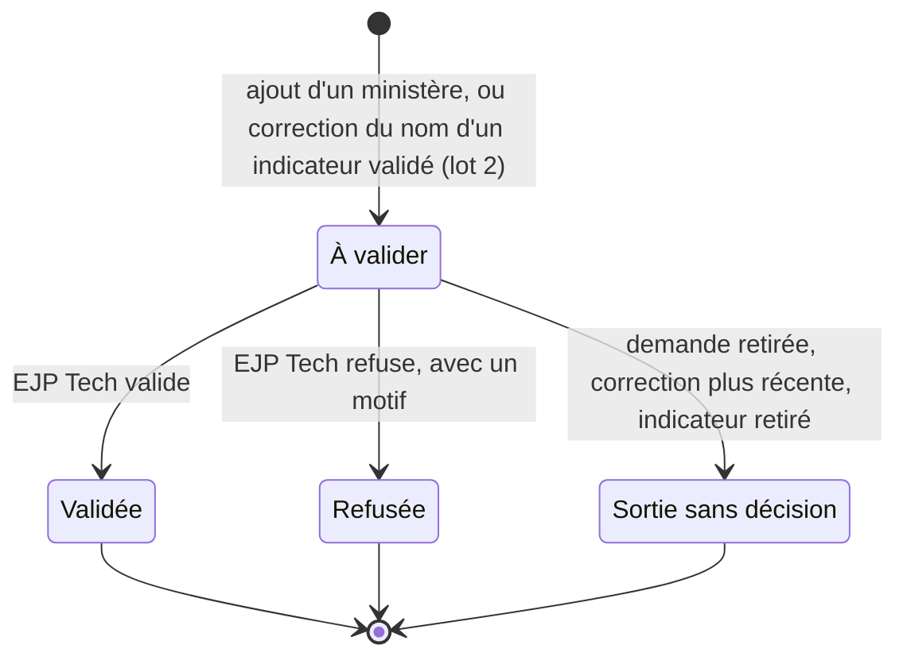

# Validation métier par EJP Tech

Statut : **Décidé le 6 octobre 2026, construit à l'étape 4** (T30 de `docs/decisions.md`, décisions
du 5 et du 6 octobre 2026, accord écrit de la personne responsable sur `docs/plan-etape-4.md`) : la
validation des ajouts côté base et l'alerte à l'étape 4, le bloc « À valider » à l'étape 6, la
confirmation « Vérifiez ce chiffre » après la mise en service, avant le 5e dimanche. La personne
responsable a répondu aux questions de la section 8 le 6 octobre 2026 (recommandations acceptées, et
mentions sur les événements dans la V1 de l'outil, section 4.7).
Date : 5 octobre 2026, réécrit le 6 octobre 2026 après les décisions de la personne responsable,
qui réduisent la validation aux indicateurs créés par les ministères (section 9 : ce qui est
retiré).

Portée, en une phrase : EJP Tech valide seulement la création d'un indicateur par un ministère (et,
au lot 2, la correction de son nom) ; un chiffre inhabituel ne demande qu'une confirmation au
ministère ; les événements gardent la règle 14, avec une alerte dans l'outil quand l'un d'eux attend
encore sa validation à 3 jours ou moins de sa date.

Sources : décisions de la personne responsable du 5 et du 6 octobre 2026 ; `BRIEF.md` (sections 2,
3, 6, 7, 9, 11 et 13) ; `docs/decisions.md` (P09, P31, P22, T29, T35) ;
`docs/conception/configuration-indicateurs.md` (« la configuration » ci-dessous, alignée sur ce
document le 6 octobre 2026) ; sur `main`, la vue `v_evenement` (`20260930163200_vues_et_lectures.sql`)
et la lecture des événements par `private.lit_tout()` (`20261005172228_droits_lecture_ejp_tech.sql`).

Numérotation : les numéros de ce document suivent le tableau « Renumérotation du 6 octobre 2026 » en
tête de `docs/decisions.md` (T29 : lecture par EJP Tech ; T35 : configuration des indicateurs ; T30 :
cette validation ; T31 : alerte sur les événements ; T32 : mentions sur les événements ; P31 :
rappels par email).

## 1. Besoin et décisions

### Décisions de la personne responsable (6 octobre 2026)

Elles remplacent le principe du 5 octobre (« EJP Tech valide les indicateurs créés par les
ministères, les événements et les chiffres inhabituels ») et tout ce qui, dans les documents plus
anciens, dit autre chose.

1. **Indicateurs** : EJP Tech valide seulement la création d'un indicateur par un ministère,
   suggestions comprises. Le ministère écrit pourquoi il veut cet indicateur, dans le champ
   « Pourquoi cet indicateur ? » (10 à 280 caractères, **sans rappel sur les données personnelles** :
   exception voulue par la personne responsable à la règle « un rappel par formulaire, sous le
   premier champ libre » de CLAUDE.md) ; ce texte n'est lu que par le ministère qui l'a écrit et par
   EJP Tech, il n'est jamais recopié dans le journal, et EJP Tech le lit pour décider. Tant qu'il n'est pas validé, l'indicateur se saisit déjà ; ses valeurs restent marquées
   « à valider » et hors de toute somme. Un refus porte un motif de 10 à 280 caractères.
2. **Correction du nom** : tant que l'indicateur attend EJP Tech, le ministère corrige librement
   une faute dans son nom. Une fois l'indicateur validé, sa correction repart à EJP Tech, sans
   perdre de valeur ni arrêter les saisies : l'indicateur compte sous son nom validé jusqu'à la
   validation de la correction.
3. **Chiffres** : EJP Tech ne les valide pas. Le ministère corrige les siens : une correction est
   une nouvelle saisie, la plus récente fait foi (règle 2). Un chiffre inhabituel (règle de la base,
   section 3) ne déclenche, à la saisie, qu'une confirmation « Vérifiez ce chiffre » pour le
   ministère : il confirme ou corrige, puis le chiffre compte normalement. Aucune marque pour le
   berger ; les totaux de l'église n'ont plus de part « à valider ».
4. **Événements** : EJP Tech ne les valide pas. La règle 14 du BRIEF reste : la validation se fait
   en dehors de l'outil, et le ministère reporte le statut.
5. **Alerte** (nouveau) : une alerte dans l'outil signale un événement encore « En attente de
   validation » (`attente_validation`) dont la date tombe dans les 3 jours ou est passée. Elle
   s'adresse au berger, au conseil, au ministère qui porte l'événement, aux ministères mentionnés
   sur l'événement (décision 6) et à EJP Tech, qui lit tout. Elle commence 3 jours avant la date et
   dure jusqu'au changement de statut ou de date ; un brouillon n'alerte jamais. Elle n'est montrée
   ni à l'administration de l'église ni aux autres ministères. Pas d'email en V1 (il pourrait
   rejoindre P31).
6. **Mentions sur les événements** (6 octobre 2026) : elles font partie de la V1 de l'outil, pas
   d'une option plus tardive. Un ministère mentionne d'autres ministères sur son événement, comme
   sur un point d'attention ; les ministères mentionnés lisent cet événement et reçoivent l'alerte.
   Conception et effort (2 à 3 jours) : 4.7 et section 7. Décision T32 de `docs/decisions.md`.
7. **Réponses aux questions de la section 8** : recommandations acceptées pour V1 à V6 et V8 ; V7
   tranchée par la décision 6 (oui, au lieu de la recommandation « non »).

### Ce qui ne change pas

- Règles 2 à 5, 12 et 13 : les totaux, la complétude (« 6 sur 8 ») et les écarts de l'étape 3
  restent tels quels. Aucune vue de l'étape 3 n'est reprise. Les indicateurs propres n'ont pas de
  total de l'église en V1 (configuration, 3.9) : un indicateur à valider ne touche que sa fiche.
- Règle 14 et P09 : le ministère reporte tous les statuts d'un événement, « Validé » compris. La
  liste `statut_evenement` garde ses six valeurs ; aucune transition n'est contrôlée ; l'aide du
  panneau reste « La validation se fait en dehors de l'outil. Ici, on reporte seulement le
  statut. ».
- EJP Tech lit tout en lecture seule (T29) et ne saisit rien au nom d'un ministère.

### Ce qui change dans le BRIEF, quand la conception est confirmée

| Section du BRIEF   | Aujourd'hui (sur cette branche)                                    | Avec T30                                                                                                                                                                     |
| ------------------ | ------------------------------------------------------------------ | ---------------------------------------------------------------------------------------------------------------------------------------------------------------------------- |
| 2, profils         | EJP Tech : modération et journal technique                         | EJP Tech valide ou refuse les indicateurs créés par les ministères, en tête de l'écran Indicateurs (5.1) ; aucun onglet nouveau                                              |
| 3, règle 1         | liste des tables en ajout seulement                                | `demande_indicateur`, `validation` et `chiffre_confirme` s'y ajoutent ; seule exception, `masquer_texte` sur le « Pourquoi » et le motif d'un refus                          |
| 3, règle 14        | validation hors de l'outil ; le ministère reporte tous les statuts | texte inchangé ; un paragraphe s'ajoute pour l'alerte (section 4)                                                                                                            |
| 6, modèle          | tables, journal, vues                                              | trois tables, trois codes de journal, deux couples de modération, deux colonnes de `v_evenement` (section 6)                                                                 |
| 7, sécurité        | matrice, politiques, fonctions                                     | lignes et fonctions de la section 6                                                                                                                                          |
| 9, écrans          | aucun écran de validation                                          | bloc « À valider » de l'écran Indicateurs, champ « Pourquoi », correction du nom, fenêtre « Vérifiez ce chiffre », bloc « Événements à confirmer », ligne de « Vos saisies » |
| 11, hors périmètre | « validation dans l'outil », « notifications »                     | « validation dans l'outil, sauf celle des indicateurs créés par les ministères » ; « notifications » reste : l'alerte est un affichage, pas un envoi                         |
| 13, plan           | étapes 0 à 8                                                       | contenu ajouté aux étapes 4a, 4 et 6 ; deux lots après la mise en service (section 7)                                                                                        |

### Ce qui change dans les droits

| Profil                     | Gagne                                                                                                                                                                        | Perd                                                        |
| -------------------------- | ---------------------------------------------------------------------------------------------------------------------------------------------------------------------------- | ----------------------------------------------------------- |
| EJP Tech                   | `valider_indicateur` ; lecture des demandes et de leur « Pourquoi » ; masquage d'un « Pourquoi » ou d'un motif de refus                                                      | rien ; il ne saisit toujours rien au nom d'un ministère     |
| Ministère                  | `verifier_chiffres` et `verifier_presence` pour sa fiche ; au lot 2, `corriger_indicateur` sur le nom de ses ajouts ; lecture de ses demandes, de leur état et de leur motif | rien                                                        |
| Berger, conseil            | lecture des indicateurs à valider (marqués) et des événements à confirmer de tous les ministères                                                                             | rien ; aucune action nouvelle                               |
| Administration de l'église | lecture de l'attente des ajouts sur l'écran Indicateurs, sans « Pourquoi », et l'alerte de 7 jours (2.6)                                                                     | rien (la validation d'un ajout lui était déjà retirée, T30) |

### Exigences

| Code | Exigence                                                                                                                                                                                                                        |
| ---- | ------------------------------------------------------------------------------------------------------------------------------------------------------------------------------------------------------------------------------- |
| F1   | EJP Tech seul valide ou refuse la création d'un indicateur par un ministère, suggestions comprises, et, au lot 2, la correction du nom d'un indicateur déjà validé.                                                             |
| F2   | Toute création par un ministère porte un « Pourquoi cet indicateur ? » de 10 à 280 caractères, lu par EJP Tech pour décider, jamais recopié dans le journal.                                                                    |
| F3   | Tant qu'il attend, l'indicateur se saisit ; ses valeurs se lisent marquées « à valider » et n'entrent dans aucune somme ni aucun calcul. Validé, toutes ses valeurs comptent.                                                   |
| F4   | Un refus porte un motif de 10 à 280 caractères ; une validation n'en porte pas. Une décision est une ligne ajoutée, définitive.                                                                                                 |
| F5   | Corriger le nom d'un indicateur validé ne fait perdre aucune valeur et n'arrête pas les saisies ; le nom validé reste affiché partout jusqu'à la validation de la correction.                                                   |
| F6   | Un chiffre inhabituel, selon une règle de la base explicable en une phrase, demande au ministère une confirmation avant l'envoi. Confirmé, il compte comme les autres ; aucun profil n'en voit de marque.                       |
| F7   | Un événement encore « En attente de validation » à 3 jours ou moins de sa date, ou passé, est signalé au berger, au conseil, à EJP Tech et au ministère qui le porte, jusqu'à ce que ce ministère change son statut ou sa date. |
| F8   | Chaque demande et chaque décision écrivent une seule ligne de journal, sans « Pourquoi », sans motif, sans valeur d'indicateur propre et sans email. L'alerte n'écrit rien.                                                     |
| F9   | Rien ne se décide tout seul. Un indicateur qui attend EJP Tech depuis plus de 7 jours est signalé à l'administration de l'église, qui prévient EJP Tech.                                                                        |

Non fonctionnelles :

- **Ajout seulement** : `demande_indicateur`, `validation` et `chiffre_confirme` rejoignent la liste
  de la règle 1. Un trigger `before update or delete` et `before truncate` les rend inaltérables,
  comme `journal`, sauf le masquage d'un « Pourquoi » ou d'un motif (6.2).
- **Sécurité** : RLS et politique restrictive `aal2` sur les trois tables ; aucun GRANT d'écriture ;
  `security definer` seulement dans `private`, `set search_path = ''`, `exige_aal2()` en tête de
  chaque fonction de l'API ; vues `security_invoker`.
- **Dates** : heure de Paris (`private.aujourdhui()`, et `(x at time zone 'Europe/Paris')::date`
  pour un horodatage), jamais `current_date` ni la date du navigateur. Les durées (« depuis 3
  jours ») et la fenêtre de l'alerte se calculent dans la base.
- **Entretien** : trois petites tables, une fonction de règle et ses seuils en un seul endroit, deux
  colonnes de vue, aucune colonne d'état mise à jour, aucun cache, aucune tâche planifiée.
- **Suppléance** (proposé, V8) : deux comptes EJP Tech actifs restent conseillés, mais ne sont plus
  une condition de mise en service : seuls les ajouts d'indicateurs attendent EJP Tech, et l'attente
  ne bloque aucune saisie (2.6).

## 2. Indicateurs créés par un ministère

### 2.1 Ce qui entre en validation

| Demande                                  | Lot | Qui la fait                         | « Pourquoi »                           |
| ---------------------------------------- | --- | ----------------------------------- | -------------------------------------- |
| Ajout d'une suggestion                   | 1   | le ministère, sur sa fiche          | obligatoire                            |
| Ajout d'un compte écrit par le ministère | 2   | le ministère, sur sa fiche          | obligatoire                            |
| Remplaçant créé par le ministère         | 2   | le ministère, pour un de ses ajouts | obligatoire                            |
| Correction du nom d'un indicateur validé | 2   | le ministère, pour un de ses ajouts | aucun : EJP Tech compare les deux noms |

- **Suggestions comprises** : décidé le 6 octobre 2026. L'ancienne question V1 (une suggestion
  passe-t-elle en validation ?) recommandait oui ; aucun autre document n'a tranché autrement.
- **N'entrent pas en validation** : les indicateurs ajoutés par l'administration ou par EJP Tech,
  les prévus de la coordination, les retraits, les saisies, et la correction d'un indicateur qui
  attend encore sa validation (libre, décision 2).
- **Au lot 1**, un ministère n'ajoute que des suggestions, dont le libellé et la définition viennent
  du catalogue et ne se corrigent pas sur une fiche (configuration, 4.1) : la règle de correction
  ne sert qu'à partir du lot 2, quand le ministère écrit ses propres comptes.

### 2.2 « Pourquoi cet indicateur ? »

- Champ obligatoire, de 10 à 280 caractères après `btrim`, avec compteur. Aide : « Ce que ce chiffre
  vous aidera à voir ou à décider. EJP Tech le lit avant de valider. » **Aucun rappel sur les
  données personnelles sous ce champ** : c'est une exception explicite, voulue par la personne
  responsable (6 octobre 2026), à la règle de CLAUDE.md « un rappel par formulaire, sous le premier
  champ libre ». Les refus de `private.verifier_texte` pour les données personnelles (« @ »,
  « http », 5 chiffres de suite, civilité suivie d'un nom) valent toujours pour lui
  (configuration, 6.1).
- Formulaire de suggestion (lot 1) : « Pourquoi » est le seul champ libre, et il n'a pas de rappel.
  Formulaire d'un indicateur écrit (lot 2) : le rappel reste sous le premier champ, le nom (« Ce que
  vous comptez »), pas sous « Pourquoi » ; le champ « Pourquoi » peut rester en premier.
- Il vit dans `demande_indicateur.pourquoi` et n'est recopié nulle part : ni dans le journal, ni dans
  `indicateur`, ni dans `validation`.
- **Lecteurs** (décidé le 6 octobre 2026, V1) : le ministère qui l'a écrit et EJP Tech. Ni le berger, ni le conseil,
  ni l'administration de l'église. Raisons : la décision dit qu'EJP Tech le lit pour décider ; un
  texte libre lu par moins de profils expose moins ; le berger lit déjà le libellé et la définition.
- **Relecture** : la validation vaut relecture. EJP Tech lit le « Pourquoi » en décidant, et peut le
  masquer (`masquer_texte`, couple `demande_indicateur`, `pourquoi`), même après la décision. Il
  n'entre pas dans la file de la Modération.
- Il ne se corrige pas : c'est une explication pour EJP Tech, pas un texte affiché sur la fiche.

### 2.3 Cycle d'une demande



L'état se lit dans les données, il n'est jamais une colonne mise à jour :

- **À valider** : une ligne de `demande_indicateur` qu'aucune ligne de `validation` ne vise, et qui
  n'est pas sortie.
- **Validée** ou **Refusée** : une ligne de `validation` avec `decision = 'valide'` ou `'refuse'`.
- **Sortie sans décision** : pour un ajout, l'indicateur a été retiré (le ministère a retiré sa
  demande) ; pour une correction, une correction plus récente du même indicateur existe, ou
  l'indicateur a été retiré.

Effet de la décision :

| Demande    | Validée                                                                                                                                  | Refusée                                                                                                                                                                             |
| ---------- | ---------------------------------------------------------------------------------------------------------------------------------------- | ----------------------------------------------------------------------------------------------------------------------------------------------------------------------------------- |
| Ajout      | `indicateur.etat` passe d'`en_attente` à `actif` ; toutes ses valeurs entrent dans les sommes et les calculs, pour toutes leurs périodes | l'indicateur est retiré avec le motif de retrait « Refusé », posé par la base ; ses valeurs ne s'affichent plus ; il ne compte pas dans la limite sur 30 jours (configuration, 4.2) |
| Correction | `indicateur.libelle` prend le nom proposé (`texte_le`, `texte_par`) ; mêmes valeurs, mêmes saisies                                       | le nom validé reste ; le ministère lit le motif                                                                                                                                     |

### 2.4 Règles

- Une décision est une **nouvelle ligne** de `validation`, jamais un `update`. Elle s'accompagne d'un
  seul changement borné d'`indicateur` (l'état pour un ajout, le libellé pour une correction),
  table de référence dont les changements sont listés par la configuration (5.9).
- Une décision est **définitive** : un index unique sur `validation.demande_id` interdit une seconde
  décision. Après un refus, le ministère envoie une autre demande (une autre suggestion, une autre
  correction).
- **EJP Tech seul** décide (`private.mon_type() = 'admin_plateforme'`), par `valider_indicateur`.
  Tout autre profil reçoit 42501, avec le message d'un objet absent.
- **Refus** : motif obligatoire, de 10 à 280 caractères après `btrim`, avec le rappel « N'écrivez
  aucun nom ni information personnelle. ». Comme les textes de l'administration (règle 9), le motif
  ne passe pas en relecture ; EJP Tech peut le masquer (couple `validation`, `motif`).
- **Deux comptes EJP Tech** peuvent décider : un verrou `for update` sur la demande et l'index unique
  empêchent deux décisions ; le second reçoit « Cette demande a déjà été décidée. ».
- **Aucune décision automatique** (2.6).
- **Correction tant que l'indicateur attend** (lot 2, décision 2) : le ministère corrige le nom par
  `corriger_indicateur`, même si des valeurs sont déjà saisies ; le libellé change tout de suite.
  EJP Tech décide sur le nom actuel, et la file montre le nom envoyé s'il diffère (« Nom corrigé le
  9 oct. ; nom envoyé : « Pages Rose : ateliers » »), puisque la demande garde le nom de l'envoi.
- **Correction d'un indicateur validé** (lot 2, décision 2) : `corriger_indicateur` écrit une
  demande (`objet = 'correction'`, le nom proposé) et ne touche pas à l'indicateur. Les saisies
  continuent et comptent sous le nom validé. Une seule correction attend à la fois : une correction
  plus récente remplace la précédente, qui sort sans décision (la plus récente fait foi, comme pour
  une saisie).
- **Contrôles du nom proposé**, à l'envoi puis de nouveau à la validation : 2 à 60 caractères,
  `private.verifier_texte` (configuration, 6.1) et libellé normalisé libre sur la fiche. Si un autre
  indicateur de la fiche a pris ce nom entre-temps, la validation est refusée : « Un autre
  indicateur de la fiche porte déjà ce nom. Refusez la correction, avec un motif. »
- **Définition** : proposé (V2), la même règle vaut pour « Ce qu'on compte exactement », dans la
  même demande que le nom. EJP Tech vérifie que la correction ne change pas ce qu'on compte ;
  sinon, le ministère remplace l'indicateur (configuration, 4.6).

### 2.5 Ce que voit chaque profil

| État                 | Ministère qui l'a ajouté                                                                                                                 | Berger, conseil                                                                                                    | Administration de l'église                                             |
| -------------------- | ---------------------------------------------------------------------------------------------------------------------------------------- | ------------------------------------------------------------------------------------------------------------------ | ---------------------------------------------------------------------- |
| Ajout à valider      | « À valider par EJP Tech depuis 2 jours. Vous pouvez déjà le saisir : ses valeurs ne comptent dans aucune somme jusqu'à la validation. » | à sa place sur la fiche, « à valider par EJP Tech depuis 2 jours », valeurs marquées, sans somme, courbe ni calcul | « à valider par EJP Tech depuis 2 jours », sans valeur ni « Pourquoi » |
| Ajout validé         | la marque disparaît                                                                                                                      | la marque disparaît ; somme, courbe et calculs apparaissent                                                        | la marque disparaît                                                    |
| Ajout refusé         | sous « Retirés » : « Refusé le 8 oct. : « motif ». »                                                                                     | sous « Retirés », sans valeur, avec la date et le motif                                                            | sous « Retirés », avec la date et le motif                             |
| Correction à valider | « Correction du nom envoyée le 9 oct. : « Pages Roses : ateliers ». En attendant, le nom validé reste et vos saisies continuent. »       | rien : le nom validé                                                                                               | rien : le nom validé                                                   |
| Correction validée   | le nouveau nom ; « Nom corrigé le 10 oct. »                                                                                              | le nouveau nom ; « Libellé corrigé le 10 oct. »                                                                    | idem                                                                   |
| Correction refusée   | « Correction refusée le 10 oct. : « motif ». », pendant 30 jours                                                                         | rien                                                                                                               | rien                                                                   |

EJP Tech lit tout cela, et décide dans le bloc « À valider » (5.1). Les autres ministères ne voient
ni l'ajout ni ses valeurs (configuration, 4.4).

### 2.6 Si EJP Tech tarde

- **Rien ne bloque le ministère** : il saisit son indicateur dès l'envoi.
- **Ce que l'attente coûte** : les valeurs restent hors de la somme de l'année et des calculs, et le
  berger les lit marquées. Elles y entrent toutes à la validation, pour toutes leurs périodes.
- **Rien ne se décide tout seul** : une validation automatique après quelques jours viderait la
  décision de sens ; un refus automatique ferait perdre un indicateur utile.
- **En retard** : au-delà de 7 jours, la file dit « depuis 9 jours, en retard », en orange avec le
  mot. En tête de la Modération (l'accueil d'EJP Tech) : « 2 indicateurs attendent votre
  validation, le plus ancien depuis 9 jours. »
- **Alerte hors d'EJP Tech** (proposé, V3) : sur l'écran Indicateurs, l'administration lit « 1 ajout
  attend EJP Tech depuis plus de 7 jours. Prévenez EJP Tech. ». Elle prévient, elle ne décide rien.
  C'est la seule alerte de 7 jours qui reste : les chiffres et les événements n'attendent plus EJP
  Tech.
- **Email** : aucun en V1. Si P31 est construit, un email hebdomadaire aux comptes EJP Tech pourrait
  dire « 2 indicateurs attendent votre validation dans Pilotage EJP », sans nom ni texte.
- **Mise en service** : la file peut recevoir jusqu'à 66 ajouts la première semaine (3 par ministère,
  22 ministères dans la liste de la coordination), une borne haute, chacun avec son « Pourquoi » à
  lire. L'administration crée d'abord les prévus de chaque ministère, qui couvrent l'essentiel,
  avant l'activation des comptes des ministères (configuration, section 9).

### 2.7 Journal

Une ligne par geste (règle 10). `ministere_id` est celui de l'indicateur. Une décision est écrite au
nom du compte EJP Tech : la fraîcheur du ministère ne bouge pas (règle 6, elle ne lit que les lignes
écrites par un compte du ministère).

| Code                             | Lot | Libellé (écran 06)       | `cible`, `cible_id` | `detail` (codes, identifiants et dates seulement)                        | Détail affiché (exemple)                                 |
| -------------------------------- | --- | ------------------------ | ------------------- | ------------------------------------------------------------------------ | -------------------------------------------------------- |
| `indicateur_cree`                | 1   | inchangé                 | indicateur          | `{"nature", "unite", "origine", "remplace", "attente": true, "demande"}` | « Pages Roses : ateliers, chaque mois, à valider »       |
| `indicateur_valide`              | 1   | A validé un indicateur   | indicateur          | `{"demande", "objet": "ajout"}` ou `{"demande", "objet": "correction"}`  | « Pages Roses : ateliers » ; « ..., nom corrigé »        |
| `indicateur_refuse`              | 1   | A refusé un indicateur   | indicateur          | idem                                                                     | « Pages Roses : ateliers » ; « ..., correction refusée » |
| `indicateur_corrige`             | 2   | inchangé                 | indicateur          | `{"champs": ["libelle"], "attente": true}` pour un ajout qui attend      | « Pages Roses : ateliers, libellé corrigé »              |
| `indicateur_correction_demandee` | 2   | A demandé une correction | indicateur          | `{"demande", "champs": ["libelle"]}`                                     | « Pages Rose : ateliers, correction envoyée »            |

- Jamais le « Pourquoi », jamais le motif, jamais un libellé, une valeur d'indicateur propre ou un
  email : l'écran lit le texte actuel de l'indicateur par `cible_texte`, sous la RLS du lecteur.
- Un refus n'écrit pas de ligne `indicateur_retire` : `valider_indicateur` change l'état par la même
  mise à jour bornée que `retirer_indicateur`, sans l'appeler, et écrit sa seule ligne.
- Lecteurs : le ministère lit les lignes de sa fiche ; le berger, le conseil et EJP Tech toutes ;
  l'administration toutes (`journal_lisible_administration` gagne ces codes, qui ne portent aucune
  valeur).

## 3. Chiffres inhabituels : une confirmation pour le ministère

**Ce que c'est, et ce que ce n'est pas.** Un filet contre la faute de frappe (120 pour 12, 0 pour
10), tendu avant l'envoi. Ce n'est ni une validation ni une marque : une fois confirmé, le chiffre
compte comme les autres, pour tous les profils, et les totaux de l'église ne changent pas de forme.
La détection ne voit pas : les 4 premières saisies d'un chiffre ; un écart de moins de 10, comme
de 3 à 12 ; un changement lent qui déplace la médiane.

### 3.1 Ce qui est contrôlé

- Les saisies de `mesure` : chiffres communs (STARs au service, STARs actifs, dont en FIJ) et
  indicateurs propres (dimanche, mois, à ce jour), un indicateur à valider compris.
- Les présences (`participation.valeur`) aux sessions Bâtir l'Église et Anti-Dispersion, comparées
  aux sessions précédentes du même type.
- **Indicateurs sensibles** : proposé, contrôlés comme les autres (V4). La confirmation ne montre au
  ministère que ses propres valeurs, et rien n'est montré à un autre profil : la raison de les
  exclure, proposée le 5 octobre (aucune référence « d'habitude » visible du berger), disparaît.
- Jamais contrôlés : un rassemblement « autre » (chaque rassemblement est différent) ; la carte des
  FIJ (8 très petits nombres, toute règle d'écart alerterait à tort) ; « déjà comptés » ; un
  calcul ; une saisie du jeu d'exemple ou d'une migration (sans `auth.uid()`).

### 3.2 La règle

Pour un chiffre `v` saisi par un ministère pour une période P, la base prend :

- **les valeurs comparées** : les 6 valeurs les plus récentes du même ministère pour le même chiffre,
  une par période (sa saisie la plus récente, celle qui compte), sur les **autres périodes que P**,
  avant ou après elle. « Les plus récentes » se lit dans l'ordre des périodes : dimanches, mois,
  dates de relevé d'un « à ce jour », dates des sessions du même type. Un rattrapage saisi dans le
  désordre se compare donc comme les autres ;
- **la référence `r`** : la médiane de ces valeurs. Avec un nombre pair de valeurs, la moyenne des
  deux du milieu, arrondie à l'entier le plus proche, une demie vers le haut (12,5 donne 13) ;
- **le dernier chiffre confirmé `c`** : parmi les valeurs comparées, la plus récente qui avait été
  jugée inhabituelle puis enregistrée, donc confirmée par le ministère (une ligne de
  `chiffre_confirme`), s'il y en a une.

Avec `f` le facteur et `e` l'écart minimum, `v` est **loin** de `x` si `v` vaut au moins `f` fois `x`
et le dépasse d'au moins `e`, ou si `x` vaut au moins `f` fois `v` et le dépasse d'au moins `e`. Le
chiffre est **inhabituel** quand il y a au moins 4 valeurs comparées, que `v` est loin de `r` **et**,
s'il existe, loin de `c`. Quand `r` vaut 0, « loin » revient à « au moins `e` » : un chiffre
d'habitude nul demande une confirmation à partir de 10.

| Réglage                                | Valeur proposée             | Raison                                                                                                                                                                                                        |
| -------------------------------------- | --------------------------- | ------------------------------------------------------------------------------------------------------------------------------------------------------------------------------------------------------------- |
| Valeurs comparées                      | 6                           | une médiane stable, sur six semaines pour un dimanche                                                                                                                                                         |
| Historique minimum                     | 4 valeurs                   | en dessous, la médiane ne dit rien : la première confirmation possible vient à la 5e saisie                                                                                                                   |
| Référence                              | médiane, demie vers le haut | une valeur extrême passée ne la déplace pas, contrairement à une moyenne                                                                                                                                      |
| Facteur, flux                          | 3 (dimanche, mois, session) | une fête ou un culte spécial double un chiffre sans erreur ; une faute de frappe le multiplie par dix                                                                                                         |
| Facteur, stock                         | 2 (« à ce jour »)           | un stock bouge lentement : 14 STARs actifs devenus 41 est presque toujours une faute de frappe                                                                                                                |
| Écart minimum                          | 10                          | sur de petits nombres (2 puis 7), le rapport seul alerterait à tort ; en contrepartie, 3 devenu 12 ne demande rien                                                                                            |
| Loin aussi du dernier chiffre confirmé | oui                         | après un changement durable confirmé une fois (12 puis 40), la suite (41, 39) ne redemande rien ; un « à ce jour » confirmé, prérempli et renvoyé chaque dimanche sans changement, ne redemande rien non plus |

Ces valeurs sont des choix, pas des mesures (V4). Elles vivent dans une seule fonction
(`private.seuils_inhabituel()`), changée par une petite migration.

### 3.3 Exemples

| Chiffre                                | Valeurs comparées (de la plus ancienne à la plus récente) | `r`, `c`  | Saisie | Résultat                                                         |
| -------------------------------------- | --------------------------------------------------------- | --------- | ------ | ---------------------------------------------------------------- |
| STARs au service (dimanche, f = 3)     | 10, 12, 12, 13, 11, 12                                    | 12, aucun | 120    | inhabituel : 120 vaut plus de 3 fois 12 et le dépasse de 108     |
| idem                                   | idem                                                      | 12, aucun | 30     | habituel : moins de 3 fois 12                                    |
| idem                                   | idem                                                      | 12, aucun | 0      | inhabituel : 12 vaut plus de 3 fois 0 et le dépasse de 12        |
| idem                                   | idem                                                      | 12, aucun | 3      | habituel : l'écart (9) est sous 10                               |
| STARs actifs (à ce jour, f = 2)        | 14, 14, 15, 14, 14, 14                                    | 14, aucun | 41     | inhabituel                                                       |
| idem                                   | idem                                                      | 14, aucun | 22     | habituel : moins de 2 fois 14                                    |
| Publications (mois, f = 3)             | 3, 5, 4, 4, 6, 3                                          | 4, aucun  | 30     | inhabituel                                                       |
| idem                                   | idem                                                      | 4, aucun  | 12     | habituel : l'écart avec 4 (8) est sous 10                        |
| Médiane paire                          | 10, 12, 13, 15                                            | 13, aucun | 40     | inhabituel : médiane 12,5 arrondie à 13                          |
| Chiffre d'habitude nul                 | 0, 0, 0, 0, 0, 0                                          | 0, aucun  | 10     | inhabituel : au moins 10                                         |
| idem                                   | idem                                                      | 0, aucun  | 9      | habituel                                                         |
| Hausse par paliers                     | 12, 12, 12, 12, 35 (35 jamais jugé inhabituel)            | 12, aucun | 100    | inhabituel : loin de 12, aucun chiffre confirmé pour l'excuser   |
| Après une hausse confirmée             | 12, 12, 12, 12, 12, 40 (40 confirmé)                      | 12, 40    | 41     | habituel : loin de 12 mais proche de 40                          |
| « À ce jour » renvoyé sans changement  | 14, 14, 14, 14, 14, 41 (41 confirmé le dimanche d'avant)  | 14, 41    | 41     | habituel : proche de 41                                          |
| Rattrapage de février saisi en octobre | les 6 mois les plus récents : 3, 5, 4, 4, 6, 3            | 4, aucun  | 40     | inhabituel : la comparaison ne dépend pas de l'ordre des saisies |
| Présents à Bâtir l'Église (f = 3)      | 13, 15, 12, 13                                            | 13, aucun | 45     | inhabituel                                                       |
| Un indicateur saisi 3 fois             | 4, 5, 4                                                   |           | 40     | jamais inhabituel : moins de 4 valeurs                           |

### 3.4 Où la règle se calcule

- Une seule fonction, `private.chiffre_inhabituel`, `stable`, `security definer`,
  `set search_path = ''`. Elle reçoit le ministère, l'indicateur ou la session, la date de la
  période et la valeur, et rend `inhabituel`, `reference`, `confirme` (le chiffre `c`),
  `nb_valeurs`, `facteur` et `sens` (« haut » ou « bas »).
- **Avant l'envoi** : `verifier_chiffres` et `verifier_presence` l'appellent pour la confirmation
  (3.5). L'écran ne recopie jamais la règle.
- **À l'enregistrement** : un trigger `after insert ... for each statement` sur `mesure` et sur
  `participation` l'appelle pour chaque ligne et écrit une ligne de `chiffre_confirme` pour chaque
  chiffre inhabituel enregistré. Comme l'écran demande la confirmation avant tout envoi, un chiffre
  inhabituel enregistré est un chiffre confirmé. Si un client passe outre, le chiffre est enregistré
  et compte : la base n'empêche rien, elle retient seulement qu'il était inhabituel.
- **Aucune valeur n'est copiée** dans `chiffre_confirme`, et aucun profil ne la lit (aucun GRANT) :
  seule `private.chiffre_inhabituel` la lit, pour trouver `c`. Elle ne sert ni à une marque, ni à un
  total, ni au journal : `mesure_saisie` et `participation_saisie` ne changent pas.

### 3.5 À la saisie : la confirmation

Au clic sur « Enregistrer les chiffres » (dimanche, mois, session), l'écran appelle
`verifier_chiffres` (ou `verifier_presence`) une fois. Si rien n'est inhabituel, l'envoi part comme
aujourd'hui, en un seul insert. Sinon, une fenêtre s'ouvre avant l'envoi :

- titre « Vérifiez ce chiffre » (ou « Vérifiez ces chiffres ») ;
- pour chaque chiffre : « STARs au service : 120. D'habitude, votre ministère saisit 12 (médiane de
  vos 6 dernières valeurs). », avec le nombre réel de valeurs, de 4 à 6 ;
- « Si c'est le bon chiffre, enregistrez-le : il comptera comme les autres. » ;
- boutons « Corriger le chiffre » (principal : revient au champ, valeur sélectionnée) et
  « Enregistrer quand même » (envoie tout, en un seul insert).

Précisions :

- La fenêtre a le rôle `dialog`, le focus va sur son titre, Échap vaut « Corriger le chiffre ».
- Aucune explication n'est demandée au ministère : personne ne la lirait, puisque le chiffre n'est
  plus validé.
- Réussite : « Chiffres enregistrés. », comme aujourd'hui. Rien n'est montré ensuite, ni au
  ministère ni aux autres profils.

### 3.6 Fausses alertes et réglage

- **Avant l'envoi** : le ministère corrige une faute de frappe d'un clic ; une fausse alerte ne lui
  coûte qu'un second clic.
- **Changement durable** : la clause « loin aussi du dernier chiffre confirmé » évite de redemander
  après une hausse ou une baisse confirmée.
- **Réglage** (proposé, sans mesure à l'appui) : après un mois d'usage, EJP Tech compte les lignes
  de `chiffre_confirme` par mois et par chiffre, par une requête écrite dans `docs/exploitation.md`
  et lancée à la main par la personne. Si un même chiffre demande souvent une confirmation (par
  exemple plus d'une fois par mois pour un ministère), une petite migration relève le facteur (3
  vers 4) ou l'écart minimum.

## 4. Événements : règle 14 inchangée, et une alerte

### 4.1 Ce qui reste

La règle 14 et P09 ne changent pas. Le ministère qui porte l'événement l'ajoute, puis reporte sa
date et son statut à chaque changement, « Validé » compris, quand la validation a été obtenue en
dehors de l'outil. Ni EJP Tech ni l'administration n'agissent sur un statut. Pas d'état « Refusé »,
pas de contrôle des transitions, pas de fonction de validation ; P20 (comptages de la phase 2) ne
change pas non plus.

### 4.2 La règle de l'alerte

Un événement est **à confirmer** quand son état le plus récent (`v_evenement`) a le statut
`attente_validation`, que sa date tombe au plus 3 jours après aujourd'hui, heure de Paris
(`date <= private.aujourdhui() + 3`), et que son ministère est actif (`desactive_le` nul).
L'alerte commence donc trois jours avant la date et continue après elle, sans fin.

- **Elle s'arrête** quand le ministère ajoute un état avec un autre statut (Validé, En préparation,
  Terminé, Annulé ou Brouillon), ou une date à plus de 3 jours (un report). Rien d'autre ne
  l'arrête : ni un délai, ni un geste du berger. Elle repart si un report ramène la date dans la
  fenêtre.
- **Brouillon** : jamais signalé (proposé, V5) : un brouillon n'a pas été envoyé pour validation.
- **Fenêtre** : 3 jours, une constante de la vue, changée par une petite migration.
- **Aucune trace** : l'alerte se calcule à la lecture. Elle n'écrit ni ligne de journal ni état, et
  ne change pas la fraîcheur du ministère.

Exemples, aujourd'hui mardi 6 octobre :

| Événement (dernier état)                          | À confirmer ? | Texte de la date                                 |
| ------------------------------------------------- | ------------- | ------------------------------------------------ |
| En attente de validation, vendredi 9 oct.         | oui           | « vendredi 9 oct., dans 3 jours »                |
| En attente de validation, samedi 10 oct.          | non (J+4)     |                                                  |
| En attente de validation, mercredi 7 oct.         | oui           | « mercredi 7 oct., demain »                      |
| En attente de validation, mardi 6 oct.            | oui           | « mardi 6 oct., aujourd'hui »                    |
| En attente de validation, lundi 5 oct.            | oui           | « lundi 5 oct., date passée (hier) »             |
| En attente de validation, samedi 26 sept.         | oui           | « samedi 26 sept., date passée depuis 10 jours » |
| Validé, jeudi 8 oct.                              | non           |                                                  |
| Brouillon, mercredi 7 oct.                        | non           |                                                  |
| En attente de validation, reporté du 8 au 17 oct. | non           |                                                  |
| Annulé, après une attente passée                  | non           |                                                  |

À minuit, heure de Paris, la fenêtre avance d'un jour, même si l'horloge du serveur est en UTC.

### 4.3 Qui la voit

| Profil                          | Voit                                                                    | Où                                                                              |
| ------------------------------- | ----------------------------------------------------------------------- | ------------------------------------------------------------------------------- |
| Ministère qui porte l'événement | ses événements à confirmer                                              | accueil (« Vos saisies »), « Ma fiche » (calendrier), panneau « Mettre à jour » |
| Berger, conseil                 | ceux de tous les ministères                                             | « Cette semaine » (bloc « Événements à confirmer »), fiches (04)                |
| EJP Tech                        | ceux de tous les ministères, en lecture seule                           | « Cette semaine » (contenu du berger, T29), fiches                              |
| Administration de l'église      | rien : elle ne lit pas les événements (BRIEF, section 7)                |                                                                                 |
| Ministère mentionné             | l'événement qui le mentionne, en lecture seule (4.7)                    | accueil (« Vos saisies »), calendrier de « Ma fiche » : « Mentionné par X »     |
| Autres ministères               | rien : « Prochain événement » ne montre pas le statut, et ne change pas |                                                                                 |

La lecture suit la RLS déjà en place sur `evenement` et `evenement_etat` (`private.lit_tout()` ou le
ministère de l'événement), élargie aux ministères mentionnés par les mentions d'événement (4.7).

### 4.4 Où elle s'affiche

- **« Cette semaine » du berger, du conseil et d'EJP Tech** : un bloc « Événements à confirmer »,
  juste sous « À décider » (dans la colonne de droite à partir de 1024 px ; en dessous, juste après
  « À décider »). Il n'apparaît que s'il y a au moins un événement : pas d'état vide. Une
  phrase, puis la liste par date, la plus ancienne d'abord (les dates passées en tête) ; 5 lignes,
  puis le bouton « Voir les 8 événements à confirmer » (`aria-expanded`), qui déplie la suite sur
  place. Chaque ligne : le titre entre guillemets, le ministère (vers sa fiche), la date et son
  texte. EJP Tech n'a aucun bouton d'action, comme sur le reste de la page. La phrase de la semaine
  ne change pas : elle garde deux phrases au plus.
- **Fiche (04 pour le berger, le conseil et EJP Tech ; 12 pour le ministère)** : dans le calendrier,
  le statut « En attente de validation » est suivi du texte de la date (« dans 2 jours », « date
  passée depuis 3 jours »). Un événement à confirmer reste dans le calendrier même daté de plus de
  7 jours dans le passé (exception à la fenêtre de 7 jours du BRIEF), pour qu'on le voie et que le
  ministère le mette à jour depuis sa fiche.
- **Accueil du ministère (07)** : « Vos saisies » gagne, après les lignes actuelles, une ligne par
  événement à confirmer, avec le bouton « Mettre à jour », qui ouvre le panneau existant. Ces lignes
  ne dépendent pas de la semaine de référence. La phrase et le bouton jaune suivent la règle
  actuelle : la phrase dit « le statut d'un événement », sans le titre (une phrase ne reprend jamais
  un texte libre) ; le bouton jaune devient « Mettre à jour l'événement » si c'est la première
  chose à faire ; « Tout est à jour pour la semaine 39. » ne s'affiche pas tant qu'un événement est
  à confirmer.
- **Panneau « Mettre à jour l'événement »** : pour un événement à confirmer, une ligne au-dessus du
  statut, en plus de l'aide actuelle : « Cet événement attend toujours sa validation. Validé en
  dehors de l'outil ? Choisissez « Validé ». Reporté ou annulé ? Changez la date ou choisissez
  « Annulé ». »
- **Pas ailleurs** : aucun nombre dans un onglet, aucun email, rien pour l'administration.
- **Style** : « dans 3 jours », « demain » et « aujourd'hui » en `--attention` ; « date passée » en
  `--alerte` ; toujours avec les mots, jamais la couleur seule (comme « dépassée » pour un point).

### 4.5 Textes

| Situation                          | Texte                                                                                                                                                                          |
| ---------------------------------- | ------------------------------------------------------------------------------------------------------------------------------------------------------------------------------ |
| Titre du bloc                      | « Événements à confirmer »                                                                                                                                                     |
| Phrase du bloc                     | « Ces événements attendent encore leur validation alors que leur date approche ou est passée. Le ministère qui les porte met à jour leur statut. »                             |
| Ligne du bloc, date à venir        | « « Soirée de louange », Communication : samedi 10 oct., dans 3 jours »                                                                                                        |
| Ligne du bloc, demain, aujourd'hui | « ... : mercredi 7 oct., demain » ; « ... : mardi 6 oct., aujourd'hui »                                                                                                        |
| Ligne du bloc, date passée         | « ... : lundi 5 oct., date passée (hier) » ; « ... : samedi 26 sept., date passée depuis 10 jours »                                                                            |
| Dépliage du bloc                   | « Voir les 8 événements à confirmer »                                                                                                                                          |
| Ligne de « Vos saisies »           | « Événement « Soirée de louange », samedi 10 oct. » ; état « À faire : en attente de validation, dans 3 jours » (ou « date passée depuis 2 jours ») ; bouton « Mettre à jour » |
| Phrase de l'accueil                | « Il reste le statut d'un événement. » ; « Il reste les chiffres du dimanche 4 oct. et le statut de 2 événements. »                                                            |
| Bouton jaune                       | « Mettre à jour l'événement »                                                                                                                                                  |
| Calendrier de la fiche             | « En attente de validation, dans 2 jours » ; « En attente de validation, date passée depuis 3 jours »                                                                          |
| Panneau « Mettre à jour »          | « Cet événement attend toujours sa validation. Validé en dehors de l'outil ? Choisissez « Validé ». Reporté ou annulé ? Changez la date ou choisissez « Annulé ». »            |

### 4.6 Données

Aucune table, aucune fonction, aucun journal. `v_evenement` (`security_invoker`) gagne deux colonnes
à la fin (`create or replace view` n'accepte que des colonnes ajoutées) :

```sql
create or replace view public.v_evenement with (security_invoker = true) as
select distinct on (e.id) e.id, e.ministere_id, e.titre, x.date, x.statut, x.saisi_le as mis_a_jour_le,
       x.date - private.aujourdhui() as jours,                 -- négatif : date passée
       (x.statut = 'attente_validation' and x.date <= private.aujourdhui() + 3
        and m.desactive_le is null) as a_confirmer               -- fenêtre de 3 jours, ici seulement
from public.evenement e
join public.ministere m on m.id = e.ministere_id
join public.evenement_etat x on x.evenement_id = e.id
order by e.id, x.saisi_le desc, x.id desc;
```

- `src/data/` : `lireEvenementsAConfirmer()` (lignes de `v_evenement` où `a_confirmer`, avec le nom
  du ministère, par date puis titre) pour « Cette semaine » ; la fiche et l'accueil lisent `jours`
  et `a_confirmer` avec les événements qu'ils lisent déjà.
- Le texte de la date (« dans 3 jours », « demain », « date passée depuis 10 jours ») se calcule dans
  l'interface à partir de `jours`, par une fonction pure de `src/lib/metier/` testée par Vitest,
  jamais à partir de la date du navigateur.

### 4.7 Mentions sur les événements (décidé : dans la V1 de l'outil)

Décidé le 6 octobre 2026 (T32) : les mentions sur les événements font partie de la V1, avec les
événements (étape 4, « Ajouter un événement (11) »). Aujourd'hui, les mentions (« tags ») n'existent
que sur les points d'attention (`point_mention`). La conception ci-dessous est celle à construire :

- une table `evenement_mention`, en ajout seulement, fixée à la création comme les mentions d'un
  point ; `ajouter_evenement` gagne `p_mentions uuid[]` ; le formulaire 11 gagne les cases à cocher
  des ministères actifs ;
- un ministère mentionné lirait l'événement et ses états : la règle « un ministère ne voit que sa
  fiche, la vue de l'église et les points qu'il a créés ou qui le mentionnent » (BRIEF, section 7,
  et P06) s'élargit, ce que la coordination doit confirmer ; une fonction `security definer` de
  `private` lit les événements mentionnant mon ministère, pour éviter la récursion de politique,
  comme pour les points ;
- l'alerte s'afficherait aussi chez le ministère mentionné, en lecture seule (« Mentionné par
  Communication »), puisque seul le ministère qui porte l'événement reporte son statut (règle 14) ;
- une ligne de journal pour les mentions de l'événement (jamais le nom saisi, comme `point_cree`) ;
- tests : matrice, politiques de lecture élargies, `ajouter_evenement`, parcours e2e (un ministère
  mentionné lit l'événement et voit l'alerte, un autre ministère ne voit rien).

Coût : 2 à 3 jours. La recommandation initiale était « pas en V1 » ; la personne responsable a
décidé le contraire le 6 octobre 2026, et le coût est repris au phasage (section 7).

## 5. Écrans

Aucun de ces écrans n'a de maquette : les écarts s'écrivent dans `LISEZMOI.md` à l'étape qui les
construit. Panneaux de 460 px à partir de 600 px, page entière en dessous ; listes sur téléphone ;
cibles de 44 px ; boutons jamais grisés, l'erreur s'affiche sous le champ ; aucune pastille : les
nombres s'écrivent en texte.

### 5.1 Bloc « À valider » de l'écran Indicateurs (EJP Tech, administration)

- **Où** (proposé, V3) : en tête de `/indicateurs` (configuration, 7.1), sous la phrase de l'écran.
  Pas d'onglet ni d'adresse à part : EJP Tech a déjà cet écran (T35), un seul endroit montre les
  définitions et les décisions, et il y a un écran de moins à construire et à tester. L'ancienne
  proposition (`/a-valider`, onglet « À valider ») est abandonnée.
- **Contenu**, une demande par ligne, de la plus ancienne à la plus récente ; le bloc disparaît s'il
  est vide :
  - un ajout : « Kumi, nouvel indicateur : Pages Roses : ateliers (chaque mois) », sa définition,
    « Pourquoi : « ... » » (EJP Tech seulement), « Envoyé le 2 oct., depuis 3 jours », les indices
    de `verifier_libelle` (« Libellé proche : Activités réalisées, dans les suggestions » ; « Mot du
    domaine sensible : à créer par l'administration ? »), « Kumi suit 8 indicateurs sur 12 au plus »
    et « 2 valeurs déjà saisies » ; s'il a été corrigé depuis l'envoi : « Nom corrigé le 9 oct. ;
    nom envoyé : « Pages Rose : ateliers » » ;
  - une correction (lot 2) : « Kumi, correction du nom : « Pages Rose : ateliers » devient « Pages
    Roses : ateliers ». Ses 5 valeurs restent. » ;
  - au-delà de 7 jours : « depuis 9 jours, en retard », en orange avec le mot.
- **Actions d'EJP Tech** : « Valider », en un clic, sans fenêtre (une erreur se rattrape : le
  ministère retire l'indicateur, ou envoie une autre correction) ; « Refuser », qui ouvre la fenêtre
  ci-dessous. L'administration lit le bloc sans bouton et sans « Pourquoi ».
- **Fenêtre « Refuser »** : titre « Refuser « Pages Roses : ateliers » ? » ou « Refuser cette
  correction ? » ; champ « Pourquoi ce refus ? » (280, compteur), et dessous « N'écrivez aucun nom
  ni information personnelle. » ; une phrase selon la demande (« L'indicateur sera retiré : ses
  valeurs ne s'afficheront plus. Kumi lira ce motif. » ou « Le nom validé reste. Kumi lira ce
  motif. ») ; bouton « Refuser ».
- **« Décidées ces 30 derniers jours »**, replié : « Validée le 8 oct. », « Refusée le 8 oct. :
  « motif » ».
- **États** : chargement ; décidée entre-temps par un autre compte : « Cette demande a déjà été
  décidée. », et la liste se recharge ; demande sortie entre-temps : « Cette demande a été retirée
  ou remplacée : il n'y a plus rien à décider. ».
- **Phrase de l'écran** : « 1 ajout attend la validation d'EJP Tech. » ; au-delà de 7 jours, pour
  l'administration : « 1 ajout attend EJP Tech depuis plus de 7 jours. Prévenez EJP Tech. » (2.6).
- **Modération (accueil d'EJP Tech)** : en tête, s'il y a lieu, « 2 indicateurs attendent votre
  validation, le plus ancien depuis 4 jours. » et le lien « Ouvrir les indicateurs à valider »
  (`/indicateurs`, au bloc « À valider »).

### 5.2 « Mes indicateurs » (ministère)

- **Ajouter une suggestion** (lot 1) : le bouton « Envoyer pour validation » d'une suggestion ouvre
  un panneau : libellé, définition et rythme de la suggestion, en lecture ; champ « Pourquoi cet
  indicateur ? » (2.2) ; « EJP Tech vérifie chaque ajout. En attendant, vous pouvez déjà le
  saisir. » ; bouton « Envoyer pour validation ».
- **Écrire votre indicateur** (lot 2) : « Pourquoi cet indicateur ? » d'abord, avec le rappel, puis
  « Ce que vous comptez », « Ce qu'on compte exactement » et « Quand le saisir » (configuration,
  7.3). Le rappel sur les données personnelles reste sous le premier champ de nom, pas sous
  « Pourquoi » ; la phrase « Vous pourrez corriger une faute dans le nom : librement avant la validation,
  puis avec l'accord d'EJP Tech. » remplace « il ne se corrige plus ensuite ».
- **Sur un ajout à valider** : « Corriger le nom » (lot 2, le changement est immédiat) et « Retirer
  la demande ».
- **Sur un ajout validé** (lot 2) : « Corriger le nom » ouvre un panneau prérempli, avec « EJP Tech
  validera la correction. En attendant, l'indicateur garde son nom et vos saisies continuent. » et
  le bouton « Envoyer la correction » ; « Retirer » et « Remplacer » comme dans la configuration
  (4.6).
- **États** : ceux de 2.5.

### 5.3 Fiche et saisies

- **Fiche (04, 12)** : l'indicateur à valider, à sa place, avec sa marque et ses valeurs, sans
  somme, courbe ni calcul (configuration, 4.5 et 7.5) ; aucune marque sur un chiffre ; les
  événements à confirmer (4.4).
- **Saisies (08, 09, « Chiffres du mois »)** : la confirmation « Vérifiez ce chiffre » (3.5) ; un
  indicateur à valider est dans le formulaire, avec la mention « à valider par EJP Tech ».
- **Cette semaine** : le bloc « Événements à confirmer » (4.4) ; rien d'autre ne change.

### 5.4 Messages

| Situation                            | Texte                                                                                                                              |
| ------------------------------------ | ---------------------------------------------------------------------------------------------------------------------------------- |
| « Pourquoi » trop court ou trop long | « Expliquez pourquoi en 10 caractères au moins. » ; « 280 caractères au plus. »                                                    |
| Ajout envoyé                         | « Envoyé pour validation. Vous pouvez déjà le saisir dans vos chiffres du mois. » (mois) ; « ... dans le formulaire du dimanche. » |
| Nom corrigé avant la validation      | « Nom corrigé. »                                                                                                                   |
| Correction envoyée                   | « Correction envoyée à EJP Tech. En attendant, l'indicateur garde son nom validé et vos saisies continuent. »                      |
| Correction d'une suggestion          | « Une suggestion garde le nom qu'elle a dans tous les ministères. »                                                                |
| Validation                           | « Indicateur validé. » ; « Correction validée. »                                                                                   |
| Refus                                | « Indicateur refusé. Kumi verra le motif. » ; « Correction refusée. Kumi verra le motif. »                                         |
| Motif trop court ou trop long        | « Expliquez le refus (10 caractères au moins). » ; « Le motif dépasse 280 caractères. »                                            |
| Déjà décidée                         | « Cette demande a déjà été décidée. »                                                                                              |
| Demande sortie                       | « Cette demande a été retirée ou remplacée : il n'y a plus rien à décider. »                                                       |
| Nom pris entre-temps                 | « Un autre indicateur de la fiche porte déjà ce nom. Refusez la correction, avec un motif. »                                       |
| Confirmation avant l'envoi           | « Vérifiez ce chiffre » ; « STARs au service : 120. D'habitude, votre ministère saisit 12 (médiane de vos 6 dernières valeurs). »  |
| Alerte de l'administration           | « 1 ajout attend EJP Tech depuis plus de 7 jours. Prévenez EJP Tech. »                                                             |
| Alerte des événements                | textes de 4.5                                                                                                                      |

## 6. Modèle de données et sécurité

### 6.1 Migrations

Toutes nouvelles ; aucune migration suivie par git n'est modifiée. Elles passent après la migration
de lecture d'EJP Tech (T29) et, pour les indicateurs, avec celles de la configuration.

| Migration                | Quand                                          | Contenu                                                                                                                                                                                                                                                                      | Tests pgTAP principaux                                                                                                              |
| ------------------------ | ---------------------------------------------- | ---------------------------------------------------------------------------------------------------------------------------------------------------------------------------------------------------------------------------------------------------------------------------- | ----------------------------------------------------------------------------------------------------------------------------------- |
| `validation_indicateurs` | étape 4a, avec le lot 1 de la configuration    | tables `demande_indicateur` et `validation`, RLS, GRANT, triggers inaltérables ; état `en_attente` ; `ajouter_suggestion` avec `p_pourquoi` ; `valider_indicateur` ; motif de retrait « Refusé » posé par la base ; codes de journal ; couples de modération ; `v_a_valider` | matrice, « Pourquoi » obligatoire et jamais au journal, saisie en attente hors des sommes, validé, refusé, une décision par demande |
| `evenements_a_confirmer` | étape 4                                        | `v_evenement` gagne `jours` et `a_confirmer`                                                                                                                                                                                                                                 | fenêtre, statuts, report, ministère désactivé, bascule de minuit à Paris, lecture par profil                                        |
| `validation_corrections` | lot 2 de la configuration                      | `creer_indicateur` avec `p_pourquoi` pour un ministère ; `corriger_indicateur` ouvert au ministère (immédiat en attente, demande une fois validé) ; `controler_indicateur` accepte le nom d'une correction validée ; `valider_indicateur` traite les corrections             | correction libre en attente, demande après validation, saisies continues, nom changé à la validation seulement                      |
| `chiffres_inhabituels`   | après la mise en service, avant le 5e dimanche | table `chiffre_confirme`, sans valeur ni GRANT ; `private.seuils_inhabituel`, `private.chiffre_inhabituel` ; triggers sur `mesure` et `participation` ; `verifier_chiffres`, `verifier_presence`                                                                             | chaque ligne de 3.3, historique minimum, ordre des saisies sans effet, chiffres jamais contrôlés, totaux de l'étape 3 inchangés     |

### 6.2 Les trois tables

```sql
create table public.demande_indicateur (          -- AJOUT SEULEMENT ; écrite par les fonctions seulement
  id uuid primary key default gen_random_uuid(),
  indicateur_id uuid not null references public.indicateur,
  ministere_id uuid not null references public.ministere,
  objet text not null check (objet in ('ajout', 'correction')),
  libelle text not null check (char_length(libelle) between 2 and 60),   -- nom envoyé, ou nom proposé
  definition text check (char_length(definition) between 10 and 140),     -- correction de la définition, si V2
  pourquoi text,                                   -- seul masquer_texte le réécrit
  saisi_le timestamptz not null default now(),
  saisi_par uuid not null default auth.uid() references public.compte (user_id),
  check ((objet = 'ajout') = (pourquoi is not null)),
  check (pourquoi is null or char_length(pourquoi) between 10 and 280),
  check (objet = 'correction' or definition is null)
);
create unique index demande_ajout_unique on public.demande_indicateur (indicateur_id) where objet = 'ajout';

create table public.validation (                  -- AJOUT SEULEMENT ; écrite par valider_indicateur seulement
  id uuid primary key default gen_random_uuid(),
  demande_id uuid not null unique references public.demande_indicateur,
  ministere_id uuid not null references public.ministere,
  decision text not null check (decision in ('valide', 'refuse')),
  motif text,                                      -- seul masquer_texte le réécrit
  saisi_le timestamptz not null default now(),
  saisi_par uuid not null default auth.uid() references public.compte (user_id),
  check ((decision = 'valide' and motif is null)
      or (decision = 'refuse' and char_length(motif) between 10 and 280))
);

create table public.chiffre_confirme (            -- AJOUT SEULEMENT ; écrite par trigger seulement ; aucun GRANT
  id uuid primary key default gen_random_uuid(),
  mesure_id bigint unique references public.mesure,
  participation_id bigint unique references public.participation,
  ministere_id uuid not null references public.ministere,
  le timestamptz not null default now(),
  check (num_nonnulls(mesure_id, participation_id) = 1)
);                                                 -- aucune valeur : « d'habitude » se recalcule
```

- `saisi_le` et `saisi_par` sont imposés par le trigger `forcer_auteur`, comme sur les autres
  tables de données. Une demande est écrite au nom du compte du ministère, une décision au nom du
  compte EJP Tech.
- Le « Pourquoi » et le motif sont les seules exceptions au « jamais modifié » : `masquer_texte`
  peut les remplacer par « [texte masqué par EJP Tech] » (27 caractères, accepté par les contrôles).
  Le trigger d'inaltérabilité laisse passer ce seul cas quand la transaction a posé
  `set_config('pilotage.masquage', 'oui', true)`, comme la configuration le fait pour `indicateur`.
- `mesure` et `participation` ne changent pas : la confirmation vit à côté.
- Index : sur `demande_indicateur`, `(ministere_id, saisi_le desc)` et
  `(indicateur_id, saisi_le desc)` ; sur `validation`, `(ministere_id, saisi_le desc)` ; sur
  `chiffre_confirme`, `(ministere_id)`.

### 6.3 Lectures

- `v_a_valider` (`security_invoker`) : une ligne par demande à valider, non sortie, avec son objet,
  son ministère, le libellé actuel et le libellé envoyé, la définition, le rythme, le « Pourquoi »,
  `saisi_le`, `attente_jours` (`private.aujourdhui()` moins le jour de l'envoi à Paris), `en_retard`
  (plus de 7 jours) et le nombre de valeurs saisies. Elle ne rend rien hors `aal2` ni à un autre
  profil qu'EJP Tech (`where private.mon_type() = 'admin_plateforme'`, comme `v_semaine`).
- Pour l'administration, le berger et le conseil, l'attente d'un ajout se lit sur `indicateur`
  (`etat = 'en_attente'`) : `v_indicateur_suivi` et `v_usage_indicateurs` (configuration, 5.6)
  gagnent `attente_jours`, calculé depuis `cree_le` à l'heure de Paris. Ils ne lisent ni les
  demandes ni le « Pourquoi ».
- Le ministère lit ses demandes et leurs décisions directement (RLS) pour « Mes indicateurs ».
- `v_evenement` : deux colonnes (4.6).
- Aucune vue de l'étape 3 n'est reprise : les totaux de l'église ne changent pas.

### 6.4 Fonctions de l'API

Chacune en deux parties : `private.<nom>` en `security definer`, `set search_path = ''`,
`exige_aal2()` en tête, et `public.<nom>` d'une ligne en `security invoker`. Aucun SQL dynamique.
Un refus de droit lève 42501 avec le message d'un objet absent : « Cet élément n'existe pas ou vous
n'y avez pas accès. ».

| Fonction                                                                                                                                                                      | Lot                        | Appelant                                         | Contrôles, dans l'ordre                                                                                                                                                                                                                                          | Écrit                                                                                                            |
| ----------------------------------------------------------------------------------------------------------------------------------------------------------------------------- | -------------------------- | ------------------------------------------------ | ---------------------------------------------------------------------------------------------------------------------------------------------------------------------------------------------------------------------------------------------------------------- | ---------------------------------------------------------------------------------------------------------------- |
| `ajouter_suggestion(p_ministere_id uuid, p_code text, p_pourquoi text default null) returns uuid`                                                                             | 1                          | ministère sur sa fiche, administration, EJP Tech | ceux de la configuration (5.8) ; pour un ministère, `p_pourquoi` de 10 à 280 après `btrim` ; ignoré pour les autres profils                                                                                                                                      | `indicateur` (à valider pour un ministère), `demande_indicateur` pour un ministère, une ligne de journal         |
| `valider_indicateur(p_demande_id uuid, p_decision text, p_motif text default null) returns void`                                                                              | 1 (2 pour les corrections) | EJP Tech                                         | `exige_aal2()` ; `admin_plateforme` (42501) ; décision « valide » ou « refuse » ; verrou `for update` sur la demande ; aucune décision (« Cette demande a déjà été décidée. ») ; demande non sortie ; motif ; pour une correction, nom encore libre sur la fiche | `validation` ; `indicateur.etat` (ajout) ou libellé, `texte_le`, `texte_par` (correction) ; une ligne de journal |
| `creer_indicateur(..., p_pourquoi text default null) returns uuid`                                                                                                            | 2                          | ministère sur sa fiche (compte, non sensible)    | ceux de la configuration (5.8) ; `p_pourquoi` comme ci-dessus ; un remplaçant aussi                                                                                                                                                                              | `indicateur` à valider, `demande_indicateur`, journal                                                            |
| `corriger_indicateur(p_indicateur_id uuid, p_libelle text, p_definition text) returns text`                                                                                   | 1 (2 pour un ministère)    | administration, EJP Tech ; au lot 2, ministère   | administration et EJP Tech : configuration (5.8) ; ministère : son ajout (`origine = 'ministere'`), pas une suggestion, non retiré ; nom contrôlé (2.4) ; à valider : correction immédiate ; validé : une demande, l'ancienne correction qui attend sort         | rend `corrige` ou `envoye` ; textes, ou `demande_indicateur` ; journal                                           |
| `verifier_chiffres(p_lignes jsonb) returns table (indicateur_id uuid, date_ref date, inhabituel boolean, reference integer, confirme integer, nb_valeurs integer, sens text)` | après la mise en service   | ministère, sa fiche                              | `exige_aal2()` ; compte de ministère actif (42501) ; chaque ligne sur un indicateur commun ou à lui, actif ou à valider                                                                                                                                          | rien                                                                                                             |
| `verifier_presence(p_session_id uuid, p_valeur integer) returns table (...)`                                                                                                  | après la mise en service   | ministère                                        | idem ; session passée ou du jour, d'un type contrôlé                                                                                                                                                                                                             | rien                                                                                                             |

`valider_indicateur` change l'état par la même mise à jour bornée que `retirer_indicateur`, sans
l'appeler : « Refusé » rejoint les motifs de retrait posés par la base (configuration, 4.6). Pour
une correction validée, il pose `set_config('pilotage.validation', 'oui', true)`, que
`controler_indicateur` exige pour changer le nom d'un indicateur qui a des valeurs ; aucun client ne
peut le poser (l'API n'expose ni `set_config` ni le schéma `private`).

### 6.5 Matrice des droits

| Objet                                                                               | Ministère                                                                    | Berger, conseil | Administration de l'église | EJP Tech                           | `aal1`, anonyme |
| ----------------------------------------------------------------------------------- | ---------------------------------------------------------------------------- | --------------- | -------------------------- | ---------------------------------- | --------------- |
| `demande_indicateur` (lecture)                                                      | les siennes                                                                  | rien            | rien                       | toutes                             | rien            |
| `validation` (lecture)                                                              | les siennes                                                                  | toutes          | toutes                     | toutes                             | rien            |
| `demande_indicateur`, `validation` (écriture)                                       | demandes par `ajouter_suggestion`, `creer_indicateur`, `corriger_indicateur` | rien            | rien                       | décisions par `valider_indicateur` | rien            |
| `chiffre_confirme`                                                                  | rien (écrite par trigger)                                                    | rien            | rien                       | rien                               | rien            |
| `v_a_valider`                                                                       | rien                                                                         | rien            | rien                       | oui                                | rien            |
| `valider_indicateur`                                                                | refusé (42501)                                                               | refusé          | refusé                     | oui                                | refusé          |
| `verifier_chiffres`, `verifier_presence`                                            | sa fiche seulement                                                           | refusé          | refusé                     | refusé                             | refusé          |
| `v_evenement` (`jours`, `a_confirmer`)                                              | ses événements                                                               | tous            | rien                       | tous                               | rien            |
| `mesure` (ajout)                                                                    | le sien, indicateur actif ou à valider                                       | rien            | rien                       | rien                               | rien            |
| `moderation`, couples (`demande_indicateur`, `pourquoi`) et (`validation`, `motif`) | rien                                                                         | rien            | rien                       | lecture et masquage                | rien            |

Politiques de lecture : `ministere_id = private.mon_ministere()` pour un ministère ;
`private.mon_type() = 'admin_plateforme'` pour `demande_indicateur` ; `private.lit_tout()` ou
`admin_eglise` pour `validation`. Aucune politique ne relit l'autre table : pas de récursion.
Politique restrictive `aal2` sur les trois ; GRANT `select` à `authenticated` sur
`demande_indicateur` et `validation`, aucun sur `chiffre_confirme` ; aucun `insert`, `update`,
`delete` ni `truncate` ; rien pour `anon`. Chaque ligne entre dans la matrice écrite en données des
tests pgTAP.

### 6.6 Tests pgTAP

- **Matrice** : chaque ligne de 6.5, par les sept profils et l'anonyme, en `aal1` et `aal2` ;
  écriture directe refusée partout ; les trois tables inaltérables même au propriétaire, sauf le
  masquage du « Pourquoi » et du motif.
- **Ajouts (lot 1)** : suggestion d'un ministère sans « Pourquoi » refusée ; 9 et 281 caractères
  refusés, 10 acceptés ; ajout né à valider ; saisie acceptée en attente, valeur lue par le berger,
  absente de toute somme et de tout calcul ; demande illisible pour le berger, le conseil,
  l'administration et un autre ministère ; validé : la somme compte toutes ses valeurs, périodes
  passées comprises ; refusé : retiré avec le motif de retrait « Refusé », absent de
  `v_indicateur_suivi` pour le berger, présent sous « Retirés » sans valeur ; demande retirée : plus
  rien à décider ; seconde décision refusée ; `valider_indicateur` refusé au ministère, au berger, au
  conseil, à l'administration et en `aal1` ; motif de 9 et de 281 caractères refusés, refus sans
  motif refusé ; **une seule ligne de journal** par geste (aucune ligne `indicateur_retire` pour un
  refus) ; la fraîcheur du ministère ne bouge pas après une décision ; un indicateur ajouté par
  l'administration n'a pas de demande.
- **Données personnelles** : un « Pourquoi » et un motif qui contiennent un marqueur unique ne se
  trouvent jamais dans `journal` (`detail` compris) ; une fois masqués, ils ne se trouvent plus dans
  `demande_indicateur`, `validation` ni `moderation`.
- **Corrections (lot 2)** : le ministère corrige le nom d'un ajout à valider, valeurs saisies
  comprises, et la demande garde le nom envoyé ; une correction d'un indicateur validé écrit une
  demande sans changer le libellé ; une saisie est acceptée pendant l'attente et compte sous le nom
  validé ; validée : le libellé change, les lignes de `mesure` ne changent pas (mêmes identifiants,
  même nombre), `texte_par` est le compte du ministère ; refusée : le libellé ne change pas ; une
  correction plus récente fait sortir la précédente ; nom déjà pris refusé à l'envoi et à la
  validation ; correction d'une suggestion, d'un prévu ou d'un ajout d'un autre ministère refusée
  (42501) ; `controler_indicateur` refuse un changement de nom avec valeurs sans le réglage local.
- **Chiffres inhabituels** : chaque ligne de 3.3 ; 3 valeurs, jamais inhabituel ; saisie dans le
  désordre ; médiane nulle (10 inhabituel, 9 non) ; médiane paire (12,5 arrondi à 13) ; hausse par
  paliers (12, 12, 12, 12, 35 puis 100 inhabituel) ; après un 40 confirmé, 41 habituel ; « à ce
  jour » renvoyé sans changement après confirmation, habituel ; indicateur sensible contrôlé (si V4) ;
  rassemblement « autre », carte des FIJ et jeu d'exemple jamais contrôlés ; `verifier_chiffres` et
  le trigger donnent le même résultat ; `chiffre_confirme` sans colonne de valeur et illisible pour
  tous les profils ; un chiffre confirmé compte dans les totaux de l'étape 3 comme un autre.
- **Événements à confirmer** : en attente à J+4 non, à J+3 oui, à J oui, à J-10 oui ; Validé à J+1
  non ; Brouillon à J+1 non ; une ligne « Annulé » arrête l'alerte ; un report à J+5 l'arrête, un
  report de J+5 à J+2 la relance ; bascule à minuit, heure de Paris (22 h 30 UTC la veille en
  octobre) ; ministère désactivé exclu ; un ministère ne lit que les siens, un autre ministère et
  l'administration rien, le berger, le conseil et EJP Tech tout, `aal1` rien.
- **Tests existants à reprendre** : `structure` (tables nouvelles, colonnes de `v_evenement`),
  `jeu-exemple` (événement ajouté, 6.8) et les tests de la configuration qui attendaient qu'un
  ministère ne corrige jamais un indicateur.

### 6.7 Vitest et parcours e2e

- **Vitest** : texte de la date de l'alerte à partir de `jours` (« dans 3 jours », « demain »,
  « aujourd'hui », « date passée (hier) », « date passée depuis 10 jours ») ; lignes de « Vos
  saisies », phrase (« Il reste le statut d'un événement. », « de 2 événements ») et bouton jaune ;
  bloc absent sans événement, 5 lignes puis dépliage ; textes de la confirmation (haut et bas, un ou
  plusieurs chiffres, 4 à 6 valeurs) ; « depuis 9 jours, en retard » ; schémas Zod du « Pourquoi »
  et du motif (10 à 280, partagés entre le formulaire et l'appel).
- **E2E** (1440, 834 et 390 px, audit axe), sur une base remise à zéro comme les parcours de saisie :
  1. Communication envoie la suggestion « Demandes reçues » avec un « Pourquoi » et la saisit ; le
     berger la lit « à valider » sur la fiche, sans le « Pourquoi » ; EJP Tech lit le « Pourquoi »
     dans le bloc « À valider » et valide ; la somme de l'année apparaît.
  2. Communication envoie une autre suggestion ; EJP Tech la refuse avec un motif ; Communication
     lit le motif sous « Retirés ».
  3. Le berger lit « Réunion des responsables » (Coordination) dans « Événements à confirmer » ;
     Coordination lit la ligne dans « Vos saisies », ouvre « Mettre à jour », choisit « Validé » ;
     la ligne disparaît chez Coordination et chez le berger ; l'administration ne voit jamais le
     bloc.
  4. Après la mise en service du lot : Communication saisit 120 STARs au service, lit « Vérifiez ce
     chiffre », corrige en 12 ; puis saisit 120 et clique « Enregistrer quand même » : le berger lit
     le total avec 120, sans aucune marque.

### 6.8 Jeu d'exemple

`seed.sql` garde toutes les valeurs attendues du BRIEF (service du 27 sept. 52, 6 sur 8, etc.) :

- **Indicateurs** : les cas de la configuration (5.11), chaque demande avec son « Pourquoi » : une
  suggestion ajoutée par Social et validée par EJP Tech, une autre à valider, un ajout refusé avec
  son motif ; au lot 2, une correction du nom à valider.
- **Événements** : un événement en attente dont la date est passée, « Réunion des responsables »
  (Coordination, samedi 26 sept. avant décalage). Les dates du jeu sont décalées d'un nombre entier
  de semaines : cette date est passée quel que soit le jour où le jeu est chargé, donc l'événement
  est toujours à confirmer, et il ne change aucun « Prochain événement ». « Soirée de louange »
  (Communication, 10 oct.) reste en attente, hors de la fenêtre (6 à 13 jours devant). Le cas des
  3 jours se construit dans les jeux ciblés de pgTAP, qui posent leurs propres dates.
- **Chiffres** : aucune ligne de `chiffre_confirme` (le trigger ne contrôle pas une saisie sans
  `auth.uid()`) ; les totaux ne changent pas.

## 7. Effort et phasage

La validation des ajouts sert dès le premier jour ; l'alerte aussi, puisque des événements existent
déjà ; la confirmation des chiffres inhabituels ne demande rien avant la 5e saisie d'un chiffre (en
production, qui démarre vide, pas avant le 5e dimanche après la mise en service). D'où le phasage :

| Moment                                         | Contenu                                                                                                                                                        | Effort (jours de travail d'EJP Tech avec Claude Code) |
| ---------------------------------------------- | -------------------------------------------------------------------------------------------------------------------------------------------------------------- | ----------------------------------------------------- |
| Avant tout                                     | migration de lecture d'EJP Tech (T29), déjà décidée et construite sur `main`                                                                                   | déjà fait                                             |
| Étape 4a (configuration, lot 1)                | `validation_indicateurs`, pgTAP, types, `src/data/`                                                                                                            | 1                                                     |
| Étape 4, fiche et saisies                      | `evenements_a_confirmer` ; bloc « Événements à confirmer », ligne de « Vos saisies », calendrier, panneau « Mettre à jour » ; marque d'un indicateur à valider | 1,5                                                   |
| Étape 6, ou avec « Mes indicateurs »           | bloc « À valider » de l'écran Indicateurs, fenêtre « Refuser », champ « Pourquoi », phrase de la Modération, alerte de l'administration                        | 1 à 1,5                                               |
| Après la mise en service, avant le 5e dimanche | `chiffres_inhabituels`, fenêtre « Vérifiez ce chiffre » dans 08, 09 et « Chiffres du mois »                                                                    | 1,5 à 2,5                                             |
| Lot 2 de la configuration, s'il est confirmé   | `validation_corrections`, « Corriger le nom », corrections dans le bloc « À valider »                                                                          | 1                                                     |
| Étape 4, avec les événements (V1, décidé)      | mentions sur les événements (4.7) : `evenement_mention`, droits de lecture, pgTAP, champ du formulaire 11, ligne de journal, alerte étendue                    | 2 à 3                                                 |

- **Total** : 5,5 à 7 jours avant la mise en service (3,5 à 4 jours, plus 2 à 3 jours de mentions
  sur les événements, décidées le 6 octobre) ; 2,5 à 3,5 jours ensuite (au lieu de 4,5 à 5,5). La
  réduction vient de ce qui est retiré
  (section 9) : validation des événements et des chiffres, reprise des vues de l'étape 3, écran
  « À valider » à part.
- **Repli** : avant la mise en service, la validation des ajouts et l'alerte ; la confirmation des
  chiffres peut attendre, puisqu'elle ne change aucun total.
- **Section 13 du BRIEF** : 4a, 4 et 6 gagnent le contenu ci-dessus ; une étape après la mise en
  service, avec une date butoir (le 5e dimanche), pour la confirmation des chiffres ; la section 11
  réécrit « validation dans l'outil » (section 1).
- **Étape 8** : `docs/exploitation.md` ajoute le bloc « À valider » à la revue hebdomadaire de la
  modération, la requête de réglage de 3.6, et conseille un second compte EJP Tech actif (V8).

## 8. Questions pour la personne responsable

Chaque question se répond par oui ou non ; la recommandation suit. Les questions de la version du
5 octobre (V1 à V30) sont retirées : la décision du 6 octobre y répond ou les rend sans objet
(section 9). Celles-ci sont renumérotées V1 à V8.

**Réponses de la personne responsable (6 octobre 2026)** : recommandation acceptée pour V1, V2,
V3, V4, V5, V6 et V8 ; V7 : **oui**, les mentions sur les événements entrent dans la V1 de l'outil
(contraire de la recommandation écrite ci-dessous, gardée pour mémoire). Pour V1, le « Pourquoi »
n'a en plus aucun rappel sur les données personnelles (2.2). Pour V6, l'alerte atteint aussi les
ministères mentionnés (4.3).

- **V1** : le « Pourquoi cet indicateur ? » est-il lu seulement par le ministère qui l'a écrit et par
  EJP Tech, et pas par le berger, le conseil ni l'administration de l'église ? Recommandation : oui
  (2.2 ; un texte libre lu par moins de profils expose moins).
- **V2** : la règle de correction du nom vaut-elle aussi pour la définition (« Ce qu'on compte
  exactement »), dans la même demande ? Recommandation : oui, EJP Tech vérifiant que la correction ne
  change pas ce qu'on compte ; sinon, le ministère remplace l'indicateur.
- **V3** : EJP Tech décide-t-il dans un bloc « À valider » en tête de l'écran Indicateurs, sans
  onglet à part, l'administration lisant l'attente et l'alerte de 7 jours, sans aucune décision
  automatique ? Recommandation : oui (un seul écran, un écran de moins à construire).
- **V4** : les réglages de 3.2 (6 valeurs, 4 au moins, facteur 3, ou 2 pour un « à ce jour », écart
  de 10) servent-ils de départ, revus après un mois, avec la mémoire des chiffres confirmés
  (`chiffre_confirme`) et les indicateurs sensibles contrôlés comme les autres ? Recommandation :
  oui (sans mémoire, un « à ce jour » confirmé redemanderait la confirmation chaque dimanche pendant
  trois semaines).
- **V5** : l'alerte commence-t-elle 3 jours avant la date et dure-t-elle, une fois la date passée,
  jusqu'au changement de statut ou de date, sans fin, les brouillons n'étant jamais signalés ?
  Recommandation : oui.
- **V6** : l'alerte s'affiche-t-elle dans un bloc « Événements à confirmer » de « Cette semaine »
  (berger, conseil, EJP Tech), dans « Vos saisies » du ministère et dans le calendrier des fiches,
  avec les textes de 4.5, et nulle part pour l'administration ni les autres ministères ?
  Recommandation : oui.
- **V7** : ajoute-t-on des mentions aux événements, pour que l'alerte atteigne aussi un ministère
  mentionné ? Recommandation : non en V1 (4.7 : 2 à 3 jours, droits de lecture élargis, et le
  ministère mentionné ne pourrait rien faire du statut ; un point d'attention avec une mention
  couvre déjà ce besoin).
- **V8** : phasage de la section 7 (validation des ajouts et alerte avant la mise en service ;
  confirmation des chiffres avant le 5e dimanche qui suit ; corrections avec le lot 2), et un second
  compte EJP Tech conseillé mais plus obligatoire ? Recommandation : oui.

## 9. Ce que la décision du 6 octobre retire

Retiré de la version du 5 octobre, sans changer de numéro de décision :

- **Validation des événements par EJP Tech** : état « Refusé », contrôle des transitions
  (`controler_evenement_etat`), `valider_evenement`, nouvelle règle 14, « Terminé » sans décision,
  « Prochain événement » réservé aux événements validés, changements de P09 et de P20 (anciennes V5
  à V12).
- **Validation des chiffres inhabituels** : `valider_chiffre`, `v_etat_chiffre`, états « retenu »,
  « à valider » et « refusé », repli « à ce jour », complétude « 5 sur 8, 1 à valider » et « 1
  refusé », total partiel d'une session, noms réservés au berger, reprise des vues de l'étape 3
  (migration `validation_totaux`), anciennes F4, F10, F11 et V19 à V24. `chiffre_signale` devient
  `chiffre_confirme`, sans `nb_valeurs`, `facteur` ni `sens`.
- **Alertes de 7 jours sur les chiffres et les événements** et `attente_validation()` : seule reste
  l'alerte de 7 jours sur les indicateurs, sur l'écran Indicateurs.
- **Onglet et adresse `/a-valider`** : la file passe en tête de l'écran Indicateurs (V3).
- **Autres candidats à valider** (ancienne 2.2) et la correction tardive (ancienne V18).
- **« Le ministère ne corrige jamais le texte d'un indicateur qu'il a créé »** (ancienne V3) :
  remplacé par la décision 2.
- **Indicateurs sensibles hors de la détection** (ancienne V15) : contrôlés, puisque rien n'est
  montré à un autre profil (V4).
- **Explication du ministère à la confirmation** (ancienne V17) : sans objet, personne ne la lirait.
- **Deux comptes EJP Tech comme condition de mise en service** : conseillés (V8).
- **Questions répondues** : suggestions en validation (ancienne V1, oui) ; saisie d'un indicateur à
  valider (ancienne V2, oui).
- **Revue du 5 octobre** (ancienne section 11) : ses points sur les totaux, les sessions et les noms
  n'ont plus d'objet ; ceux qui restent (règle explicable, médiane dans le désordre, une ligne de
  journal par geste, aucune valeur copiée hors de `mesure`) sont repris ci-dessus.
