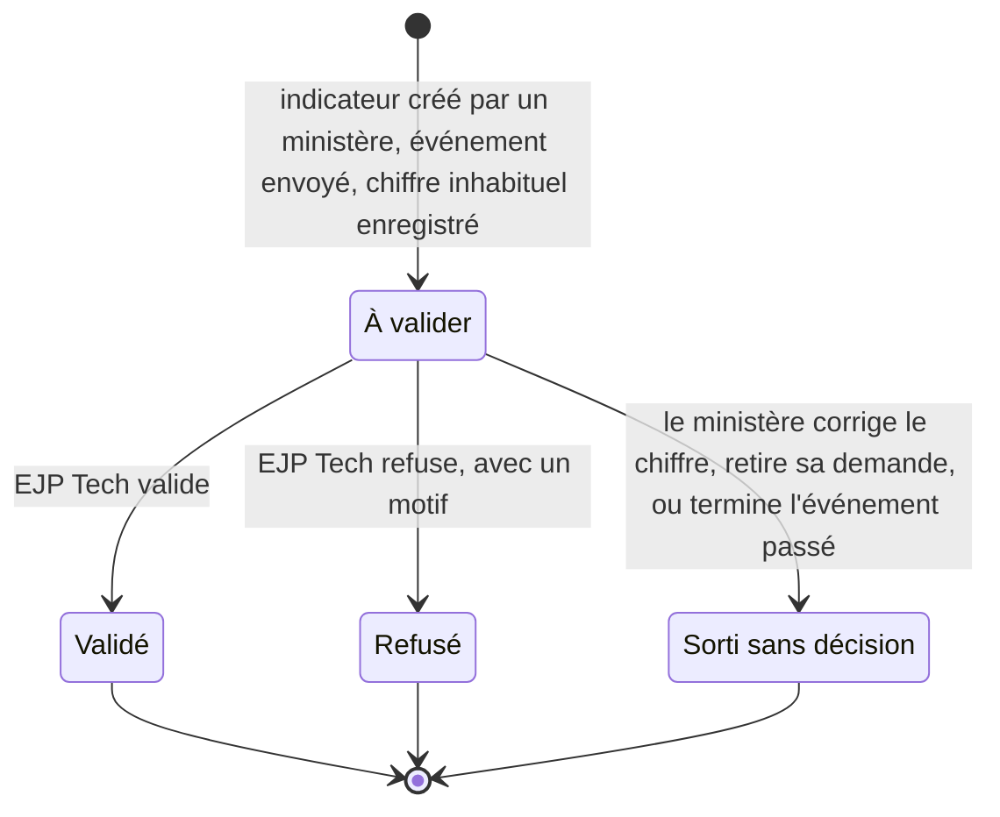
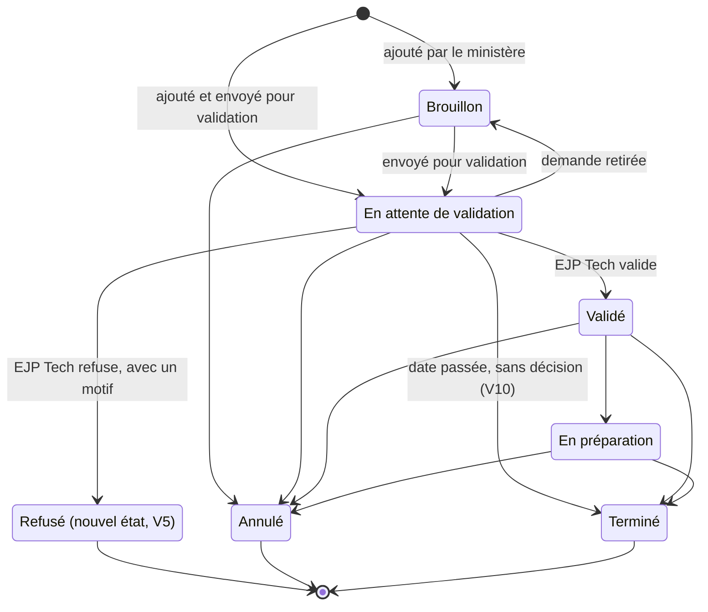

# Validation métier par EJP Tech

Statut : **principe décidé (T30 de `docs/decisions.md`), conception à l'étude, non appliquée**.
Rien n'est codé, aucune migration n'est écrite, `BRIEF.md` n'est pas modifié. Une session ne
construit rien à partir de ce document tant que la personne responsable n'a pas répondu aux
questions de la section 10.
Date : 5 octobre 2026, revue appliquée le même jour (section 11).

Sources : décisions de la personne responsable du 5 octobre 2026 ; `BRIEF.md` (sections 2 à 4, 6,
7, 9, 11 et 13) ; `docs/decisions.md` (P06, P09, P14, P20, P22, T28, T29) ;
`docs/conception/configuration-indicateurs.md` (« la configuration » ci-dessous, alignée sur ce
document le même jour) ; `docs/conception/kpi-ministeres.md` (3.6) ; vues de l'étape 3 sur `main`
(`20260930163200_vues_et_lectures.sql` : `v_total_dimanche`, `v_total_a_ce_jour`,
`v_pourcentage_fij`, `v_session_completude`, `v_ecart_dimanche`, `v_ecart_session`) et
`src/lib/metier/completude.ts`, qui met en forme « 6 sur 8 » sans rien recompter.

Numérotation : la branche `etape-droits-ejp-tech` et `main` utilisent déjà T26 à T30 pour d'autres
entrées. La correspondance à appliquer à la fusion est dans le tableau « Numérotation à la fusion »
en tête de `docs/decisions.md`. Ce document garde les numéros de cette branche (T28 : lecture par
EJP Tech ; T29 : configuration des indicateurs ; T30 : cette validation).

## 1. Besoin et décisions

### Décisions de la personne responsable (5 octobre 2026)

Elles remplacent tout ce qui, dans les documents plus anciens, dit autre chose.

- EJP Tech (profil `admin_plateforme`) lit tout comme le berger, en lecture seule (T28 sur cette
  branche, construit sur une autre branche).
- La validation métier dans l'outil est faite par **EJP Tech seul** : ni l'administration de
  l'église, ni le berger. EJP Tech ne fait pas que des actions techniques : quand c'est
  nécessaire, il valide ce que les ministères soumettent.
- Ce qui se valide : les indicateurs créés par les ministères, les événements (« En attente de
  validation » devient « Validé » dans l'outil) et les chiffres inhabituels (une saisie loin des
  valeurs habituelles). D'autres candidats sont proposés en 2.2, sans être décidés.
- Tant qu'un élément n'est pas validé, le berger et le conseil le **voient**, marqué « à
  valider », et il **n'entre dans aucun total**. Les totaux gardent une complétude honnête.
- EJP Tech et l'administration de l'église utilisent tous deux l'écran Indicateurs. Pour la
  validation, EJP Tech n'agit plus « sur demande écrite de l'administration ».

### Ce qui change dans le BRIEF

| Section du BRIEF        | Aujourd'hui                                                                                              | Avec T30, à écrire quand la conception est confirmée                                                                                                      |
| ----------------------- | -------------------------------------------------------------------------------------------------------- | --------------------------------------------------------------------------------------------------------------------------------------------------------- |
| 2, profils et onglets   | EJP Tech : « Modération des champs libres et journal technique. Ne voit aucun chiffre. »                 | EJP Tech lit tout en lecture (T28) et valide ou refuse ce que les ministères soumettent ; nouvel onglet « À valider »                                     |
| 3, règle 1              | liste des tables en ajout seulement                                                                      | `validation` et `chiffre_signale` s'y ajoutent ; aucune exception nouvelle                                                                                |
| 3, règles 3, 4, 5 et 13 | totaux et complétude sur la saisie la plus récente de chaque ministère                                   | sur les chiffres retenus seulement ; les chiffres à valider ou refusés se comptent à part ; un « à ce jour » garde sa dernière valeur retenue (section 4) |
| 3, règle 12             | « pour les 6 ministères qui ont saisi les deux fois »                                                    | « pour les 6 ministères comptés les deux fois »                                                                                                           |
| 3, règle 14             | « la validation se fait en dehors de l'outil » ; le ministère reporte tous les statuts                   | texte proposé ci-dessous                                                                                                                                  |
| 6, modèle               | `statut_evenement` à six valeurs ; codes de journal                                                      | deux tables, état « Refusé » (V5), deux codes de journal, cible `validation`, colonnes ajoutées aux vues (section 8)                                      |
| 7, sécurité             | matrice, politiques et fonctions                                                                         | lignes et fonctions `valider_*` de la section 8 ; noms réservés au berger, au conseil et à EJP Tech (V23)                                                 |
| 9, écrans               | aide de l'événement « La validation se fait en dehors de l'outil. Ici, on reporte seulement le statut. » | écran « À valider », marques, confirmation d'un chiffre inhabituel, alerte de l'administration, adresse `/a-valider` (section 7)                          |
| 11, hors périmètre      | « validation dans l'outil »                                                                              | retiré de la liste ; « notifications » y reste : tout se signale dans l'interface (7.5)                                                                   |
| 13, plan                | étapes 0 à 8                                                                                             | étape 4b et lot V2 (section 9) ; l'étape 8 rend obligatoires deux comptes EJP Tech actifs                                                                 |

Règle 14 proposée :

> 14. **Événements** : le ministère qui porte l'événement l'ajoute en brouillon ou l'envoie pour
>     validation (« En attente de validation »). EJP Tech seul le valide ou le refuse, dans l'outil ;
>     un refus porte un motif et il est définitif. Tant qu'il attend, l'événement est visible du
>     berger et du conseil, marqué « à valider », et n'entre dans aucun comptage. Une fois validé,
>     le ministère reporte sa date et son statut (en préparation, terminé, annulé) à chaque
>     changement ; chaque changement ajoute une ligne d'état et une ligne de journal. Une fois sa
>     date passée, un événement qui attend toujours peut passer « Terminé » ou « Annulé » : il sort
>     de la file sans décision et n'est compté nulle part. L'administration ne change pas les
>     statuts : la liste est fixe (`statut_evenement`) et ne change que par une migration d'EJP
>     Tech. Le nom ne change pas : pour renommer, on passe l'événement « Annulé » et on en ajoute
>     un autre.

### Ce qui change dans les décisions et la configuration

Ces changements sont écrits dans `configuration-indicateurs.md` et dans `docs/decisions.md`
depuis la revue du 5 octobre 2026.

| Décision ou passage                 | Avant T30                                                                                   | Avec T30                                                                                                                                         |
| ----------------------------------- | ------------------------------------------------------------------------------------------- | ------------------------------------------------------------------------------------------------------------------------------------------------ |
| P09                                 | le ministère reporte tous les statuts, « Validé » compris                                   | il ne pose plus « Validé » ; EJP Tech valide ou refuse                                                                                           |
| P20                                 | prévus : dernier état « Validé » ou « En préparation »                                      | même règle, événements validés seulement ; un événement à valider se montre à part, jamais compté (6.4)                                          |
| P22 et configuration, lot 2         | un ministère d'un domaine sensible fait valider ce qu'il écrit, par l'administration        | toute création d'un ministère est validée, par EJP Tech ; les chiffres sensibles restent hors de la détection (V15)                              |
| Configuration, 2 (qui fait quoi)    | valider un ajout : l'administration ; EJP Tech selon une question à la coordination         | EJP Tech seul. La question (Q13 de la configuration) ne vaut plus que pour les autres gestes (retirer, remplacer, rendre officiel, etc.)         |
| Configuration, 4.2                  | limite sur 30 jours, « retirés compris »                                                    | retirés compris, refusés non compris : un refus d'EJP Tech ne coûte pas une place au ministère                                                   |
| Configuration, 4.3                  | validation seulement dans quatre cas à risque                                               | toute création par un ministère (proposé : suggestions comprises, V1) ; les quatre conditions disparaissent                                      |
| Configuration, 4.4, 4.5 et 8.1      | un ajout en attente ou jamais validé est caché au berger et au conseil                      | visible, marqué « à valider », saisissable (V2) ; refusé, il passe dans « Retirés » sans valeur                                                  |
| Configuration, 4.6 et 5.8           | le ministère corrige ses comptes écrits par lui, tant que rien n'est saisi                  | il ne les corrige plus (V3) : avant la décision, il retire sa demande ; après, il remplace, et le remplaçant repasse en validation               |
| Configuration, 5.2                  | colonnes `ne_en_attente` et `valide_le` (lot 2)                                             | inutiles : la décision est une ligne de `validation`                                                                                             |
| Configuration, 5.8 et 5.10          | `valider_indicateur` par l'administration, motif en liste fermée ; code `indicateur_valide` | `valider_indicateur` par EJP Tech, motif libre de 10 à 280 caractères ; codes `element_valide` et `element_refuse` ; motif de retrait « Refusé » |
| Configuration, 6.2                  | alerte de valeur inhabituelle calculée dans l'interface, sans suite (lot 2)                 | règle de la base (section 5), confirmation à la saisie, validation par EJP Tech                                                                  |
| Configuration, 6.3, 7.6 (relecture) | relecture par EJP Tech de chaque texte d'indicateur écrit par un ministère                  | la validation vaut relecture ; un texte validé qui pose problème se retire pour confidentialité                                                  |
| Configuration, 7.1                  | bloc « À valider » sur l'écran Indicateurs, avec des boutons pour l'administration          | une phrase sans bouton ; la décision se prend dans « À valider » d'EJP Tech (V4)                                                                 |

### Ce qui change dans les droits

| Profil                     | Gagne                                                                                                    | Perd                                                                                                                                                              |
| -------------------------- | -------------------------------------------------------------------------------------------------------- | ----------------------------------------------------------------------------------------------------------------------------------------------------------------- |
| EJP Tech                   | valider et refuser, par les fonctions `valider_*` ; la file « À valider » ; masquer un motif de refus    | rien ; il ne saisit toujours rien au nom d'un ministère (T28)                                                                                                     |
| Ministère                  | `verifier_chiffres` et `verifier_presence` pour sa fiche ; lecture de l'état et du motif de ses éléments | poser « Validé » ; passer un événement « En préparation » avant sa validation, ou « Terminé » avant sa date ; corriger le texte d'un indicateur qu'il a créé (V3) |
| Berger, conseil            | lecture des éléments à valider, des noms et des motifs de refus                                          | rien ; aucune action nouvelle                                                                                                                                     |
| Administration de l'église | le nombre d'éléments qui attendent, sans nom ; l'alerte de 7 jours (5.7)                                 | valider ou refuser un ajout d'indicateur (configuration, lot 2)                                                                                                   |

### Exigences

| Code | Exigence                                                                                                                                                  |
| ---- | --------------------------------------------------------------------------------------------------------------------------------------------------------- |
| F1   | EJP Tech seul valide ou refuse, dans l'outil, les indicateurs créés par un ministère, les événements envoyés et les chiffres inhabituels.                 |
| F2   | Un refus porte un motif de 10 à 280 caractères. Une validation n'en porte pas.                                                                            |
| F3   | Tant qu'un élément attend, le berger et le conseil le voient, marqué « à valider ». Il n'entre dans aucun total.                                          |
| F4   | Tout total garde sa complétude et dit combien de chiffres attendent ou sont refusés (« 5 sur 8, 1 à valider », « 5 sur 8, 1 refusé »).                    |
| F5   | Un chiffre est inhabituel selon une règle de la base, la même pour l'écran et pour l'enregistrement, explicable en une phrase.                            |
| F6   | Le ministère est prévenu avant d'envoyer un chiffre inhabituel, et peut le corriger.                                                                      |
| F7   | Une décision est une ligne ajoutée. Elle est définitive, comme un point traité.                                                                           |
| F8   | Chaque décision écrit une seule ligne de journal, sans le motif, sans valeur d'indicateur propre et sans email.                                           |
| F9   | Rien ne se décide tout seul. Une attente de plus de 7 jours est signalée à l'administration, qui prévient EJP Tech sans rien décider.                     |
| F10  | Tous les profils qui lisent un total obtiennent le même total et la même complétude.                                                                      |
| F11  | Le nom du ministère dont un chiffre attend ou est refusé n'est montré qu'au berger, au conseil et à EJP Tech ; les autres profils lisent le nombre (V23). |

Non fonctionnelles :

- **Ajout seulement** : `validation` et `chiffre_signale` rejoignent la liste de la règle 1. Un
  trigger `before update or delete` et `before truncate` les rend inaltérables, comme `journal`.
- **Sécurité** : RLS et politique restrictive `aal2` sur les deux tables ; aucun GRANT d'écriture ;
  `security definer` seulement dans `private`, `set search_path = ''`, `exige_aal2()` en tête de
  chaque fonction de l'API ; vues `security_invoker`, ou vues sur fonction qui font leur propre
  contrôle.
- **Dates** : heure de Paris (`private.aujourdhui()`, `private.dimanche_reference()`, et
  `(x at time zone 'Europe/Paris')::date` pour un horodatage), jamais `current_date`.
- **Entretien** : deux tables, une fonction de règle et ses seuils en un seul endroit, aucune
  colonne d'état mise à jour, aucun cache, aucune tâche planifiée.
- **Suppléance, obligatoire** : au moins deux comptes EJP Tech actifs avant la mise en service du
  lot V1. L'étape 8 l'écrit dans `docs/exploitation.md` comme une condition de mise en service, pas
  comme un conseil (V28 demande seulement qui tient le second compte).

## 2. Ce qui se valide

### 2.1 Les trois objets décidés

La colonne « Ce qu'EJP Tech regarde » aide EJP Tech à décider. Ce n'est pas un contrôle de l'outil,
qui ne vérifie rien de tout cela : la personne responsable confirme ou fixe ces critères (V7).

| Objet                            | Qui le soumet                               | Entre en validation                                                                    | Ce qu'EJP Tech regarde (proposé, V7)                                                                                                                   | Tant qu'il attend                                                                                                                                |
| -------------------------------- | ------------------------------------------- | -------------------------------------------------------------------------------------- | ------------------------------------------------------------------------------------------------------------------------------------------------------ | ------------------------------------------------------------------------------------------------------------------------------------------------ |
| Indicateur créé par un ministère | le ministère, depuis « Mes indicateurs »    | à sa création : suggestion (lot 1 de la configuration) ou compte écrit par lui (lot 2) | utile au ministère ; pas déjà compté par un chiffre commun ou un autre indicateur ; libellé et définition clairs ; aucun nom ; pas un domaine sensible | sur la fiche, marqué « à valider » ; il se saisit déjà, ses valeurs marquées et hors de toute somme (V2) ; compté dans les 3 ajouts du ministère |
| Événement                        | le ministère qui le porte                   | quand il passe « En attente de validation », à la création ou depuis un brouillon      | l'événement concerne bien ce ministère ; son nom ne contient aucun nom de personne ; le reste selon les critères que fixe la personne responsable      | statut « En attente de validation », marqué « à valider » pour le berger, le conseil et EJP Tech ; dans aucun comptage                           |
| Chiffre inhabituel               | le ministère qui saisit, après confirmation | à l'enregistrement, quand la règle de la section 5 le repère                           | ce n'est pas une faute de frappe ; le chiffre a une raison (fête, rattrapage, équipe qui change), au besoin en demandant au ministère hors de l'outil  | sur la fiche avec « à valider » ; hors des totaux, compté à part dans la complétude ; un « à ce jour » garde sa valeur retenue précédente (4.1)  |

Suggestions (V1) : proposé, une suggestion ajoutée par un ministère passe aussi en validation.
Raisons : la décision dit « les indicateurs créés par les ministères », sans exception ; la question
d'EJP Tech (ce chiffre est-il utile à ce ministère, n'est-il pas déjà compté ?) se pose de la même
façon ; une seule règle est plus simple à expliquer et à tester. Coûts : un clic d'EJP Tech par
suggestion ; l'état « à valider » passe du lot 2 au lot 1 de la configuration ; à la mise en
service, la file peut recevoir jusqu'à 66 ajouts (3 ajouts au plus par ministère, 22 ministères
dans la liste de la coordination), une borne haute que les ministères atteignent rarement d'un
coup. Comme l'ajout se saisit déjà (V2), l'attente ne bloque pas le ministère. Alternative :
suggestion active tout de suite, puisque son libellé et sa définition sont déjà relus.

### 2.2 Autres candidats

La personne responsable a demandé une liste argumentée. Rien n'est décidé : « proposé » veut dire
« à ajouter si la personne responsable le confirme », « déconseillé » veut dire « à ne pas
valider ».

| Candidat                                                                                      | Avis                                           | Pourquoi                                                                                                                                                                                                                                                                      |
| --------------------------------------------------------------------------------------------- | ---------------------------------------------- | ----------------------------------------------------------------------------------------------------------------------------------------------------------------------------------------------------------------------------------------------------------------------------- |
| Correction tardive : nouvelle saisie d'une période déjà saisie, plus de 4 semaines après elle | proposé, après un mois d'usage du lot V2 (V18) | un total que le berger a déjà lu et discuté change sans bruit ; la règle est objective (période déjà saisie, âge de la période) ; la première saisie d'une période, même ancienne (rattrapage d'un indicateur tout juste validé), reste libre, donc pas d'afflux dans la file |
| Toute présence à une session, et pas seulement l'inhabituelle                                 | déconseillé                                    | une session attend jusqu'à 22 saisies (22 ministères dans la liste de la coordination, 8 dans le jeu d'exemple) : la file déborderait et le total de la session resterait partiel plusieurs jours (4.6) ; les présences inhabituelles sont déjà couvertes (section 5)         |
| Sessions déclarées par l'administration                                                       | déconseillé                                    | l'administration est l'autorité de l'église pour les sessions (règle 5) ; une session non validée bloquerait la saisie de tous les ministères attendus ; une erreur se corrige déjà (modifier, supprimer tant que rien n'est saisi)                                           |
| Points d'attention                                                                            | déconseillé                                    | un point urgent doit atteindre le berger tout de suite ; aucun total n'en dépend ; la modération relit déjà les textes après coup                                                                                                                                             |
| Mentions d'un point                                                                           | déconseillé                                    | retarder une mention cacherait le point au ministère mentionné, qui doit pouvoir le traiter ; une mention est fixée à la création et ne fait aucun total                                                                                                                      |
| Textes déjà modérés (relus ou masqués)                                                        | déconseillé                                    | la relecture est déjà la vérification d'EJP Tech ; valider avant de publier bloquerait chaque texte et doublerait le travail                                                                                                                                                  |
| Prochaine réunion                                                                             | déconseillé                                    | simple déclaration du ministère, sans total ; une réunion passée disparaît d'elle-même                                                                                                                                                                                        |
| Carte des FIJ (`fij_departement`)                                                             | déconseillé en V1 (V16)                        | un seul ministère la saisit, avec de très petits nombres (2 à 6 par département) : toute règle d'écart alerterait à tort ; le même mécanisme s'y ajoute plus tard s'il le faut                                                                                                |
| Comptes et ministères (création, désactivation)                                               | déconseillé                                    | P07 : l'administration crée les comptes, EJP Tech demande et l'église décide ; valider ses gestes inverserait ce partage et donnerait à une seule personne le contrôle des accès                                                                                              |
| Indicateurs créés par l'administration ou par EJP Tech                                        | déconseillé                                    | l'administration décide de ce qui est suivi ; EJP Tech ne se valide pas lui-même                                                                                                                                                                                              |
| Changements d'un événement déjà validé (report, préparation, fin, annulation)                 | déconseillé (V8, V9)                           | le ministère sait si son événement a eu lieu ; revalider chaque changement triplerait la file ; un report reste lisible dans l'historique et compté « Reporté » (P20)                                                                                                         |
| Premières valeurs d'un ministère, que la règle de la section 5 ne juge pas                    | déconseillé                                    | la règle ne juge qu'à partir de la 5e saisie d'un chiffre ; valider ces premières saisies ferait, pour 22 ministères et 3 chiffres communs, jusqu'à 66 éléments chaque semaine pendant les quatre premières semaines                                                          |
| Retrait d'un indicateur par un ministère                                                      | déconseillé                                    | il ne retire que ses propres ajouts, l'historique reste, aucun total ne change                                                                                                                                                                                                |
| Plus de STARs au service que de STARs actifs dans un ministère                                | déconseillé                                    | un STAR peut servir dans un ministère qui n'est pas son ministère principal (BRIEF, section 6) : ce n'est pas une erreur                                                                                                                                                      |

## 3. Cycle de validation commun

### États



L'état se lit dans les données, il n'est jamais une colonne mise à jour :

- **À valider** : l'élément attend et aucune ligne de `validation` ne le vise.
- **Validé** : une ligne de `validation` avec `decision = 'valide'`.
- **Refusé** : une ligne avec `decision = 'refuse'` et son motif.
- **Sorti sans décision** : le ministère a saisi un autre chiffre pour la même période (même
  dimanche, même mois, même session, ou relevé plus récent d'un « à ce jour »), a remis
  l'événement en brouillon ou l'a annulé, a passé « Terminé » un événement dont la date est passée
  (6.2), ou a retiré l'indicateur. L'élément sort de la file sans ligne de `validation`.

### Règles communes

- Une validation est une **nouvelle ligne** de `validation`, jamais un `update`. Deux gestes
  l'accompagnent, déjà bornés : la nouvelle ligne d'état d'un événement (un ajout dans
  `evenement_etat`) et le changement d'`indicateur.etat`, table de référence dont les seuls
  changements sont listés par la configuration (5.9).
- Une décision est **définitive** : un index unique par objet interdit une seconde décision. Après
  un refus, le ministère saisit un autre chiffre, ajoute un autre événement ou un autre indicateur.
- **EJP Tech seul** décide (`private.mon_type() = 'admin_plateforme'`), par les fonctions
  `valider_*` (8.4). Tout autre profil reçoit 42501, avec le message d'un objet absent.
- **Refus** : motif obligatoire, de 10 à 280 caractères après `btrim`. Sous le champ, le rappel
  « N'écrivez aucun nom ni information personnelle. ». Comme les textes de l'administration
  (règle 9), le motif ne passe pas en relecture ; EJP Tech peut le masquer (`masquer_texte`,
  couple `validation`, `motif`). Une validation ne porte aucun texte.
- **Deux comptes EJP Tech** peuvent décider : un verrou `for update` sur l'objet et l'index unique
  empêchent deux décisions ; le second reçoit « Cet élément a déjà été décidé. ».
- **La validation vaut relecture** pour un indicateur créé par un ministère : EJP Tech lit le
  libellé et la définition en décidant. Ces textes n'entrent plus dans la file de la Modération.
- **Aucune décision automatique** (5.7).

### Après une décision

Une validation ne doit pas pouvoir se contourner en changeant l'objet ensuite.

- **Indicateur** : proposé (V3), le ministère ne corrige jamais le texte d'un indicateur qu'il a
  créé. Avant la décision, il retire sa demande et en envoie une autre ; après, il le remplace, et
  le remplaçant naît « à valider ». L'administration et EJP Tech gardent la correction tant que
  rien n'est saisi (configuration, 4.6) : leurs textes ne sont pas soumis à validation. Une
  correction faite par l'administration sur un ajout qui attend est lue par EJP Tech au moment de
  décider, puisque la file montre le texte actuel.
- **Événement** : le nom ne change jamais (règle 14). Proposé (V8), un report de date garde la
  validation : il se lit dans l'historique et compte « Reporté » (P20). Un report lointain (plus de
  30 jours) qui repasserait en validation est une question à part (V9) ; recommandation : non en V1.
- **Chiffre** : une nouvelle saisie de la même période remplace le chiffre, qu'il soit à valider,
  validé ou refusé (règle 2), et passe à son tour par la règle de la section 5.

### Qui fait quoi

| Geste                                                                 | Ministère                                        | Berger, conseil        | Administration de l'église                                             | EJP Tech           |
| --------------------------------------------------------------------- | ------------------------------------------------ | ---------------------- | ---------------------------------------------------------------------- | ------------------ |
| Soumettre (indicateur, événement, chiffre inhabituel confirmé)        | oui, pour lui                                    | non                    | non                                                                    | non                |
| Retirer sa demande (corriger le chiffre, brouillon, annuler, retirer) | oui, pour lui                                    | non                    | non                                                                    | non                |
| Valider                                                               | non                                              | non                    | non                                                                    | oui, seul          |
| Refuser, avec un motif                                                | non                                              | non                    | non                                                                    | oui, seul          |
| Voir qu'un élément attend                                             | les siens ; pour les totaux, le nombre, sans nom | tout, marqué, avec nom | le nombre, sans nom ; les ajouts d'indicateurs sur l'écran Indicateurs | tout, dans la file |
| Lire le motif d'un refus                                              | les siens                                        | oui                    | sur les indicateurs seulement                                          | oui                |

### Ce que voit le ministère qui soumet

| Objet      | À valider                                                                                                                   | Validé                                                 | Refusé                                                                                                   |
| ---------- | --------------------------------------------------------------------------------------------------------------------------- | ------------------------------------------------------ | -------------------------------------------------------------------------------------------------------- |
| Indicateur | « À valider par EJP Tech depuis 2 jours. Vous pouvez déjà le saisir : le berger voit ses valeurs, marquées « à valider ». » | la marque disparaît                                    | dans « Retirés » : « Refusé le 8 oct. : « motif ». »                                                     |
| Événement  | « En attente de validation par EJP Tech depuis 3 jours. »                                                                   | statut « Validé » ; « Mettre à jour » propose la suite | statut « Refusé », « Refusé le 8 oct. : « motif ». Ajoutez un nouvel événement s'il le faut. »           |
| Chiffre    | « 120, à valider par EJP Tech : pas encore compté dans les totaux de l'église. »                                            | la valeur, sans mention                                | « 120, refusé le 8 oct. : « motif ». Saisissez le bon chiffre. », et « Vos saisies » repasse « À faire » |

### Journal

Une ligne par décision, comme pour tout geste (règle 10). `compte` est le compte EJP Tech,
`ministere_id` celui de l'élément : la fraîcheur du ministère ne bouge pas (règle 6, elle ne lit
que les lignes écrites par un compte du ministère).

| Code              | Libellé (écran 06) | `cible`, `cible_id`    | `detail` (codes, identifiants et dates seulement)                                                                                                     | Détail affiché (exemple)                           |
| ----------------- | ------------------ | ---------------------- | ----------------------------------------------------------------------------------------------------------------------------------------------------- | -------------------------------------------------- |
| `element_valide`  | A validé           | `validation`, sa ligne | `{"objet": "mesure", "indicateur_id", "date_ref"}`, `{"objet": "participation", "session_id"}`, `{"objet": "evenement"}` ou `{"objet": "indicateur"}` | « STARs au service du 27 sept., Communication »    |
| `element_refuse`  | A refusé           | `validation`, sa ligne | idem                                                                                                                                                  | « Soirée de louange, Communication »               |
| `indicateur_cree` | inchangé           | indicateur             | `"attente": true` pour un ajout d'un ministère (configuration, 5.10)                                                                                  | « Pages Roses : ateliers, chaque mois, à valider » |

- Jamais le motif, jamais une valeur d'indicateur propre, jamais un email : l'écran lit le texte
  actuel de l'objet par `cible_texte` (`v_journal` gagne le cas `validation`), sous la RLS du
  lecteur.
- `mesure_saisie` et `participation_saisie` ne changent pas : leur `detail` ne dit pas qu'un
  chiffre est signalé. L'administration lit ces lignes ; elle apprendrait sinon qu'un chiffre
  d'indicateur propre, peut-être sensible, était inhabituel. L'écran du journal lit l'état par
  `v_etat_chiffre`, sous la RLS du lecteur.
- La ligne d'état qu'écrit `valider_evenement` ne produit pas de ligne `evenement_modifie` : le
  trigger du journal la saute quand la transaction a posé le réglage local `pilotage.validation`
  (`set_config`, que l'API n'expose pas : aucun client ne peut le poser).
- `valider_indicateur` écrit lui-même sa seule ligne (`element_valide` ou `element_refuse`). Il
  n'appelle pas `retirer_indicateur` et n'écrit pas `indicateur_retire` : le journal des
  indicateurs est écrit par les fonctions, pas par un trigger (configuration, 5.10), donc aucun
  réglage local n'est nécessaire. Un test le vérifie (8.6).
- Lecteurs : le ministère lit les lignes de son ministère ; le berger, le conseil et EJP Tech
  toutes ; l'administration celles dont l'objet est un indicateur (`journal_lisible_administration`
  gagne ces deux codes pour l'objet `indicateur` seulement).

## 4. Effet sur les totaux et la complétude

### 4.1 Trois états d'un chiffre saisi

- **Retenu** : jamais signalé, ou signalé puis validé. Il compte.
- **À valider** : signalé, sans décision. Il ne compte pas.
- **Refusé** : signalé puis refusé. Il ne compte pas.

La saisie la plus récente fait toujours foi (règle 2). Ce qu'on fait quand elle attend ou est
refusée dépend de la sorte de chiffre :

- **Une période** (dimanche, mois, session) : le ministère n'est pas compté pour cette période.
  Proposé, **pas de repli** sur une saisie plus ancienne de la même période (V20) : le ministère a
  lui-même remplacé cette valeur, et la règle 3 ne reprend jamais la valeur d'une autre période.
  Une correction ordinaire (12 après 120) devient la plus récente, compte tout de suite et fait
  sortir 120 de la file. Un refusé se dit à part : « 5 sur 8, 1 refusé ».
- **« À ce jour »** (STARs actifs, dont en FIJ, indicateurs propres « à ce jour ») : la **dernière
  valeur retenue** compte, avec sa date, comme pour la règle des 30 jours. La règle 3 additionne les
  dernières valeurs, et un relevé n'efface pas le précédent : sans ce repli, un nouveau chiffre à
  valider (souvent une faute de frappe) ferait sortir le ministère entier du total, et 69 STARs
  actifs deviendraient 55, comme si l'église avait reculé. Le formulaire du ministère préremplit
  avec cette même valeur (5.5) : l'outil montre partout la même valeur courante. Un relevé refusé
  laisse aussi la valeur retenue précédente.
- **Pourcentage FIJ** : chacune des deux valeurs est la dernière retenue du ministère. Si le
  « dont en FIJ » retenu dépasse les « STARs actifs » retenus (le relevé qui attend était
  justement la correction), le ministère sort des deux sommes jusqu'à la décision, et la complétude
  le dit (« 7 sur 8, 1 à valider »).

### 4.2 Lire la complétude

Règle proposée : **le premier nombre est toujours celui des ministères (ou des périodes) dont la
valeur est dans le total**. Les chiffres à valider et les refusés se disent à part. Le nom du
ministère n'apparaît que pour le berger, le conseil et EJP Tech (V23) ; les ministères et
l'administration lisent le même texte sans le nom.

| Situation               | Affichage                                                           | Libellé accessible                                                                                                                                 |
| ----------------------- | ------------------------------------------------------------------- | -------------------------------------------------------------------------------------------------------------------------------------------------- |
| Rien n'attend           | « 6 sur 8 »                                                         | inchangé                                                                                                                                           |
| Un chiffre à valider    | « 5 sur 8, 1 à valider »                                            | « 5 ministères comptés sur 8 attendus. Le chiffre d'un ministère attend la validation d'EJP Tech : il n'est pas compté. »                          |
| Deux chiffres à valider | « 4 sur 8, 2 à valider »                                            | idem, au pluriel                                                                                                                                   |
| Un chiffre refusé       | « 5 sur 8, 1 refusé »                                               | « 5 ministères comptés sur 8 attendus. Le chiffre d'un ministère a été refusé par EJP Tech : il n'est pas compté. »                                |
| « À ce jour »           | « 8 sur 8, 1 nouvelle valeur à valider »                            | « 8 ministères comptés sur 8. Pour un ministère, la nouvelle valeur attend la validation d'EJP Tech : sa valeur précédente, du 20 sept., compte. » |
| « À ce jour », ancienne | « À ce jour, 1 valeur de plus de 30 jours »                         | inchangé ; une valeur précédente gardée par le repli entre dans cette règle comme les autres                                                       |
| Session                 | « 5 sur 8, 1 à valider. Manquent : Coordination et Intégration. »   | « Manquent » ne liste que les ministères sans saisie ; avec la phrase du total partiel (4.6)                                                       |
| Somme de l'année        | « Somme des mois depuis janvier : 98 (8 mois sur 9, 1 à valider). » | les périodes à valider ne sont ni dans la somme ni dans les saisies                                                                                |

Écarté : « 6 sur 8, dont 1 à valider ». Le premier nombre ne serait plus celui des ministères
additionnés : devant « 47 (6 sur 8) », le berger croirait que 47 couvre six ministères. La forme
retenue garde le sens actuel de « 6 sur 8 » et ajoute une information, sans en changer une (V19).

Mise en forme : `completude(saisis, attendus)` de `src/lib/metier/completude.ts` gagne deux
arguments, `aValider` et `refuses` (0 par défaut) ; `libelle` devient « 5 sur 8, 1 à valider » ou
« 5 sur 8, 1 refusé » quand ils ne sont pas nuls ; `complet` reste faux tant qu'un chiffre attend
ou est refusé. Le cas « à ce jour » a son propre libellé (« 1 nouvelle valeur à valider »).

### 4.3 Total par total

| Total                                      | Ce qui s'additionne                                                                                                        | Complétude                                                              | Exemple                                                             |
| ------------------------------------------ | -------------------------------------------------------------------------------------------------------------------------- | ----------------------------------------------------------------------- | ------------------------------------------------------------------- |
| Dimanche (STARs au service)                | pour chaque ministère, sa saisie la plus récente pour D, si elle est retenue                                               | comptés sur attendus ; à valider et refusés à part ; attendus inchangés | « 47 », « 5 sur 8, 1 à valider »                                    |
| À ce jour (STARs actifs, dont en FIJ)      | dernière valeur retenue de chaque ministère actif                                                                          | comptés sur attendus ; « 1 nouvelle valeur à valider »                  | « 69 », « 8 sur 8, 1 nouvelle valeur à valider »                    |
| Pourcentage FIJ (calculé)                  | les deux dernières valeurs retenues de chaque ministère actif ; hors des deux sommes si « dont en FIJ » dépasse les actifs | « 7 sur 8, 1 à valider » dans ce dernier cas seulement                  | « 53 sur 69 STARs actifs », 77 %                                    |
| Session                                    | présents moins déjà comptés, sur la saisie la plus récente de chaque ministère, si elle est retenue                        | comptés, à valider, refusés, manquants ; total partiel (4.6)            | « 47 », « 5 sur 8, 1 à valider »                                    |
| Carte des FIJ                              | inchangée : pas de détection en V1 (2.2)                                                                                   | « 8 dép. »                                                              |                                                                     |
| Indicateur propre : somme de l'année       | périodes finies dont la saisie la plus récente est retenue ; aucune somme pour un indicateur à valider                     | « 8 mois sur 9, 1 à valider »                                           | « Somme des mois depuis janvier : 98 (8 mois sur 9, 1 à valider). » |
| Indicateur propre : calcul (taux, moyenne) | périodes dont le haut et le bas sont retenus                                                                               | comme la configuration (3.4)                                            | « Non calculé : demandes reçues de septembre à valider. »           |
| Comptages d'événements (phase 2, P20)      | événements validés                                                                                                         | pas de liste d'attendus : « et 2 à valider », jamais compté             | « 4 prévus en octobre, et 2 à valider »                             |

`v_total_dimanche` en exemple (le reste suit le même schéma, 8.3) :

```sql
-- v_mesure_dimanche gagne mesure_id et etat à la fin ; nb_saisis compte désormais les ministères
-- comptés ; nb_a_valider et nb_refuses s'ajoutent à la fin (create or replace view n'accepte que
-- des colonnes ajoutées).
select i.id as indicateur_id, d.dimanche,
       sum(v.valeur) filter (where v.etat = 'retenu') as total,      -- null : trou dans la courbe
       count(*) filter (where v.etat = 'retenu') as nb_saisis,
       (... nb_attendus inchangé ...) as nb_attendus,
       count(*) filter (where v.etat = 'a_valider') as nb_a_valider,
       count(*) filter (where v.etat = 'refuse') as nb_refuses
```

### 4.4 Courbes et écarts

- **Courbes** : elles gardent le total brut des chiffres retenus. Un dimanche ou une session dont
  un chiffre attend est incomplet : cercle vide, comme aujourd'hui. Un point passé monte quand le
  chiffre est validé, comme il monte aujourd'hui après un rattrapage.
- **Écart à périmètre égal** (règle 12) : seuls les ministères **retenus les deux fois** entrent
  dans la comparaison, pour un dimanche comme pour une session. Libellé : « +3 par rapport à
  dimanche dernier, pour les 5 ministères comptés les deux fois ». Un chiffre à valider ne crée
  donc jamais un faux écart.

### 4.5 Phrases

- **Phrase de la semaine** : A additionne les chiffres retenus ; B ne change pas (un ministère
  dont le chiffre attend a saisi). Pour le berger, le conseil et EJP Tech, la ligne secondaire
  commence, s'il y a lieu, par « Le chiffre de Social attend la validation d'EJP Tech : il n'est
  pas encore compté. » ou « 2 chiffres attendent la validation d'EJP Tech (Social et MCAD) : ils
  ne sont pas encore comptés. » ; pour un ministère et l'administration, sans nom : « 1 chiffre
  attend la validation d'EJP Tech : il n'est pas encore compté. ». Elle garde deux phrases au
  plus : la dernière tombe.
- **Phrase de la fiche** : la valeur du ministère, avec sa marque (« 120 STARs au service
  dimanche, à valider par EJP Tech. »).
- **Accueil du ministère** : « Vos saisies » reste « Fait » pour un chiffre à valider (« Fait, 120
  au service, à valider ») et repasse « À faire » pour un chiffre refusé, avec le bouton
  « Corriger ».

### 4.6 Règles gardées

- **Un STAR compté une fois** : le total d'une session reste la somme de (présents moins déjà
  comptés) sur les présences retenues. Il ne compte jamais un STAR deux fois. Mais tant qu'une
  présence attend ou est refusée, le total est **partiel au-delà de l'apport de ce ministère** :
  les STARs dont il est le ministère principal et que d'autres ministères ont aussi saisis sont
  déduits par ceux-ci et ne sont comptés nulle part. Exemple : A saisit 10 présents ; B saisit 5
  présents dont 3 déjà comptés (par A) ; le total vaut 10 + 2 = 12. Si la présence de A attend, le
  total vaut 2, et non 5. C'est déjà le cas aujourd'hui quand A n'a pas saisi. Le bloc de la
  session le dit sous le total : « Total partiel : la présence de Social attend la validation
  d'EJP Tech. Les STARs dont Social est le ministère principal, saisis aussi par d'autres
  ministères, ne sont pas encore comptés. » (ministère et administration : « d'un ministère », sans
  nom ; pour un refus, « a été refusée »). Validée, la présence ajoute ses 10 et le total revient
  à 12.
  - Écarté : ne plus déduire les « déjà comptés » des autres ministères pendant l'attente.
    « Déjà comptés » ne dit pas quel est le ministère principal : un STAR de B dont le ministère
    principal est un troisième ministère, lui compté, serait alors compté deux fois.
  - Écarté : « Non calculé » pendant l'attente (V22). Un total partiel avec sa complétude est déjà
    la règle pour un ministère qui n'a pas saisi, et une présence peut attendre plusieurs jours ;
    la phrase dit ce qui manque.
- **Les valeurs calculées ne se saisissent jamais** : pourcentage FIJ, taux et moyennes se
  calculent sur des chiffres retenus. La règle de la section 5 ne vise que des chiffres saisis ; un
  calcul n'est jamais « à valider », il est calculé ou « Non calculé ».
- **Mêmes totaux pour tous** : l'état de chaque saisie (retenu, à valider, refusé) se lit par
  `v_etat_chiffre` exactement quand la saisie se lit (8.3). Un ministère, le berger et
  l'administration obtiennent donc les mêmes totaux des chiffres communs ; seuls les noms
  diffèrent. Un test pgTAP le vérifie.
- **Dates** : les durées (« depuis 3 jours ») et les périodes se comptent à l'heure de Paris.

## 5. Chiffres inhabituels

**Ce que la détection est, et n'est pas.** C'est un filet contre la faute de frappe (120 pour 12,
0 pour 10), pas un contrôle d'honnêteté. Elle ne voit pas : les 4 premières saisies d'un chiffre ;
un écart de moins de 10 (3 devenu 12) ; un changement lent qui déplace la médiane ; un chiffre
proche d'un chiffre qu'EJP Tech vient de valider. Elle ne remplace ni le regard du berger sur la
fiche, ni la relecture des courbes.

### 5.1 Ce qui est contrôlé

- Les saisies de `mesure` : chiffres communs (STARs au service, STARs actifs, dont en FIJ) et
  indicateurs propres (dimanche, mois, à ce jour).
- Les présences (`participation.valeur`) aux sessions Bâtir l'Église et Anti-Dispersion,
  comparées aux sessions précédentes du même type.
- Jamais contrôlés : les indicateurs sensibles (proposé, V15 : de petits nombres d'un mois clos, où
  ni « d'habitude » ni un motif libre ne doivent s'afficher) ; un rassemblement « autre » (chaque
  rassemblement est différent) ; la carte des FIJ (V16) ; « déjà comptés » ; un calcul ; une saisie
  du jeu d'exemple ou d'une migration (sans `auth.uid()`).

### 5.2 La règle

Pour un chiffre `v` saisi par un ministère pour une période P, la base prend :

- **les valeurs comparées** : les 6 valeurs retenues les plus récentes du même ministère pour le
  même chiffre, une par période (celle qui compte dans les totaux), sur les **autres périodes que
  P**, avant ou après elle. « Les plus récentes » se lit dans l'ordre des périodes : dimanches,
  mois, dates de relevé d'un « à ce jour », dates des sessions du même type. Un rattrapage saisi
  dans le désordre (septembre, puis août, puis juillet) se compare donc comme les autres ;
- **la référence `r`** : la médiane de ces valeurs. Avec un nombre pair de valeurs, la moyenne des
  deux du milieu ; arrondie à l'entier le plus proche, une demie vers le haut (12,5 donne 13) ;
- **le chiffre validé `a`** : parmi les valeurs comparées, la plus récente qui avait été signalée
  puis validée par EJP Tech, s'il y en a une.

Avec `f` le facteur et `e` l'écart minimum, `v` est **loin** de `x` si `v` vaut au moins `f` fois
`x` et le dépasse d'au moins `e`, ou si `x` vaut au moins `f` fois `v` et le dépasse d'au moins
`e`. Le chiffre est **inhabituel** quand il y a au moins 4 valeurs comparées, que `v` est loin de
`r` **et**, s'il existe, loin de `a`. Quand `r` vaut 0, « loin » revient à « au moins `e` » : un
chiffre d'habitude nul est signalé à partir de 10, le facteur ne joue pas.

| Réglage                              | Valeur proposée             | Raison                                                                                                                                                                      |
| ------------------------------------ | --------------------------- | --------------------------------------------------------------------------------------------------------------------------------------------------------------------------- |
| Valeurs comparées                    | 6                           | une médiane stable, sur six semaines pour un dimanche                                                                                                                       |
| Historique minimum                   | 4 valeurs                   | en dessous, la médiane ne dit rien : les 4 premières saisies d'un chiffre ne sont jamais signalées, la première signalable est la 5e                                        |
| Référence                            | médiane, demie vers le haut | une valeur extrême passée ne la déplace pas, contrairement à une moyenne                                                                                                    |
| Facteur, flux                        | 3 (dimanche, mois, session) | une fête ou un culte spécial double un chiffre sans erreur ; une faute de frappe le multiplie par dix                                                                       |
| Facteur, stock                       | 2 (« à ce jour »)           | un stock bouge lentement : 14 STARs actifs devenus 41 est presque toujours une faute de frappe                                                                              |
| Écart minimum                        | 10                          | sur de petits nombres (2 puis 7), le rapport seul alerterait à tort ; en contrepartie, 3 devenu 12 n'est pas signalé                                                        |
| Loin aussi du dernier chiffre validé | oui                         | après un changement durable validé une fois (12 puis 40 validé), la suite (41, 39) ne réalerte pas ; une hausse par paliers jamais validée (12, 35, 100) est signalée à 100 |

Ces valeurs sont des choix, pas des mesures (V13, V14). Elles vivent dans une seule fonction
(`private.seuils_inhabituel()`), changée par une petite migration.

### 5.3 Exemples

| Chiffre                                | Valeurs comparées (de la plus ancienne à la plus récente) | `r`, `a`  | Saisie | Résultat                                                         |
| -------------------------------------- | --------------------------------------------------------- | --------- | ------ | ---------------------------------------------------------------- |
| STARs au service (dimanche, f = 3)     | 10, 12, 12, 13, 11, 12                                    | 12, aucun | 120    | inhabituel : 120 vaut plus de 3 fois 12 et le dépasse de 108     |
| idem                                   | idem                                                      | 12, aucun | 30     | habituel : moins de 3 fois 12                                    |
| idem                                   | idem                                                      | 12, aucun | 0      | inhabituel : 12 vaut plus de 3 fois 0 et le dépasse de 12        |
| idem                                   | idem                                                      | 12, aucun | 3      | habituel : l'écart (9) est sous 10                               |
| STARs actifs (à ce jour, f = 2)        | 14, 14, 15, 14, 14, 14                                    | 14, aucun | 41     | inhabituel                                                       |
| idem                                   | idem                                                      | 14, aucun | 22     | habituel : moins de 2 fois 14                                    |
| Publications (mois, f = 3)             | 3, 5, 4, 4, 6, 3                                          | 4, aucun  | 30     | inhabituel                                                       |
| idem                                   | idem                                                      | 4, aucun  | 12     | habituel : l'écart avec 4 (8) est sous 10                        |
| Médiane paire                          | 10, 12, 13, 15                                            | 13, aucun | 40     | inhabituel : médiane 12,5 arrondie à 13                          |
| Chiffre d'habitude nul                 | 0, 0, 0, 0, 0, 0                                          | 0, aucun  | 10     | inhabituel : au moins 10                                         |
| idem                                   | idem                                                      | 0, aucun  | 9      | habituel                                                         |
| Hausse par paliers                     | 12, 12, 12, 12, 35 (35 jamais signalé)                    | 12, aucun | 100    | inhabituel : loin de 12, aucun chiffre validé pour l'excuser     |
| Après une hausse validée               | 12, 12, 12, 12, 12, 40 (40 signalé puis validé)           | 12, 40    | 41     | habituel : loin de 12 mais proche de 40                          |
| Rattrapage de février saisi en octobre | les 6 mois retenus les plus récents : 3, 5, 4, 4, 6, 3    | 4, aucun  | 40     | inhabituel : la comparaison ne dépend pas de l'ordre des saisies |
| Présents à Bâtir l'Église (f = 3)      | 13, 15, 12, 13                                            | 13, aucun | 45     | inhabituel                                                       |
| Un indicateur saisi 3 fois             | 4, 5, 4                                                   |           | 40     | jamais signalé : moins de 4 valeurs                              |

### 5.4 Où la règle se calcule

- Une seule fonction, `private.chiffre_inhabituel`, `stable`, `security definer`,
  `set search_path = ''`. Elle reçoit le ministère, l'indicateur ou la session, la date de la
  période et la valeur, et rend `inhabituel`, `reference`, `valide` (le chiffre `a`),
  `nb_valeurs`, `facteur` et `sens` (« haut » ou « bas »).
- **À l'enregistrement** : un trigger `after insert ... for each statement` sur `mesure` et sur
  `participation` l'appelle pour chaque ligne et écrit une ligne de `chiffre_signale` pour chaque
  chiffre inhabituel. Le **signalement est figé** : une décision prise plus tard sur un autre
  chiffre ne fait ni apparaître ni disparaître un signalement.
- **Aucune valeur n'est copiée** dans `chiffre_signale` : ni la référence, ni le chiffre validé.
  « D'habitude : 12 » se recalcule à la lecture par la même fonction, appelée par `v_a_valider`
  (EJP Tech) et par la vue de la fiche, qui ne la rend qu'aux profils qui lisent toutes les saisies
  de ce chiffre (berger, conseil, EJP Tech, et le ministère pour les siennes). Une valeur ne
  s'expose donc jamais par une autre table que `mesure` ou `participation`, et si la coordination
  ferme un jour la lecture de certaines lignes (seuil K5c), cette référence suit. Le chiffre peut
  différer légèrement de celui de la confirmation si d'autres périodes ont été saisies entre-temps.
- **Avant l'envoi** : `verifier_chiffres` et `verifier_presence` appellent la même fonction pour la
  confirmation (5.5). L'écran ne recopie jamais la règle ; si le client passe outre, la base
  signale quand même.

### 5.5 À la saisie : la confirmation

Au clic sur « Enregistrer les chiffres » (dimanche, mois, session), l'écran appelle
`verifier_chiffres` (ou `verifier_presence`) une fois. Si rien n'est inhabituel, l'envoi part comme
aujourd'hui, en un seul insert. Sinon, une fenêtre s'ouvre avant l'envoi :

- titre « Vérifiez ce chiffre » (ou « Vérifiez ces chiffres ») ;
- pour chaque chiffre : « STARs au service : 120. D'habitude, Communication saisit 12 (médiane de
  ses 6 dernières valeurs comptées). » (avec le nombre réel de valeurs, de 4 à 6) ;
- « Si c'est le bon chiffre, enregistrez-le : EJP Tech le vérifiera avant qu'il entre dans les
  totaux de l'église. » ;
- boutons « Corriger le chiffre » (revient au champ, valeur sélectionnée) et « Enregistrer quand
  même » (envoie tout, en un seul insert).

Précisions :

- Un « à ce jour » prérempli avec une valeur qui attend n'est pas renvoyé s'il n'a pas changé : il
  est déjà dans la file. Le champ montre alors « 41, à valider ; 14 compte en attendant ». Si la
  dernière valeur a été refusée, le champ est prérempli avec la dernière valeur retenue, celle que
  compte le total (4.1), et la ligne dit « 41 a été refusé le 8 oct. : « motif ». ».
- Proposé : pas d'explication du ministère en V1 (V17). Une liste fermée (« Événement
  exceptionnel », « Rattrapage d'un oubli ») aiderait EJP Tech, mais ajoute une colonne à `mesure`
  ou un second appel.
- Réussite : « Chiffres enregistrés. 1 chiffre attend la validation d'EJP Tech. ».

### 5.6 Ce que voit EJP Tech

Dans la section « Chiffres inhabituels » de « À valider » (7.1), pour chaque chiffre :

- « Communication, STARs au service du dimanche 27 sept. : 120 » ;
- « D'habitude : 12 (médiane de ses 6 dernières valeurs comptées : 10, 12, 12, 13, 11, 12 ; aucun
  chiffre validé parmi elles) », recalculé à la lecture ;
- s'il remplace une saisie de la même période : « Remplace 12, saisi le 27 sept. » ;
- « Saisi le 28 sept. à 12 h 41, depuis 3 jours » ;
- l'effet : « Pas compté dans : STARs au service du 27 sept. (5 sur 8, 1 à valider). » ; pour un
  « à ce jour » : « En attendant, 14 (relevé du 20 sept.) compte. » ;
- boutons « Valider » et « Refuser ».

### 5.7 Si EJP Tech ne décide pas

Aucune absence d'EJP Tech ne doit bloquer un ministère ; une absence longue doit se voir hors
d'EJP Tech.

- **Rien ne se décide tout seul** (proposé, V25) : une validation automatique après quelques jours
  viderait la décision de sens ; un refus automatique ferait perdre un chiffre juste. Le total
  reste honnête : il dit « 1 à valider ».
- **Ce qui ne bloque pas** : un indicateur à valider se saisit déjà (V2) ; un événement dont la
  date est passée peut passer « Terminé » ou « Annulé » sans décision (V10, 6.2) ; un « à ce jour »
  garde sa valeur précédente (4.1) ; un refus ne coûte pas de place dans la limite de 3 ajouts sur
  30 jours (configuration, 4.2).
- **Ce qui reste incomplet** : une période dont un chiffre attend reste incomplète, sans date
  limite, tant qu'il n'est pas décidé. C'est le prix de « rien ne se décide tout seul » ; l'alerte
  ci-dessous le rend visible.
- **Vieillissement** : la file montre « depuis 3 jours » ; au-delà de 7 jours, « depuis 9 jours,
  en retard », en orange avec le mot. La phrase de la Modération le reprend (« 2 éléments attendent
  depuis plus de 7 jours. »).
- **Alerte hors d'EJP Tech** (proposé, V26) : au-delà de 7 jours, l'administration de l'église lit
  en tête de « Ministères et comptes » : « 3 éléments attendent EJP Tech depuis plus de 7 jours.
  Prévenez EJP Tech, ou vérifiez qu'un second compte EJP Tech est actif. ». Le nombre seulement,
  sans nom ni contenu, par `public.attente_validation()` (8.4). Elle prévient, elle ne décide rien.
  Le berger et le conseil lisent déjà les marques « à valider » ; ils n'ont pas cette phrase.
- **Rappel par email** : aucun en V1 (7.5). Si P14 est construit (V27), un email hebdomadaire aux
  comptes EJP Tech, le lundi, quand un élément attend depuis plus de 7 jours : « 3 éléments
  attendent votre validation dans Pilotage EJP », sans chiffre ni nom, lien vers `/a-valider`.
- **Suppléance, obligatoire** : tout compte EJP Tech décide ; deux comptes actifs au moins avant la
  mise en service (section 1, non fonctionnelles), et la file vue chaque semaine avec la
  modération (`docs/exploitation.md`, étape 8).
- **Mise en service** : si V1 est retenue, la file peut recevoir jusqu'à 66 ajouts de suggestions
  la première semaine (2.1). EJP Tech prévoit ce temps, ou l'administration crée d'abord les prévus
  de chaque ministère, qui couvrent l'essentiel, avant d'ouvrir les comptes des ministères.

### 5.8 Fausses alertes

- **Avant l'envoi** : la confirmation laisse le ministère corriger une faute de frappe ; la plupart
  n'atteignent jamais la file.
- **Après l'envoi** : EJP Tech valide en un clic ; le chiffre compte alors pour sa date, rien
  n'est perdu, seulement retardé.
- **Changement durable** : la clause « loin aussi du dernier chiffre validé » évite de réalerter
  après une hausse ou une baisse validée.
- **Réglage** (proposé, sans mesure à l'appui) : chaque mois, EJP Tech compte dans le journal les
  chiffres validés et refusés (codes seulement). Si presque tous sont validés (par exemple 3 sur
  4), une petite migration relève le facteur (3 vers 4) ou l'écart minimum. Le seuil exact se
  fixe après un mois d'usage (V13).
- **Refus par erreur** : le ministère saisit de nouveau le même chiffre ; il est signalé de
  nouveau (l'historique n'a pas changé), et EJP Tech le valide.

## 6. Événements

### 6.1 Ce que « validé » veut dire

Proposé (V6) : « Validé » veut dire que l'événement est confirmé pour le calendrier de l'église.
Ce qu'EJP Tech regarde avant de valider est une aide (2.1), que la personne responsable confirme
ou complète (V7) ; l'outil garde la décision, sa date et son auteur, rien d'autre. Aucun accord
d'une autre personne n'est demandé ni enregistré par l'outil.

Qui soumet : le ministère qui porte l'événement, seul à en ajouter (P09). Il l'ajoute en brouillon
ou l'envoie tout de suite pour validation.

### 6.2 Cycle d'un événement



- Un état accepte une nouvelle ligne au même statut avec une autre date (report), sauf « Refusé »,
  « Annulé » et « Terminé », qui sont définitifs (proposé : pour reprendre, on ajoute un
  événement, comme pour renommer).
- Le ministère ne pose jamais « Validé » ni « Refusé ». Il ne pose « En préparation » que sur un
  événement validé, c'est-à-dire qui a dans son historique une ligne « Validé », « En préparation »
  ou « Terminé » (les événements du jeu d'exemple, saisis avant la règle, restent ainsi
  cohérents). Il pose « Terminé » sur un événement validé, ou, proposé (V10), sur un événement qui
  attend toujours une fois sa date passée (heure de Paris, la date actuelle de l'événement avant
  `private.aujourdhui()`). Dans ce cas, l'événement sort de la file sans décision ; la fiche dit
  « Terminé, jamais validé » et les comptages ne le comptent nulle part (6.4).
- La base l'impose par un trigger `before insert` sur `evenement_etat`
  (`private.controler_evenement_etat`), pour tout compte connecté ; le jeu d'exemple, sans
  `auth.uid()`, n'est pas contrôlé, comme pour `forcer_auteur`. `ajouter_evenement` n'accepte plus
  que « Brouillon » et « En attente de validation ».
- `valider_evenement` ajoute la ligne « Validé » ou « Refusé », à la date actuelle de
  l'événement, au nom du compte EJP Tech (auteur imposé par `forcer_auteur`), et la ligne de
  `validation`.
- Proposé (V8) : un report de date après la validation ne la remet pas en cause. Un report
  lointain fait l'objet d'une question à part (V9).
- « Refusé » demande une nouvelle valeur `refuse` de `statut_evenement` (`alter type`), libellé
  « Refusé ». Raison (V5) : un refus reste lisible comme tel dans l'historique, sur la fiche et
  dans les comptages (jamais compté), alors qu'un retour en brouillon ne dirait pas qu'EJP Tech a
  refusé. Alternative : le refus remet l'événement en brouillon, sans nouvel état. Dans les deux
  cas, rien n'empêche le ministère d'envoyer de nouveau un événement semblable, et aucune limite
  n'est proposée en V1 : EJP Tech refuse de nouveau, avec le même motif.

### 6.3 Vue de l'église et fiche

- **« Les ministères », colonne « Prochain événement »** : l'événement daté d'aujourd'hui ou après,
  ni terminé, ni annulé, ni refusé, le plus proche. Proposé (V11) : sans les brouillons, qui ne
  sont pas soumis. Proposé (V12) : pour le berger, le conseil et EJP Tech, un événement en attente
  s'affiche avec sa marque (« Soirée de louange, 10 oct. (à valider) ») ; pour un ministère et
  l'administration, la colonne ne montre que les événements validés. Raison : la décision réserve
  la marque « à valider » au berger et au conseil, et un événement non validé montré sans marque
  tromperait. `private.tableau_ministeres()` gagne la colonne `prochain_evenement_a_valider` et lit
  `private.lit_tout()` (nouvelle version de la fonction et de sa vue).
- **Fiche (04, 12)** : le calendrier montre chaque événement avec son statut en mots ; en attente,
  « à valider par EJP Tech depuis 3 jours » ; refusé, « Refusé le 8 oct. par EJP Tech : « motif ». »,
  tant que l'événement est dans la fenêtre du calendrier (7 jours après sa date) ; terminé sans
  décision, « Terminé, jamais validé ».
- La vue de l'église ne compte pas les événements : rien d'autre ne change.

### 6.4 Comptages de la coordination (P20, phase 2)

| Compte                                        | Règle avec T30                                                                                                 |
| --------------------------------------------- | -------------------------------------------------------------------------------------------------------------- |
| Prévus                                        | dernier état « Validé » ou « En préparation », daté d'aujourd'hui ou après                                     |
| Réalisés                                      | dernier état « Terminé » d'un événement validé, date dans la période                                           |
| Annulés                                       | dernier état « Annulé » sur un événement validé avant ; annulé avant la validation, il n'est compté nulle part |
| Reportés                                      | date repoussée, lue dans l'historique, après la validation                                                     |
| À valider                                     | montré à part, jamais dans un taux : « 4 prévus en octobre, et 2 à valider »                                   |
| Refusés, brouillons, terminés sans validation | jamais comptés                                                                                                 |
| Taux de réalisation                           | réalisés sur réalisés plus annulés (ou sur prévus, K10), événements validés seulement                          |

## 7. Écrans

Aucun de ces écrans n'a de maquette : les écarts s'écrivent dans `LISEZMOI.md` à l'étape qui les
construit. Panneaux de 460 px à partir de 600 px, page entière en dessous ; listes sur téléphone ;
cibles de 44 px ; boutons jamais grisés, l'erreur s'affiche sous le champ ; aucune pastille : les
nombres s'écrivent en texte.

### 7.1 À valider (EJP Tech)

- **Adresse** : `/a-valider`, EJP Tech seulement. Onglet « À valider » après « Modération » ; son
  libellé porte le nombre en texte : « À valider (3) ». L'accueil d'EJP Tech ne change pas.
- **Phrase** : « 3 éléments attendent votre validation, le plus ancien depuis 4 jours. »
- **Trois sections**, dans cet ordre, chacune avec son nombre et ses éléments du plus ancien au
  plus récent ; une section vide disparaît :
  1. « Chiffres inhabituels » d'abord, parce qu'ils manquent aux totaux (contenu de 5.6) ;
  2. « Événements » : « Communication, Soirée de louange, samedi 10 oct. » ; « Envoyé le 2 oct.,
     depuis 3 jours » ; « Le même jour : Concert (Prodiges Musique, validé). » ;
  3. « Indicateurs » : « Kumi, Pages Roses : ateliers, chaque mois », sa définition, « Ajouté le
     2 oct. », les indices de `verifier_libelle` (« Libellé proche : Activités réalisées, dans
     les suggestions » ; « Mot du domaine sensible : à créer par l'administration ? ») et « Kumi
     suit 8 indicateurs sur 12 au plus ».
- **Actions** : « Valider », en un clic, sans fenêtre (une erreur se rattrape : le ministère
  corrige le chiffre, annule l'événement ou retire l'indicateur) ; « Refuser », qui ouvre la
  fenêtre ci-dessous.
- **Fenêtre « Refuser »** : titre « Refuser ce chiffre ? », « Refuser « Soirée de louange » ? » ou
  « Refuser « Pages Roses : ateliers » ? » ; champ « Pourquoi ce refus ? » (280, compteur), et
  dessous « N'écrivez aucun nom ni information personnelle. » ; une phrase selon l'objet (« Le
  chiffre restera hors des totaux. Communication et le berger liront ce motif. », « L'événement
  passera « Refusé ». Un refus est définitif. », « L'indicateur sera retiré, ses valeurs ne
  s'afficheront plus. Kumi et le berger liront ce motif. ») ; bouton « Refuser ».
- **« Décidés ces 30 derniers jours »**, replié : « Validé le 8 oct. », « Refusé le 8 oct. :
  « motif » ».
- **États** : chargement ; vide : « Rien à valider. Les indicateurs ajoutés par les ministères, les
  événements envoyés pour validation et les chiffres inhabituels apparaîtront ici. » ; décidé
  entre-temps par un autre compte : « Cet élément a déjà été décidé. », et la liste se recharge.
- Sur « Cette semaine », les fiches et l'écran Indicateurs, EJP Tech garde la lecture seule pour
  la validation : la marque « à valider » porte un lien « Ouvrir À valider », jamais un bouton de
  décision. Proposé (V4) : un seul endroit pour décider, moins d'écrans à construire et à tester.

### 7.2 Berger et conseil

- **Tableau des chiffres** : la complétude de 4.2, avec son libellé accessible et le nom.
- **Phrase de la semaine** : la ligne secondaire de 4.5.
- **Bloc de la session** : « 5 sur 8, 1 à valider » ; la phrase du total partiel (4.6) ; dans la
  liste des apports, « Social : 45, à valider », hors de la barre (la barre dessine le total).
- **« Les ministères »** : « Soirée de louange, 10 oct. (à valider) ».
- **Fiche (04)** : « Dimanche 27 sept. : 120, à valider (12 d'habitude) » ; pour un « à ce jour »,
  « 41, à valider ; 14 compte en attendant (relevé du 20 sept.) » ; les événements avec leur
  marque ; un indicateur à valider à sa place, marqué, avec ses valeurs s'il en a, sans somme de
  l'année ; un refus avec sa date et son motif.
- **Style** : « à valider » s'écrit en mots, dans la couleur du texte : ce n'est pas une alerte
  pour le berger. L'orange reste à « en retard », dans la file d'EJP Tech.

### 7.3 Ministère

- **Saisies (08, 09, « Chiffres du mois »)** : la confirmation de 5.5.
- **« Vos saisies »** et **fiche (12)** : les marques et les textes de 3 et 4.5.
- **Cette semaine** : la complétude sans nom (« 5 sur 8, 1 à valider ») et la phrase sans nom de
  4.5 ; dans la liste des apports de la session, seuls les apports comptés ; la phrase du total
  partiel, sans nom.
- **Événement (11)** : statut à la création, deux boutons radio, « Brouillon » et « Envoyer pour
  validation » ; « Mettre à jour » propose ce que permet 6.2 (« Terminé » dès la date passée).
  L'aide devient : « EJP Tech valide l'événement dans l'outil. Ensuite, vous reportez sa
  préparation, sa fin ou son annulation. »
- **« Mes indicateurs »** : bouton « Envoyer pour validation » au lieu d'« Ajouter » ; réussite
  « Envoyé pour validation. Vous pouvez déjà le saisir. » ; sur un ajout à valider, « Retirer la
  demande », jamais « Corriger » (V3).

### 7.4 Administration de l'église

- **Cette semaine** et **Sessions (14)** : la complétude de 4.2 sans nom (« 5 sur 8, 1 à
  valider ») et la phrase du total partiel sans nom.
- **Indicateurs (configuration, 7.1)** : la phrase « 1 ajout attend la validation d'EJP Tech. »,
  sans bouton ; la ligne de l'ajout porte « à valider par EJP Tech depuis 2 jours », avec le nom du
  ministère, comme toute définition que l'administration lit déjà (configuration, 4.4).
- **Ministères et comptes (13)** : l'alerte de 5.7 au-delà de 7 jours, sans nom.

### 7.5 Notifications, dans l'interface seulement

- **EJP Tech** : le nombre dans l'onglet « À valider (3) » ; en tête de la Modération, « 3
  éléments attendent une validation. » et le lien « Ouvrir À valider ».
- **Ministère** : l'état sur l'accueil et la fiche à sa visite suivante ; un chiffre refusé fait
  revenir le bouton jaune de la saisie du dimanche.
- **Berger et conseil** : les marques seulement.
- **Administration** : l'alerte de 7 jours (5.7).
- **Aucun email en V1.** Avec P14 : l'email hebdomadaire à EJP Tech de 5.7 ; un chiffre refusé
  compte comme non saisi pour les rappels (V21), donc le rappel au ministère part de lui-même, sans
  le motif.

### 7.6 Messages

| Situation                                   | Texte                                                                                                                                                                                          |
| ------------------------------------------- | ---------------------------------------------------------------------------------------------------------------------------------------------------------------------------------------------- |
| Confirmation avant l'envoi                  | « Vérifiez ce chiffre » ; « STARs au service : 120. D'habitude, Communication saisit 12 (médiane de ses 6 dernières valeurs comptées). »                                                       |
| Envoi avec un chiffre à valider             | « Chiffres enregistrés. 1 chiffre attend la validation d'EJP Tech. »                                                                                                                           |
| Événement envoyé                            | « Événement envoyé pour validation. »                                                                                                                                                          |
| Indicateur envoyé                           | « Envoyé pour validation. Vous pouvez déjà le saisir. »                                                                                                                                        |
| Validation                                  | « Chiffre validé : il entre dans les totaux. » ; « Événement validé. » ; « Indicateur validé. »                                                                                                |
| Refus                                       | « Chiffre refusé. Communication verra le motif. » ; « Événement refusé. » ; « Indicateur refusé. Kumi verra le motif. »                                                                        |
| Motif trop court ou trop long               | « Expliquez le refus (10 caractères au moins). » ; « Le motif dépasse 280 caractères. »                                                                                                        |
| Déjà décidé                                 | « Cet élément a déjà été décidé. »                                                                                                                                                             |
| Chiffre remplacé entre-temps                | « Ce chiffre a été remplacé par une saisie plus récente : il n'y a plus rien à décider. »                                                                                                      |
| Ministère qui pose « Validé »               | « Seul EJP Tech peut valider un événement. »                                                                                                                                                   |
| Préparation avant la validation             | « Cet événement attend sa validation par EJP Tech. »                                                                                                                                           |
| Fin avant la validation et avant la date    | « Cet événement attend sa validation par EJP Tech. Une fois sa date passée, vous pourrez le passer « Terminé ». »                                                                              |
| Changement d'un événement clos              | « Cet événement est refusé, annulé ou terminé : ajoutez-en un nouveau. »                                                                                                                       |
| Correction d'un indicateur par un ministère | « Retirez votre demande et envoyez-en une autre, ou remplacez l'indicateur. »                                                                                                                  |
| Total partiel d'une session                 | « Total partiel : la présence de Social attend la validation d'EJP Tech. Les STARs dont Social est le ministère principal, saisis aussi par d'autres ministères, ne sont pas encore comptés. » |
| Alerte de l'administration                  | « 3 éléments attendent EJP Tech depuis plus de 7 jours. Prévenez EJP Tech, ou vérifiez qu'un second compte EJP Tech est actif. »                                                               |
| Autre profil sur `/a-valider`               | « Cette page n'est pas disponible avec votre compte. », aucune requête                                                                                                                         |

## 8. Modèle de données et sécurité

### 8.1 Migrations

Toutes nouvelles ; aucune migration suivie par git n'est modifiée. Elles passent après la
migration de lecture d'EJP Tech (T28) et, pour les indicateurs, avec celles de la configuration.

| Migration                | Lot         | Contenu                                                                                                                                                                                                                                                                                    | Tests pgTAP principaux                                                                                                                      |
| ------------------------ | ----------- | ------------------------------------------------------------------------------------------------------------------------------------------------------------------------------------------------------------------------------------------------------------------------------------------ | ------------------------------------------------------------------------------------------------------------------------------------------- |
| `validation_decisions`   | V1          | table `validation`, RLS, GRANT, triggers inaltérables ; codes de journal `element_valide`, `element_refuse` et cible `validation` ; couple de modération (`validation`, `motif`) ; `v_journal` ; `journal_lisible_administration` ; `attente_validation()`                                 | matrice, inaltérable même au propriétaire, une décision par objet, motif obligatoire au refus, alerte sans identifiant                      |
| `validation_evenements`  | V1          | valeur `refuse` de `statut_evenement` ; `controler_evenement_etat` (dont « Terminé » sans décision après la date) ; `ajouter_evenement` recréée ; le journal saute la ligne d'état d'une validation ; `valider_evenement` ; `v_a_valider` (événements) ; `tableau_ministeres`              | transitions permises et refusées, validation et refus, une seule ligne de journal, fraîcheur inchangée, prochain événement par profil       |
| `validation_indicateurs` | V1, avec 4a | état « en attente » dès le lot 1 ; saisie permise en attente, valeurs hors des sommes ; `valider_indicateur` (EJP Tech) ; motif de retrait « Refusé » posé par la base ; lecture de l'attente par le berger et le conseil ; correction refusée au ministère ; `v_a_valider` (indicateurs)  | suggestion en attente, saisie acceptée en attente, validé, refusé puis invisible, une seule ligne de journal, refus hors limite de 30 jours |
| `validation_chiffres`    | V2          | table `chiffre_signale`, sans valeur ; `private.seuils_inhabituel`, `private.chiffre_inhabituel` ; triggers sur `mesure` et `participation` ; `verifier_chiffres`, `verifier_presence`, `valider_chiffre` ; `v_a_valider` (chiffres)                                                       | chaque ligne de 5.3, historique minimum, ordre des saisies sans effet, chiffres jamais contrôlés                                            |
| `validation_totaux`      | V2          | `private.etats_chiffres()` et `v_etat_chiffre` ; vues de l'étape 3 reprises (colonnes `etat`, `mesure_id`, `nb_a_valider`, `nb_refuses`, `a_valider`, `refuses` ajoutées à la fin ; repli « à ce jour ») ; vues de la configuration (`v_mesure_periode`, `v_indicateur_suivi`, `v_calcul`) | totaux, complétude, écarts, pourcentage FIJ, session à deux ministères, noms par profil, mêmes totaux pour tous les profils                 |

### 8.2 Les deux tables

```sql
create table public.chiffre_signale (            -- AJOUT SEULEMENT ; écrite par trigger seulement
  id uuid primary key default gen_random_uuid(),
  mesure_id bigint unique references public.mesure,
  participation_id bigint unique references public.participation,
  ministere_id uuid not null references public.ministere,
  nb_valeurs smallint not null check (nb_valeurs between 4 and 6),
  facteur smallint not null,
  sens text not null check (sens in ('haut', 'bas')),
  le timestamptz not null default now(),
  check (num_nonnulls(mesure_id, participation_id) = 1)
);                                               -- aucune valeur : « d'habitude » se recalcule (5.4)

create table public.validation (                 -- AJOUT SEULEMENT ; écrite par valider_* seulement
  id uuid primary key default gen_random_uuid(),
  objet text not null check (objet in ('indicateur', 'evenement', 'mesure', 'participation')),
  indicateur_id uuid unique references public.indicateur,
  evenement_id uuid unique references public.evenement,
  mesure_id bigint unique references public.mesure,
  participation_id bigint unique references public.participation,
  ministere_id uuid not null references public.ministere,
  decision text not null check (decision in ('valide', 'refuse')),
  motif text,                                    -- seul masquer_texte le réécrit
  par uuid not null references public.compte (user_id),
  le timestamptz not null default now(),
  check (num_nonnulls(indicateur_id, evenement_id, mesure_id, participation_id) = 1),
  check ((objet = 'indicateur') = (indicateur_id is not null)
     and (objet = 'evenement') = (evenement_id is not null)
     and (objet = 'mesure') = (mesure_id is not null)),
  check ((decision = 'valide' and motif is null)
      or (decision = 'refuse' and char_length(motif) between 10 and 280))
);
```

- Des colonnes typées plutôt qu'un identifiant générique : de vraies clés étrangères, et
  `mesure.id` est un `bigint` quand les autres sont des `uuid`.
- `mesure` et `participation` ne changent pas : le signalement vit à côté.
- `validation.motif` est la seule exception au « jamais modifié » : `masquer_texte` peut le
  remplacer par « [texte masqué par EJP Tech] » (27 caractères, accepté par le contrôle). Le
  trigger d'inaltérabilité laisse passer ce seul cas quand la transaction a posé
  `set_config('pilotage.masquage', 'oui', true)`, comme la configuration le fait pour
  `indicateur` (5.4).
- Index : `validation (ministere_id, le desc)` ; `chiffre_signale (ministere_id, le desc)`.

### 8.3 Lectures

- `v_etat_chiffre` : vue sur la fonction `private.etats_chiffres()` (`security definer`), qui rend,
  pour chaque saisie de `mesure` ou de `participation` que l'appelant peut lire selon la matrice
  du BRIEF, son `etat` (`retenu`, `a_valider`, `refuse`), sans motif, sans référence et sans
  décideur. Toute vue de totaux la joint à gauche : `coalesce(e.etat, 'retenu')`. Raison : un
  ministère et l'administration doivent obtenir les mêmes totaux que le berger (F10), sans lire
  les tables `validation` et `chiffre_signale` des autres ministères (8.5).
- `v_mesure_dimanche`, `v_derniere_mesure`, `v_participation_courante` : gagnent `mesure_id` (ou
  `participation_id`) et `etat`, à la fin. `v_derniere_mesure` gagne aussi
  `derniere_retenue` et sa date, pour le repli « à ce jour » (4.1).
- `v_total_dimanche`, `v_total_a_ce_jour`, `v_pourcentage_fij`, `v_session_completude` :
  additionnent les retenus (pour « à ce jour », la dernière valeur retenue) ; `nb_saisis` (ou
  `nb_ministeres`) compte les ministères comptés ; `nb_a_valider` et `nb_refuses` s'ajoutent ;
  `v_session_completude` ajoute `a_valider` et `refuses` (noms), **nuls sauf si
  `private.lit_tout()`** (berger, conseil, EJP Tech), et `manquants` ne garde que les ministères
  sans saisie. `total_saisi` additionne aussi les seuls retenus.
- `v_ecart_dimanche`, `v_ecart_session` : retenus des deux côtés seulement.
- `v_a_valider` (`security_invoker`) : la file, une ligne par élément qui attend, non sorti, avec
  son type, son ministère, `depuis` et le contexte de 5.6 et 7.1 (la référence recalculée). Elle ne
  rend rien hors `aal2` ni à un autre profil qu'EJP Tech (`where private.mon_type() =
'admin_plateforme'`, comme `v_semaine`).
- Vues de la configuration : `v_mesure_periode` gagne `etat` ; `v_indicateur_suivi` donne la
  dernière valeur avec son état, `periodes_a_valider`, et, pour un indicateur à valider, ses
  valeurs marquées sans somme ; elle écarte un indicateur refusé ; `v_calcul` rend « Non calculé »
  quand une source attend.
- Limite connue, acceptée (V23) : un ministère ou l'administration qui interroge l'API lit déjà
  chaque saisie des chiffres communs et des présences (BRIEF, section 7) ; avec `v_etat_chiffre`,
  il peut lire aussi l'état de chacune. Les écrans ne montrent jamais le nom ; fermer cette lecture
  demanderait de calculer tous les totaux par des fonctions au lieu des vues de l'étape 3.

### 8.4 Fonctions de l'API

Chacune en deux parties : `private.<nom>` en `security definer`, `set search_path = ''`,
`exige_aal2()` en tête, et `public.<nom>` d'une ligne en `security invoker`. Aucun SQL dynamique.
Un refus de droit lève 42501 avec le message d'un objet absent : « Cet élément n'existe pas ou
vous n'y avez pas accès. ».

| Fonction                                                                                                                                                                    | Lot | Appelant                                  | Contrôles, dans l'ordre                                                                                                                                                                                                                                                          | Écrit                                                                                                                                |
| --------------------------------------------------------------------------------------------------------------------------------------------------------------------------- | --- | ----------------------------------------- | -------------------------------------------------------------------------------------------------------------------------------------------------------------------------------------------------------------------------------------------------------------------------------- | ------------------------------------------------------------------------------------------------------------------------------------ |
| `valider_evenement(p_evenement_id uuid, p_decision text, p_motif text default null) returns void`                                                                           | V1  | EJP Tech                                  | `exige_aal2()` ; `admin_plateforme` (42501) ; décision « valide » ou « refuse » ; verrou `for update` sur l'événement ; dernier état « En attente de validation » (« Cet événement n'attend pas de validation. ») ; aucune décision (« Cet élément a déjà été décidé. ») ; motif | `validation`, `evenement_etat` (« Validé » ou « Refusé »), journal                                                                   |
| `valider_indicateur(p_indicateur_id uuid, p_decision text, p_motif text default null) returns void`                                                                         | V1  | EJP Tech                                  | idem ; indicateur « en attente »                                                                                                                                                                                                                                                 | `validation`, `indicateur.etat` (actif, ou retiré avec le motif de retrait « Refusé », posé par la base), une seule ligne de journal |
| `attente_validation() returns table (nb integer, nb_en_retard integer, plus_ancien_jours integer)`                                                                          | V1  | administration, berger, conseil, EJP Tech | `exige_aal2()` ; profil (42501 pour un ministère)                                                                                                                                                                                                                                | rien ; aucun identifiant, aucun nom                                                                                                  |
| `valider_chiffre(p_objet text, p_id bigint, p_decision text, p_motif text default null) returns void`                                                                       | V2  | EJP Tech                                  | idem ; `p_objet` vaut `mesure` ou `participation` (un bloc chacun) ; chiffre signalé ; pas remplacé (« Ce chiffre a été remplacé par une saisie plus récente : il n'y a plus rien à décider. »)                                                                                  | `validation`, journal                                                                                                                |
| `verifier_chiffres(p_lignes jsonb) returns table (indicateur_id uuid, date_ref date, inhabituel boolean, reference integer, valide integer, nb_valeurs integer, sens text)` | V2  | ministère, sa fiche                       | `exige_aal2()` ; compte de ministère actif (42501) ; chaque ligne sur un indicateur commun ou à lui, actif ou à valider                                                                                                                                                          | rien                                                                                                                                 |
| `verifier_presence(p_session_id uuid, p_valeur integer) returns table (...)`                                                                                                | V2  | ministère                                 | idem ; session passée ou du jour                                                                                                                                                                                                                                                 | rien                                                                                                                                 |

Le motif : pour un refus, `btrim`, de 10 à 280 caractères (« Expliquez le refus (10 caractères au
moins). », « Le motif dépasse 280 caractères. ») ; pour une validation, ignoré et enregistré nul.
Puis une ligne de `validation` et une ligne de journal, dans la même transaction.
`valider_indicateur` change l'état par la même mise à jour bornée que `retirer_indicateur`, sans
l'appeler : « Refusé » rejoint les motifs posés par la base (configuration, 4.6), à côté de
« Remplacé ».

### 8.5 Matrice des droits

| Objet                                          | Ministère                                              | Berger, conseil        | Administration de l'église                      | EJP Tech                  | `aal1`, anonyme |
| ---------------------------------------------- | ------------------------------------------------------ | ---------------------- | ----------------------------------------------- | ------------------------- | --------------- |
| `validation` (lecture)                         | les siennes                                            | toutes                 | celles des indicateurs (`objet = 'indicateur'`) | toutes                    | rien            |
| `chiffre_signale` (lecture)                    | les siens                                              | tous                   | rien                                            | tous                      | rien            |
| `validation`, `chiffre_signale` (écriture)     | rien                                                   | rien                   | rien                                            | par `valider_*` seulement | rien            |
| `v_etat_chiffre`                               | l'état des saisies qu'il lit, sans motif ni nom        | idem                   | idem                                            | idem                      | rien            |
| `v_session_completude`, `a_valider`, `refuses` | nuls                                                   | les noms               | nuls                                            | les noms                  | rien            |
| `v_a_valider`                                  | rien                                                   | rien                   | rien                                            | oui                       | rien            |
| `attente_validation()`                         | refusé (42501)                                         | oui                    | oui                                             | oui                       | refusé          |
| `valider_*`                                    | refusé (42501)                                         | refusé                 | refusé                                          | oui                       | refusé          |
| `verifier_chiffres`, `verifier_presence`       | sa fiche seulement                                     | refusé                 | refusé                                          | refusé                    | refusé          |
| `evenement_etat` (ajout)                       | les siens, selon 6.2 ; jamais « Validé » ni « Refusé » | rien                   | rien                                            | par `valider_evenement`   | rien            |
| `indicateur` (lecture)                         | inchangée (configuration)                              | tous, attente comprise | tous                                            | tous                      | rien            |
| `mesure` (ajout)                               | le sien, indicateur actif ou à valider (V2)            | rien                   | rien                                            | rien                      | rien            |
| `moderation`, couple (`validation`, `motif`)   | rien                                                   | rien                   | rien                                            | lecture et masquage       | rien            |

Politique de lecture des deux tables : une ligne se lit quand son objet se lit **et** selon le
tableau ci-dessus (`ministere_id = private.mon_ministere()` pour un ministère ;
`private.lit_tout()` pour le berger, le conseil et EJP Tech ; `objet = 'indicateur'` pour
l'administration). Aucune politique ne relit l'autre table : pas de récursion. Politique
restrictive `aal2` sur les deux ; GRANT `select` à `authenticated`, aucun `insert`, `update`,
`delete` ni `truncate` ; rien pour `anon`. Chaque ligne entre dans la matrice écrite en données des
tests pgTAP.

### 8.6 Tests pgTAP

Lot V1 :

- **Matrice** : chaque ligne de 8.5, par les sept profils et l'anonyme, en `aal1` et `aal2` ;
  écriture directe refusée partout ; `validation` inaltérable même au propriétaire, sauf le
  masquage du motif.
- **Événements** : le ministère ne pose ni « Validé » ni « Refusé » (insert direct et
  `ajouter_evenement`) ; « En préparation » refusé avant la validation, accepté après ;
  « Terminé » refusé avant la validation et avant la date, accepté une fois la date passée
  (bascule à minuit, heure de Paris), et l'événement sort de `v_a_valider` ; demande retirée
  (retour en brouillon) et annulation acceptées en attente ; rien après « Refusé », « Annulé » ou
  « Terminé » ; `valider_evenement` refusé au ministère, au berger, au conseil, à
  l'administration et en `aal1` ; motif de 9 et de 281 caractères refusés, de 10 accepté ; refus
  sans motif refusé ; seconde décision refusée ; une seule ligne de journal, sans le motif ; la
  fraîcheur du ministère ne bouge pas ; `prochain_evenement` sans brouillon ni refusé, avec la
  marque à valider pour le berger, sans l'événement à valider pour un ministère et
  l'administration.
- **Indicateurs** : suggestion ajoutée par un ministère en attente (si V1) ; saisie acceptée en
  attente, valeur lue par le berger, absente de toute somme ; lue par le berger et le conseil en
  attente ; validée : la somme compte ses valeurs ; refusée : retirée avec le motif de retrait
  « Refusé », absente de `v_indicateur_suivi` pour le berger, présente dans « Retirés » sans
  valeur ; **une seule ligne de journal** (`element_refuse`, aucune ligne `indicateur_retire`) ;
  correction par le ministère refusée (42501), avant comme après la décision ; remplacement par le
  ministère : le remplaçant naît en attente ; un refus ne compte pas dans la limite sur 30 jours.
- **Alerte** : `attente_validation` rend le bon nombre et l'âge du plus ancien à l'heure de Paris,
  aucun identifiant ; refusée au ministère.
- **Données personnelles** : un motif qui contient un marqueur unique, une fois masqué, ne se
  trouve plus dans `validation`, `journal` (`detail` compris) ni `moderation`.

Lot V2 :

- **Règle** : chaque ligne de 5.3 ; 3 valeurs, jamais signalé ; **saisie dans le désordre** : un
  rattrapage de février saisi après septembre se compare aux 6 mois retenus les plus récents ;
  **médiane nulle** : 10 signalé, 9 non ; **médiane paire** : 12,5 arrondi à 13 ; **hausse par
  paliers** : 12, 12, 12, 12, 35 puis 100 signalé ; après un 40 validé, 41 non signalé ; une
  valeur à valider ou refusée n'entre pas dans les valeurs comparées ; indicateur sensible,
  rassemblement « autre », carte des FIJ et jeu d'exemple jamais contrôlés ; `verifier_chiffres`
  et le trigger donnent le même résultat ; `chiffre_signale` ne contient aucune valeur.
- **Totaux** : un chiffre à valider hors du total, `nb_saisis`, `nb_a_valider` et `nb_refuses`
  justes ; pas de repli sur la saisie plus ancienne du même dimanche ; « à ce jour » : une nouvelle
  valeur à valider laisse la précédente comptée (69 reste 69, `nb_a_valider` vaut 1), de même pour
  une valeur refusée ; pourcentage FIJ : un « dont en FIJ » retenu supérieur aux actifs retenus
  fait sortir le ministère des deux sommes ; une correction ordinaire compte tout de suite et fait
  sortir l'attente ; **session à deux ministères** : A 10 présents, B 5 présents dont 3 déjà
  comptés : 12 ; présence de A à valider : 2, `nb_a_valider` vaut 1 ; A validée : 12 ; A refusée :
  2 et `nb_refuses` vaut 1 ; écarts sur les retenus des deux côtés ; un ministère, le berger et
  l'administration obtiennent les mêmes totaux et la même complétude.
- **Noms** : `a_valider` et `refuses` de `v_session_completude` nuls pour un ministère et pour
  l'administration, remplis pour le berger, le conseil et EJP Tech ; `validation` et
  `chiffre_signale` d'un autre ministère illisibles pour un ministère ; `validation` d'une saisie
  illisible pour l'administration.
- **Fonctions** : `valider_chiffre` refusé sur un chiffre remplacé, non signalé ou déjà décidé.
- **Tests existants à reprendre** : ceux de l'étape 3 sur les vues reprises, et `structure`.

### 8.7 Vitest et parcours e2e

- **Vitest** : complétude « 5 sur 8, 1 à valider », « 5 sur 8, 1 refusé » et « 8 sur 8, 1
  nouvelle valeur à valider », avec leurs libellés accessibles ; phrase secondaire, avec et sans
  nom ; phrase du total partiel de la session ; textes de la confirmation (haut et bas, un ou
  plusieurs chiffres, 4 à 6 valeurs) ; « depuis 9 jours, en retard » à l'heure de Paris ; schéma
  Zod du motif (10 à 280, partagé entre la fenêtre et l'appel).
- **E2E** (1440, 834 et 390 px, audit axe), sur une base remise à zéro comme les parcours de
  saisie :
  1. Kumi envoie un événement pour validation ; le berger le lit « à valider » ; EJP Tech le
     valide dans « À valider » ; le berger lit « Validé ».
  2. Communication envoie une suggestion ; le berger la lit « à valider » ; EJP Tech la refuse
     avec un motif ; Communication lit le motif sous « Retirés ».
  3. Lot V2 : Communication saisit 120 STARs au service, lit la confirmation et clique
     « Enregistrer quand même » ; le berger lit « 5 sur 8, 1 à valider », le nom de Communication
     et la marque sur la fiche ; Social et l'administration lisent « 5 sur 8, 1 à valider » sans
     nom ; EJP Tech refuse ; le berger lit « 5 sur 8, 1 refusé » ; Communication saisit 12 ; le
     total revient.
  4. Un ministère, le berger et l'administration qui ouvrent `/a-valider` ne reçoivent aucune
     donnée.

### 8.8 Jeu d'exemple

`seed.sql` garde toutes les valeurs attendues du BRIEF (service du 27 sept. 52, 6 sur 8, etc.).
Les exemples ne touchent aucun total de l'église : « Soirée de louange » (Communication, en attente
de validation, déjà dans le prototype) ; un événement refusé avec son motif ; un événement validé
par EJP Tech ; une valeur à valider de « Visuels livrés » (indicateur propre) et sa ligne de
`chiffre_signale`, écrite par le jeu puisque le trigger ne contrôle pas une saisie sans
`auth.uid()`. Le cas d'un total de l'église se construit dans les jeux ciblés de pgTAP et dans le
parcours e2e 3.

## 9. Effort et phasage

La détection ne signale rien avant la 5e saisie d'un chiffre (4 valeurs comparées au moins) : en
production, qui démarre vide, pas avant le 5e dimanche après la mise en service (le 5e mois pour un
chiffre du mois). Les événements et les indicateurs, eux, se soumettent dès le premier jour. D'où
deux lots.

| Moment                                                | Contenu                                                                                                                                                                                             | Effort (jours de travail d'EJP Tech avec Claude Code) |
| ----------------------------------------------------- | --------------------------------------------------------------------------------------------------------------------------------------------------------------------------------------------------- | ----------------------------------------------------- |
| Avant tout                                            | migration de lecture d'EJP Tech (T28), déjà décidée                                                                                                                                                 | déjà prévu                                            |
| Étape 4a (configuration, lot 1)                       | `validation_decisions`, `validation_indicateurs`                                                                                                                                                    | 1 de plus                                             |
| Étape 4b, nouvelle, avant l'étape 4                   | `validation_evenements`, pgTAP du lot V1, `seed.sql`, types, `src/data/`                                                                                                                            | 2                                                     |
| Étape 4, fiche et saisies                             | marques sur la fiche et l'accueil, formulaire d'événement (« Terminé » après la date), « Mes indicateurs »                                                                                          | 1 de plus                                             |
| Étape 6, administration et modération                 | écran « À valider » (événements, indicateurs), fenêtre « Refuser », codes du journal, phrase de l'écran Indicateurs, alerte de l'administration                                                     | 2                                                     |
| Lot V2, avant le 5e dimanche après la mise en service | `validation_chiffres`, `validation_totaux`, confirmation à la saisie, complétude de l'étape 3 et des fiches (repli « à ce jour », total partiel, noms par profil), section « Chiffres inhabituels » | 4,5 à 5,5                                             |

- **Total** : lot V1, 6 jours avant la mise en service ; lot V2, 4,5 à 5,5 jours dans les cinq
  semaines qui suivent. La configuration perd environ 2 jours au lot 2 : sa validation, son alerte
  de valeur inhabituelle, la correction par le ministère et la relecture des textes d'indicateur
  sont reprises ou retirées ici.
- **Repli** : lot V1 seulement ; la détection attend, et les totaux restent ceux de l'étape 3.
- **Section 13 du BRIEF** : « 4b » s'ajoute entre 4a et 4 ; 4 et 6 gagnent le contenu du lot V1 ;
  le lot V2 devient une étape juste après la mise en service, avec une date butoir (le 5e
  dimanche) ; la section 11 retire « validation dans l'outil ».
- **Étape 8** : `docs/exploitation.md` ajoute la file « À valider » à la revue hebdomadaire de la
  modération, et pose comme condition de mise en service deux comptes EJP Tech actifs au moins.

## 10. Questions pour la personne responsable

Chaque question se répond par oui ou non ; la recommandation suit. À trancher d'abord : V1, V2,
V3, V10, V13, V15, V22, V23, V26 et V29.

Indicateurs créés par les ministères :

- **V1** : une suggestion ajoutée par un ministère passe-t-elle aussi en validation ?
  Recommandation : oui (une seule règle ; l'attente ne bloque pas la saisie, V2).
- **V2** : un indicateur à valider se saisit-il déjà, ses valeurs marquées « à valider », hors de
  toute somme, et effacées des fiches après un refus ? Recommandation : oui (une absence d'EJP Tech
  ne bloque pas le ministère).
- **V3** : un ministère ne corrige-t-il plus le texte d'un indicateur qu'il a créé (avant la
  décision, il retire sa demande ; après, il le remplace, et le remplaçant repasse en
  validation) ? Recommandation : oui (une validation ne se contourne pas).
- **V4** : EJP Tech décide-t-il seulement depuis « À valider », l'écran Indicateurs portant un lien
  vers elle ? Recommandation : oui (un seul endroit pour décider).

Événements :

- **V5** : un événement refusé passe-t-il « Refusé », état définitif, plutôt que de revenir en
  brouillon ? Recommandation : oui.
- **V6** : « Validé » veut-il dire « confirmé pour le calendrier de l'église » ? Recommandation :
  oui.
- **V7** : les points de 2.1 (« Ce qu'EJP Tech regarde ») suffisent-ils comme critères, sans accord
  d'une autre personne à recueillir ? Recommandation : oui, comme aide à EJP Tech ; l'outil ne les
  contrôle pas.
- **V8** : un report de date après la validation garde-t-il la validation ? Recommandation : oui.
- **V9** : un report de plus de 30 jours repasse-t-il en validation ? Recommandation : non en V1
  (le report se lit dans l'historique et compte « Reporté »).
- **V10** : une fois sa date passée, un événement toujours à valider peut-il passer « Terminé » ou
  « Annulé », et sortir de la file sans être compté ? Recommandation : oui.
- **V11** : les brouillons sortent-ils de « Prochain événement » ? Recommandation : oui.
- **V12** : un ministère et l'administration ne voient-ils dans « Prochain événement » que les
  événements validés ? Recommandation : oui.

Chiffres inhabituels :

- **V13** : les réglages chiffrés de 5.2 (6 valeurs, 4 au moins, facteur 3, ou 2 pour un « à ce
  jour », écart de 10) servent-ils de départ, revus après un mois d'usage ? Recommandation : oui.
- **V14** : un chiffre proche du dernier chiffre validé par EJP Tech n'est-il plus signalé ?
  Recommandation : oui.
- **V15** : les indicateurs sensibles restent-ils hors de la détection ? Recommandation : oui
  (petits nombres d'un mois clos ; ni « d'habitude » ni motif libre sur eux).
- **V16** : la carte des FIJ et les rassemblements « autre » restent-ils hors de la détection ?
  Recommandation : oui.
- **V17** : pas d'explication du ministère à la confirmation en V1 ? Recommandation : oui, à revoir
  si EJP Tech doit souvent demander pourquoi.
- **V18** : la correction tardive d'une période déjà saisie (2.2) s'ajoute-t-elle, après un mois
  d'usage du lot V2 ? Recommandation : oui.

Totaux et lecture :

- **V19** : « 5 sur 8, 1 à valider » plutôt que « 6 sur 8, dont 1 à valider » ? Recommandation :
  oui (4.2).
- **V20** : pour un dimanche, un mois ou une session, pas de repli sur une saisie plus ancienne de
  la même période quand la plus récente attend ? Recommandation : oui (un « à ce jour » garde, lui,
  sa dernière valeur retenue).
- **V21** : un chiffre refusé s'affiche-t-il « 1 refusé » et compte-t-il comme manquant pour les
  rappels (P14) ? Recommandation : oui.
- **V22** : une session dont une présence attend affiche-t-elle un total partiel avec sa phrase,
  plutôt que « Non calculé » ? Recommandation : oui (4.6).
- **V23** : le nom du ministère dont un chiffre attend ou est refusé est-il réservé au berger, au
  conseil et à EJP Tech, en acceptant que l'API montre l'état d'une saisie à qui lit déjà cette
  saisie ? Recommandation : oui (8.3).
- **V24** : le berger et le conseil lisent-ils le motif d'un refus ? Recommandation : oui.

Fonctionnement :

- **V25** : aucune décision automatique ? Recommandation : oui.
- **V26** : « en retard » après 7 jours, et alerte sans nom à l'administration ? Recommandation :
  oui.
- **V27** : email hebdomadaire à EJP Tech seulement si P14 est construit ? Recommandation : oui.
- **V28** : qui tient le second compte EJP Tech, obligatoire avant la mise en service du lot V1 ?
  Recommandation : une deuxième personne d'EJP Tech, nommée avant l'étape 8.
- **V29** : lot V1 (événements, indicateurs) avant la mise en service, lot V2 (chiffres
  inhabituels) avant le 5e dimanche qui suit ? Recommandation : oui.
- **V30** : EJP Tech annonce-t-il aux ministères et à la coordination que la validation se fait
  désormais dans l'outil, avec la mise en service et la règle 14 réécrite ? Recommandation : oui.

## 11. Revue appliquée (5 octobre 2026)

Chaque point a été vérifié sur le texte avant d'être appliqué.

| Point de la revue                                   | Suite                                                                                                                                                                                                                                                                                                                                                                              |
| --------------------------------------------------- | ---------------------------------------------------------------------------------------------------------------------------------------------------------------------------------------------------------------------------------------------------------------------------------------------------------------------------------------------------------------------------------- |
| STAR compté une fois, présence à valider (bloquant) | appliqué en partie : la phrase fausse de 4.6 est corrigée, l'effet est dit sous le total (« Total partiel »), le test à deux ministères est ajouté (8.6). Réfuté : ne plus déduire les « déjà comptés » des autres ministères pendant l'attente compterait deux fois un STAR dont le ministère principal est un troisième ministère ; « Non calculé » est laissé en question (V22) |
| Détection facile à contourner                       | appliqué : la détection est présentée comme un filet contre la faute de frappe (section 5) ; valeurs comparées sur les autres périodes, avant ou après ; arrondi de la médiane et chiffre validé `a` définis ; médiane nulle dite ; tests ajoutés (désordre, médiane nulle, paliers, médiane paire)                                                                                |
| Repli « à ce jour »                                 | appliqué : « à ce jour » et pourcentage FIJ gardent la dernière valeur retenue ; pas de repli réservé au dimanche, au mois et à la session ; « 1 refusé » dit dans la complétude                                                                                                                                                                                                   |
| Absence d'EJP Tech                                  | appliqué : saisie d'un indicateur à valider (V2), « Terminé » après la date (V10), refus hors limite de 30 jours (configuration), alerte sans nom à l'administration (5.7), deux comptes EJP Tech obligatoires                                                                                                                                                                     |
| Indicateurs sensibles                               | appliqué : hors de la détection (V15) ; `chiffre_signale` sans valeur, référence recalculée à la lecture ; plus de drapeau dans le journal. Réfuté en partie : un chiffre sensible ne peut pas être celui d'un mois en cours, la base le refuse (configuration, 3.7)                                                                                                               |
| Validation contournée après coup                    | appliqué : plus de correction par le ministère (V3), le remplaçant repasse en validation ; le report lointain devient une question à part (V9)                                                                                                                                                                                                                                     |
| Noms lus par les autres profils                     | appliqué : noms réservés au berger, au conseil et à EJP Tech (F11, 4.2, 4.5, 7.3, 7.4, 8.3), tests pgTAP et e2e ; la lecture de l'état par l'API est dite et mise en question (V23)                                                                                                                                                                                                |
| Une ligne de journal pour un indicateur             | appliqué : `valider_indicateur` écrit sa seule ligne sans appeler `retirer_indicateur` ; « Refusé » devient un motif posé par la base ; test ajouté. Le réglage local n'est pas nécessaire : le journal des indicateurs vient des fonctions, pas d'un trigger                                                                                                                      |
| Départ de la détection                              | appliqué : 5e saisie, 5e dimanche (section 9 et T30) ; « médiane de ses 6 dernières valeurs comptées »                                                                                                                                                                                                                                                                             |
| Argument de V3 sur les boucles                      | appliqué : argument retiré, raison remplacée ; aucune limite proposée en V1                                                                                                                                                                                                                                                                                                        |
| « 1 refusé » dans la complétude                     | appliqué : 4.2, Vitest                                                                                                                                                                                                                                                                                                                                                             |
| Passages présentés comme des faits                  | appliqué : accord hors de l'outil retiré ; critères d'EJP Tech posés en question (V7) ; seuil de réglage marqué « proposé » ; nombres sourcés (22 ministères de la liste de la coordination). Réfuté en partie : l'argument des 66 éléments portait sur le candidat « valider les premières valeurs », pas sur la règle ; il est réécrit pour le dire                              |
| Questions peu claires                               | appliqué : questions à réponse oui ou non, regroupées (section 10) ; V18 alignée sur 2.2 ; questions ajoutées (V3, V4, V9, V10, V12, V15, V22, V23)                                                                                                                                                                                                                                |
| Numérotation T29 et T30                             | appliqué : tableau de correspondance en tête de `docs/decisions.md`, qui couvre aussi T26 à T28 et le doublon P14                                                                                                                                                                                                                                                                  |
