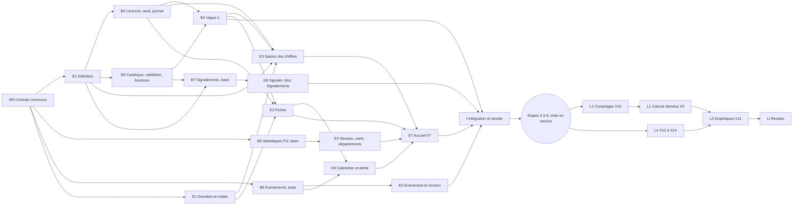

# Plan de l'étape 4 : fiche ministère, saisies, indicateurs et événements

- **Date** : 6 octobre 2026
- **Statut** : **plan approuvé le 6 octobre 2026** par la personne responsable (accord écrit,
  section 7). Les questions 1 à 14 sont répondues et approuvées ; seule la question 15 (forme et
  textes des aides contextuelles) reste ouverte, sans bloquer le code. Le signalement (T39) est
  décidé : il n'est lu que par le ministère qui l'écrit et par EJP Tech.
- **Sources** : `BRIEF.md` (sections 3, 4, 6, 7, 9 et 13), `docs/decisions.md` (P01 à P42, T01 à
  T39), `docs/conception/vague-1-decisions.md`, `docs/conception/configuration-indicateurs.md`,
  `docs/conception/validation-metier.md`, `docs/reference/maquettes/LISEZMOI.md` et le code de
  l'étape 3 (`supabase/migrations`, `src/features`, `src/data`, `src/pages`, `e2e`). Les trois
  propositions préliminaires du 6 octobre (socle des indicateurs, fiche et saisies, événements) ne
  sont pas versées au dépôt : ce plan les remplace et ne s'appuie sur aucune d'elles.
- **Règle de priorité** : là où une proposition préliminaire diffère de `vague-1-decisions.md`, ce
  document applique `vague-1-decisions.md` et le dit (section 1, « Alignements »).
- **Documents liés, écrits à part** : `docs/conception/aides-contextuelles.md` (règles et catalogue
  des aides contextuelles, T38) ; `docs/conformite/` (registre des traitements, note d'analyse des
  comptes sensibles et libellés à faire valider, remis à la coordination avant la mise en service).

## 1. Objectif et périmètre

### La ligne du BRIEF

`BRIEF.md`, section 13, étape 4 : « Fiche ministère et saisies ». Vérification : « E2E : une saisie
crée une ligne, l'historique grandit, le journal aussi (une ligne par envoi) ; EJP Tech ouvre la
liste et une fiche sans aucun bouton de saisie ».

L'étape 4 reçoit en plus, par décision du 5 et du 6 octobre : le lot 1 de la configuration des
indicateurs (T35), la validation des ajouts par EJP Tech côté base (T30), l'alerte et les mentions
sur les événements (T31, T32), et tout ce qui sert à saisir la vague 1 des indicateurs (P32 à P41,
extensions X1 à X8). Elle prévoit enfin un lot de lecture, livré dans les 4 semaines qui suivent la
mise en service (X9 à X14).

Les réponses de la personne responsable du 6 octobre 2026 ajoutent trois choses : les indicateurs
sensibles sont créés et actifs dès la vague 1, avec toutes leurs protections (P42) ; la base refuse
une nouvelle date d'événement déjà passée et une mise à jour identique à l'état actuel (T37) ; des
aides contextuelles aident à la prise en main (T38). Elle demande aussi qu'un ministère puisse
signaler une difficulté : c'est décidé (T39, question 14), et seuls ce ministère et EJP Tech lisent
le signalement.

### Dans l'étape 4 (avant la mise en service)

- **Socle des indicateurs** : natures `dimanche`, `mois` et `a_ce_jour` (pas de nature
  « activité » ni « jour ») ; unités nombre, grand nombre, euros, heure (0 à 1439) et jours (0 à
  99 999), sans unité « minutes » ; case sensible ; définition de 10 à 140 caractères ; état
  (à valider, actif, retiré) ; calculs taux et moyenne sur `indicateur_terme` (X8) ; drapeaux
  `sans_somme`, `saisi_dimanche_matin`, `libelle_sessions` (X3) ; limite de 30 lignes par fiche,
  saisis et calculs, prévus compris (X7). Les indicateurs sensibles (santé, écoute,
  accompagnement, enfants) sont créés et actifs dès la vague 1, sans aucun réglage d'activation
  (P42).
- **Lectures** : période, série, suivi (dernière valeur, mois en cours à part, somme de l'année avec
  son départ et sa complétude), calculs V1, usage pour l'administration, seuil « moins de 3 » sans
  fuite pour les sensibles (X4), journal des saisies sans valeur propre (Q16), libellés des communs
  sous le nom de la demande (X6, vue `v_commun_fiche` de B4).
- **Catalogue, validation et fonctions** (base seulement) : `private.indicateur_prevu`,
  `creer_indicateurs_prevus`, `demande_indicateur`, `validation`, `ajouter_suggestion` avec
  « Pourquoi », `valider_indicateur`, `v_a_valider`, `creer_indicateur`, `corriger_indicateur`,
  `retirer_indicateur`, `verifier_libelle`, `limites_indicateurs`. Toutes livrées et testées par
  pgTAP ; leurs écrans viennent à l'étape 6.
- **Vague 1** : 161 prévus, 41 calculs, 11 suggestions communes, libellés des communs (X1, X6), et
  le ministère Coordination de code `coordination` posé par migration (X7).
- **Statistiques FIJ par département** : table `fij_statistique`, saisie « Chiffres par département »
  et bloc de lecture du même nom sur la fiche de Coordo FIJ, lu par le berger, le conseil et EJP Tech
  (X5, P40, P32) : une saisie qu'on ne peut pas relire serait perdue.
- **Événements** : mentions (T32), alerte des événements en attente (T31), report lu dans
  l'historique, formulaire 11 et « Mettre à jour » ; refus par la base d'une nouvelle date déjà
  passée et d'une mise à jour identique à l'état actuel (T37).
- **Aides contextuelles** (T38) : un composant partagé (bouton d'aide qui ouvre une bulle au clic,
  accessible au clavier et au lecteur d'écran), posé par W0, et les aides de chaque écran, posées
  par le lot de l'écran ; règles et textes dans `docs/conception/aides-contextuelles.md`.
- **Signaler une difficulté** (T39, décidé, question 14) : tables
  `signalement` et `signalement_suivi` en ajout seulement, fonctions `signaler_difficulte` et
  `clore_signalement`, lien en bas de chaque formulaire de saisie, page `/signaler` et bloc
  « Signalements » sur l'accueil d'EJP Tech (Modération).
- **Écrans** : fiche 04 et 12, liste `/ministeres`, accueil du ministère 07 (T18), saisie du
  dimanche 08, « Chiffres du mois », saisie d'une session 09, carte des FIJ, « Chiffres par
  département », événement 11, prochaine réunion, calendrier, bloc « Événements à confirmer »,
  « Signaler une difficulté » et bloc « Signalements », tous avec leurs états vides (T36) et leurs
  aides contextuelles (T38).

### Hors de l'étape 4

| Sujet                                                                                                                                   | Où                                                    |
| --------------------------------------------------------------------------------------------------------------------------------------- | ----------------------------------------------------- |
| Écran Indicateurs (`/indicateurs`, `/indicateurs/:id`), bouton « Créer », bloc « À valider », panneaux corriger, retirer, remplacer     | étape 6 (configuration, section 9 ; validation, 7)    |
| « Mes indicateurs » (`/ma-fiche/indicateurs`), suggestions et champ « Pourquoi cet indicateur ? »                                       | étape 6, avant la mise en service (Q8)                |
| Nouveau point, « Changer le statut », « Marquer traité » (dont les points de départ de Production et d'Entretien)                       | étape 5 (T19)                                         |
| Écran Journal et journal technique                                                                                                      | étape 6                                               |
| Bouton « Masquer le texte » sur un signalement (la fenêtre de masquage de l'écran Modération ; la base est livrée par B7)               | étape 6                                               |
| Confirmation « Vérifiez ce chiffre » (`chiffres_inhabituels`)                                                                           | après la mise en service, avant le 5e dimanche (V8)   |
| Lot 2 de la configuration (comptes écrits par les ministères, correction du nom par le ministère, 3 ajouts par 30 jours, mots refusés)  | après la mise en service                              |
| Lot de lecture X9 à X14 (calculs étendus, comptages d'événements, graphiques, courbes de fin de mois, série de l'église, sessions lues) | dans les 4 semaines après la mise en service (lots L) |
| Rappels par email (P31), courriel d'alerte (T31)                                                                                        | hors de l'étape, à décider à part                     |
| Indicateurs propres sur la vue de l'église                                                                                              | jamais (K12, P39)                                     |

### Alignements sur `vague-1-decisions.md`

Ce que ce plan change dans les propositions préliminaires du 6 octobre (non versées au dépôt : chaque cellule de droite se suffit à elle-même), et pourquoi.

| Proposition préliminaire                                                                       | Ce plan                                                                                                                                                                                                                                                                                                                                                     | Source        |
| ---------------------------------------------------------------------------------------------- | ----------------------------------------------------------------------------------------------------------------------------------------------------------------------------------------------------------------------------------------------------------------------------------------------------------------------------------------------------------- | ------------- |
| 4a : unités minutes et heures, jours plafonnés à 9 999                                         | unités heure (0 à 1439) et jours (0 à 99 999) seulement                                                                                                                                                                                                                                                                                                     | Q4, K22a, X2  |
| 4a : `haut_id` et `bas_id` ; calculs `rapport`, `somme_annee`, `evenements`, `graphique`       | `indicateur_terme` figé à la création ; en V1, taux et moyenne seulement ; somme de l'année automatique                                                                                                                                                                                                                                                     | X8, X9        |
| 4a et 4b : 12 indicateurs par fiche                                                            | 30 lignes par fiche, saisis et calculs, prévus compris ; 3 ajouts d'un ministère au lot 1                                                                                                                                                                                                                                                                   | K13a, Q2, X7  |
| 4a : lignes brutes sensibles lisibles par l'API, pas de seuil en V1                            | seuil « moins de 3 » sans fuite, lignes brutes au seul ministère, export hors API                                                                                                                                                                                                                                                                           | K5c, Q9, X4   |
| 4a : aucun indicateur en euros ; catalogue de prévus vide d'abord                              | 4 indicateurs en euros ; catalogue complet de 161 prévus dès la vague 1                                                                                                                                                                                                                                                                                     | K6a, X1       |
| 4a : demandes de la coordination parmi les suggestions possibles                               | toute demande de la coordination est un prévu, jamais une suggestion ; 11 suggestions communes seulement                                                                                                                                                                                                                                                    | Q18, P41      |
| 4a et 4b : `public.indicateur_serie`, tables `graphique` et `graphique_serie` dans `public`    | `private.graphique_prevu` et `private.graphique_serie`, changées par migration, **écrites par L3 et non par la migration de la vague 1** : écart à X11 et P39, sans perte, car les déclarations ne lisent que des saisies et le schéma des séries (indicateur, calcul, comptage, rubrique FIJ, série de l'église) n'existe pas avant L2 et L4 (question 13) | X11, P39      |
| 4b et 4c : comptages d'événements à l'étape 4, par ministère porteur seulement                 | comptages livrés dans les 4 semaines après la mise en service, totaux de l'église lus par Coordination                                                                                                                                                                                                                                                      | K11, P38, X10 |
| 4c : `alter type statut_evenement add value 'reporte'` (M4)                                    | abandonnée : « reporté » se lit dans l'historique                                                                                                                                                                                                                                                                                                           | K10b          |
| 4a et 4b : « Mes indicateurs » et écran Indicateurs à l'étape 4                                | étape 6 ; l'étape 4 livre et teste les fonctions                                                                                                                                                                                                                                                                                                            | Q8, config 9  |
| 4a : « Aucun ajout à valider. » ; 4b : « Ce ministère ne suit pas encore d'indicateur à lui. » | textes retenus de `LISEZMOI.md` (« Rien à valider... », « Aucun indicateur pour Protocole... »)                                                                                                                                                                                                                                                             | T36           |
| aucun plan : statistiques FIJ par département                                                  | lot B5 (base), saisie et bloc de lecture « Chiffres par département » de E4, avant la mise en service                                                                                                                                                                                                                                                       | K47a, X5, P40 |
| aucun plan : saisie d'une session 09 et carte des FIJ                                          | lot E4 (« Saisies » de l'étape 4, BRIEF section 9)                                                                                                                                                                                                                                                                                                          | BRIEF 9 et 13 |
| 4a et 4c : deux dossiers de jeux d'exemple (`seed/` et `seeds/`)                               | un seul dossier `supabase/seed/`, fichiers numérotés                                                                                                                                                                                                                                                                                                        | ce plan       |

## 2. Ordre des lots et parallélisme

### Les lots

| Lot | Nom                                                                  | Moment                   | Effort (jours) |
| --- | -------------------------------------------------------------------- | ------------------------ | -------------- |
| W0  | Contrats communs, dont le composant des aides contextuelles (T38)    | avant tout, seul         | 3,5            |
| B1  | Définition des indicateurs (X2, X3, X7, X8), sensibles actifs (P42)  | avant la mise en service | 3,25           |
| B2  | Lectures, seuil des sensibles et journal des saisies (X4)            | avant                    | 4              |
| B3  | Catalogue, validation et fonctions de configuration                  | avant                    | 3,5            |
| B4  | Vague 1 : prévus, calculs, suggestions, communs (X1, X6)             | avant                    | 2,5            |
| B5  | Statistiques FIJ par département, base (X5)                          | avant                    | 2              |
| B6  | Événements, base : mentions, alerte, report, refus des dates (T37)   | avant                    | 2              |
| B7  | Signalements, base (T39, décidé)                                     | avant                    | 1,5            |
| E1  | Données et métier des indicateurs                                    | avant                    | 1              |
| E2  | Fiches 04 et 12, liste des ministères                                | avant                    | 3,25           |
| E3  | Saisies des chiffres : dimanche et mois                              | avant                    | 2,75           |
| E4  | Saisies de session, de la carte des FIJ et par département           | avant                    | 3,75           |
| E5  | Saisies d'événement et de réunion                                    | avant                    | 2,25           |
| E6  | Calendrier, prochaine réunion et alerte                              | avant                    | 2,75           |
| E7  | Accueil du ministère 07                                              | avant                    | 2,25           |
| E8  | Signaler une difficulté et bloc « Signalements » (T39, décidé)       | avant                    | 1,5            |
| I   | Intégration, recette, captures, revues                               | avant                    | 3              |
| L1  | Calculs étendus (X9)                                                 | 4 semaines après         | 3              |
| L2  | Comptages d'événements (X10)                                         | 4 semaines après         | 2,5            |
| L3  | Graphiques déclarés (X11)                                            | 4 semaines après         | 2,5            |
| L4  | Courbes de fin de mois, série de l'église, sessions lues (X12 à X14) | 4 semaines après         | 1,25           |
| LI  | Recette du lot de lecture                                            | 4 semaines après         | 1              |

Avant la mise en service : **44,75 jours de travail**, environ **19,25 jours de calendrier** avec
quatre worktrees au plus, soit **23 jours avec une marge de 20 %** pour les reprises entre les vagues
(la base ne se teste qu'en CI, au retour lent). Lot de lecture : **10,25 jours de travail**, environ
**9 jours de calendrier**. W0 est seul sur le chemin critique : son estimation est de 3,5 jours
parce qu'il livre le contrat, la migration, les contrôles génériques, l'aide de matrice, le projet
d'écriture de Playwright, les types, les routes, les briques partagées (dont le composant des aides
contextuelles et le lien « Signaler une difficulté ») et leurs tests.

Écarts avec la première version du plan (39 jours, 17,5 jours de calendrier), après les réponses
du 6 octobre :

| Changement                                                                                                          | Lots                 | Jours      |
| ------------------------------------------------------------------------------------------------------------------- | -------------------- | ---------- |
| Aides contextuelles : composant, catalogue des textes, tests et parcours `e2e/aide.spec.ts` (T38)                   | W0                   | + 1        |
| Aides contextuelles : pose et tests sur chaque écran (T38)                                                          | E2 à E7, 0,25 chacun | + 1,5      |
| Sensibles actifs dès la vague 1 : plus de table `private.reglage` (P42)                                             | B1                   | − 0,25     |
| Signaler une difficulté, base et écrans (T39, décidé)                                                               | B7, E8               | + 3        |
| Aides de la vue de l'église (écrans de l'étape 3), recette des aides et des signalements, report des textes validés | I                    | + 0,5      |
| **Total**                                                                                                           |                      | **+ 5,75** |

L'estimation du composant suit `docs/conception/aides-contextuelles.md` (section 9 : environ 1 jour
en W0) ; la pose par écran y est estimée à 0,5 jour en tout, ce plan compte 0,25 jour par lot
parce que chaque lot teste aussi ses aides au clavier et dans l'audit axe. Le signalement étant
décidé, ses 3 jours sont dans le total (sans lui : 41,75 jours de travail, même calendrier).

### Dépendances

Une flèche dit « fusionné avant » : le lot suivant peut s'écrire plus tôt contre les contrats de W0
et `src/test/fauxSupabase.ts`, mais il n'est fusionné qu'après ses prédécesseurs, parce que sa CI
(jobs « base » et « e2e ») a besoin de leurs migrations.

### Ce qui tourne en parallèle

Chaque lot vit dans un worktree (`../pilotage-ejp-<lot>`), sur une branche `etape-4-<lot>` partie de
la branche d'étape `etape-4`, et ne touche que ses propres fichiers (section 3, « Propriété des
fichiers »). Les fusions se font sans avance rapide dans `etape-4`, dans l'ordre des vagues.

| Vague | Worktrees en parallèle | Calendrier | Pourquoi ensemble                                                                                                                      |
| ----- | ---------------------- | ---------- | -------------------------------------------------------------------------------------------------------------------------------------- |
| 1     | W0 seul                | 3,5 jours  | il écrit tous les fichiers partagés, dont le composant des aides contextuelles                                                         |
| 2     | B1, B5, B6, E1         | 3,25 jours | trois migrations sans objet commun, plus le métier pur                                                                                 |
| 3     | B2, B3, E4, E5         | 4 jours    | B2 et B3 lisent B1 sans se lire ; E4 et E5 ont leur base (B5, B6)                                                                      |
| 4     | B4, E2, E3, E6         | 3,25 jours | B4 a B2 et B3 ; les écrans ont leurs lectures                                                                                          |
| 5     | E7, B7, E8             | 2,25 jours | E7 consomme les lignes de « Vos saisies » de E3, E4 et E6 ; B7 a B1 (`verifier_texte`) et B3 (`masquer_texte`), E8 est fusionné sur B7 |
| 6     | I                      | 3 jours    | il rétablit les listes exhaustives, pose les aides de la vue de l'église et lance la recette                                           |

Quatre worktrees au plus en même temps : c'est la limite de relecture de la personne responsable,
pas une limite technique. Ce qui **ne peut pas** tourner en parallèle : deux lots qui écrivent la
même fonction ou la même vue (réglé par la propriété unique ci-dessous), B4 avant B2 et B3, et B7
avant la fusion de B3 (B7 reprend `masquer_texte` après lui).

La vague 4 reste faisable avec les arêtes B4 vers E2 et E3 : les quatre lots s'écrivent en même
temps, mais B4 (2,5 jours, le plus court des trois lots longs) est fusionné en premier, puis E2 et E3
(3,25 et 2,75 jours) se fusionnent sur lui, parce que la fiche lit les libellés des communs de B4 et
que les parcours de E2 et E3 ont besoin du jeu d'exemple `seed/40` (un sensible à 2). E3 est aussi
fusionné après B2 (`v_mesure_periode` pour « Déjà saisi » et « Vos saisies »), déjà fusionné en
vague 3. E6 n'attend que B6 et E2.

La vague 5 suit le même principe : E8 s'écrit en même temps que B7 contre les contrats de W0, puis
se fusionne sur lui. Le lien « Signaler une difficulté » en bas de chaque formulaire est une brique
de W0 que E3, E4 et E5 posent sans attendre B7 : tant que E8 n'est pas fusionné, il mène à la page
amorce de `/signaler`.

## 3. Contrats communs à fixer d'abord (W0)

W0 tourne seul, dans `etape-4`, et rien ne part avant sa fusion. Il écrit tous les fichiers que
plusieurs lots toucheraient, puis ces fichiers sont figés jusqu'au lot I.

### Ce que W0 écrit

1. **`docs/conception/contrat-etape-4.md`** : colonnes et types de chaque vue et fonction nouvelle
   (section 4), routes, emplacements, codes de journal, horodatages et jeux d'exemple ci-dessous.
2. **Migration `20261007090000_contrats_etape_4.sql`** : réécrit une seule fois les `check` de
   `journal.action`, `journal.cible` et `moderation.cible`, **et la contrainte des couples (cible,
   champ) de `moderation`** (`20260930163150_types_et_tables.sql`, l. 199 à 203), avec l'union de
   tous les codes de l'étape 4 (recommandation de la section 7, question 3). Nouveaux codes
   d'action : `indicateur_cree`, `indicateurs_prevus_crees`, `indicateur_corrige`,
   `indicateur_valide`, `indicateur_refuse`, `indicateur_retire`, `fij_statistiques_saisies`
   (union des lots 1 de `configuration-indicateurs.md` 5.10 et de `validation-metier.md` 2.7 ; les
   codes du lot 2, `indicateur_correction_demandee` et `indicateur_officiel`, n'y sont pas).
   Nouvelle cible de journal : `indicateur` (`ministere` existe déjà). Nouvelles cibles de
   modération : `demande_indicateur` et `validation`, avec les deux couples nouveaux
   (`demande_indicateur`, `pourquoi`) et (`validation`, `motif`) ajoutés aux sept couples actuels.
   **Signalement (T39, décidé)** : codes d'action `difficulte_signalee` et `signalement_clos`,
   cible de journal `signalement`, cibles de modération `signalement` et `signalement_suivi` avec
   les couples (`signalement`, `texte`) et (`signalement_suivi`, `commentaire`).
   Un test pgTAP de W0 insère une ligne de `moderation` pour chaque couple et vérifie la liste des
   codes et des cibles contre ces documents. Aucun lot ne retouche ces contraintes.
3. **`supabase/config.toml`** : `sql_paths = ["./seed.sql", "./seed/*.sql"]`, vérifié en CI par W0
   (ordre lexical des fichiers).
4. **Types** : `src/lib/base.ts` devient un point d'entrée qui réexporte `src/lib/base/communs.ts`
   (le contenu actuel), `indicateurs.ts`, `fiche.ts`, `fij.ts`, `evenements.ts` et
   `signalements.ts`. Chaque lot ne
   remplit que son fichier. Les types restent écrits à la main (Docker absent du poste).
5. **Routes et pages amorces** : `src/features/navigation/profils.ts`, `src/app/routes.tsx` et
   `src/pages/PageApplication.tsx` déclarent une fois toutes les adresses de la section 4 et les
   aperçus `/apercu/fiche`, `/apercu/saisies`, `/apercu/evenements`. Chaque adresse pointe vers un
   fichier de page amorce (`src/pages/PageMaFiche.tsx`, `PageFicheMinistere.tsx`,
   `PageMinisteres.tsx`, `PageSaisieDimanche.tsx`, `PageSaisieMois.tsx`, `PageSaisieSession.tsx`,
   `PageSaisieFij.tsx`, `PageSaisieFijStatistiques.tsx`, `PageSaisieEvenement.tsx`,
   `PageSaisieReunion.tsx`, `PageSignalement.tsx`) que son lot remplace. La page `/moderation`
   d'EJP Tech, encore « à venir » jusqu'à l'étape 6, gagne un emplacement `BlocSignalements.tsx`
   (amorce qui ne rend rien, que E8 remplit) au-dessus du message « à venir ».
6. **Briques partagées** : `src/components/etats/EtatVide.tsx` (type des six situations de T36 :
   premier usage, en attente des autres, tout est fait, aucun résultat, pas pour ce profil, problème
   passager ; au plus une action, montrée au seul profil qui peut agir) ;
   `src/features/saisie/PanneauSaisie.tsx` (page entière sous 600 px, panneau de 460 px au-delà),
   `ChampNombre.tsx`, `RappelDonneesPersonnelles.tsx`, `Compteur.tsx`, `ErreurFormulaire.tsx`,
   `MessageReussite.tsx` ; `src/lib/metier/unites.ts` (« 5 164 € », « 10 h 42 », « 3 jours »,
   « moins de 3 ») et `src/lib/metier/periodes.ts` (« Septembre 2026 », « Octobre en cours »,
   « Depuis juillet », mois proposés à partir de `v_semaine.aujourdhui`), avec leurs tests.
   **Aides contextuelles (T38)**, telles que `docs/conception/aides-contextuelles.md` les décrit
   (sections 3 à 5) : `src/components/aide/Aide.tsx` (une « toggletip » : bouton d'aide juste
   après le libellé, nom accessible « Aide : <libellé> », bulle ouverte au clic, à Entrée ou à
   Espace, jamais au seul survol, fermée à Échap, au clic en dehors et au second clic, cible de
   44 px, 280 px de large au plus, couleurs par les tokens), `LibelleAvecAide.tsx` (la ligne
   libellé et aide des formulaires) et `textesAide.ts`, qui reçoit **une fois** tous les textes du
   catalogue, pour qu'aucun lot ne retouche ce fichier avant I ; leurs tests (`Aide.test.tsx`,
   `textesAide.test.ts`) et `e2e/aide.spec.ts` sur les aperçus. Une aide complète un libellé,
   elle ne remplace jamais une information nécessaire à la saisie. **Signalement (T39,
   décidé)** : `src/features/signalement/LienSignalement.tsx` (« Signaler une
   difficulté », lien vers `/signaler?ecran=<code>`), que chaque formulaire de saisie pose en bas,
   sous ses boutons ; textes de la section 7 de `aides-contextuelles.md`.
7. **Emplacements** : `src/features/fiche/emplacements.tsx` (blocs calendrier, réunion, statistiques
   FIJ, puis comptages et graphiques du lot de lecture, chacun dans son fichier amorce qui ne rend
   rien ; l'amorce des statistiques FIJ est `ChiffresParDepartement.tsx`, que E4 remplit) ; `src/features/accueil-ministere/types.ts` (`LigneVosSaisies` : `cle`, `libelle`, `etat`,
   `detail`, `action`) et les fichiers amorces `lignesChiffres.ts` (E3), `lignesSessions.ts` et
   `lignesFij.ts` (E4), `lignesReunion.ts` et `lignesEvenements.ts` (E6) ; deux emplacements dans
   `GrilleCetteSemaine.tsx` (« Vos points » pour E7, « Événements à confirmer » pour E6), pour qu'un
   seul lot touche ce fichier.
8. **Tests partagés** : `supabase/tests/structure.test.sql` passe des listes exhaustives aux
   contrôles génériques, car plusieurs listes casseraient dès la vague 2 : `tables_are` et
   `views_are`, les politiques d'ajout (cinq tables), `table_privs_are` sur 16 tables, « les 9
   fonctions de l'API et elles seules » et « `exige_aal2` en tête » limité à ces 9 noms. Les
   contrôles génériques sont : RLS active et politique restrictive `aal2` sur toute table ; aucun
   droit pour `anon` ; aucun `update`, `delete` ni `truncate` pour `authenticated` ; aucun GRANT
   `insert` hors des tables de la matrice (liste écrite en données) ; aucun droit d'`authenticated`
   ni d'`anon` sur les tables de `private` ; toute fonction `public` est en `security invoker` et
   appelle sa partie `private` ; toute fonction `private` en `security definer`, exécutable par
   `authenticated` et appelée par une fonction `public`, commence par l'appel de
   `private.exige_aal2()` ; toute fonction `private` en `security definer` qui sert une vue
   (`returns table`) contrôle `aal2` dans son jeton, comme `tableau_ministeres`. Le contrôle des
   fonctions couvre donc les quelque 20 fonctions nouvelles dès leur lot, et non au lot I. Le lot I
   rétablit les listes exhaustives avec tous les objets de l'étape. `000-outils.test.sql` gagne une
   aide qui parcourt une matrice des droits écrite en données (profil, objet, action, `aal1` ou
   `aal2`, attendu), que chaque lot de base alimente de ses lignes.
9. **Playwright** : `playwright.config.ts` gagne le projet `ecritures` (voir les règles communes de
   la section 4) et le `testIgnore` des projets de lecture ; W0 est seul à toucher ce fichier.

### Horodatages réservés des migrations

Chaque lot crée sa migration directement sous son nom réservé (Write), après la dernière migration
suivie (`20261005172228`). Une migration fusionnée est figée : une correction passe par une
nouvelle migration du même lot, **horodatée après la dernière migration déjà fusionnée dans
`etape-4`** (comme les lots L), jamais dans sa plage réservée : une correction placée avant des
migrations déjà appliquées (préproduction, ou base locale d'un autre worktree) serait refusée par
`db push` sans `--include-all` et rejouerait dans un autre ordre que l'ordre réel. Les plages
réservées ne servent qu'à la première écriture d'un lot.

| Lot | Fichiers (dans l'ordre d'application)                                                                                             |
| --- | --------------------------------------------------------------------------------------------------------------------------------- |
| W0  | `20261007090000_contrats_etape_4.sql`                                                                                             |
| B1  | `20261007100000_indicateurs_definition.sql`, `20261007100500_indicateurs_lexique.sql`                                             |
| B5  | `20261007110000_fij_statistique.sql`                                                                                              |
| B6  | `20261007120000_evenements_mentions.sql`, `20261007120500_evenements_alerte_report.sql`                                           |
| B2  | `20261008100000_indicateurs_lectures.sql`, `20261008100500_indicateurs_seuil_sensibles.sql`, `20261008101000_journal_mesures.sql` |
| B3  | `20261008110000_validation_indicateurs.sql`, `20261008110500_indicateurs_fonctions.sql`                                           |
| B4  | `20261009100000_indicateurs_vague_1.sql`                                                                                          |
| B7  | `20261009110000_signalements.sql`                                                                                                 |
| L   | horodatage réel du jour de création, après la dernière migration passée en production ; ordre L2, L4, L1, L3                      |

B2 et B3 ne se lisent pas : `attente_jours` de `v_indicateur_suivi` se calcule sur
`indicateur.cree_le` et `indicateur.etat` (B1), pas sur `demande_indicateur` (B3).

### Jeux d'exemple

| Fichier                                 | Lot | Contenu                                                                                                                                                                                                                                                                                                       |
| --------------------------------------- | --- | ------------------------------------------------------------------------------------------------------------------------------------------------------------------------------------------------------------------------------------------------------------------------------------------------------------- |
| `supabase/seed.sql`                     | B1  | définition de « Visuels livrés ce mois » ; reprise du ministère Coordination créé par la migration (comme FIJ)                                                                                                                                                                                                |
| `supabase/seed/40-indicateurs.sql`      | B4  | prévus créés pour les ministères d'exemple, sensibles compris, actifs dès leur création comme les autres (P42) ; une valeur par unité ; un sensible (1, 2 et 0, dont un sensible à 2 pour le parcours « moins de 3 ») ; un ajout à valider, un validé, un refusé ; un retiré avec saisies ; mois et dimanches |
| `supabase/seed/41-fij-statistiques.sql` | B5  | deux semaines des 4 rubriques, une semaine incomplète (« 6 dép. sur 8 »)                                                                                                                                                                                                                                      |
| `supabase/seed/42-evenements.sql`       | B6  | « Réunion des responsables » (Coordination, en attente, reporté, @Communication), décalage de semaines recalculé                                                                                                                                                                                              |
| `supabase/seed/43-signalements.sql`     | B7  | deux signalements de Communication, sans aucune donnée personnelle : un ouvert sur la saisie d'un événement, un clos avec un commentaire d'EJP Tech                                                                                                                                                           |

`jeu-exemple.test.sql` n'est touché que par B6 (11 puis 12 événements) et B2 (ligne de journal de
Communication, l. 104). Les signalements du jeu d'exemple ne passent pas par le journal (insertion
directe sous `pilotage.migration`, comme les autres jeux), pour ne pas changer la fraîcheur que
vérifient les tests de l'étape 3.

### Propriété des fichiers après W0

| Fichier ou objet partagé                                                                                                      | Seul lot qui l'écrit                         |
| ----------------------------------------------------------------------------------------------------------------------------- | -------------------------------------------- |
| `private.journaliser_mesures`, `private.journal_lisible_administration`                                                       | B2                                           |
| `v_journal` (cible `indicateur`), `masquer_texte` (couples des indicateurs)                                                   | B3                                           |
| `masquer_texte` (couples des signalements, repris après B3), `private.tableau_ministeres()` (fraîcheur sans les signalements) | B7                                           |
| `src/components/aide/*` (`Aide.tsx`, `LibelleAvecAide.tsx`, `textesAide.ts`), `LienSignalement.tsx`                           | W0 puis I                                    |
| `private.journaliser_evenements`, `v_evenement`, politique de `evenement`                                                     | B6                                           |
| `private.controler_mesure`, `private.controler_indicateur`, politique d'ajout de `mesure`                                     | B1                                           |
| politiques de lecture de `indicateur` et `indicateur_terme` (Q3)                                                              | B1                                           |
| politique de lecture de `mesure` (lignes sensibles, retirés pour confidentialité)                                             | B2                                           |
| `v_commun_fiche` et `private.communs_de_fiche()` (libellés des communs)                                                       | B4                                           |
| `playwright.config.ts`                                                                                                        | W0                                           |
| `src/pages/PageConfidentialite.tsx` (texte K56, signalements)                                                                 | I                                            |
| `audit.test.sql`, tests `rls-chiffres-*` (colonne `definition`)                                                               | B1 (`rls-chiffres-*`), B2 (`audit.test.sql`) |
| `src/features/cette-semaine/*` hors emplacements                                                                              | E7                                           |
| `structure.test.sql` (listes exhaustives), `LISEZMOI.md`, `BRIEF.md`, `docs/decisions.md`                                     | W0 puis I                                    |

## 4. Les lots

Règles communes à tous les lots, vérifiées par `rls-auditor` :

- ajout seulement : aucun GRANT `update`, `delete` ni `truncate` ; triggers d'inaltérabilité sur
  `indicateur_terme`, `demande_indicateur`, `validation`, `fij_statistique`, `evenement_mention`,
  `signalement` et `signalement_suivi` (seule exception :
  `masquer_texte`, sous `pilotage.masquage`) ; `saisi_le` et `saisi_par` posés
  par `forcer_auteur` ;
- RLS active, politique restrictive `aal2` sur chaque table nouvelle, GRANT explicites, rien pour
  `anon` ; `private.exige_aal2()` en tête de chaque fonction de l'API ; `security definer`
  seulement dans `private`, avec `set search_path = ''`, appelée par une fonction `public` en
  `security invoker` ; vues `with (security_invoker = true)` ;
- dates par `private.aujourdhui()`, `private.dimanche_reference()` et `v_semaine`, jamais
  `current_date` ni la date du navigateur ;
- journal : une ligne par envoi, jamais un texte libre, un email, un libellé, une valeur propre ou
  une valeur sensible ; les chiffres communs gardent leur valeur ;
- **EJP Tech lit tout et ne saisit rien** : aucune politique d'ajout et aucune fonction de saisie
  ne l'accepte (`mesure`, `fij_statistique`, `participation`, `evenement`, `evenement_etat`,
  `reunion`, `signalement`) ; ses écrans n'ont aucun bouton de saisie (`enLectureSeule`) ; seules
  la validation des ajouts, la configuration sur demande écrite (Q13), la modération et la
  clôture des signalements (`clore_signalement`) lui sont ouvertes ;
- textes : français simple, aucun tiret cadratin ni demi-cadratin, un rappel sur les données
  personnelles sous le premier champ libre de chaque formulaire (nom de l'événement, objet de la
  réunion, texte du signalement), sauf le champ « Pourquoi cet indicateur ? » qui n'en a jamais
  (T30) ; 80 caractères pour un nom ou un objet, 280 pour un « Pourquoi », un motif ou un
  signalement ;
- **aides contextuelles (T38)** : chaque écran pose les aides que lui donne
  `docs/conception/aides-contextuelles.md`, par les composants `Aide` et `LibelleAvecAide` de W0
  et les textes de `textesAide.ts`, jamais un texte écrit dans le composant de l'écran ; une aide de
  plus ou de moins passe par ce document ; chaque lot teste ses aides au clavier et dans l'audit axe ;
- tout total avec sa complétude ; jamais un 0 pour une absence ;
- **parcours Playwright qui écrivent** (E3, E4, E5, E6) : les parcours de l'étape 3 vérifient des
  chiffres du jeu d'exemple (« 58 », « selon 6 ministères sur 8 », « 29 FIJ », chiffres du dimanche
  de référence de Communication), les projets tournent en parallèle (`fullyParallel`) et rien ne
  remet la base à zéro entre deux tests. Tout parcours qui écrit porte donc le suffixe
  `.ecriture.spec.ts` et tourne dans un projet Playwright **`ecritures`**, en série (un seul
  worker), à 1440 px, qui dépend des trois projets de lecture (`ordinateur`, `tablette`,
  `telephone`) et ne démarre qu'après eux ; les projets de lecture l'ignorent (`testIgnore`). Les
  écrits utilisent un événement créé par le test et un nom suffixé ; la méthode « comptes avant et
  après » reste, mais elle ne sert plus à protéger les autres tests. Les captures (`@captures`) ne
  passent que par les aperçus, sans écriture ;
- **indicateurs sensibles (K56, P42)** : créés et actifs dès la vague 1, comme tout indicateur de
  la coordination, sans aucun réglage d'activation. Toutes leurs protections restent et chaque lot
  qui les touche les teste : seuls des totaux de mois écoulés, jamais le mois en cours (B1) ;
  « moins de 3 » pour 1 et 2 au berger, au conseil et à EJP Tech, sans fuite par différence (B2) ;
  lignes brutes lisibles par le seul ministère qui les saisit (B2) ; jamais source d'un calcul
  (B1, B3) ; jamais sur la vue de l'église ni dans un graphique (B2, L3) ; journal sans valeur
  (B2) ; mention sur la page Confidentialité (I).

### Matrice des droits des objets nouveaux

Référence des tests pgTAP en données. Profils : ministère (un ministère porteur, un ministère
mentionné ou autre, le ministère `fij`, le ministère `coordination`), berger, conseil,
administration de l'église, EJP Tech, session `aal1`, anonyme. « L » lire, « A » ajouter.

| Objet                                                                                       | Ministère                                                             | Berger, conseil                        | Administration                                                        | EJP Tech                           | `aal1`, anonyme |
| ------------------------------------------------------------------------------------------- | --------------------------------------------------------------------- | -------------------------------------- | --------------------------------------------------------------------- | ---------------------------------- | --------------- |
| `indicateur`, `indicateur_terme`                                                            | L des communs et des siens (Q3)                                       | L tous, ajouts à valider compris       | L tous (définitions)                                                  | L tous                             | rien            |
| `mesure` (lecture)                                                                          | L des communs de tous et des siens, sensibles compris                 | L, sauf lignes sensibles               | L des communs seulement                                               | comme le berger                    | rien            |
| `mesure` (ajout)                                                                            | A le sien : actif ou à valider, non calculé, mois clos si sensible    | rien                                   | rien                                                                  | rien                               | rien            |
| `v_mesure_periode`, `v_indicateur_serie`, `v_indicateur_suivi`, `v_calcul`                  | valeurs exactes des siens                                             | seuil « moins de 3 » sur les sensibles | lignes sans valeur, sauf communs                                      | comme le berger                    | rien            |
| `v_usage_indicateurs`                                                                       | rien                                                                  | rien                                   | L                                                                     | L                                  | rien            |
| `demande_indicateur`                                                                        | L les siennes                                                         | rien                                   | rien                                                                  | L                                  | rien            |
| `validation`                                                                                | L les siennes                                                         | L                                      | L                                                                     | L                                  | rien            |
| `v_a_valider`                                                                               | rien                                                                  | rien                                   | rien                                                                  | L                                  | rien            |
| `valider_indicateur`                                                                        | refusé                                                                | refusé                                 | refusé                                                                | oui                                | refusé          |
| `creer_indicateurs_prevus`, `creer_indicateur`, `corriger_indicateur`, `retirer_indicateur` | refusé                                                                | refusé                                 | oui                                                                   | oui                                | refusé          |
| `ajouter_suggestion`                                                                        | sa fiche, « Pourquoi » obligatoire                                    | refusé                                 | oui                                                                   | oui                                | refusé          |
| `limites_indicateurs`, `verifier_libelle`                                                   | sa fiche                                                              | refusé                                 | toute fiche                                                           | toute fiche                        | refusé          |
| `fij_statistique`, `v_fij_statistique`                                                      | L et A (par `saisir_fij_statistiques`) si `fij` ; rien sinon          | L                                      | rien                                                                  | L                                  | rien            |
| `evenement`, `evenement_etat`                                                               | L et A les siens ; L de ceux qui le mentionnent                       | L                                      | rien                                                                  | L                                  | rien            |
| `evenement_mention`                                                                         | L des siens et de ceux qui le mentionnent ; A par `ajouter_evenement` | L                                      | rien                                                                  | L                                  | rien            |
| `v_evenement` (`jours`, `a_confirmer`, `reporte_du`)                                        | siens et mentionnés                                                   | tous                                   | rien                                                                  | tous                               | rien            |
| `journal` (codes nouveaux)                                                                  | lignes de sa fiche                                                    | toutes                                 | `mesure_saisie` et `indicateur_*`, sans valeur ; ni FIJ ni événements | toutes                             | rien            |
| `moderation` (couples nouveaux)                                                             | rien                                                                  | rien                                   | rien                                                                  | L et masquage                      | rien            |
| `creer_calcul`                                                                              | refusé                                                                | refusé                                 | oui                                                                   | oui                                | refusé          |
| `v_commun_fiche` (libellé de la demande par commun, lignes de référence de MDS)             | les siens seulement                                                   | tous                                   | rien                                                                  | tous                               | rien            |
| `private.indicateur_prevu`, `private.libelle_commun`, `private.fij_rubrique`                | rien                                                                  | rien                                   | rien                                                                  | rien                               | rien            |
| `signalement` (T39, décidé)                                                                 | L les siens ; A par `signaler_difficulte`                             | rien                                   | rien                                                                  | L tous                             | rien            |
| `signalement_suivi` (T39, décidé)                                                           | L celui de ses signalements                                           | rien                                   | rien                                                                  | L tous ; A par `clore_signalement` | rien            |
| `signaler_difficulte`                                                                       | sa fiche seulement                                                    | refusé                                 | refusé                                                                | refusé                             | refusé          |
| `clore_signalement`                                                                         | refusé                                                                | refusé                                 | refusé                                                                | oui                                | refusé          |
| Lot L : `v_evenements_mois`                                                                 | ses événements                                                        | tous                                   | rien                                                                  | tous                               | rien            |
| Lot L : `evenements_eglise_mois()`                                                          | `coordination` seulement                                              | oui                                    | refusé                                                                | oui                                | refusé          |
| Lot L : `v_graphique`, `v_stock_mois`                                                       | comme leurs sources, jamais une série sensible                        | comme leurs sources                    | rien                                                                  | comme leurs sources                | rien            |
| Lot L : `v_serie_eglise`                                                                    | L                                                                     | L                                      | L                                                                     | L                                  | rien            |

Un indicateur retiré pour confidentialité ne se lit plus par l'API, pour aucun profil, EJP Tech
compris, ni dans `mesure` ni dans aucune vue (Q11) : B2 l'écrit dans la politique de `mesure` et
dans chaque vue, et le teste pour les sept comptes. Un ministère ne lit que les définitions des
communs et des siennes, termes compris (Q3) : B1 réécrit les politiques de `indicateur` et
`indicateur_terme` (le BRIEF, section 7, lui ouvre aujourd'hui toutes les définitions).

### Adresses

| Adresse                                                                | Profils                                   | Lot |
| ---------------------------------------------------------------------- | ----------------------------------------- | --- |
| `/` (ouverture 07 pour le ministère)                                   | ministère                                 | E7  |
| `/ma-fiche`                                                            | ministère                                 | E2  |
| `/ministeres`, `/ministeres/:id`                                       | berger, conseil, EJP Tech (lecture seule) | E2  |
| `/saisir/dimanche` (`date`)                                            | ministère                                 | E3  |
| `/saisir/mois` (`mois=AAAA-MM`)                                        | ministère                                 | E3  |
| `/saisir/session/:id`                                                  | ministère                                 | E4  |
| `/saisir/fij`, `/saisir/fij-statistiques`                              | ministère `fij`                           | E4  |
| `/saisir/evenement`, `/saisir/evenement/:id`, `/saisir/reunion`        | ministère                                 | E5  |
| `/signaler` (`ecran=<code>`, T39, décidé)                              | ministère                                 | E8  |
| `/moderation` (bloc « Signalements » seulement ; le reste à l'étape 6) | EJP Tech                                  | E8  |

Une adresse réservée à un autre profil donne la page non disponible, sans aucune requête.
L'administration de l'église n'a aucune adresse nouvelle à l'étape 4.

### W0. Contrats communs (3,5 jours)

- **Fichiers et migration** : section 3. Ordre de travail : la partie base d'abord (migration,
  `structure.test.sql`, aide de matrice, `config.toml`), poussée tôt pour que la CI « base » la
  vérifie pendant qu'on écrit les types, les routes et les briques.
- **Aides contextuelles (T38, + 1 jour)** : `Aide`, `LibelleAvecAide` et `textesAide.ts`, rempli
  une fois depuis `docs/conception/aides-contextuelles.md` (textes « Proposé » tant qu'ils ne sont
  pas validés), et `LienSignalement`. W0 ne pose aucune aide sur
  un écran : chaque lot pose les siennes.
- **Écrans** : aucun ; pages amorces seulement.
- **Tests** : `structure.test.sql` en contrôles génériques ; test de la migration de contrats
  (chaque couple de `moderation`, liste des codes et des cibles) ; aide de matrice dans
  `000-outils.test.sql` ; Vitest de `unites.ts`, `periodes.ts`, `EtatVide`, `PanneauSaisie`, et
  des aides selon la section 5 de `aides-contextuelles.md` (`Aide.test.tsx` : clavier, Échap, clic
  en dehors, nom accessible ; `textesAide.test.ts` : longueur, ponctuation, interdits, aucun
  tiret cadratin) ; `e2e/aide.spec.ts` sur les aperçus ;
  `profils.test.ts` et `routes.test.tsx` (chaque adresse, ses profils, la page non disponible sans
  requête) ; projet `ecritures` de Playwright (un parcours vide d'essai) ; CI verte avec les jeux
  d'exemple chargés par `sql_paths`.

### B1. Définition des indicateurs (3,25 jours)

- **Migrations** : `20261007100000_indicateurs_definition.sql`, `20261007100500_indicateurs_lexique.sql`.
- **Contenu** :
  - colonnes de `indicateur` : nature `mois` ; `unite` (`nombre` 9 999, `grand_nombre` et `euros`
    9 999 999, `heure` 0 à 1439, `jours` 0 à 99 999) ; `definition` (10 à 140, remplie pour les
    communs) ; `sensible` (mois et nombre seulement, jamais source d'un calcul) ; `etat`
    (`en_attente`, `actif`, `retire`) ; `origine` ; `modele_code` ; `remplace_id` ; `retire_le`,
    `retrait_motif` ; drapeaux `sans_somme`, `saisi_dimanche_matin`, `libelle_sessions` (X3) ;
  - **contraintes de l'étape 3 retirées ou remplacées** (`configuration-indicateurs.md` 5.2) :
    `mesure_valeur_check` (0 à 9 999) remplacée par 0 à 9 999 999, le plafond de chaque unité étant
    vérifié par `controler_mesure` ; clé `indicateur_ministere_id_libelle_key` retirée au profit de
    `private.normaliser(text)` (immutable) et d'un index unique sur (`ministere_id`, libellé
    normalisé) hors retirés, pour qu'un remplacement garde le même nom ; `check (actif = (etat =
'actif'))` pour garder `actif` cohérent avec `etat` (la politique d'ajout lit `etat`, pas
    `actif`, pour accepter un ajout à valider) ;
  - **schéma complet des calculs, fixé ici une fois pour toutes** (question 6) : `indicateur.calcul`
    accepte `taux`, `moyenne`, `difference`, `somme` et `evolution` (les sortes de X9), le comptage
    d'événements (X10) étant une sorte de terme et non de calcul. Table `indicateur_terme` : calcul, rôle (`haut`, `bas`,
    `plus`, `moins`, `terme`), ordre, **source** (un indicateur du même ministère, ni sensible ni
    commun) **ou** code de comptage d'événements (`prevus`, `realises`, `annules`, `reportes`,
    `en_attente`, `sans_etat_final`), exactement l'un des deux (`check`), agrégat (`periode`,
    `somme_dimanches_du_mois`, `fin_de_mois`) et décalage de 0 à 3 mois ; 2 à 4 termes pour une
    somme ; écrite seulement à la création, figée, lue comme `indicateur` (X8). Les 12 calculs
    étendus s'écrivent donc par B4 sans qu'aucune migration ne remplace un indicateur déjà créé ;
    `v_calcul` (B2) ne lit que les taux et moyennes dont tous les termes sont des indicateurs, à
    agrégat `periode` et décalage 0 ; les autres restent invisibles jusqu'à L1 ;
  - politiques de lecture **réécrites** (Q3) : un ministère ne lit que les définitions et les termes
    des communs et des siens, au lieu de toutes les définitions (BRIEF, section 7, ligne
    `indicateur`) ; berger, conseil, administration et EJP Tech lisent tout ;
  - `controler_indicateur` : sens figé, aucune suppression, réglages `pilotage.validation`,
    `pilotage.masquage`, `pilotage.migration` ; **un indicateur sensible se crée et s'active comme
    les autres** (P42), quel que soit le chemin (`creer_indicateur`, `creer_indicateurs_prevus`),
    sans réglage d'activation ni table `private.reglage` ; le contrôle impose seulement sa forme :
    nature `mois`, unité `nombre`, aucun calcul, aucun drapeau `saisi_dimanche_matin`, et il
    refuse qu'un indicateur sensible soit source d'un terme de `indicateur_terme` ;
  - `controler_mesure` réécrit : plafond de l'unité ; mois au 1er seulement ; ni mois futur ni avant
    le 1er janvier de l'année précédente ; mois en cours refusé pour un sensible ; aucune saisie d'un
    calcul ; dimanche du jour accepté le dimanche matin (heure de Paris) ;
  - politique d'ajout de `mesure` : indicateur actif ou à valider, non calculé ;
  - ministère Coordination créé avec le code `coordination` s'il n'existe pas (X7), comme FIJ ;
  - `private.verifier_texte` (lexique : données personnelles, crochets, familles calcul, cumul et
    période), seule garde côté base contre les données personnelles dans le « Pourquoi », qui n'a
    pas de rappel sous son champ (T30).
- **Écrans** : aucun.
- **Tests pgTAP** : `indicateurs-definition.test.sql` (structure, sens figé, aucune suppression,
  unicité du libellé normalisé et remplacement sous le même nom, `actif` lié à `etat`, drapeaux,
  termes figés, **les 12 calculs étendus s'écrivent et se figent** : une différence, une somme de 2
  à 4 termes, une évolution, un agrégat « somme des dimanches du mois », un décalage de 0 à 3, un
  terme « comptage d'événements » sans source, une source sensible ou commune refusée, une
  définition de terme à la fois source et comptage refusée ; politiques de lecture : un autre
  ministère ne lit ni la définition ni les termes d'un indicateur propre, mais lit ceux d'un
  commun) ; `indicateurs-saisies.test.sql` (plafond par unité, heure 1439 et 1440, jours 99 999 et
  100 000, euros à 9 999 999 accepté et à 10 000 000 refusé, 15 du mois, mois futur, avant janvier
  N-1, mois en cours d'un sensible, bascule du 31 octobre à 23 h 30 UTC, dimanche matin, calcul
  refusé par le trigger et la politique, EJP Tech refusé) ; `indicateurs-sensibles.test.sql`
  (un sensible créé par `creer_indicateur` et par `creer_indicateurs_prevus` est actif dès sa
  création et se saisit pour le dernier mois écoulé ; nature autre que `mois`, unité autre que
  `nombre`, calcul sensible et terme dont la source est sensible refusés ; mois en cours refusé ;
  aucune table ni aucun réglage d'activation n'existe) ; **`indicateurs-lexique.test.sql`** (chaque famille refusée
  de `verifier_texte` : « @ », « http », 5 chiffres de suite, civilité suivie d'un nom, crochets qui
  imitent le masquage, « [texte masqué par EJP Tech] » refusé ; voisins acceptés ; familles calcul,
  cumul et période ; un « Pourquoi » qui contient un email refusé est testé en B3) ; données de
  test reprises dans `rls-chiffres-matrice`, `rls-chiffres-saisies`, `rls-chiffres-vues` et
  `integrite`.

### B2. Lectures, seuil des sensibles et journal des saisies (4 jours)

- **Migrations** : `20261008100000_indicateurs_lectures.sql`,
  `20261008100500_indicateurs_seuil_sensibles.sql`, `20261008101000_journal_mesures.sql`.
- **Contenu** :
  - `v_mesure_periode` : saisie la plus récente par indicateur, ministère et période (règle 2,
    départage par `id`) ;
  - `v_indicateur_serie` : 10 dimanches ou 12 mois, trous à `null`, cercle vide pour une période
    incomplète ;
  - `v_indicateur_suivi` : dernière valeur et sa période ; mois en cours à part, jamais pour un
    sensible ; somme de l'année avec son départ (« Depuis juillet ») et sa complétude (« 9 mois sur
    9 »), absente si `sans_somme` ou « à ce jour » ; valeur de plus de 30 jours ; `etat_valeur` et
    `attente_jours` ; un ajout à valider garde ses valeurs, hors somme et hors calcul ; un refusé ou
    un retiré pour confidentialité n'y figure pas ;
  - `v_calcul` : taux et moyenne V1 seulement (termes qui sont des indicateurs, agrégat `periode`,
    décalage 0 : les calculs étendus créés par B4 restent invisibles jusqu'à L1), Σ haut ÷ Σ bas sur
    les périodes qui ont toutes les valeurs, jamais une moyenne de taux ; « Non calculé » avec sa
    raison ; plafond de 100 % pour une part ; un « à ce jour » en bas est pris en vigueur à la fin
    de la période ;
  - `v_usage_indicateurs` (« Saisi 4 mois sur 5 », aucune valeur) ;
  - **retrait pour confidentialité (Q11)** : la politique de lecture de `mesure` et chaque vue
    excluent les indicateurs retirés pour confidentialité (`retrait_motif`), pour tous les profils,
    EJP Tech compris ;
  - seuil (X4) : politique de lecture de `mesure` fermée aux lignes sensibles pour tout autre
    profil que le ministère ; fonction `private` en `security definer` (elle ignore la RLS, donc elle
    **réapplique le filtre du lecteur**) : `private.lit_tout()` pour toutes les fiches ou
    `ministere_id = private.mon_ministere()` pour la sienne, `null` pour l'administration, rien pour
    un autre ministère, rien hors `aal2` ; elle rend 1 et 2 en « moins de 3 », 0 en 0, une somme des
    seuls mois affichés (« Somme des mois affichés : 14, plus 2 mois sous 3 ») **et une somme de
    l'année égale à 1 ou 2 en « moins de 3 »** (K5c) ; aucune différence entre la somme affichée et
    la série affichée ne révèle un mois masqué ;
  - `journaliser_mesures` : une ligne par envoi, `indicateur_id` et `date_ref` sans valeur propre,
    valeur gardée pour les communs, drapeau `corrige` ; `journal_lisible_administration` accepte
    `mesure_saisie` et les codes `indicateur_*`.
- **Écrans** : aucun.
- **Tests pgTAP** : `rls-indicateurs-matrice.test.sql` (lignes de la matrice qui touchent ces
  objets, sept comptes et l'anonyme, `aal1` et `aal2`) ; `indicateurs-lectures.test.sql` (correction
  d'un même dimanche, départage par `id`, trous, mois en cours hors somme, départ de la somme et
  rattrapage, ministère désactivé, à valider hors somme, taux 16 sur 20 = 80, « Non calculé »,
  Σ/Σ sur l'année, un calcul étendu absent de `v_calcul`) ; `indicateurs-seuil.test.sql` (0 reste 0,
  1 et 2 masqués au berger, au conseil et à EJP Tech, valeur exacte pour le ministère, lecture
  directe de `mesure` refusée, somme sans fuite par différence ; **un autre ministère,
  l'administration, `aal1` et l'anonyme ne reçoivent aucune valeur sensible par aucune vue ; une
  somme de l'année égale à 1 ou 2 rendue « moins de 3 »** ; aucune différence entre la somme
  affichée et la série affichée ne révèle un mois masqué ; un sensible n'apparaît dans aucune vue
  de l'église ni dans le journal avec sa valeur, P42) ; **`indicateurs-confidentialite.test.sql`**
  (un retrait pour confidentialité vide `mesure` et `v_indicateur_suivi` pour les sept comptes,
  EJP Tech compris) ; `journal-saisies.test.sql` (envoi mixte d'une ligne, aucune valeur propre,
  `corrige`) ; mise à jour de `audit.test.sql` et de `jeu-exemple.test.sql` (l. 104).

### B3. Catalogue, validation et fonctions de configuration (3,5 jours)

- **Migrations** : `20261008110000_validation_indicateurs.sql`,
  `20261008110500_indicateurs_fonctions.sql`.
- **Contenu** :
  - `private.indicateur_prevu` (codes de calcul, termes, drapeaux), `v_catalogue`, `v_suggestions` ;
  - `creer_indicateurs_prevus` : tout ou rien, sans doublon, accepte « aucun » ; crée les
    sensibles du catalogue avec les autres prévus, actifs dès leur création (P42) ;
  - tables `demande_indicateur` et `validation` (`validation-metier.md`, 6.2) ;
    `ajouter_suggestion(p_ministere_id, p_code, p_pourquoi)` ; `valider_indicateur` (EJP Tech seul,
    verrou, une seule décision, motif de 10 à 280 caractères, « Refusé » comme motif de retrait) ;
    `v_a_valider` ;
  - `creer_indicateur`, **`creer_calcul`** (lot 1 de `configuration-indicateurs.md` 5.8,
    administration et EJP Tech : écrit `indicateur` et ses lignes de `indicateur_terme` ; sources du
    même ministère, ni sensibles ni communes, rythme compatible, remplacement avec retrait de
    l'ancien, une ligne de journal ; sans elle l'écran Indicateurs de l'étape 6 ne pourrait créer
    aucun calcul et l'étape 6 devrait écrire une migration de fonctions non prévue),
    `corriger_indicateur` (tant que rien n'est saisi), `retirer_indicateur` (motif obligatoire),
    `verifier_libelle`, `limites_indicateurs` (30 lignes, 3 ajouts, sous verrou),
    `private.peut_configurer()` (administration et EJP Tech, Q13) ;
  - `masquer_texte` étendu aux couples (`demande_indicateur`, `pourquoi`) et (`validation`,
    `motif`) ; `v_journal` gagne la cible `indicateur` (texte actuel, sous la RLS du lecteur).
- **Écrans** : aucun (étape 6).
- **Tests pgTAP** : `indicateurs-catalogue.test.sql` (tout ou rien, « aucun », sensibles créés
  actifs avec les autres prévus, 30 lignes, 31e refusée) ; `validation-indicateurs.test.sql` (« Pourquoi » de 9,
  10, 280 et 281 caractères ; jamais au journal ; illisible pour le berger, le conseil,
  l'administration et un autre ministère ; décision unique par EJP Tech seul ; refus « Refusé » ;
  fraîcheur du ministère inchangée ; un « Pourquoi » qui contient un email est refusé) ;
  `indicateurs-fonctions.test.sql` (correction avant et après saisie, retrait avec saisies gardées,
  limites sous verrou, `creer_calcul` : sources d'un autre ministère, sensibles ou communes
  refusées, remplacement, ministère et berger refusés, administration et EJP Tech acceptés) ;
  **`indicateurs-verifier-libelle.test.sql`** (contrôle de l'appelant : un ministère sur une autre
  fiche reçoit 42501, le berger est refusé ; les familles refusées et les voisins acceptés de
  `verifier_texte` vus par `verifier_libelle`) ; **`rls-validation-matrice.test.sql`** (chaque
  ligne de la section 4 qui touche `demande_indicateur`, `validation`, `v_a_valider`, les sept
  fonctions de configuration, `creer_calcul` et `masquer_texte` sur les couples nouveaux : sept
  comptes et l'anonyme, en `aal1` et `aal2`, écriture directe refusée, inaltérabilité même au
  propriétaire), construit sur l'aide de matrice de W0 ; inaltérabilité même au propriétaire,
  sauf masquage.

### B4. Vague 1 (2,5 jours)

- **Migration** : `20261009100000_indicateurs_vague_1.sql`.
- **Contenu** : les 161 prévus et les 41 calculs de `vague-1-decisions.md` (section 4), avec
  libellés, définitions, rythmes, unités, drapeaux, valeurs de départ (5 164 € pour Production, 25
  personnes formées) ; les 12 calculs étendus sont écrits avec leurs termes, dans le schéma complet
  posé par B1, et restent hors de la fiche jusqu'à L1 (section 7, question 6) ; les 11 suggestions
  communes ; Protocole au modèle « aucun ».
- **Lecture des libellés des communs (X6)** : `private.libelle_commun` (modèle, code du commun,
  libellé de 60 caractères au plus) reste illisible par l'API. Le chemin de lecture que la fiche
  utilise est `private.communs_de_fiche()`, en `security definer` avec `set search_path = ''`,
  lue à travers la vue `v_commun_fiche` en `security_invoker` (comme `v_catalogue`) : une ligne par
  commun et par ministère (`ministere_id`, code du commun, libellé de la demande, `ordre`,
  `reference_eglise`). La fonction contrôle `aal2` et réapplique le filtre du lecteur :
  `private.lit_tout()` pour toutes les fiches, `ministere_id = private.mon_ministere()` pour la
  sienne, rien pour l'administration ni un autre ministère. Elle sert les 13 communs affichés sous
  le nom de la demande, dont les deux lignes de référence de l'église pour MDS (lignes 262 et 268) ;
  les **valeurs** de ces deux lignes (totaux de l'église et complétude « 21 sur 22 ») restent lues
  dans `v_total_a_ce_jour` et `v_total_dimanche`, déjà publiques sur la vue de l'église (K52a).
- **Écrans** : aucun ; la fiche les montre par E2.
- **Tests pgTAP** : `indicateurs-vague-1.test.sql` (161 et 41, 11 sensibles, 4 en euros, 2 en
  heure, 4 en jours ; MCAD 21 lignes sur 30 ; aucun prévu ne passe par la validation ni ne compte
  dans les 3 ajouts ; aucune demande de la coordination parmi les suggestions ; aucun calcul sur un
  sensible ou un commun ; création pour un ministère d'exemple) ; **`communs-fiche.test.sql`** (13
  communs dont 2 lignes de référence de MDS ; chaque libellé de 60 caractères au plus ; un autre
  ministère ne lit pas les libellés d'un ministère, l'administration, `aal1` et l'anonyme ne lisent
  rien, `private.libelle_commun` illisible en direct ; la ligne `v_commun_fiche` de la matrice, pour
  les sept comptes et l'anonyme en `aal1` et `aal2`, est dans ce fichier, qui appartient à B4) ;
  `seed/40-indicateurs.sql`.

### B5. Statistiques FIJ par département, base (2 jours)

- **Migration** : `20261007110000_fij_statistique.sql`.
- **Contenu** : table `fij_statistique` (rubrique, département, dimanche, valeur, `saisi_le`,
  `saisi_par`), ajout seulement ; liste fermée `private.fij_rubrique` (présents au culte EJP,
  présents à la réunion FIJ, présents à l'évangélisation, membres du mardi) ;
  `saisir_fij_statistiques` (partie `private` en `security definer`, partie `public` en
  `security invoker`, ministère `fij` seulement, 32 valeurs en un envoi, une ligne de journal
  `fij_statistiques_saisies` sans valeur) ; `v_fij_statistique` (dernière saisie par département et
  semaine, total par rubrique, complétude « 8 dép. sur 8 », série). Sa lecture sur la fiche est
  livrée par E4 : B5 → E4 dans le graphe.
- **Tests pgTAP** : `fij-statistiques.test.sql` (le ministère `fij` écrit ; berger, conseil et EJP
  Tech lisent ; rien pour l'administration ni les autres ministères ; EJP Tech ne saisit pas ;
  dernière saisie gagnante ; semaine du lundi au dimanche ; complétude ; une ligne de journal par
  envoi) ; **`rls-fij-statistiques-matrice.test.sql`** (chaque ligne de la section 4 pour
  `fij_statistique`, `v_fij_statistique` et `saisir_fij_statistiques` : sept comptes et
  l'anonyme, en `aal1` et `aal2`, écriture directe refusée, inaltérabilité même au propriétaire),
  construit sur l'aide de matrice de W0 ; `seed/41-fij-statistiques.sql`.

### B6. Événements, base (2 jours)

- **Migrations** : `20261007120000_evenements_mentions.sql`,
  `20261007120500_evenements_alerte_report.sql`.
- **Contenu** :
  - table `evenement_mention` (événement, ministère, clé des deux), index sur `ministere_id`, RLS,
    `aal2`, GRANT `select` seulement ; `private.evenements_mentionnant_mon_ministere()` contre la
    récursion ; politique de lecture de `evenement` recréée avec les événements qui mentionnent le
    ministère ; `evenement_etat` suit ;
  - `ajouter_evenement(text, date, statut_evenement, uuid[])` : contrôles de `creer_point`
    (doublons, ministères actifs, jamais soi-même), mentions insérées avant le premier état ; la
    version à trois arguments délègue avec `'{}'` ; le refus d'une date passée de l'étape 3 reste,
    avec son message (« La date ne peut pas être passée. ») ;
  - `journaliser_evenements` : `evenement_ajoute` porte la date, le statut et les identifiants des
    ministères mentionnés, jamais le nom ; `evenement_modifie` gagne `date_precedente` ;
  - `v_evenement` gagne en fin `jours`, `a_confirmer` (en attente de validation, date au plus
    aujourd'hui plus 3, ministère actif) et `reporte_du` ;
  - trigger `private.controler_evenement_etat()` (avant l'ajout d'une ligne de `evenement_etat`,
    décidé le 6 octobre 2026, T37 et question 7) : il compare la ligne nouvelle au dernier état
    de l'événement ; une date différente de la date actuelle et antérieure à
    `private.aujourdhui()` est refusée avec le message « La nouvelle date doit être aujourd'hui ou
    plus tard. » ; une ligne de même statut et de même date que le dernier état est refusée avec
    le message « Rien n'a changé : ce statut et cette date sont déjà enregistrés. » ; une date
    inchangée, même passée, reste permise (c'est le cas d'un événement passé dont on reporte enfin
    le statut, T31) ; le premier état, écrit par `ajouter_evenement`, n'a pas de dernier état et
    passe. Les messages sont repris tels quels par le formulaire 11 (E5).
- **Tests pgTAP** : `rls-evenements-matrice.test.sql` ; `evenements-mentions.test.sql` (soi-même,
  ministère désactivé ou inconnu, doublons, une ligne de journal sans le nom, le mentionné ne change
  pas l'état) ; **`evenements-mise-a-jour.test.sql`** (T37 : nouvelle date d'hier refusée avec son
  message, nouvelle date du jour acceptée, bascule de minuit à Paris ; statut changé sur une date
  passée inchangée accepté ; ligne identique refusée avec son message ; date changée et statut
  gardé accepté ; aucune ligne de journal pour un refus) ; `evenements-alerte.test.sql` (J+4 non ; J+3, J et J−10 oui ; Validé, Brouillon,
  Annulé ; report à J+5 puis J+2 ; minuit à Paris ; ministère désactivé ; administration et autre
  ministère ne voient rien) ; `evenements-report.test.sql` ; `jeu-exemple.test.sql` (12 événements) ;
  `seed/42-evenements.sql`.

### B7. Signalements, base (1,5 jour)

Décidé le 6 octobre 2026 (T39). Un ministère qui bloque sur un écran (par exemple une date qu'il ne
peut pas poser) l'écrit en quelques mots ; **seuls ce ministère et EJP Tech le lisent** (ni
l'administration, ni le berger, ni le conseil) ; EJP Tech l'aide en dehors de l'outil, puis clôt le
signalement. Ce que l'administration doit connaître (une session absente, des ministères
attendus), EJP Tech le lui transmet hors de l'outil et l'écrit dans le commentaire de clôture
(« transmis à l'administration »). Un problème de compte ou de connexion ne passe jamais par le
signalement : un ministère qui ne peut pas se connecter écrit à l'administration.

- **Migration** : `20261009110000_signalements.sql`, fusionnée après B1 (`verifier_texte`) et B3
  (`masquer_texte`).
- **Contenu** :
  - table `signalement` (`id`, `ministere_id`, `ecran`, `texte`, `saisi_le`, `saisi_par`), ajout
    seulement : `ecran` est un code d'une liste fermée (`check`) : `saisie_dimanche`,
    `saisie_mois`, `saisie_session`, `saisie_fij`, `saisie_fij_statistiques`, `saisie_evenement`,
    `saisie_reunion`, `autre` (une nouvelle saisie ajoute son code par migration) ; `texte` de 10 à 280 caractères après `trim`,
    refusé s'il tombe dans une famille « données personnelles » de `private.verifier_texte`
    (« @ », 5 chiffres de suite, civilité suivie d'un nom) ; `saisi_le` et `saisi_par` posés par
    `forcer_auteur` ; trigger d'inaltérabilité (seule exception : `masquer_texte`) ;
  - table `signalement_suivi` (`signalement_id` unique, `commentaire` facultatif de 10 à 280
    caractères, `saisi_le`, `saisi_par`), ajout seulement : une seule clôture par signalement,
    définitive, comme une décision de `validation` ;
  - `signaler_difficulte(p_ecran text, p_texte text)` : partie `private` en `security definer`
    avec `set search_path = ''`, appelée par une fonction `public` en `security invoker` ;
    `private.exige_aal2()` en tête ; ministère actif seulement (le ministère vient de la session,
    jamais d'un paramètre) ; une ligne de journal `difficulte_signalee`, cible `signalement`, dont le
    `detail` porte le code de l'écran et jamais le texte ;
  - `clore_signalement(p_signalement_id uuid, p_commentaire text)` : même construction ; EJP Tech
    seul, sous verrou, refus d'une seconde clôture (« Ce signalement est déjà clos. ») ; une ligne
    de journal `signalement_clos` sans le commentaire ;
  - RLS : le ministère lit ses signalements et leur clôture ; EJP Tech lit tout ; l'administration,
    le berger et le conseil ne lisent rien (l'administration ne voit ni les pages des ministères ni
    les points, BRIEF section 2, et un signalement parle du contenu d'une page) ; personne ne met à
    jour ni ne supprime ;
    GRANT `select` seulement, l'ajout passant par les deux fonctions ; politique restrictive `aal2` ;
  - `masquer_texte` étendu aux couples (`signalement`, `texte`) et (`signalement_suivi`,
    `commentaire`), repris après B3 ;
  - **fraîcheur** : un signalement n'est pas une saisie ; `private.tableau_ministeres()` est recréé
    depuis sa dernière version (`20261005172228_droits_lecture_ejp_tech.sql`) pour ignorer
    `difficulte_signalee` dans la fraîcheur (règle 6 du BRIEF, à préciser au report) ;
  - aucun email, aucune notification : EJP Tech voit les signalements ouverts sur son accueil.
- **Écrans** : aucun (E8).
- **Tests pgTAP** : `signalements.test.sql` (texte de 9, 10, 280 et 281 caractères ; code d'écran
  hors liste refusé ; un email ou un numéro de téléphone dans le texte refusé ; ministère désactivé
  refusé ; une ligne de journal par envoi, sans le texte, et aucune pour un refus ; seconde clôture
  refusée ; commentaire facultatif ; fraîcheur inchangée après un signalement ; masquage du texte
  et du commentaire) ; **`rls-signalements-matrice.test.sql`** (chaque ligne de la section 4 pour
  `signalement`, `signalement_suivi`, `signaler_difficulte` et `clore_signalement` : sept comptes
  et l'anonyme, en `aal1` et `aal2`, un ministère ne lit pas les signalements d'un autre, **un
  test précis : l'administration, le berger et le conseil ne lisent aucune ligne de `signalement`
  ni de `signalement_suivi` et se voient refuser `signaler_difficulte` et `clore_signalement`**,
  EJP Tech ne signale pas, écriture directe refusée, inaltérabilité même au propriétaire, sauf
  masquage), construit sur l'aide de matrice de W0 ; `seed/43-signalements.sql`.

### E1. Données et métier des indicateurs (1 jour)

- **Fichiers** : `src/lib/base/indicateurs.ts`, `src/data/indicateurs.ts` (une fonction typée par
  requête), `src/lib/metier/indicateurs.ts` (ordre par rythme puis alphabétique, R6 ; libellé du
  calcul ; texte du « Non calculé »), `src/features/indicateurs/schemas.ts` (Zod : `valeur(unite)`
  entier de 0 au plafond, « Entre 0 et 9 999. » ; heure saisie en heures et minutes ; « Pourquoi »
  et motif de 10 à 280 après `trim`, pour l'étape 6), `src/features/indicateurs/textesVides.ts`.
- **Tests** : Vitest des fonctions, des schémas et de `src/data/indicateurs.ts` avec
  `fauxSupabase`.

### E2. Fiches 04 et 12, liste des ministères (3,25 jours)

- **Fichiers** : `src/features/fiche/` (phrase par `phraseDeLaFiche`, chiffres communs avec leur
  libellé de demande lu dans `v_commun_fiche` (B4) et l'écart de fiche, lignes de référence de MDS
  dont les valeurs et la complétude viennent de `v_total_a_ce_jour` et `v_total_dimanche`,
  indicateurs par rythme, ligne d'un calcul, petite courbe, « moins de 3 », marque « à valider »,
  « Retirés » replié, points en lecture, « Dernières saisies », emplacements de W0),
  `src/data/fiche.ts`, `src/pages/PageMaFiche.tsx`, `PageFicheMinistere.tsx`, `PageMinisteres.tsx`.
- **Maquettes** : 04, 12 et le bloc « Les ministères » de 01. Une fiche peut avoir 30 lignes :
  sections repliables par rythme sur téléphone.
- **Profils** : le ministère sur `/ma-fiche` avec ses boutons de saisie ; berger et conseil en
  lecture ; EJP Tech en lecture, aucun bouton (`enLectureSeule`) ; **règle exacte de
  `/ministeres/:id` pour un ministère** : son propre identifiant (connu par la session, sans
  requête) renvoie vers `/ma-fiche` ; tout autre identifiant donne la page non disponible, sans
  aucune requête, comme toute adresse réservée à un autre profil (section 4, « Adresses ») ;
  l'administration reçoit la page non disponible. Testé dans `routes.test.tsx`.
- **États vides** :

| Bloc                         | Situation                                | Texte (« proposé » s'il n'est pas encore dans `LISEZMOI.md`)                                                                                                                                              | Action                                                             |
| ---------------------------- | ---------------------------------------- | --------------------------------------------------------------------------------------------------------------------------------------------------------------------------------------------------------- | ------------------------------------------------------------------ |
| Phrase de la fiche           | en attente des autres                    | « Chiffres du dimanche 27 sept. non saisis. Dernière saisie : 9 STARs au service le 20 sept. » (BRIEF)                                                                                                    | aucune                                                             |
| Ligne d'indicateur           | premier usage                            | « Pas encore de saisie » sur la valeur, l'écart et la courbe, ligne gardée                                                                                                                                | une seule par bloc, au ministère : « Saisir les chiffres du mois » |
| Somme de l'année             | premier usage                            | « Pas encore de saisie » (jamais « 0 »)                                                                                                                                                                   | aucune                                                             |
| Mois en cours d'un sensible  | pas pour ce moment                       | « Se saisit une fois le mois fini. » (proposé)                                                                                                                                                            | aucune                                                             |
| Calcul                       | en attente des autres                    | « Non calculé : demandes reçues de septembre non saisies. » (proposé)                                                                                                                                     | aucune                                                             |
| Ajout à valider              | en attente des autres                    | ministère : « À valider par EJP Tech depuis 2 jours. Vous pouvez déjà le saisir. » ; berger : « à valider »                                                                                               | aucune                                                             |
| Indicateurs propres          | premier usage, ministère                 | « Votre ministère n'a pas encore d'indicateur à lui. Les STARs au service, actifs et en FIJ se saisissent déjà chaque dimanche. » (texte de « Mes indicateurs », `LISEZMOI.md`)                           | aucune à l'étape 4 (« Demander un indicateur » vient à l'étape 6)  |
| Indicateurs propres          | premier usage, berger, conseil, EJP Tech | « Ce ministère n'a pas encore d'indicateur à lui. Il saisit les chiffres communs. » (proposé ; « Aucun indicateur pour Protocole... » reste le texte de l'écran Indicateurs de l'administration, étape 6) | aucune                                                             |
| Points                       | tout est fait                            | « Aucun point ouvert pour votre ministère. » (`LISEZMOI.md`) ; berger : « Aucun point ouvert pour Social. » (proposé)                                                                                     | aucune                                                             |
| Dernières saisies            | premier usage                            | « Aucune saisie pour l'instant. » (proposé)                                                                                                                                                               | aucune                                                             |
| Retirés                      | aucun résultat                           | « Aucun indicateur retiré. » (proposé)                                                                                                                                                                    | aucune                                                             |
| `/ministeres/:id` inconnu    | aucun résultat                           | « Ce ministère n'existe pas ou n'est plus actif. » (proposé)                                                                                                                                              | « Revenir aux ministères »                                         |
| `/ministeres` sans ministère | premier usage                            | « Aucun ministère actif. L'administration de l'église crée les ministères. » (proposé)                                                                                                                    | aucune                                                             |
| Tout bloc                    | problème passager                        | « La connexion a échoué. Réessayez. » (`LISEZMOI.md`)                                                                                                                                                     | « Réessayer »                                                      |
| Administration               | pas pour ce profil                       | page non disponible, sans requête                                                                                                                                                                         | « Revenir à l'accueil »                                            |

- **Aides contextuelles (T38, + 0,25 jour)** : les cinq aides `fiche.*` de la fiche (04 et 12)
  dans `docs/conception/aides-contextuelles.md` (somme de l'année et sa complétude, première
  valeur « moins de 3 », première ligne calculée, colonne des courbes, fraîcheur), posées à côté
  du libellé qu'elles expliquent ; la marque « à valider » garde son texte visible, sans aide
  (section 8 du document) ; aucune aide ne répète la définition déjà affichée sous un libellé.
- **Tests** : Vitest des composants (chaque état vide, EJP Tech sans bouton, « moins de 3 »,
  jamais 0 pour une absence, libellé de la demande à la place du nom du commun, deux lignes de
  référence de MDS avec leur complétude, les deux textes de « Indicateurs propres ») ;
  `e2e/base/fiche.spec.ts` (EJP Tech ouvre la liste et une fiche sans aucun bouton de saisie ;
  l'administration est refusée sans requête ; un ministère sur sa fiche arrive sur `/ma-fiche`, sur
  la fiche d'un autre ministère sur la page non disponible ; berger : un sensible à 2 s'affiche
  « moins de 3 », ce qui suppose le jeu `seed/40` de B4) ;
  `e2e/fiche.spec.ts` sur `/apercu/fiche` avec `@captures` en 1440, 834 et 390 px, audit axe,
  cibles de 44 px, aucun défilement horizontal à 360 px.

### E3. Saisies des chiffres : dimanche et mois (2,75 jours)

- **Fichiers** : `src/features/saisie-chiffres/` (`FormulaireChiffres` commun au dimanche et au
  mois, choix de la période, « Déjà saisi : ... », champ heure en heures et minutes, définition sous
  chaque champ, unité en suffixe, étape « vérifier » vide prévue pour `chiffres_inhabituels`),
  `schemas.ts`, `src/data/saisies.ts` (un seul insert par envoi), `lignesChiffres.ts`,
  `src/pages/PageSaisieDimanche.tsx`, `PageSaisieMois.tsx`.
- **Règles** : dimanche de référence par `v_semaine` ; le dimanche du jour tant qu'on est dimanche
  pour un indicateur `saisi_dimanche_matin` ; mois proposés (K1a, K5b) : le mois en cours et les
  deux précédents, le mois choisi d'abord étant le dernier mois fini non saisi, sinon le mois en
  cours ; pour un sensible, les deux derniers mois écoulés (jamais le mois en cours) ; rattrapage
  par « Choisir un autre mois » jusqu'au 1er janvier de l'année précédente ; un sensible n'a pas de
  champ le mois en cours ; un calcul n'est jamais un champ ; un ajout à valider
  y est, avec sa mention ; « Vos saisies » gagne « Chiffres de septembre », « À faire » du 1er du
  mois jusqu'à la dernière valeur du mois écoulé.
- **États vides** : « Dimanche dernier : non saisi » ; « Déjà saisi : 10, le 27 sept. à 12 h 41.
  Votre saisie la remplacera dans les totaux. » ; mois sans indicateur : « Votre ministère n'a pas
  d'indicateur du mois. » avec « Revenir à ma fiche » (proposé) ; erreur de formulaire de
  `LISEZMOI.md`, valeurs gardées ; réussite « Chiffres du dimanche 27 sept. enregistrés. » et
  « Chiffres de septembre 2026 enregistrés. » (proposé).
- **Aides contextuelles (T38, + 0,25 jour)** : celles de la saisie du dimanche (08,
  `dimanche.*`) et de « Chiffres du mois » (`mois.periode`, `mois.sensible`, `mois.aValider`) dans
  `docs/conception/aides-contextuelles.md`, à côté du libellé qu'elles expliquent, jamais à la
  place de la définition affichée sous le champ ; le format de l'heure et « Déjà saisi » restent
  des textes visibles (section 8 du document).
- **Signalement (T39, décidé)** : `LienSignalement` en bas des deux
  formulaires, sous les boutons (`ecran=saisie_dimanche` ou `saisie_mois`).
- **Tests** : Vitest des schémas (bornes de chaque unité, heure), de la période proposée (bascule
  du dimanche à 12 h, du 31 octobre à minuit à Paris ; mois en cours et deux précédents, deux mois
  écoulés pour un sensible), de `lignesChiffres` ;
  `e2e/base/saisies-chiffres.ecriture.spec.ts`, dans le projet `ecritures` (section 4, règles
  communes : série, après les projets de lecture), comptes avant et après : une saisie crée une
  ligne et « Vos saisies » passe à Fait ; l'historique
  grandit ; le journal gagne **une ligne par envoi** (lecture REST avec le jeton de la page) ; après
  une correction, la nouvelle valeur gagne ; mois et mois en cours d'un sensible ; EJP Tech sur
  `/saisir/dimanche` reçoit la page non disponible. `@captures` sur `/apercu/saisies`.

### E4. Saisies de session, de la carte des FIJ et par département (3,75 jours)

- **Fichiers** : `src/features/saisie-session/` (choix de la session, 09, ligne « Comptés dans le
  total de l'église : 11. »), `src/features/saisie-fij/` (carte, 8 champs, « Total : 29 FIJ » ;
  « Chiffres par département », 4 rubriques sur 8 départements, une rubrique par section sur
  téléphone), **`src/features/fiche/ChiffresParDepartement.tsx`** (bloc de lecture, branché sur
  l'emplacement « statistiques FIJ » que W0 crée sur la fiche), `src/data/participations.ts`,
  `src/data/fij.ts` (saisie et lecture de `v_fij_statistique`), `lignesSessions.ts`,
  `lignesFij.ts`, pages `PageSaisieSession.tsx`, `PageSaisieFij.tsx`,
  `PageSaisieFijStatistiques.tsx`.
- **Bloc de lecture « Chiffres par département »** (X5, ligne 221 : « total par rubrique,
  complétude « 8 dép. sur 8 », courbes ») : sur la fiche de Coordo FIJ, lu par le berger, le conseil
  et EJP Tech (fiche 04) et par le ministère `fij` sur sa fiche (12) ; absent de toute autre fiche
  et de l'administration. Il montre le total de chaque rubrique du dimanche de référence avec sa
  complétude, la petite courbe de chaque rubrique (10 dimanches, trous gardés, cercle vide pour une
  semaine incomplète) et, par département, la dernière valeur de chaque rubrique ; ni nom ni liste
  de personnes. Il s'ajoute à la carte des FIJ, qui reste telle quelle.
- **Maquettes** : 08 et 09 ; carte et départements dérivés de 08 (BRIEF, section 9) ; le bloc de
  lecture suit la fiche 04.
- **États vides** : aucune session à saisir : « Aucune session à saisir. L'administration de
  l'église déclare les sessions. » (proposé, sur le modèle de T22) ; « Ce nombre ne peut pas
  dépasser les présents. » ; réussites « Présence enregistrée pour Bâtir l'Église du 26 sept. »,
  « Carte des FIJ enregistrée. » et « Chiffres par département de la semaine 39 enregistrés. »
  (proposés) ; un autre ministère que `fij` reçoit la page non disponible. Bloc de lecture :
  premier usage « Pas encore de saisie par département. » avec « Saisir les chiffres par
  département » pour le ministère `fij` seulement (proposé) ; semaine incomplète : le total garde
  sa complétude (« 6 dép. sur 8 ») et un cercle vide sur la courbe, jamais un 0 pour un département
  absent ; problème passager : « La connexion a échoué. Réessayez. » (`LISEZMOI.md`) avec
  « Réessayer ».
- **Aides contextuelles (T38, + 0,25 jour)** : celles de la saisie d'une session (09), de la carte
  des FIJ et de « Chiffres par département » dans `docs/conception/aides-contextuelles.md` (par
  exemple « déjà comptés par leur ministère principal », les quatre rubriques, la complétude
  « 6 dép. sur 8 » du bloc de lecture).
- **Signalement (T39, décidé)** : `LienSignalement` en bas des trois
  formulaires (`saisie_session`, `saisie_fij`, `saisie_fij_statistiques`).
- **Tests** : Vitest (schémas, présents moins déjà comptés, total en direct, lignes de « Vos
  saisies » ; bloc de lecture : total par rubrique avec « 8 dép. sur 8 » et « 6 dép. sur 8 »,
  courbe avec trou, chacun des trois états vides, absent hors de la fiche `fij`) ;
  `e2e/base/saisies-fij-session.ecriture.spec.ts` dans le projet `ecritures` (une session saisie
  crée une ligne et une ligne de journal ; 32 valeurs en un envoi donnent une ligne de journal ;
  EJP Tech refusé) ; la lecture du bloc sur `/ministeres/:id` de Coordo FIJ par le berger, le
  conseil et EJP Tech passe en lecture dans le parcours du lot I, parce qu'elle a besoin de la
  fiche de E2 ; `@captures` des trois panneaux et du bloc.

### E5. Saisies d'événement et de réunion (2,25 jours)

- **Fichiers** : `src/features/evenements/` (`PanneauEvenement.tsx` pour l'ajout et la mise à jour,
  `ChoixStatut.tsx`, `ChoixMentions.tsx`, `PanneauReunion.tsx`, `schemas.ts`, `textes.ts`),
  `src/data/evenementsEcriture.ts`, `src/data/reunions.ts`, pages `PageSaisieEvenement.tsx`,
  `PageSaisieReunion.tsx`.
- **Règles** : date au plus tôt `v_semaine.aujourdhui` ; nom de 1 à 80 caractères, rappel sous le
  nom ; note « Le ministère mentionné verra cet événement, et seulement cet événement. » ; nom en
  lecture seule en mise à jour ; « Report : du sam. 10 oct. au sam. 17 oct. » ; aide « La
  validation se fait en dehors de l'outil. Ici, on reporte seulement le statut. » ; **pour un
  événement à confirmer, une ligne au-dessus du statut** (`validation-metier.md`, 4.4) : « Cet
  événement attend toujours sa validation. Validé en dehors de l'outil ? Choisissez « Validé ».
  Reporté ou annulé ? Changez la date ou choisissez « Annulé ». » ; réunion : objet et décision de
  80 caractères, rappel sous l'objet. **Refus par la base** (T37, décidé le 6 octobre 2026,
  question 7) : une date inchangée reste permise ; une nouvelle date passée est refusée (message
  de la base : « La nouvelle date doit être aujourd'hui ou plus tard. ») et une ligne identique à
  l'état actuel est refusée (« Rien n'a changé : ce statut et cette date sont déjà
  enregistrés. ») ; à l'ajout, une date passée garde le refus de l'étape 3 (message de la base :
  « La date ne peut pas être passée. »). Le formulaire contrôle la date avant l'envoi et la base
  reste la garde. Les textes affichés sont ceux de la section 7 de
  `docs/conception/aides-contextuelles.md` : sous le champ date pour une date refusée, à l'ajout
  « Cette date est passée. Choisissez aujourd'hui ou une date à venir. » et en mise à jour « La
  nouvelle date doit être aujourd'hui ou plus tard. », chacun suivi
  de « Vous ne pouvez pas choisir de date ? Signaler une difficulté » (lien vers
  `/signaler?ecran=saisie_evenement`) ; sous le bouton pour une ligne identique, sans lien.
  Formulaire et valeurs gardés.
- **Aides contextuelles (T38, + 0,25 jour)** : celles du formulaire 11 (`evenement.date`,
  `evenement.statut`, `evenement.mentions`, `evenement.report`) et de la réunion (`reunion.date`,
  `reunion.decision`) dans `docs/conception/aides-contextuelles.md` ; ce qu'il faut faire d'une
  date refusée n'est pas une aide mais le message visible sous le champ date, avec son lien
  « Signaler une difficulté » ; la phrase « La validation se fait en dehors de l'outil. Ici, on
  reporte seulement le statut. » reste visible sous le statut, pas une bulle, parce qu'elle sert à
  chaque mise à jour ; texte visible à ajouter sous les mentions : « Les mentions se choisissent à
  la création et ne changent plus. » (proposé, section 8 du document).
- **Signalement (T39, décidé)** : `LienSignalement` en bas des deux
  formulaires (`saisie_evenement`, `saisie_reunion`).
- **États vides** : « Aucun autre ministère actif à mentionner. » ; « Seul Communication met à jour
  cet événement. » avec « Revenir à ma fiche » ; « Cet élément n'existe pas ou vous n'y avez pas
  accès. » ; réussites « Événement ajouté au calendrier. », « Événement mis à jour. » (proposé),
  « Réunion enregistrée. ».
- **Tests** : Vitest (schémas, mentions sans doublon ni soi-même, report, ligne du panneau d'un
  événement à confirmer, refus d'une date passée sous le champ date et d'une ligne identique sous le bouton,
  lien « Signaler une difficulté » sous le refus de date, aides au clavier) ;
  `e2e/base/evenements.ecriture.spec.ts` dans le projet `ecritures` : Communication ajoute un
  événement créé par le test, avec @Coordination, une ligne au calendrier et une ligne de journal ;
  une mise à jour sans changement est refusée par la base avec son message et n'ajoute aucune
  ligne de journal ; une réunion renseignée puis modifiée ; `@captures` du panneau 11, aide de la
  date ouverte.

### E6. Calendrier, prochaine réunion et alerte (2,75 jours)

- **Fichiers** : `CalendrierMinistere.tsx`, `LigneEvenement.tsx`, `ProchaineReunion.tsx`,
  `EvenementsAConfirmer.tsx`, `BandeauAlerteFiche.tsx`, `src/data/evenements.ts`,
  `src/lib/metier/evenements.ts`, `src/lib/metier/alerteEvenements.ts`, `lignesReunion.ts`,
  `lignesEvenements.ts`, et les fichiers amorces des emplacements de la fiche et de
  `GrilleCetteSemaine.tsx`.
- **Règles** : événements datés d'au plus 7 jours dans le passé, ceux à confirmer au-delà ; tri par
  date puis nom ; statut en mots ; « @Coordination » et « Mentionné par Communication » ; « Mettre
  à jour » pour le seul ministère porteur ; bloc « Événements à confirmer » pour le berger, le
  conseil et EJP Tech sous « À décider » (5 lignes, puis « Voir les N événements à confirmer ») ;
  bandeau sur la fiche du porteur et des mentionnés ; rien pour l'administration ni les autres
  ministères.
- **États vides** : « Aucun événement prévu. » avec « Ajouter un événement » pour le ministère ;
  réunion « Non renseignée. » (berger) ou « Renseigner » (ministère) ; le bloc d'alerte et le
  bandeau **disparaissent** quand rien n'est à signaler (`LISEZMOI.md`).
- **Aides contextuelles (T38, + 0,25 jour)** : `accueil.aConfirmer` sur le titre du bloc
  « Événements à confirmer » (ce que veut dire « à confirmer » et quand la ligne disparaît), dans
  `docs/conception/aides-contextuelles.md` ; le calendrier et la prochaine réunion n'ont pas d'aide
  au catalogue ; le bandeau d'alerte garde sa phrase visible, sans bulle.
- **Tests** : Vitest (sélection et tri, texte des jours, boutons par profil : EJP Tech et ministère
  mentionné sans bouton, aides au clavier) ; `e2e/base/evenements-alerte.ecriture.spec.ts` dans le projet
  `ecritures`, sur un événement en attente créé par le test (jamais celui du jeu d'exemple, que
  d'autres tests lisent) : il apparaît à J+2 chez le berger ; le porteur choisit « Validé » et il
  disparaît ; l'administration ne voit jamais le bloc ; Coordination lit l'événement qui la
  mentionne, sans bouton ; un autre ministère ne le lit pas ; `@captures` sur `/apercu/evenements`.

### E7. Accueil du ministère 07 (2,25 jours)

- **Fichiers** : `src/features/accueil-ministere/` (phrase par `phraseDAccueil`, bouton principal
  par `libelleBoutonPrincipal`, « Vos saisies », « Vos points »), et le seul lot qui touche
  `src/features/cette-semaine/` (`GrilleCetteSemaine.tsx`, `PageCetteSemaine.tsx`) : « Vos points »
  prend la colonne de droite à partir de 1024 px et la carte revient à côté de la session (T28).
- **« Vos saisies »**, dans cet ordre : chiffres du dimanche ; chiffres du mois écoulé ; chaque
  session où le ministère est attendu ; prochaine réunion ; pour `fij`, carte des FIJ et chiffres
  par département ; événements du ministère ou qui le mentionnent (une ligne sans bouton pour un
  mentionné).
- **Règles de l'alerte sur l'accueil** (`validation-metier.md`, 4.4 et 4.5) : une ligne par
  événement à confirmer, sans dépendre de la semaine de référence, avec le bouton « Mettre à jour »
  (état « À faire : en attente de validation, dans 3 jours » ou « date passée depuis 2 jours ») ;
  la phrase dit « Il reste le statut d'un événement. » ou « Il reste les chiffres du dimanche 4 oct.
  et le statut de 2 événements. », jamais le titre ; le bouton jaune devient « Mettre à jour
  l'événement » si c'est la première chose à faire ; « Tout est à jour pour la semaine 39. » est
  masqué tant qu'un événement est à confirmer.
- **États vides** : « Tout est à jour pour la semaine 39. », sans bouton jaune (et seulement si
  aucun événement n'est à confirmer) ; « Aucun point ouvert pour votre ministère. ».
- **Aides contextuelles (T38, + 0,25 jour)** : `accueil.points` sur le titre « Vos points » de
  l'accueil 07, dans `docs/conception/aides-contextuelles.md` ; « Vos saisies » et ses états
  disent déjà ce qu'il reste à faire en texte visible, sans aide ; le bouton jaune n'en a pas.
- **Tests** : Vitest (ordre des lignes, ordre du bouton principal avec chiffres, session et
  événement à confirmer, phrase avec un événement à confirmer, « Tout est à jour » masqué tant
  qu'un événement attend, bascule du dimanche à 12 h) ; `e2e/base/accueil-ministere.spec.ts`, en
  lecture seule ; `@captures` de 07 en 390 px et de la grille en 1440 et 834 px. La revue de
  l'étape 4 vérifie l'ouverture de 07 (`LISEZMOI.md`).

### E8. Signaler une difficulté et bloc « Signalements » (1,5 jour)

- **Fichiers** : `src/features/signalement/` (`FormulaireSignalement.tsx`, `BlocSignalements.tsx`,
  `schemas.ts`, `textes.ts`), `src/data/signalements.ts`, `src/lib/base/signalements.ts`, page
  `PageSignalement.tsx` ; l'emplacement `BlocSignalements.tsx` de la page `/moderation` (W0).
- **Textes** : ceux de la section 7 de `docs/conception/aides-contextuelles.md` (« Proposé »),
  qui font foi ; les textes ci-dessous qui n'y sont pas (clôture, « Vos derniers signalements »)
  sont proposés ici et s'y reportent.
- **Formulaire « Signaler une difficulté »** (`/signaler`, ministère seulement, dans
  `PanneauSaisie`) : ligne de contexte « Écran concerné : Ajouter un événement », remplie par
  `ecran` quand on arrive d'un formulaire (`autre` sinon) ; champ « Quelle difficulté
  rencontrez-vous ? » (10 à 280 caractères, compteur), avec le rappel sur les données
  personnelles juste en dessous, puisque c'est le premier champ libre ; bouton « Envoyer le
  signalement » ; confirmation « Signalement envoyé. EJP Tech le lira. » ; sous le formulaire,
  « Vos derniers signalements » (les 3 derniers, avec « Ouvert » ou « Clos le 8 oct. » et le
  commentaire d'EJP Tech s'il y en a un, proposé).
- **Bloc « Signalements »** sur l'accueil d'EJP Tech (`/moderation`), au-dessus du reste de
  l'écran Modération (étape 6) : les signalements ouverts, du plus ancien au plus récent (ministère,
  écran, texte, date), puis les clos des 30 derniers jours ; « Clore le signalement » ouvre un
  petit panneau avec un commentaire facultatif (10 à 280 caractères, rappel en dessous) et le
  bouton « Clore définitivement ». « N signalements ouverts » dans le titre du bloc. Le berger, le
  conseil et l'administration ne lisent aucun signalement et n'ont aucun accès à ce bloc ni à
  `/signaler`. Le masquage d'un texte vient avec l'écran Modération (étape 6).
- **États vides** : bloc « Signalements », tout est fait : « Aucun signalement. Les difficultés
  signalées par les ministères arriveront ici. » (`aides-contextuelles.md`, section 7), le titre et
  les clos des 30 derniers jours gardés ; « Vos derniers signalements », premier usage : rien n'est affiché (pas de bloc vide
  sous un formulaire) ; problème passager : « La connexion a échoué. Réessayez. » (`LISEZMOI.md`)
  avec « Réessayer » ; un autre profil qu'un ministère sur `/signaler` : page non disponible, sans
  requête.
- **Aides contextuelles (T38)** : aucune ; qui lit le signalement est dit en texte visible sous
  le titre du panneau (section 7 de `docs/conception/aides-contextuelles.md`), parce que c'est
  nécessaire avant d'écrire.
- **Tests** : Vitest (schéma, écran prérempli, rappel sous le champ, chaque état vide, EJP Tech
  seul à voir « Clore le signalement ») ; `e2e/base/signalements.ecriture.spec.ts` dans le projet
  `ecritures` : Communication part du refus d'une date passée sur le formulaire 11, suit le lien,
  envoie un signalement créé par le test, et une ligne de journal sans le texte apparaît ; EJP Tech
  le voit dans le bloc, le clôt avec un commentaire, et Communication lit « Clos » ; le berger et
  l'administration sur `/signaler` reçoivent la page non disponible ; `@captures` du formulaire et du bloc en 1440, 834 et
  390 px.

### I. Intégration, recette, captures, revues (3 jours)

- `structure.test.sql` : listes exhaustives rétablies avec tous les objets de l'étape.
- **Page Confidentialité** (`src/pages/PageConfidentialite.tsx`, K56, P42) : elle dit que seuls
  des totaux de mois écoulés sont saisis pour la santé, l'accompagnement, l'écoute et les enfants,
  qu'un nombre de 1 ou 2 s'affiche « moins de 3 » et que seul le ministère qui les saisit voit ses
  valeurs exactes ; elle dit aussi qui lit un signalement (le ministère qui l'écrit et EJP Tech,
  personne d'autre). Test Vitest. Elle est en place avant la mise en service,
  puisque les indicateurs sensibles sont actifs dès le premier jour.
- **Aides contextuelles** : les textes validés de `docs/conception/aides-contextuelles.md`
  remplacent les textes « Proposé » dans `textesAide.ts` ; les aides `eglise.*` se posent sur la
  vue de l'église (écrans 01 à 03, construits à l'étape 3) ; revue `ui-reviewer` de leur
  placement à 1440, 834 et 390 px (aucune bulle hors de l'écran, aucun champ caché).
- **Parcours de lecture de bout en bout**, y compris le bloc « Chiffres par département » de
  Coordo FIJ lu par le berger, le conseil et EJP Tech (total « 8 dép. sur 8 », « 6 dép. sur 8 » sur
  la semaine incomplète du jeu d'exemple) ; le projet `ecritures` s'exécute en dernier.
- Report des textes « proposés » retenus et des écarts dans `LISEZMOI.md`.
- Revues `rls-auditor` (toute la base de l'étape) et `ui-reviewer` (tous les écrans), corrections.
- Parcours complet en CI, captures, `/verifier`, puis la section 6.

### Lot de lecture, dans les 4 semaines après la mise en service

Ces lots ne lisent que des données saisies dès le premier jour : rien n'est perdu à les livrer
après (K15, P29). Leurs migrations prennent l'horodatage réel du jour, après la dernière migration
passée en production.

| Lot | Contenu                                                                                                                                                                                                                                                                                                                                       | Tests                                                                                                                  | Effort |
| --- | --------------------------------------------------------------------------------------------------------------------------------------------------------------------------------------------------------------------------------------------------------------------------------------------------------------------------------------------- | ---------------------------------------------------------------------------------------------------------------------- | ------ |
| L2  | X10 : `v_evenements_mois` (prévus, réalisés, annulés, reportés lus dans l'historique, en attente, passés sans état final) ; `evenements_eglise_mois()` pour `coordination`, berger, conseil, EJP Tech ; bloc des comptages sur la fiche ; départ « Depuis la mise en service, le ... »                                                        | pgTAP : report détecté, dernier état gagnant, minuit à Paris, autre ministère et administration sans rien              | 2,5    |
| L4  | X12 `v_stock_mois` (pas pour un sensible) ; X13 `v_serie_eglise` ; X14 colonne « dimanches au-dessus de 0 » sous `libelle_sessions`                                                                                                                                                                                                           | pgTAP : trou sans saisie, fin de mois à Paris, complétude par point                                                    | 1,25   |
| L1  | X9 : lecture seulement, le schéma des termes étant posé par B1 : `v_calcul` étend sa lecture à la différence signée, la somme de 2 à 4 termes, l'évolution, l'agrégat « somme des dimanches du mois », le décalage de 0 à 3 mois et le terme « comptage d'événements » ; les 12 calculs étendus, déjà créés par B4, apparaissent sur la fiche | pgTAP : chaque sorte, sources jamais sensibles ni communes, « Non calculé »                                            | 3      |
| L3  | X11 : `private.graphique_prevu`, `private.graphique_serie` et leurs 12 déclarations (écart à P39, question 13), `v_graphique` ; un composant avec équivalent texte, trous, cercle vide ; jamais de série sensible ; changement par migration seulement                                                                                        | pgTAP : lecture sous la RLS du lecteur ; Vitest de l'équivalent texte ; `@captures` de G1 à G12 en 1440, 834 et 390 px | 2,5    |
| LI  | recette, revues `rls-auditor` et `ui-reviewer`, `/verifier`                                                                                                                                                                                                                                                                                   | parcours e2e des comptages et d'un graphique                                                                           | 1      |

## 5. Couverture des 185 demandes par lot

Chaque demande de `vague-1-decisions.md` (section 3) est servie, aucune n'est abandonnée.
« Avant » : servie à la mise en service, par B4 (définition), E2 (fiche) et E3 (saisie), ou par B5
et E4 pour la ligne 221. « 4 semaines » : servie par le lot de lecture ; les 5 demandes « dont
saisie dès la mise en service » ont leurs chiffres saisis dès le premier jour (lignes 41, 52, 154,
176, 223), seul le calcul ou le graphique arrive ensuite.

| Ministère        | Demandes | Avant      | dont communs (X6) | dont sensibles (X4) | 4 semaines | dont saisie dès la mise en service | Lots des 4 semaines             |
| ---------------- | -------- | ---------- | ----------------- | ------------------- | ---------- | ---------------------------------- | ------------------------------- |
| Intégration      | 15       | 9          | 1                 | 0                   | 6          | 0                                  | L1 : 3, L3 : 3                  |
| Coordination     | 11       | 3          | 0                 | 0                   | 8          | 1                                  | L2 : 7, L3 : 1                  |
| Communication    | 9        | 7          | 0                 | 0                   | 2          | 1                                  | L1 : 1, L3 : 1                  |
| Social           | 7        | 7          | 0                 | 3                   | 0          | 0                                  |                                 |
| Film             | 9        | 9          | 0                 | 0                   | 0          | 0                                  |                                 |
| Tech             | 8        | 7          | 0                 | 0                   | 1          | 0                                  | L3 : 1                          |
| MCAD             | 19       | 17         | 1                 | 0                   | 2          | 0                                  | L1 : 2                          |
| MPI              | 12       | 11         | 0                 | 0                   | 1          | 0                                  | L3 : 1                          |
| Santé            | 7        | 7          | 1                 | 4                   | 0          | 0                                  |                                 |
| Merch            | 9        | 6          | 0                 | 0                   | 3          | 1                                  | L1 : 2, L3 : 1                  |
| Production       | 5        | 5          | 0                 | 0                   | 0          | 0                                  |                                 |
| Prodiges Musique | 4        | 3          | 0                 | 0                   | 1          | 1                                  | L3 : 1                          |
| Kumi             | 13       | 13         | 2                 | 1                   | 0          | 0                                  |                                 |
| Eagles           | 8        | 8          | 1                 | 1                   | 0          | 0                                  |                                 |
| Entretien        | 7        | 7          | 1                 | 0                   | 0          | 0                                  |                                 |
| Coordo FIJ       | 2        | 1 (B5, E4) | 0                 | 0                   | 1          | 1                                  | L3 : 1                          |
| Multilingue      | 8        | 8          | 1                 | 0                   | 0          | 0                                  |                                 |
| Sécurité         | 7        | 7          | 1                 | 0                   | 0          | 0                                  |                                 |
| Formation        | 6        | 6          | 1                 | 0                   | 0          | 0                                  |                                 |
| MDS              | 12       | 10         | 2                 | 0                   | 2          | 0                                  | L2 : 1, L3 : 1                  |
| Prodiges Junior  | 7        | 6          | 1                 | 2                   | 1          | 0                                  | L4 : 1                          |
| Protocole        | 0        | 0          | 0                 | 0                   | 0          | 0                                  |                                 |
| **Total**        | **185**  | **157**    | **13**            | **11**              | **28**     | **5**                              | L1 : 8, L2 : 8, L3 : 11, L4 : 1 |

Par lot :

- **Avant la mise en service (157)** : 156 par B4, E2 et E3 (dont 13 communs affichés sous le nom
  de la demande par `v_commun_fiche`, sans saisie de plus) ; 1 par B5 (base) et E4 (saisie et bloc
  de lecture « Chiffres par département » sur la fiche, ligne 221).
  Deux demandes ont aussi un point d'attention écrit par le ministère à sa première connexion
  (Production, ligne 166 ; Entretien, ligne 216) : le chiffre est servi par l'étape 4, le point par
  l'étape 5. Les 11 demandes sensibles sont construites à l'étape 4 et **actives dès la vague 1**,
  comme les autres (P42, décision du 6 octobre 2026), avec toutes leurs protections ; le registre
  et la note d'analyse sont remis à la coordination avant la mise en service, sans rien
  conditionner dans l'outil.
- **Dans les 4 semaines (28)** : L1 (X9) sert les lignes 22, 24, 25, 52, 104, 106, 157 et 158 ; L2
  (X10) sert 33, 34, 35, 38, 39, 40, 41 et 270 ; L3 (X11) sert les trois graphiques de la ligne 28
  et les lignes 43, 56, 89, 135, 154, 176, 223 et 265 (le graphique G8 de la ligne 158 aussi, avec
  L1) ; L4 (X14) sert la ligne 281, et X13 nourrit G12.

## 6. Vérification de l'étape

1. **Ligne du BRIEF** (section 13, étape 4), en CI (job « e2e ») :
   - une saisie crée une ligne (`saisies-chiffres.ecriture.spec.ts`, projet `ecritures`, comptes
     avant et après) ;
   - l'historique grandit (série de la fiche et `v_mesure_periode`) ;
   - le journal aussi, **une ligne par envoi** (envoi mixte communs et propres, 32 valeurs FIJ,
     événement avec mentions, signalement sans son texte) ;
   - EJP Tech ouvre `/ministeres` et une fiche sans aucun bouton de saisie, et toute adresse
     `/saisir/...` lui donne la page non disponible sans requête (test d'interface qui échoue
     sinon).
2. **pgTAP** (job « base », Docker absent du poste) : matrices en données de la section 4 pour les
   sept comptes et l'anonyme, en `aal1` et `aal2` ; ajout seulement ; seuil sans fuite ; dates de
   Paris (bascules du dimanche à 12 h, de minuit, du 31 octobre) ; les 12 calculs étendus s'écrivent
   et se figent ; sensibles actifs dès leur création, avec mois clos, seuil, lignes brutes au seul
   ministère et aucune source de calcul ; refus d'une nouvelle date passée et d'une mise à jour
   identique ; retrait pour confidentialité ; signalements (dont l'administration, le berger et le conseil, qui ne lisent rien) ;
   `structure.test.sql` exhaustif.
3. **Vitest** : `npm test -- --run` vert, dont chaque état vide, EJP Tech sans bouton et chaque
   aide contextuelle au clavier.
4. **Captures** `@captures` en 1440, 834 et 390 px de 04, 07, 08, « Chiffres du mois », 09, carte,
   départements, 11, réunion, 12, « Signaler une difficulté », bloc « Signalements » et des états
   vides par les aperçus, avec au moins une aide ouverte par écran ; comparaison aux maquettes 04,
   07, 08, 09, 11 et 12, écarts écrits dans `LISEZMOI.md`.
5. **Revues** : `rls-auditor` sur toutes les migrations de l'étape (aucune alerte 0010, 0028 ou
   0029 sans explication écrite) ; `ui-reviewer` sur tous les écrans (contraste AA, cibles de 44 px,
   64 px pour plus et moins, zoom à 200 %, aucun défilement horizontal à 360 px, textes sans tiret
   cadratin).
6. **`/verifier`** au vert (lint et textes, format, types, tests, build, e2e, base), puis accord de
   la personne responsable avant le commit d'étape.

## 7. Ce qui bloque et questions à la personne responsable

Chaque question porte une recommandation. **État au 6 octobre 2026**, après l'accord écrit de la
personne responsable, qui **approuve le plan** :

| Questions | État                                                                                                              |
| --------- | ----------------------------------------------------------------------------------------------------------------- |
| 1 à 3     | **approuvées** le 6 octobre 2026 (report dans le BRIEF, ajouts à CLAUDE.md, une migration W0 pour les codes)      |
| 4         | **répondue, recommandation inversée** : sensibles créés et actifs dès la vague 1, sans réglage de blocage (P42)   |
| 5 et 6    | **approuvées**                                                                                                    |
| 7         | **répondue : oui** (T37), avec deux demandes en plus (signalement, décidé ; aides contextuelles, principe décidé) |
| 8 à 13    | **approuvées**                                                                                                    |
| 14        | **répondue** : signalement décidé (T39), lu par le ministère qui l'écrit et par EJP Tech seulement                |
| 15        | **ouverte** : forme (avant W0) et textes (avant la vague 4) des aides contextuelles (T38)                         |

Seule la question 15 reste ouverte. Les questions 1 à 14 gardent ci-dessous leur texte et leur
recommandation, avec leur réponse.

1. **Accord sur ce plan et report dans le BRIEF.** _Approuvée le 6 octobre 2026._ T35 et les décisions de la vague 1 (P32 à P41)
   changent le modèle : CLAUDE.md demande votre accord avant le code, et le BRIEF n'est pas encore
   modifié (sections 3, 4, 6, 7, 9, 11 et 13). _Recommandation_ : après votre accord, W0 commence
   par un commit de documents seul qui reporte dans le BRIEF : section 3 (règle 1 : tables en ajout
   seulement `indicateur_terme`, `demande_indicateur`, `validation`, `fij_statistique`,
   `evenement_mention` ; règle 13 : complétude dans le temps et « 8 dép. sur 8 ») ; section 4
   (rythmes, unités, sensibles, seuil, prévus, Coordo FIJ) ; section 6 (tables et vues de
   l'étape) ; section 7 (matrice de la section 4 de ce plan) ; section 9 (adresses, « Chiffres du
   mois », « Chiffres par département », « Vos saisies ») ; section 11 (« écran de création des
   indicateurs propres », « graphique d'évolution » et « comptage des événements » retirés du hors
   périmètre) ; section 13 (étape 4 : « Fiche ministère, saisies, socle des indicateurs et
   événements » ; nouvelle ligne « 4 bis, dans les 4 semaines après la mise en service : lot de
   lecture X9 à X14 »). **Dans le même commit de documents**, pour que les documents ne se
   contredisent plus : passer T30, T31 et T35 de `docs/decisions.md` à « Décidé » (avec la date de
   votre accord) ; lever la phrase « une session ne construit rien » et le statut « à l'étude, non
   appliqué » en tête de `configuration-indicateurs.md` et de `validation-metier.md` ; récrire dans
   le BRIEF la ligne EJP Tech de la section 2 (« aucune action ... de l'administration », qui
   contredit la validation et la configuration que ce plan lui ouvre) et la phrase de la section 7
   « aucune fonction de l'API n'accepte EJP Tech, sauf celles de la modération » (ajouter la
   validation des ajouts, T30, et la configuration sur demande écrite, Q13), ainsi que la mention
   « conception à l'étude, rien n'est construit » de T30 (section 4) et de la règle 14 (section 3). Le plan ouvre en effet à EJP Tech `creer_indicateur`,
   `creer_calcul`, `ajouter_suggestion`, `valider_indicateur` et les autres fonctions de
   configuration. Le même commit reporte aussi les réponses du 6 octobre : section 4 (indicateurs
   sensibles actifs dès la vague 1, P42 ; aides contextuelles, T38) ; section 3, règle 14, et
   section 7 (refus d'une nouvelle date passée et d'une mise à jour identique, T37) ; section 9
   (aides contextuelles sur chaque écran) ; et le signalement (T39, décidé), sections 3
   (règle 1 : `signalement`, `signalement_suivi` ; règle 6 : la fraîcheur ignore les
   signalements), 6, 7 (lu par le ministère qui l'écrit et par EJP Tech seulement) et 9
   (« Signaler une difficulté », bloc « Signalements », adresse `/signaler`).
2. **CLAUDE.md.** _Approuvée le 6 octobre 2026._ Deux ajouts, dans le même commit que le BRIEF. (a) La liste
   « ajout seulement » ne nomme pas les tables nouvelles. _Recommandation_ : ajouter
   `indicateur_terme`, `demande_indicateur`, `validation`, `fij_statistique` et
   `evenement_mention`, `signalement` et `signalement_suivi`.
   (b) La règle « un ministère ne voit que sa fiche, la vue de l'église et les points qu'il a créés
   ou qui le mentionnent » doit dire aussi « et les événements qui le mentionnent » (T32), « et
   ses signalements », et nommer l'exception de Coordination, qui
   lit les totaux d'événements de l'église (K11).
3. **Codes du journal.** _Approuvée le 6 octobre 2026._ Une version préliminaire proposait des tables de
   référence (`private.action_journal`), qui changent le modèle. _Recommandation_ : une seule
   migration W0 qui réécrit les `check` (codes, cibles et couples de modération) avec l'union de
   tous les codes de l'étape, codes des signalements compris
   (section 3, point 2) ; les tables de référence seulement si une étape suivante en a besoin.
4. **Indicateurs sensibles (K56).** _Répondue le 6 octobre 2026, recommandation inversée._ La
   recommandation était de fermer leur création par un réglage `sensibles_actives` jusqu'à la
   remise du registre et de la note d'analyse. **Réponse de la personne responsable** : « à partir
   du moment où ils sont présents dans les KPI, ils doivent être présents » ; à EJP Tech de prendre
   toutes les mesures nécessaires pour bien les créer. **Ce que le plan applique** (P42) : les
   indicateurs sensibles (santé, écoute, accompagnement, enfants) sont créés et actifs dès la
   vague 1, comme tout indicateur de la coordination ; aucun réglage d'activation, aucune table
   `private.reglage`, aucune migration d'activation. Toutes les protections restent, chacune
   testée par son lot (section 4, règles communes) : totaux de mois écoulés seulement, jamais le
   mois en cours ; « moins de 3 » pour 1 et 2, sans fuite par différence ; lignes brutes lisibles
   par le seul ministère ; jamais source d'un calcul ; jamais sur la vue de l'église ; journal sans
   valeur ; mention sur la page Confidentialité. EJP Tech rédige maintenant, pour la coordination,
   l'entrée du registre des traitements et la note d'analyse (`docs/conformite/`) ; elles sont
   remises avant la mise en service, mais ne conditionnent plus rien dans l'outil.
5. **Écran Indicateurs et « Mes indicateurs » à l'étape 6.** _Approuvée le 6 octobre 2026._ Une
   version préliminaire les mettait à l'étape 4 ; Q8 et la configuration (section 9) les mettent à
   l'étape 6. _Recommandation_ : étape 6 ; l'étape 4 livre et teste toutes leurs fonctions (dont
   `creer_calcul`), et le jeu d'exemple crée les prévus sans écran.
6. **Les 12 calculs étendus avant L1.** _Approuvée le 6 octobre 2026._ _Recommandation_ : créés avec le catalogue, **dans un
   schéma de calculs complet fixé par B1** (toutes les sortes de X9, l'agrégat, le décalage de 0 à
   3 mois et le terme « comptage d'événements » sans source), donc sans migration qui remplace un
   indicateur déjà créé ; leurs termes se figent à la création, comptent dans les 30 lignes et
   restent cachés de la fiche jusqu'à L1. Autre choix : les créer par la migration de L1, au risque
   de dépasser 30 lignes sur une fiche déjà remplie.
7. **Mises à jour d'événement.** _Répondue le 6 octobre 2026 : oui sur le principe (T37)._ Faut-il
   que la base refuse une nouvelle date passée (une date inchangée reste permise) et une ligne
   identique à l'état actuel ? _Recommandation_ : oui pour les deux, avec les deux messages écrits
   en B6 et E5 ; le report se compte dans le mois de la date quittée (K10b). **Ce que le plan
   applique** : le trigger de B6 et ses tests (`evenements-mise-a-jour.test.sql`), les messages
   repris par E5. **Deux demandes en plus de la personne responsable** : (a) qu'un ministère puisse
   signaler une difficulté, par exemple quand il ne peut pas poser une date : décidé (question 14),
   conçu en B7 et E8 ; (b) de petites aides contextuelles, bien placées, professionnelles,
   rédigées simplement et clairement compréhensibles, pour aider à la prise en main : décidé sur
   le principe (T38), composant en W0, aides de chaque écran dans son lot, règles et textes dans
   `docs/conception/aides-contextuelles.md` (question 15 pour leur validation).
8. **Événements qui mentionnent le ministère.** _Approuvée le 6 octobre 2026._ La fiche 04 les
   montre, comme les points, et « Vos saisies » d'un ministère mentionné a une ligne sans bouton.
   _Recommandation_ : oui, conforme à T32.
9. **T26, T27 et T28, encore « Proposé ».** _Approuvée le 6 octobre 2026_ : elles restent à
   confirmer avant la vague 5. E7 place « Vos points » selon T28. _Recommandation_ : les confirmer
   avant la vague 5.
10. **Ministère Coordination créé par migration (X7).** _Approuvée le 6 octobre 2026._ En
    production, les ministères sont créés à
    l'écran 13 après les migrations. _Recommandation_ : la migration de B1 crée Coordination avec
    son code, comme FIJ, et l'administration lui crée ensuite son compte (`creer-compte` accepte un
    ministère existant) ; FIJ se renomme « Coordo FIJ » à l'écran 13 (K14c).
11. **Un commit par étape et des worktrees.** _Approuvée le 6 octobre 2026._ CLAUDE.md demande un
    commit par étape. _Recommandation_ : un commit par lot sur sa branche `etape-4-<lot>`, fusionné
    sans avance rapide dans `etape-4`, puis un commit de fin d'étape après `/verifier` et votre
    accord.
12. **Lot de lecture.** _Approuvée le 6 octobre 2026._ _Recommandation_ : planifié comme « 4 bis »,
    à livrer dans les 4 semaines après la mise en service, après les étapes 5 à 8.
13. **Déclaration des 12 graphiques.** _Approuvée le 6 octobre 2026._ P39 et X11 les font écrire
    par la migration de la vague 1 (B4). Ce plan les écrit en L3, avec `v_graphique` : écart voulu,
    sans perte, car elles ne lisent que des saisies de ce premier jour, et leur schéma (séries
    d'indicateur, de calcul, de comptage, de rubrique FIJ et de l'église) dépend de L2 et de L4.
    _Recommandation_ : L3. Autre choix : les écrire dès B4 dans un schéma fixé à l'avance, au
    risque d'une migration corrective en L3.
14. **Signaler une difficulté (T39).** _Répondue le 6 octobre 2026 : décidé, avec un lecteur de
    moins que la recommandation._ W0 écrit les codes du journal, les routes et le lien partagé.
    Vous demandez qu'un ministère puisse signaler une difficulté, par exemple quand il ne peut pas
    poser une date. Cela ajoute deux tables, donc un changement du modèle de données (CLAUDE.md).
    **Réponse de la personne responsable** : oui, **lu seulement par le ministère qui l'écrit et
    par EJP Tech**. Ni l'administration, ni le berger, ni le conseil : l'administration ne voit ni
    les pages des ministères ni les points (BRIEF section 2), et un signalement parle du contenu
    d'une page. EJP Tech transmet à l'administration ce qui la concerne (une session absente, des
    ministères attendus) et écrit « transmis à l'administration » en marquant le signalement
    traité. Un problème de compte ou de connexion ne passe jamais par le signalement : un
    ministère qui ne peut pas se connecter écrit à l'administration. **Ce que le plan applique** :
    B7 et E8, sans lecture pour l'administration, avec un test pgTAP qui vérifie que
    l'administration, le berger et le conseil ne lisent rien. _Recommandation initiale_ (reprise
    sauf pour l'administration) : le ministère envoie un texte court (10 à 280 caractères, rappel sur les données
    personnelles sous le champ) depuis un lien en bas de chaque formulaire de saisie et sous le
    message d'une date refusée ; **EJP Tech le reçoit** sur son accueil (bloc « Signalements »),
    aide le ministère en dehors de l'outil, puis clôt le signalement avec un commentaire
    facultatif ; le berger et le conseil ne les lisent pas, car ce sont des questions d'usage de
    l'outil, pas des décisions (la recommandation initiale faisait lire l'administration : la
    personne responsable l'a retirée) ; aucun email ; la fraîcheur d'un ministère ignore ses signalements (un signalement n'est pas une
    saisie). Effort : 3 jours (B7 1,5, E8 1,5), sans allonger le calendrier. _Autre choix_ : passer
    par un point d'attention. Non recommandé : un point d'attention est lu et tranché par le berger
    et le conseil (« Marquer traité ») ; y mêler l'aide technique encombrerait « À décider », ferait
    lire au berger des questions d'usage qui ne sont pas les siennes, et fausserait la lecture des
    points ouverts d'un ministère. Réglé avec la réponse : EJP Tech reçoit ; l'administration ne
    lit pas ; un ministère seulement peut signaler (le berger, le conseil et l'administration
    parlent déjà à EJP Tech directement) ; le lien est en bas de **chaque** formulaire de saisie
    (repris par la section 7 de `aides-contextuelles.md`) ; la phrase du panneau devient « EJP Tech
    lit votre signalement. ».
15. **Textes et forme des aides contextuelles (T38).** _Nouvelle, sans bloquer le code._ Le
    principe est décidé ; les textes du catalogue de `docs/conception/aides-contextuelles.md` et
    ses points de forme (section 10 : bouton rond, fond sombre de la bulle, placement dans le flux
    des formulaires) restent « Proposé » jusqu'à leur validation. _Recommandation_ : vous validez
    la forme avant W0, qui écrit le composant, et les textes avant la fin de la vague 4 ; W0 écrit
    les textes proposés, le lot I reporte les textes validés ; la relecture en préproduction par la
    coordination et les ministères (K16) peut encore les ajuster, sans migration puisqu'ils vivent
    dans le code de l'interface.

**Hors de l'outil**, avant la mise en service et non avant le code (aucun de ces points ne
conditionne plus l'activation d'un indicateur) :

- **documents à remettre à la coordination**, rédigés par EJP Tech dans `docs/conformite/` :
  l'entrée du registre des traitements (`registre-traitements.md`), la note d'analyse des comptes
  sensibles (`note-indicateurs-sensibles.md`, K56, P42) et la liste des libellés, définitions et
  faits choisis à faire valider (`libelles-a-valider.md`) ; la personne responsable les remet à
  la coordination ;
- **relecture en préproduction** des libellés, des définitions et des faits choisis par la
  coordination et chaque ministère, avant l'ouverture de la saisie (K16) ;
- **une boîte mail partagée par ministère**, au nom de l'église (K14b) : chaque ministère a été
  invité à créer la sienne, et la personne responsable enverra la liste plus tard. Cette liste
  sert à l'administration pour créer les comptes à l'écran 13 ; **elle ne va jamais dans le
  dépôt** (ni dans un document, ni dans un jeu d'exemple, ni dans un test).

## 8. Risques

| Risque                                                                                         | Effet                                                                                            | Parade                                                                                                                                                                                                                                                                                                           |
| ---------------------------------------------------------------------------------------------- | ------------------------------------------------------------------------------------------------ | ---------------------------------------------------------------------------------------------------------------------------------------------------------------------------------------------------------------------------------------------------------------------------------------------------------------- |
| 44,75 jours de travail avant la mise en service (23 jours de calendrier avec la marge de 20 %) | date repoussée                                                                                   | quatre worktrees ; couper les lots les plus longs (E2, E4) ; rien de ce qui sert à saisir ne passe après la mise en service, car une saisie construite après coup perd des données ; si le temps manque, E8 (bloc et formulaire) peut passer en tête de l'étape 6, avec l'écran Modération, sans perte de donnée |
| Indicateurs sensibles actifs dès le premier jour (P42)                                         | un petit nombre ou une ligne brute désigne une personne avant toute relecture de la coordination | toutes les protections testées par pgTAP dès leur lot (mois clos, seuil sans fuite, lignes brutes au seul ministère, aucune source de calcul, journal sans valeur) ; revue `rls-auditor` dédiée en I ; page Confidentialité en place avant la mise en service ; registre et note remis avant la mise en service  |
| Aides contextuelles trop nombreuses ou mal placées                                             | écran chargé, information utile cachée dans une bulle                                            | règles de `aides-contextuelles.md` ; une aide complète un libellé et ne remplace jamais une information nécessaire ; revue `ui-reviewer` à 1440, 834 et 390 px                                                                                                                                                   |
| Signalements qui contiennent une donnée personnelle                                            | texte libre lu par le ministère et par EJP Tech seulement                                        | rappel sous le champ, familles « données personnelles » de `verifier_texte` refusées, journal sans texte, `masquer_texte` étendu, aucun email                                                                                                                                                                    |
| Docker absent du poste : pgTAP et e2e de base seulement en CI                                  | retour lent, erreurs de migration vues tard                                                      | chaque lot pousse sa branche `etape-4-<lot>` tôt ; tests écrits avant la migration                                                                                                                                                                                                                               |
| Types écrits à la main                                                                         | écart entre migrations et `src/lib/base/*.ts`                                                    | un fichier de types par lot ; tests de `src/data/` sur les colonnes du contrat ; revue en I                                                                                                                                                                                                                      |
| Une migration fusionnée est figée                                                              | une erreur du catalogue ne se corrige que par une migration                                      | relecture du catalogue en B4 avant fusion ; correction avant la première saisie par l'écran de l'étape 6 (Q7)                                                                                                                                                                                                    |
| Seuil des sensibles contourné par PostgREST                                                    | un petit nombre désigne une personne                                                             | seuil dans la base (X4), lecture directe refusée, test de différence, revue `rls-auditor`                                                                                                                                                                                                                        |
| Ordre des migrations entre worktrees                                                           | une migration lit un objet pas encore créé                                                       | plages réservées pour la première écriture seulement, correction datée après la dernière migration fusionnée, dépendances de la section 2, B2 et B3 indépendants                                                                                                                                                 |
| Fiches de 30 lignes et formulaire FIJ de 32 valeurs sur téléphone                              | saisie longue, erreurs                                                                           | sections par rythme et par rubrique, « Chiffres du mois » en un envoi, revue `ui-reviewer` en 390 px                                                                                                                                                                                                             |
| Performance des vues sur 22 ministères et 202 lignes                                           | fiche lente                                                                                      | index sur (`indicateur_id`, `ministere_id`, `date_ref`) ; mesure en CI sur le jeu d'exemple élargi                                                                                                                                                                                                               |
| Écritures e2e en parallèle sur trois projets                                                   | tests instables, chiffres du jeu d'exemple faussés pour les parcours de l'étape 3                | projet Playwright `ecritures` en série, après les trois projets de lecture, objets créés par le test (section 4, règles communes)                                                                                                                                                                                |
| Changement d'heure du 25 octobre et bascules de Paris                                          | mois ou dimanche faux                                                                            | tests à instants fixes (31 octobre à 23 h 30 UTC, dimanche 11 h 59 et 12 h)                                                                                                                                                                                                                                      |
| Révision par la coordination après la première saisie                                          | changement de sens                                                                               | remplacement seulement (Q7, R4), relecture K16 avant l'ouverture                                                                                                                                                                                                                                                 |
| Migrations du lot de lecture après la mise en service                                          | application en production d'une migration de lecture                                             | horodatage réel, migrations de lecture seulement (vues, fonctions), recette en préproduction (étape 8)                                                                                                                                                                                                           |
