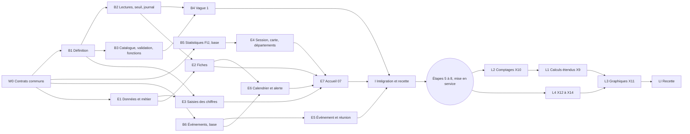

# Plan de l'étape 4 : fiche ministère, saisies, indicateurs et événements

- **Date** : 6 octobre 2026
- **Statut** : plan à valider par la personne responsable. Rien n'est codé tant qu'elle ne l'a pas
  accepté (CLAUDE.md, « Mode plan d'abord, code ensuite »).
- **Sources** : `BRIEF.md` (sections 3, 4, 6, 7, 9 et 13), `docs/decisions.md` (P01 à P41, T01 à
  T36), `docs/conception/vague-1-decisions.md`, `docs/conception/configuration-indicateurs.md`,
  `docs/conception/validation-metier.md`, `docs/reference/maquettes/LISEZMOI.md`, les trois plans de
  partie du 6 octobre (4a socle des indicateurs, 4b fiche et saisies, 4c événements) et le code de
  l'étape 3 (`supabase/migrations`, `src/features`, `src/data`, `src/pages`, `e2e`).
- **Règle de priorité** : là où les plans de partie diffèrent de `vague-1-decisions.md`, ce
  document applique `vague-1-decisions.md` et le dit (section 1, « Alignements »).

## 1. Objectif et périmètre

### La ligne du BRIEF

`BRIEF.md`, section 13, étape 4 : « Fiche ministère et saisies ». Vérification : « E2E : une saisie
crée une ligne, l'historique grandit, le journal aussi (une ligne par envoi) ; EJP Tech ouvre la
liste et une fiche sans aucun bouton de saisie ».

L'étape 4 reçoit en plus, par décision du 5 et du 6 octobre : le lot 1 de la configuration des
indicateurs (T35), la validation des ajouts par EJP Tech côté base (T30), l'alerte et les mentions
sur les événements (T31, T32), et tout ce qui sert à saisir la vague 1 des indicateurs (P32 à P41,
extensions X1 à X8). Elle prévoit enfin un lot de lecture, livré dans les 4 semaines qui suivent la
mise en service (X9 à X14).

### Dans l'étape 4 (avant la mise en service)

- **Socle des indicateurs** : natures `dimanche`, `mois` et `a_ce_jour` (pas de nature
  « activité » ni « jour ») ; unités nombre, grand nombre, euros, heure (0 à 1439) et jours (0 à
  99 999), sans unité « minutes » ; case sensible ; définition de 10 à 140 caractères ; état
  (à valider, actif, retiré) ; calculs taux et moyenne sur `indicateur_terme` (X8) ; drapeaux
  `sans_somme`, `saisi_dimanche_matin`, `libelle_sessions` (X3) ; limite de 30 lignes par fiche,
  saisis et calculs, prévus compris (X7).
- **Lectures** : période, série, suivi (dernière valeur, mois en cours à part, somme de l'année avec
  son départ et sa complétude), calculs V1, usage pour l'administration, seuil « moins de 3 » sans
  fuite pour les sensibles (X4), journal des saisies sans valeur propre (Q16).
- **Catalogue, validation et fonctions** (base seulement) : `private.indicateur_prevu`,
  `creer_indicateurs_prevus`, `demande_indicateur`, `validation`, `ajouter_suggestion` avec
  « Pourquoi », `valider_indicateur`, `v_a_valider`, `creer_indicateur`, `corriger_indicateur`,
  `retirer_indicateur`, `verifier_libelle`, `limites_indicateurs`. Toutes livrées et testées par
  pgTAP ; leurs écrans viennent à l'étape 6.
- **Vague 1** : 161 prévus, 41 calculs, 11 suggestions communes, libellés des communs (X1, X6), et
  le ministère Coordination de code `coordination` posé par migration (X7).
- **Statistiques FIJ par département** : table `fij_statistique`, saisie et lecture (X5).
- **Événements** : mentions (T32), alerte des événements en attente (T31), report lu dans
  l'historique, formulaire 11 et « Mettre à jour ».
- **Écrans** : fiche 04 et 12, liste `/ministeres`, accueil du ministère 07 (T18), saisie du
  dimanche 08, « Chiffres du mois », saisie d'une session 09, carte des FIJ, « Chiffres par
  département », événement 11, prochaine réunion, calendrier, bloc « Événements à confirmer », tous
  avec leurs états vides (T36).

### Hors de l'étape 4

| Sujet                                                                                                                                   | Où                                                    |
| --------------------------------------------------------------------------------------------------------------------------------------- | ----------------------------------------------------- |
| Écran Indicateurs (`/indicateurs`, `/indicateurs/:id`), bouton « Créer », bloc « À valider », panneaux corriger, retirer, remplacer     | étape 6 (configuration, section 9 ; validation, 7)    |
| « Mes indicateurs » (`/ma-fiche/indicateurs`), suggestions et champ « Pourquoi cet indicateur ? »                                       | étape 6, avant la mise en service (Q8)                |
| Nouveau point, « Changer le statut », « Marquer traité » (dont les points de départ de Production et d'Entretien)                       | étape 5 (T19)                                         |
| Écran Journal et journal technique                                                                                                      | étape 6                                               |
| Confirmation « Vérifiez ce chiffre » (`chiffres_inhabituels`)                                                                           | après la mise en service, avant le 5e dimanche (V8)   |
| Lot 2 de la configuration (comptes écrits par les ministères, correction du nom par le ministère, 3 ajouts par 30 jours, mots refusés)  | après la mise en service                              |
| Lot de lecture X9 à X14 (calculs étendus, comptages d'événements, graphiques, courbes de fin de mois, série de l'église, sessions lues) | dans les 4 semaines après la mise en service (lots L) |
| Rappels par email (P31), courriel d'alerte (T31)                                                                                        | hors de l'étape, à décider à part                     |
| Indicateurs propres sur la vue de l'église                                                                                              | jamais (K12, P39)                                     |

### Alignements sur `vague-1-decisions.md`

Ce que ce plan change dans les trois plans de partie, et pourquoi.

| Plan de partie                                                                                 | Ce plan                                                                                                  | Source        |
| ---------------------------------------------------------------------------------------------- | -------------------------------------------------------------------------------------------------------- | ------------- |
| 4a : unités minutes et heures, jours plafonnés à 9 999                                         | unités heure (0 à 1439) et jours (0 à 99 999) seulement                                                  | Q4, K22a, X2  |
| 4a : `haut_id` et `bas_id` ; calculs `rapport`, `somme_annee`, `evenements`, `graphique`       | `indicateur_terme` figé à la création ; en V1, taux et moyenne seulement ; somme de l'année automatique  | X8, X9        |
| 4a et 4b : 12 indicateurs par fiche                                                            | 30 lignes par fiche, saisis et calculs, prévus compris ; 3 ajouts d'un ministère au lot 1                | K13a, Q2, X7  |
| 4a : lignes brutes sensibles lisibles par l'API, pas de seuil en V1                            | seuil « moins de 3 » sans fuite, lignes brutes au seul ministère, export hors API                        | K5c, Q9, X4   |
| 4a : aucun indicateur en euros ; catalogue de prévus vide d'abord                              | 4 indicateurs en euros ; catalogue complet de 161 prévus dès la vague 1                                  | K6a, X1       |
| 4a : demandes de la coordination parmi les suggestions possibles                               | toute demande de la coordination est un prévu, jamais une suggestion ; 11 suggestions communes seulement | Q18, P41      |
| 4a et 4b : `public.indicateur_serie`, tables `graphique` et `graphique_serie` dans `public`    | `private.graphique_prevu` et `private.graphique_serie`, écrites par migration, changées par migration    | X11, P39      |
| 4b et 4c : comptages d'événements à l'étape 4, par ministère porteur seulement                 | comptages livrés dans les 4 semaines après la mise en service, totaux de l'église lus par Coordination   | K11, P38, X10 |
| 4c : `alter type statut_evenement add value 'reporte'` (M4)                                    | abandonnée : « reporté » se lit dans l'historique                                                        | K10b          |
| 4a et 4b : « Mes indicateurs » et écran Indicateurs à l'étape 4                                | étape 6 ; l'étape 4 livre et teste les fonctions                                                         | Q8, config 9  |
| 4a : « Aucun ajout à valider. » ; 4b : « Ce ministère ne suit pas encore d'indicateur à lui. » | textes retenus de `LISEZMOI.md` (« Rien à valider... », « Aucun indicateur pour Protocole... »)          | T36           |
| aucun plan : statistiques FIJ par département                                                  | lot B5 et écran de E4, avant la mise en service                                                          | K47a, X5, P40 |
| aucun plan : saisie d'une session 09 et carte des FIJ                                          | lot E4 (« Saisies » de l'étape 4, BRIEF section 9)                                                       | BRIEF 9 et 13 |
| 4a et 4c : deux dossiers de jeux d'exemple (`seed/` et `seeds/`)                               | un seul dossier `supabase/seed/`, fichiers numérotés                                                     | ce plan       |

## 2. Ordre des lots et parallélisme

### Les lots

| Lot | Nom                                                                  | Moment                   | Effort (jours) |
| --- | -------------------------------------------------------------------- | ------------------------ | -------------- |
| W0  | Contrats communs                                                     | avant tout, seul         | 1,5            |
| B1  | Définition des indicateurs (X2, X3, X7, X8)                          | avant la mise en service | 3              |
| B2  | Lectures, seuil des sensibles et journal des saisies (X4)            | avant                    | 3,5            |
| B3  | Catalogue, validation et fonctions de configuration                  | avant                    | 3              |
| B4  | Vague 1 : prévus, calculs, suggestions, communs (X1, X6)             | avant                    | 2              |
| B5  | Statistiques FIJ par département, base (X5)                          | avant                    | 1,5            |
| B6  | Événements, base : mentions, alerte, report                          | avant                    | 2              |
| E1  | Données et métier des indicateurs                                    | avant                    | 1              |
| E2  | Fiches 04 et 12, liste des ministères                                | avant                    | 3              |
| E3  | Saisies des chiffres : dimanche et mois                              | avant                    | 2,5            |
| E4  | Saisies de session, de la carte des FIJ et par département           | avant                    | 3              |
| E5  | Saisies d'événement et de réunion                                    | avant                    | 2              |
| E6  | Calendrier, prochaine réunion et alerte                              | avant                    | 2,5            |
| E7  | Accueil du ministère 07                                              | avant                    | 1,5            |
| I   | Intégration, recette, captures, revues                               | avant                    | 2              |
| L1  | Calculs étendus (X9)                                                 | 4 semaines après         | 3              |
| L2  | Comptages d'événements (X10)                                         | 4 semaines après         | 2,5            |
| L3  | Graphiques déclarés (X11)                                            | 4 semaines après         | 2,5            |
| L4  | Courbes de fin de mois, série de l'église, sessions lues (X12 à X14) | 4 semaines après         | 1,25           |
| LI  | Recette du lot de lecture                                            | 4 semaines après         | 1              |

Avant la mise en service : **34 jours de travail**, environ **14,5 jours de calendrier** avec quatre
worktrees au plus. Lot de lecture : **10,25 jours de travail**, environ **9 jours de calendrier**.

### Dépendances

Une flèche dit « fusionné avant » : le lot suivant peut s'écrire plus tôt contre les contrats de W0
et `src/test/fauxSupabase.ts`, mais il n'est fusionné qu'après ses prédécesseurs, parce que sa CI
(jobs « base » et « e2e ») a besoin de leurs migrations.

### Ce qui tourne en parallèle

Chaque lot vit dans un worktree (`../pilotage-ejp-<lot>`), sur une branche `etape-4-<lot>` partie de
la branche d'étape `etape-4`, et ne touche que ses propres fichiers (section 3, « Propriété des
fichiers »). Les fusions se font sans avance rapide dans `etape-4`, dans l'ordre des vagues.

| Vague | Worktrees en parallèle | Calendrier | Pourquoi ensemble                                                 |
| ----- | ---------------------- | ---------- | ----------------------------------------------------------------- |
| 1     | W0 seul                | 1,5 jour   | il écrit tous les fichiers partagés                               |
| 2     | B1, B5, B6, E1         | 3 jours    | trois migrations sans objet commun, plus le métier pur            |
| 3     | B2, B3, E4, E5         | 3,5 jours  | B2 et B3 lisent B1 sans se lire ; E4 et E5 ont leur base (B5, B6) |
| 4     | B4, E2, E3, E6         | 3 jours    | B4 a B2 et B3 ; les écrans ont leurs lectures                     |
| 5     | E7                     | 1,5 jour   | il consomme les lignes de « Vos saisies » de E3, E4 et E6         |
| 6     | I                      | 2 jours    | il rétablit les listes exhaustives et lance la recette            |

Quatre worktrees au plus en même temps : c'est la limite de relecture de la personne responsable,
pas une limite technique. Ce qui **ne peut pas** tourner en parallèle : deux lots qui écrivent la
même fonction ou la même vue (réglé par la propriété unique ci-dessous), et B4 avant B2 et B3.

## 3. Contrats communs à fixer d'abord (W0)

W0 tourne seul, dans `etape-4`, et rien ne part avant sa fusion. Il écrit tous les fichiers que
plusieurs lots toucheraient, puis ces fichiers sont figés jusqu'au lot I.

### Ce que W0 écrit

1. **`docs/conception/contrat-etape-4.md`** : colonnes et types de chaque vue et fonction nouvelle
   (section 4), routes, emplacements, codes de journal, horodatages et jeux d'exemple ci-dessous.
2. **Migration `20261007090000_contrats_etape_4.sql`** : réécrit une seule fois les `check` de
   `journal.action`, `journal.cible` et `moderation.cible` avec l'union de tous les codes de
   l'étape 4 (recommandation de la section 7, question 3). Nouveaux codes d'action :
   `indicateur_cree`, `indicateurs_prevus_crees`, `indicateur_corrige`, `indicateur_valide`,
   `indicateur_refuse`, `indicateur_retire`, `fij_statistiques_saisies`. Nouvelle cible de journal :
   `indicateur`. Nouvelles cibles de modération : `demande_indicateur` (champ `pourquoi`) et
   `validation` (champ `motif`). Aucun lot ne retouche ces contraintes.
3. **`supabase/config.toml`** : `sql_paths = ["./seed.sql", "./seed/*.sql"]`, vérifié en CI par W0
   (ordre lexical des fichiers).
4. **Types** : `src/lib/base.ts` devient un point d'entrée qui réexporte `src/lib/base/communs.ts`
   (le contenu actuel), `indicateurs.ts`, `fiche.ts`, `fij.ts` et `evenements.ts`. Chaque lot ne
   remplit que son fichier. Les types restent écrits à la main (Docker absent du poste).
5. **Routes et pages amorces** : `src/features/navigation/profils.ts`, `src/app/routes.tsx` et
   `src/pages/PageApplication.tsx` déclarent une fois toutes les adresses de la section 4 et les
   aperçus `/apercu/fiche`, `/apercu/saisies`, `/apercu/evenements`. Chaque adresse pointe vers un
   fichier de page amorce (`src/pages/PageMaFiche.tsx`, `PageFicheMinistere.tsx`,
   `PageMinisteres.tsx`, `PageSaisieDimanche.tsx`, `PageSaisieMois.tsx`, `PageSaisieSession.tsx`,
   `PageSaisieFij.tsx`, `PageSaisieFijStatistiques.tsx`, `PageSaisieEvenement.tsx`,
   `PageSaisieReunion.tsx`) que son lot remplace.
6. **Briques partagées** : `src/components/etats/EtatVide.tsx` (type des six situations de T36 :
   premier usage, en attente des autres, tout est fait, aucun résultat, pas pour ce profil, problème
   passager ; au plus une action, montrée au seul profil qui peut agir) ;
   `src/features/saisie/PanneauSaisie.tsx` (page entière sous 600 px, panneau de 460 px au-delà),
   `ChampNombre.tsx`, `RappelDonneesPersonnelles.tsx`, `Compteur.tsx`, `ErreurFormulaire.tsx`,
   `MessageReussite.tsx` ; `src/lib/metier/unites.ts` (« 5 164 € », « 10 h 42 », « 3 jours »,
   « moins de 3 ») et `src/lib/metier/periodes.ts` (« Septembre 2026 », « Octobre en cours »,
   « Depuis juillet », mois proposés à partir de `v_semaine.aujourdhui`), avec leurs tests.
7. **Emplacements** : `src/features/fiche/emplacements.tsx` (blocs calendrier, réunion, statistiques
   FIJ, puis comptages et graphiques du lot de lecture, chacun dans son fichier amorce qui ne rend
   rien) ; `src/features/accueil-ministere/types.ts` (`LigneVosSaisies` : `cle`, `libelle`, `etat`,
   `detail`, `action`) et les fichiers amorces `lignesChiffres.ts` (E3), `lignesSessions.ts` et
   `lignesFij.ts` (E4), `lignesReunion.ts` et `lignesEvenements.ts` (E6) ; deux emplacements dans
   `GrilleCetteSemaine.tsx` (« Vos points » pour E7, « Événements à confirmer » pour E6), pour qu'un
   seul lot touche ce fichier.
8. **Tests partagés** : `supabase/tests/structure.test.sql` passe des listes exhaustives
   (`tables_are`, `views_are`) aux contrôles génériques (RLS active, politique restrictive `aal2`,
   aucun droit pour `anon`, aucun `update`, `delete` ni `truncate` pour `authenticated`) plus
   `has_table` sur les objets d'avant l'étape 4 ; le lot I rétablit les listes exhaustives avec tous
   les objets de l'étape. `000-outils.test.sql` gagne une aide qui parcourt une matrice des droits
   écrite en données (profil, objet, action, attendu).

### Horodatages réservés des migrations

Chaque lot crée sa migration directement sous son nom réservé (Write), après la dernière migration
suivie (`20261005172228`). Une migration fusionnée est figée : une correction passe par une
nouvelle migration du même lot, horodatée dans sa plage.

| Lot | Fichiers (dans l'ordre d'application)                                                                                             |
| --- | --------------------------------------------------------------------------------------------------------------------------------- |
| W0  | `20261007090000_contrats_etape_4.sql`                                                                                             |
| B1  | `20261007100000_indicateurs_definition.sql`, `20261007100500_indicateurs_lexique.sql`                                             |
| B5  | `20261007110000_fij_statistique.sql`                                                                                              |
| B6  | `20261007120000_evenements_mentions.sql`, `20261007120500_evenements_alerte_report.sql`                                           |
| B2  | `20261008100000_indicateurs_lectures.sql`, `20261008100500_indicateurs_seuil_sensibles.sql`, `20261008101000_journal_mesures.sql` |
| B3  | `20261008110000_validation_indicateurs.sql`, `20261008110500_indicateurs_fonctions.sql`                                           |
| B4  | `20261009100000_indicateurs_vague_1.sql`                                                                                          |
| L   | horodatage réel du jour de création, après la dernière migration passée en production ; ordre L2, L4, L1, L3                      |

B2 et B3 ne se lisent pas : `attente_jours` de `v_indicateur_suivi` se calcule sur
`indicateur.cree_le` et `indicateur.etat` (B1), pas sur `demande_indicateur` (B3).

### Jeux d'exemple

| Fichier                                 | Lot | Contenu                                                                                                                                                                             |
| --------------------------------------- | --- | ----------------------------------------------------------------------------------------------------------------------------------------------------------------------------------- |
| `supabase/seed.sql`                     | B1  | définition de « Visuels livrés ce mois » ; reprise du ministère Coordination créé par la migration (comme FIJ)                                                                      |
| `supabase/seed/40-indicateurs.sql`      | B4  | prévus créés pour les ministères d'exemple ; une valeur par unité ; un sensible (1, 2 et 0) ; un ajout à valider, un validé, un refusé ; un retiré avec saisies ; mois et dimanches |
| `supabase/seed/41-fij-statistiques.sql` | B5  | deux semaines des 4 rubriques, une semaine incomplète (« 6 dép. sur 8 »)                                                                                                            |
| `supabase/seed/42-evenements.sql`       | B6  | « Réunion des responsables » (Coordination, en attente, reporté, @Communication), décalage de semaines recalculé                                                                    |

`jeu-exemple.test.sql` n'est touché que par B6 (11 puis 12 événements) et B2 (ligne de journal de
Communication, l. 104).

### Propriété des fichiers après W0

| Fichier ou objet partagé                                                                  | Seul lot qui l'écrit                         |
| ----------------------------------------------------------------------------------------- | -------------------------------------------- |
| `private.journaliser_mesures`, `private.journal_lisible_administration`                   | B2                                           |
| `v_journal` (cible `indicateur`), `masquer_texte` (nouveaux couples)                      | B3                                           |
| `private.journaliser_evenements`, `v_evenement`, politique de `evenement`                 | B6                                           |
| `private.controler_mesure`, `private.controler_indicateur`, politique d'ajout de `mesure` | B1                                           |
| politique de lecture de `mesure` (lignes sensibles)                                       | B2                                           |
| `audit.test.sql`, tests `rls-chiffres-*` (colonne `definition`)                           | B1 (`rls-chiffres-*`), B2 (`audit.test.sql`) |
| `src/features/cette-semaine/*` hors emplacements                                          | E7                                           |
| `structure.test.sql` (listes exhaustives), `LISEZMOI.md`, `BRIEF.md`, `docs/decisions.md` | W0 puis I                                    |

## 4. Les lots

Règles communes à tous les lots, vérifiées par `rls-auditor` :

- ajout seulement : aucun GRANT `update`, `delete` ni `truncate` ; triggers d'inaltérabilité sur
  `indicateur_terme`, `demande_indicateur`, `validation`, `fij_statistique`, `evenement_mention`
  (seule exception : `masquer_texte`, sous `pilotage.masquage`) ; `saisi_le` et `saisi_par` posés
  par `forcer_auteur` ;
- RLS active, politique restrictive `aal2` sur chaque table nouvelle, GRANT explicites, rien pour
  `anon` ; `private.exige_aal2()` en tête de chaque fonction de l'API ; `security definer`
  seulement dans `private`, avec `set search_path = ''`, appelée par une fonction `public` en
  `security invoker` ; vues `with (security_invoker = true)` ;
- dates par `private.aujourdhui()`, `private.dimanche_reference()` et `v_semaine`, jamais
  `current_date` ni la date du navigateur ;
- journal : une ligne par envoi, jamais un texte libre, un email, un libellé, une valeur propre ou
  une valeur sensible ; les chiffres communs gardent leur valeur ;
- **EJP Tech lit tout et ne saisit rien** : aucune politique d'ajout et aucune fonction de saisie
  ne l'accepte (`mesure`, `fij_statistique`, `participation`, `evenement`, `evenement_etat`,
  `reunion`) ; ses écrans n'ont aucun bouton de saisie (`enLectureSeule`) ; seules la validation
  des ajouts, la configuration sur demande écrite (Q13) et la modération lui sont ouvertes ;
- textes : français simple, aucun tiret cadratin ni demi-cadratin, un rappel sur les données
  personnelles sous le premier champ libre de chaque formulaire (nom de l'événement, objet de la
  réunion), sauf le champ « Pourquoi cet indicateur ? » qui n'en a jamais (T30) ; 80 caractères pour
  un nom ou un objet, 280 pour un « Pourquoi » ou un motif ;
- tout total avec sa complétude ; jamais un 0 pour une absence.

### Matrice des droits des objets nouveaux

Référence des tests pgTAP en données. Profils : ministère (un ministère porteur, un ministère
mentionné ou autre, le ministère `fij`, le ministère `coordination`), berger, conseil,
administration de l'église, EJP Tech, session `aal1`, anonyme. « L » lire, « A » ajouter.

| Objet                                                                                       | Ministère                                                             | Berger, conseil                        | Administration                                                        | EJP Tech            | `aal1`, anonyme |
| ------------------------------------------------------------------------------------------- | --------------------------------------------------------------------- | -------------------------------------- | --------------------------------------------------------------------- | ------------------- | --------------- |
| `indicateur`, `indicateur_terme`                                                            | L des communs et des siens (Q3)                                       | L tous, ajouts à valider compris       | L tous (définitions)                                                  | L tous              | rien            |
| `mesure` (lecture)                                                                          | L des communs de tous et des siens, sensibles compris                 | L, sauf lignes sensibles               | L des communs seulement                                               | comme le berger     | rien            |
| `mesure` (ajout)                                                                            | A le sien : actif ou à valider, non calculé, mois clos si sensible    | rien                                   | rien                                                                  | rien                | rien            |
| `v_mesure_periode`, `v_indicateur_serie`, `v_indicateur_suivi`, `v_calcul`                  | valeurs exactes des siens                                             | seuil « moins de 3 » sur les sensibles | lignes sans valeur, sauf communs                                      | comme le berger     | rien            |
| `v_usage_indicateurs`                                                                       | rien                                                                  | rien                                   | L                                                                     | L                   | rien            |
| `demande_indicateur`                                                                        | L les siennes                                                         | rien                                   | rien                                                                  | L                   | rien            |
| `validation`                                                                                | L les siennes                                                         | L                                      | L                                                                     | L                   | rien            |
| `v_a_valider`                                                                               | rien                                                                  | rien                                   | rien                                                                  | L                   | rien            |
| `valider_indicateur`                                                                        | refusé                                                                | refusé                                 | refusé                                                                | oui                 | refusé          |
| `creer_indicateurs_prevus`, `creer_indicateur`, `corriger_indicateur`, `retirer_indicateur` | refusé                                                                | refusé                                 | oui                                                                   | oui                 | refusé          |
| `ajouter_suggestion`                                                                        | sa fiche, « Pourquoi » obligatoire                                    | refusé                                 | oui                                                                   | oui                 | refusé          |
| `limites_indicateurs`, `verifier_libelle`                                                   | sa fiche                                                              | refusé                                 | toute fiche                                                           | toute fiche         | refusé          |
| `fij_statistique`, `v_fij_statistique`                                                      | L et A (par `saisir_fij_statistiques`) si `fij` ; rien sinon          | L                                      | rien                                                                  | L                   | rien            |
| `evenement`, `evenement_etat`                                                               | L et A les siens ; L de ceux qui le mentionnent                       | L                                      | rien                                                                  | L                   | rien            |
| `evenement_mention`                                                                         | L des siens et de ceux qui le mentionnent ; A par `ajouter_evenement` | L                                      | rien                                                                  | L                   | rien            |
| `v_evenement` (`jours`, `a_confirmer`, `reporte_du`)                                        | siens et mentionnés                                                   | tous                                   | rien                                                                  | tous                | rien            |
| `journal` (codes nouveaux)                                                                  | lignes de sa fiche                                                    | toutes                                 | `mesure_saisie` et `indicateur_*`, sans valeur ; ni FIJ ni événements | toutes              | rien            |
| `moderation` (couples nouveaux)                                                             | rien                                                                  | rien                                   | rien                                                                  | L et masquage       | rien            |
| `private.indicateur_prevu`, `private.libelle_commun`, `private.fij_rubrique`                | rien                                                                  | rien                                   | rien                                                                  | rien                | rien            |
| Lot L : `v_evenements_mois`                                                                 | ses événements                                                        | tous                                   | rien                                                                  | tous                | rien            |
| Lot L : `evenements_eglise_mois()`                                                          | `coordination` seulement                                              | oui                                    | refusé                                                                | oui                 | refusé          |
| Lot L : `v_graphique`, `v_stock_mois`                                                       | comme leurs sources, jamais une série sensible                        | comme leurs sources                    | rien                                                                  | comme leurs sources | rien            |
| Lot L : `v_serie_eglise`                                                                    | L                                                                     | L                                      | L                                                                     | L                   | rien            |

Un indicateur retiré pour confidentialité ne se lit plus par l'API, pour aucun profil (Q11).

### Adresses

| Adresse                                                         | Profils                                   | Lot |
| --------------------------------------------------------------- | ----------------------------------------- | --- |
| `/` (ouverture 07 pour le ministère)                            | ministère                                 | E7  |
| `/ma-fiche`                                                     | ministère                                 | E2  |
| `/ministeres`, `/ministeres/:id`                                | berger, conseil, EJP Tech (lecture seule) | E2  |
| `/saisir/dimanche` (`date`)                                     | ministère                                 | E3  |
| `/saisir/mois` (`mois=AAAA-MM`)                                 | ministère                                 | E3  |
| `/saisir/session/:id`                                           | ministère                                 | E4  |
| `/saisir/fij`, `/saisir/fij-statistiques`                       | ministère `fij`                           | E4  |
| `/saisir/evenement`, `/saisir/evenement/:id`, `/saisir/reunion` | ministère                                 | E5  |

Une adresse réservée à un autre profil donne la page non disponible, sans aucune requête.
L'administration de l'église n'a aucune adresse nouvelle à l'étape 4.

### W0. Contrats communs (1,5 jour)

- **Fichiers et migration** : section 3.
- **Écrans** : aucun ; pages amorces seulement.
- **Tests** : `structure.test.sql` en contrôles génériques ; aide de matrice dans
  `000-outils.test.sql` ; Vitest de `unites.ts`, `periodes.ts`, `EtatVide`, `PanneauSaisie` ;
  `profils.test.ts` et `routes.test.tsx` (chaque adresse, ses profils, la page non disponible sans
  requête) ; CI verte avec les jeux d'exemple chargés par `sql_paths`.

### B1. Définition des indicateurs (3 jours)

- **Migrations** : `20261007100000_indicateurs_definition.sql`, `20261007100500_indicateurs_lexique.sql`.
- **Contenu** :
  - colonnes de `indicateur` : nature `mois` ; `unite` (`nombre` 9 999, `grand_nombre` et `euros`
    9 999 999, `heure` 0 à 1439, `jours` 0 à 99 999) ; `definition` (10 à 140, remplie pour les
    communs) ; `sensible` (mois et nombre seulement, jamais source d'un calcul) ; `etat`
    (`en_attente`, `actif`, `retire`) ; `origine` ; `modele_code` ; `remplace_id` ; `retire_le`,
    `retrait_motif` ; drapeaux `sans_somme`, `saisi_dimanche_matin`, `libelle_sessions` (X3) ;
    unicité du libellé normalisé, retirés exclus ;
  - table `indicateur_terme` (calcul, côté haut ou bas, source, agrégat, décalage, ordre), écrite
    seulement à la création, figée, lue comme `indicateur` (X8) ; sources jamais sensibles ni
    communes ;
  - `controler_indicateur` : sens figé, aucune suppression, réglages `pilotage.validation`,
    `pilotage.masquage`, `pilotage.migration` ;
  - `controler_mesure` réécrit : plafond de l'unité ; mois au 1er seulement ; ni mois futur ni avant
    le 1er janvier de l'année précédente ; mois en cours refusé pour un sensible ; aucune saisie d'un
    calcul ; dimanche du jour accepté le dimanche matin (heure de Paris) ;
  - politique d'ajout de `mesure` : indicateur actif ou à valider, non calculé ;
  - ministère Coordination créé avec le code `coordination` s'il n'existe pas (X7), comme FIJ ;
  - `private.verifier_texte` (lexique : données personnelles, crochets, familles calcul, cumul et
    période).
- **Écrans** : aucun.
- **Tests pgTAP** : `indicateurs-definition.test.sql` (structure, sens figé, aucune suppression,
  unicité, drapeaux, termes figés) ; `indicateurs-saisies.test.sql` (plafond par unité, heure 1439
  et 1440, jours 99 999 et 100 000, 15 du mois, mois futur, avant janvier N-1, mois en cours d'un
  sensible, bascule du 31 octobre à 23 h 30 UTC, dimanche matin, calcul refusé par le trigger et la
  politique, EJP Tech refusé) ; données de test reprises dans `rls-chiffres-matrice`,
  `rls-chiffres-saisies`, `rls-chiffres-vues` et `integrite`.

### B2. Lectures, seuil des sensibles et journal des saisies (3,5 jours)

- **Migrations** : `20261008100000_indicateurs_lectures.sql`,
  `20261008100500_indicateurs_seuil_sensibles.sql`, `20261008101000_journal_mesures.sql`.
- **Contenu** :
  - `v_mesure_periode` : saisie la plus récente par indicateur, ministère et période (règle 2,
    départage par `id`) ;
  - `v_indicateur_serie` : 10 dimanches ou 12 mois, trous à `null`, cercle vide pour une période
    incomplète ;
  - `v_indicateur_suivi` : dernière valeur et sa période ; mois en cours à part, jamais pour un
    sensible ; somme de l'année avec son départ (« Depuis juillet ») et sa complétude (« 9 mois sur
    9 »), absente si `sans_somme` ou « à ce jour » ; valeur de plus de 30 jours ; `etat_valeur` et
    `attente_jours` ; un ajout à valider garde ses valeurs, hors somme et hors calcul ; un refusé ou
    un retiré pour confidentialité n'y figure pas ;
  - `v_calcul` : taux et moyenne V1 seulement, Σ haut ÷ Σ bas sur les périodes qui ont toutes les
    valeurs, jamais une moyenne de taux ; « Non calculé » avec sa raison ; plafond de 100 % pour une
    part ; un « à ce jour » en bas est pris en vigueur à la fin de la période ;
  - `v_usage_indicateurs` (« Saisi 4 mois sur 5 », aucune valeur) ;
  - seuil (X4) : politique de lecture de `mesure` fermée aux lignes sensibles pour tout autre
    profil que le ministère ; fonction `private` en `security definer` qui rend 1 et 2 en « moins de
    3 », 0 en 0, et une somme des seuls mois affichés (« Somme des mois affichés : 14, plus 2 mois
    sous 3 ») ;
  - `journaliser_mesures` : une ligne par envoi, `indicateur_id` et `date_ref` sans valeur propre,
    valeur gardée pour les communs, drapeau `corrige` ; `journal_lisible_administration` accepte
    `mesure_saisie` et les codes `indicateur_*`.
- **Écrans** : aucun.
- **Tests pgTAP** : `rls-indicateurs-matrice.test.sql` (lignes de la matrice qui touchent ces
  objets, sept comptes et l'anonyme, `aal1` et `aal2`) ; `indicateurs-lectures.test.sql` (correction
  d'un même dimanche, départage par `id`, trous, mois en cours hors somme, départ de la somme et
  rattrapage, ministère désactivé, à valider hors somme, taux 16 sur 20 = 80, « Non calculé »,
  Σ/Σ sur l'année) ; `indicateurs-seuil.test.sql` (0 reste 0, 1 et 2 masqués au berger, au conseil
  et à EJP Tech, valeur exacte pour le ministère, lecture directe de `mesure` refusée, somme sans
  fuite par différence) ; `journal-saisies.test.sql` (envoi mixte d'une ligne, aucune valeur propre,
  `corrige`) ; mise à jour de `audit.test.sql` et de `jeu-exemple.test.sql` (l. 104).

### B3. Catalogue, validation et fonctions de configuration (3 jours)

- **Migrations** : `20261008110000_validation_indicateurs.sql`,
  `20261008110500_indicateurs_fonctions.sql`.
- **Contenu** :
  - `private.indicateur_prevu` (codes de calcul, termes, drapeaux), `v_catalogue`, `v_suggestions` ;
  - `creer_indicateurs_prevus` : tout ou rien, sans doublon, accepte « aucun » ; ne crée un
    sensible que si le réglage `private.sensibles_actives` est posé (section 7, question 4) ;
  - tables `demande_indicateur` et `validation` (`validation-metier.md`, 6.2) ;
    `ajouter_suggestion(p_ministere_id, p_code, p_pourquoi)` ; `valider_indicateur` (EJP Tech seul,
    verrou, une seule décision, motif de 10 à 280 caractères, « Refusé » comme motif de retrait) ;
    `v_a_valider` ;
  - `creer_indicateur`, `corriger_indicateur` (tant que rien n'est saisi), `retirer_indicateur`
    (motif obligatoire), `verifier_libelle`, `limites_indicateurs` (30 lignes, 3 ajouts, sous
    verrou), `private.peut_configurer()` (administration et EJP Tech, Q13) ;
  - `masquer_texte` étendu aux couples (`demande_indicateur`, `pourquoi`) et (`validation`,
    `motif`) ; `v_journal` gagne la cible `indicateur` (texte actuel, sous la RLS du lecteur).
- **Écrans** : aucun (étape 6).
- **Tests pgTAP** : `indicateurs-catalogue.test.sql` (tout ou rien, « aucun », sensibles retenus
  sans le réglage, 30 lignes, 31e refusée) ; `validation-indicateurs.test.sql` (« Pourquoi » de 9,
  10, 280 et 281 caractères ; jamais au journal ; illisible pour le berger, le conseil,
  l'administration et un autre ministère ; décision unique par EJP Tech seul ; refus « Refusé » ;
  fraîcheur du ministère inchangée) ; `indicateurs-fonctions.test.sql` (correction avant et après
  saisie, retrait avec saisies gardées, limites sous verrou) ; inaltérabilité même au propriétaire,
  sauf masquage.

### B4. Vague 1 (2 jours)

- **Migration** : `20261009100000_indicateurs_vague_1.sql`.
- **Contenu** : les 161 prévus et les 41 calculs de `vague-1-decisions.md` (section 4), avec
  libellés, définitions, rythmes, unités, drapeaux, valeurs de départ (5 164 € pour Production, 25
  personnes formées) ; les 12 calculs étendus sont écrits avec leurs termes mais restent hors de la
  fiche jusqu'à L1 (section 7, question 6) ; les 11 suggestions communes ; `private.libelle_commun`
  (13 communs affichés sous le nom de la demande, dont les deux lignes de référence de l'église pour
  MDS, X6) ; Protocole au modèle « aucun ».
- **Écrans** : aucun ; la fiche les montre par E2.
- **Tests pgTAP** : `indicateurs-vague-1.test.sql` (161 et 41, 11 sensibles, 4 en euros, 2 en
  heure, 4 en jours ; MCAD 21 lignes sur 30 ; aucun prévu ne passe par la validation ni ne compte
  dans les 3 ajouts ; aucune demande de la coordination parmi les suggestions ; aucun calcul sur un
  sensible ou un commun ; création pour un ministère d'exemple) ; `seed/40-indicateurs.sql`.

### B5. Statistiques FIJ par département, base (1,5 jour)

- **Migration** : `20261007110000_fij_statistique.sql`.
- **Contenu** : table `fij_statistique` (rubrique, département, dimanche, valeur, `saisi_le`,
  `saisi_par`), ajout seulement ; liste fermée `private.fij_rubrique` (présents au culte EJP,
  présents à la réunion FIJ, présents à l'évangélisation, membres du mardi) ;
  `saisir_fij_statistiques` (`private` en `security definer`, appelée par `public` en `security
invoker`, ministère `fij` seulement, 32 valeurs en un envoi, une ligne de journal
  `fij_statistiques_saisies` sans valeur) ; `v_fij_statistique` (dernière saisie par département et
  semaine, total par rubrique, complétude « 8 dép. sur 8 », série).
- **Tests pgTAP** : `fij-statistiques.test.sql` (le ministère `fij` écrit ; berger, conseil et EJP
  Tech lisent ; rien pour l'administration ni les autres ministères ; EJP Tech ne saisit pas ;
  dernière saisie gagnante ; semaine du lundi au dimanche ; complétude ; une ligne de journal par
  envoi) ; `seed/41-fij-statistiques.sql`.

### B6. Événements, base (2 jours)

- **Migrations** : `20261007120000_evenements_mentions.sql`,
  `20261007120500_evenements_alerte_report.sql`.
- **Contenu** :
  - table `evenement_mention` (événement, ministère, clé des deux), index sur `ministere_id`, RLS,
    `aal2`, GRANT `select` seulement ; `private.evenements_mentionnant_mon_ministere()` contre la
    récursion ; politique de lecture de `evenement` recréée avec les événements qui mentionnent le
    ministère ; `evenement_etat` suit ;
  - `ajouter_evenement(text, date, statut_evenement, uuid[])` : contrôles de `creer_point`
    (doublons, ministères actifs, jamais soi-même), mentions insérées avant le premier état ; la
    version à trois arguments délègue avec `'{}'` ;
  - `journaliser_evenements` : `evenement_ajoute` porte la date, le statut et les identifiants des
    ministères mentionnés, jamais le nom ; `evenement_modifie` gagne `date_precedente` ;
  - `v_evenement` gagne en fin `jours`, `a_confirmer` (en attente de validation, date au plus
    aujourd'hui plus 3, ministère actif) et `reporte_du` ;
  - trigger `private.controler_evenement_etat()` : refuse une nouvelle date passée et une ligne
    identique à l'état actuel (section 7, question 7).
- **Tests pgTAP** : `rls-evenements-matrice.test.sql` ; `evenements-mentions.test.sql` (soi-même,
  ministère désactivé ou inconnu, doublons, une ligne de journal sans le nom, le mentionné ne change
  pas l'état) ; `evenements-alerte.test.sql` (J+4 non ; J+3, J et J−10 oui ; Validé, Brouillon,
  Annulé ; report à J+5 puis J+2 ; minuit à Paris ; ministère désactivé ; administration et autre
  ministère ne voient rien) ; `evenements-report.test.sql` ; `jeu-exemple.test.sql` (12 événements) ;
  `seed/42-evenements.sql`.

### E1. Données et métier des indicateurs (1 jour)

- **Fichiers** : `src/lib/base/indicateurs.ts`, `src/data/indicateurs.ts` (une fonction typée par
  requête), `src/lib/metier/indicateurs.ts` (ordre par rythme puis alphabétique, R6 ; libellé du
  calcul ; texte du « Non calculé »), `src/features/indicateurs/schemas.ts` (Zod : `valeur(unite)`
  entier de 0 au plafond, « Entre 0 et 9 999. » ; heure saisie en heures et minutes ; « Pourquoi »
  et motif de 10 à 280 après `trim`, pour l'étape 6), `src/features/indicateurs/textesVides.ts`.
- **Tests** : Vitest des fonctions, des schémas et de `src/data/indicateurs.ts` avec
  `fauxSupabase`.

### E2. Fiches 04 et 12, liste des ministères (3 jours)

- **Fichiers** : `src/features/fiche/` (phrase par `phraseDeLaFiche`, chiffres communs avec leur
  libellé de demande et l'écart de fiche, lignes de référence de MDS avec leur complétude,
  indicateurs par rythme, ligne d'un calcul, petite courbe, « moins de 3 », marque « à valider »,
  « Retirés » replié, points en lecture, « Dernières saisies », emplacements de W0),
  `src/data/fiche.ts`, `src/pages/PageMaFiche.tsx`, `PageFicheMinistere.tsx`, `PageMinisteres.tsx`.
- **Maquettes** : 04, 12 et le bloc « Les ministères » de 01. Une fiche peut avoir 30 lignes :
  sections repliables par rythme sur téléphone.
- **Profils** : le ministère sur `/ma-fiche` avec ses boutons de saisie ; berger et conseil en
  lecture ; EJP Tech en lecture, aucun bouton (`enLectureSeule`) ; un ministère qui ouvre sa propre
  fiche par `/ministeres/:id` va sur `/ma-fiche` ; l'administration reçoit la page non disponible.
- **États vides** :

| Bloc                         | Situation             | Texte (« proposé » s'il n'est pas encore dans `LISEZMOI.md`)                                                          | Action                                                             |
| ---------------------------- | --------------------- | --------------------------------------------------------------------------------------------------------------------- | ------------------------------------------------------------------ |
| Phrase de la fiche           | en attente des autres | « Chiffres du dimanche 27 sept. non saisis. Dernière saisie : 9 STARs au service le 20 sept. » (BRIEF)                | aucune                                                             |
| Ligne d'indicateur           | premier usage         | « Pas encore de saisie » sur la valeur, l'écart et la courbe, ligne gardée                                            | une seule par bloc, au ministère : « Saisir les chiffres du mois » |
| Somme de l'année             | premier usage         | « Pas encore de saisie » (jamais « 0 »)                                                                               | aucune                                                             |
| Mois en cours d'un sensible  | pas pour ce moment    | « Se saisit une fois le mois fini. » (proposé)                                                                        | aucune                                                             |
| Calcul                       | en attente des autres | « Non calculé : demandes reçues de septembre non saisies. » (proposé)                                                 | aucune                                                             |
| Ajout à valider              | en attente des autres | ministère : « À valider par EJP Tech depuis 2 jours. Vous pouvez déjà le saisir. » ; berger : « à valider »           | aucune                                                             |
| Indicateurs propres          | premier usage         | « Aucun indicateur pour Protocole. Il saisit les chiffres communs. » (`LISEZMOI.md`)                                  | aucune à l'étape 4                                                 |
| Points                       | tout est fait         | « Aucun point ouvert pour votre ministère. » (`LISEZMOI.md`) ; berger : « Aucun point ouvert pour Social. » (proposé) | aucune                                                             |
| Dernières saisies            | premier usage         | « Aucune saisie pour l'instant. » (proposé)                                                                           | aucune                                                             |
| Retirés                      | aucun résultat        | « Aucun indicateur retiré. » (proposé)                                                                                | aucune                                                             |
| `/ministeres/:id` inconnu    | aucun résultat        | « Ce ministère n'existe pas ou n'est plus actif. » (proposé)                                                          | « Revenir aux ministères »                                         |
| `/ministeres` sans ministère | premier usage         | « Aucun ministère actif. L'administration de l'église crée les ministères. » (proposé)                                | aucune                                                             |
| Tout bloc                    | problème passager     | « La connexion a échoué. Réessayez. » (`LISEZMOI.md`)                                                                 | « Réessayer »                                                      |
| Administration               | pas pour ce profil    | page non disponible, sans requête                                                                                     | « Revenir à l'accueil »                                            |

- **Tests** : Vitest des composants (chaque état vide, EJP Tech sans bouton, « moins de 3 »,
  jamais 0 pour une absence) ; `e2e/base/fiche.spec.ts` (EJP Tech ouvre la liste et une fiche sans
  aucun bouton de saisie ; l'administration est refusée sans requête ; un ministère sur sa fiche
  arrive sur `/ma-fiche` ; berger : un sensible à 2 s'affiche « moins de 3 ») ;
  `e2e/fiche.spec.ts` sur `/apercu/fiche` avec `@captures` en 1440, 834 et 390 px, audit axe,
  cibles de 44 px, aucun défilement horizontal à 360 px.

### E3. Saisies des chiffres : dimanche et mois (2,5 jours)

- **Fichiers** : `src/features/saisie-chiffres/` (`FormulaireChiffres` commun au dimanche et au
  mois, choix de la période, « Déjà saisi : ... », champ heure en heures et minutes, définition sous
  chaque champ, unité en suffixe, étape « vérifier » vide prévue pour `chiffres_inhabituels`),
  `schemas.ts`, `src/data/saisies.ts` (un seul insert par envoi), `lignesChiffres.ts`,
  `src/pages/PageSaisieDimanche.tsx`, `PageSaisieMois.tsx`.
- **Règles** : dimanche de référence par `v_semaine` ; le dimanche du jour tant qu'on est dimanche
  pour un indicateur `saisi_dimanche_matin` ; mois proposés : le dernier mois fini non saisi, sinon
  le mois en cours, puis « Choisir un autre mois » jusqu'à janvier de l'année précédente ; un
  sensible n'a pas de champ le mois en cours ; un calcul n'est jamais un champ ; un ajout à valider
  y est, avec sa mention ; « Vos saisies » gagne « Chiffres de septembre », « À faire » du 1er du
  mois jusqu'à la dernière valeur du mois écoulé.
- **États vides** : « Dimanche dernier : non saisi » ; « Déjà saisi : 10, le 27 sept. à 12 h 41.
  Votre saisie la remplacera dans les totaux. » ; mois sans indicateur : « Votre ministère n'a pas
  d'indicateur du mois. » avec « Revenir à ma fiche » (proposé) ; erreur de formulaire de
  `LISEZMOI.md`, valeurs gardées ; réussite « Chiffres du dimanche 27 sept. enregistrés. » et
  « Chiffres de septembre 2026 enregistrés. » (proposé).
- **Tests** : Vitest des schémas (bornes de chaque unité, heure), de la période proposée (bascule
  du dimanche à 12 h, du 31 octobre à minuit à Paris), de `lignesChiffres` ;
  `e2e/base/saisies-chiffres.spec.ts`, en série, écritures sur le projet « ordinateur » seulement,
  comptes avant et après : une saisie crée une ligne et « Vos saisies » passe à Fait ; l'historique
  grandit ; le journal gagne **une ligne par envoi** (lecture REST avec le jeton de la page) ; après
  une correction, la nouvelle valeur gagne ; mois et mois en cours d'un sensible ; EJP Tech sur
  `/saisir/dimanche` reçoit la page non disponible. `@captures` sur `/apercu/saisies`.

### E4. Saisies de session, de la carte des FIJ et par département (3 jours)

- **Fichiers** : `src/features/saisie-session/` (choix de la session, 09, ligne « Comptés dans le
  total de l'église : 11. »), `src/features/saisie-fij/` (carte, 8 champs, « Total : 29 FIJ » ;
  « Chiffres par département », 4 rubriques sur 8 départements, une rubrique par section sur
  téléphone), `src/data/participations.ts`, `src/data/fij.ts`, `lignesSessions.ts`, `lignesFij.ts`,
  pages `PageSaisieSession.tsx`, `PageSaisieFij.tsx`, `PageSaisieFijStatistiques.tsx`.
- **Maquettes** : 08 et 09 ; carte et départements dérivés de 08 (BRIEF, section 9).
- **États vides** : aucune session à saisir : « Aucune session à saisir. L'administration de
  l'église déclare les sessions. » (proposé, sur le modèle de T22) ; « Ce nombre ne peut pas
  dépasser les présents. » ; réussites « Présence enregistrée pour Bâtir l'Église du 26 sept. »,
  « Carte des FIJ enregistrée. » et « Chiffres par département de la semaine 39 enregistrés. »
  (proposés) ; un autre ministère que `fij` reçoit la page non disponible.
- **Tests** : Vitest (schémas, présents moins déjà comptés, total en direct, lignes de « Vos
  saisies ») ; `e2e/base/saisies-fij-session.spec.ts` (une session saisie crée une ligne et une
  ligne de journal ; 32 valeurs en un envoi donnent une ligne de journal ; EJP Tech refusé) ;
  `@captures` des trois panneaux.

### E5. Saisies d'événement et de réunion (2 jours)

- **Fichiers** : `src/features/evenements/` (`PanneauEvenement.tsx` pour l'ajout et la mise à jour,
  `ChoixStatut.tsx`, `ChoixMentions.tsx`, `PanneauReunion.tsx`, `schemas.ts`, `textes.ts`),
  `src/data/evenementsEcriture.ts`, `src/data/reunions.ts`, pages `PageSaisieEvenement.tsx`,
  `PageSaisieReunion.tsx`.
- **Règles** : date au plus tôt `v_semaine.aujourdhui` ; nom de 1 à 80 caractères, rappel sous le
  nom ; note « Le ministère mentionné verra cet événement, et seulement cet événement. » ; nom en
  lecture seule en mise à jour ; « Report : du sam. 10 oct. au sam. 17 oct. » ; aide « La
  validation se fait en dehors de l'outil. Ici, on reporte seulement le statut. » ; réunion : objet
  et décision de 80 caractères, rappel sous l'objet.
- **États vides** : « Aucun autre ministère actif à mentionner. » ; « Seul Communication met à jour
  cet événement. » avec « Revenir à ma fiche » ; « Cet élément n'existe pas ou vous n'y avez pas
  accès. » ; réussites « Événement ajouté au calendrier. », « Événement mis à jour. » (proposé),
  « Réunion enregistrée. ».
- **Tests** : Vitest (schémas, mentions sans doublon ni soi-même, report) ;
  `e2e/base/evenements.spec.ts`, noms suffixés par projet : Communication ajoute un événement avec
  @Coordination, une ligne au calendrier et une ligne de journal ; une réunion renseignée puis
  modifiée ; `@captures` du panneau 11.

### E6. Calendrier, prochaine réunion et alerte (2,5 jours)

- **Fichiers** : `CalendrierMinistere.tsx`, `LigneEvenement.tsx`, `ProchaineReunion.tsx`,
  `EvenementsAConfirmer.tsx`, `BandeauAlerteFiche.tsx`, `src/data/evenements.ts`,
  `src/lib/metier/evenements.ts`, `src/lib/metier/alerteEvenements.ts`, `lignesReunion.ts`,
  `lignesEvenements.ts`, et les fichiers amorces des emplacements de la fiche et de
  `GrilleCetteSemaine.tsx`.
- **Règles** : événements datés d'au plus 7 jours dans le passé, ceux à confirmer au-delà ; tri par
  date puis nom ; statut en mots ; « @Coordination » et « Mentionné par Communication » ; « Mettre
  à jour » pour le seul ministère porteur ; bloc « Événements à confirmer » pour le berger, le
  conseil et EJP Tech sous « À décider » (5 lignes, puis « Voir les N événements à confirmer ») ;
  bandeau sur la fiche du porteur et des mentionnés ; rien pour l'administration ni les autres
  ministères.
- **États vides** : « Aucun événement prévu. » avec « Ajouter un événement » pour le ministère ;
  réunion « Non renseignée. » (berger) ou « Renseigner » (ministère) ; le bloc d'alerte et le
  bandeau **disparaissent** quand rien n'est à signaler (`LISEZMOI.md`).
- **Tests** : Vitest (sélection et tri, texte des jours, boutons par profil : EJP Tech et ministère
  mentionné sans bouton) ; `e2e/base/evenements-alerte.spec.ts` (un événement en attente à J+2
  apparaît chez le berger ; le porteur choisit « Validé » et il disparaît ; l'administration ne voit
  jamais le bloc ; Coordination lit l'événement qui la mentionne, sans bouton ; un autre ministère
  ne le lit pas) ; `@captures` sur `/apercu/evenements`.

### E7. Accueil du ministère 07 (1,5 jour)

- **Fichiers** : `src/features/accueil-ministere/` (phrase par `phraseDAccueil`, bouton principal
  par `libelleBoutonPrincipal`, « Vos saisies », « Vos points »), et le seul lot qui touche
  `src/features/cette-semaine/` (`GrilleCetteSemaine.tsx`, `PageCetteSemaine.tsx`) : « Vos points »
  prend la colonne de droite à partir de 1024 px et la carte revient à côté de la session (T28).
- **« Vos saisies »**, dans cet ordre : chiffres du dimanche ; chiffres du mois écoulé ; chaque
  session où le ministère est attendu ; prochaine réunion ; pour `fij`, carte des FIJ et chiffres
  par département ; événements du ministère ou qui le mentionnent (une ligne sans bouton pour un
  mentionné).
- **États vides** : « Tout est à jour pour la semaine 39. », sans bouton jaune ; « Aucun point
  ouvert pour votre ministère. ».
- **Tests** : Vitest (ordre des lignes, bouton principal, bascule du dimanche à 12 h) ;
  `e2e/base/accueil-ministere.spec.ts` ; `@captures` de 07 en 390 px et de la grille en 1440 et
  834 px. La revue de l'étape 4 vérifie l'ouverture de 07 (`LISEZMOI.md`).

### I. Intégration, recette, captures, revues (2 jours)

- `structure.test.sql` : listes exhaustives rétablies avec tous les objets de l'étape.
- Report des textes « proposés » retenus et des écarts dans `LISEZMOI.md`.
- Revues `rls-auditor` (toute la base de l'étape) et `ui-reviewer` (tous les écrans), corrections.
- Parcours complet en CI, captures, `/verifier`, puis la section 6.

### Lot de lecture, dans les 4 semaines après la mise en service

Ces lots ne lisent que des données saisies dès le premier jour : rien n'est perdu à les livrer
après (K15, P29). Leurs migrations prennent l'horodatage réel du jour, après la dernière migration
passée en production.

| Lot | Contenu                                                                                                                                                                                                                                                                                | Tests                                                                                                                  | Effort |
| --- | -------------------------------------------------------------------------------------------------------------------------------------------------------------------------------------------------------------------------------------------------------------------------------------- | ---------------------------------------------------------------------------------------------------------------------- | ------ |
| L2  | X10 : `v_evenements_mois` (prévus, réalisés, annulés, reportés lus dans l'historique, en attente, passés sans état final) ; `evenements_eglise_mois()` pour `coordination`, berger, conseil, EJP Tech ; bloc des comptages sur la fiche ; départ « Depuis la mise en service, le ... » | pgTAP : report détecté, dernier état gagnant, minuit à Paris, autre ministère et administration sans rien              | 2,5    |
| L4  | X12 `v_stock_mois` (pas pour un sensible) ; X13 `v_serie_eglise` ; X14 colonne « dimanches au-dessus de 0 » sous `libelle_sessions`                                                                                                                                                    | pgTAP : trou sans saisie, fin de mois à Paris, complétude par point                                                    | 1,25   |
| L1  | X9 : différence signée, somme de 2 à 4 termes, évolution, agrégat « somme des dimanches du mois », décalage de 0 à 3 mois, terme « comptage d'événements » ; les 12 calculs étendus apparaissent sur la fiche                                                                          | pgTAP : chaque sorte, sources jamais sensibles ni communes, « Non calculé »                                            | 3      |
| L3  | X11 : `private.graphique_prevu`, `private.graphique_serie`, `v_graphique`, les 12 graphiques de la vague 1 ; un composant avec équivalent texte, trous, cercle vide ; jamais de série sensible ; changement par migration seulement                                                    | pgTAP : lecture sous la RLS du lecteur ; Vitest de l'équivalent texte ; `@captures` de G1 à G12 en 1440, 834 et 390 px | 2,5    |
| LI  | recette, revues `rls-auditor` et `ui-reviewer`, `/verifier`                                                                                                                                                                                                                            | parcours e2e des comptages et d'un graphique                                                                           | 1      |

## 5. Couverture des 185 demandes par lot

Chaque demande de `vague-1-decisions.md` (section 3) est servie, aucune n'est abandonnée.
« Avant » : servie à la mise en service, par B4 (définition), E2 (fiche) et E3 (saisie), ou par B5
et E4 pour la ligne 221. « 4 semaines » : servie par le lot de lecture ; les 5 demandes « dont
saisie dès la mise en service » ont leurs chiffres saisis dès le premier jour (lignes 41, 52, 154,
176, 223), seul le calcul ou le graphique arrive ensuite.

| Ministère        | Demandes | Avant   | dont communs (X6) | dont sensibles (X4) | 4 semaines | dont saisie dès la mise en service | Lots des 4 semaines             |
| ---------------- | -------- | ------- | ----------------- | ------------------- | ---------- | ---------------------------------- | ------------------------------- |
| Intégration      | 15       | 9       | 1                 | 0                   | 6          | 0                                  | L1 : 3, L3 : 3                  |
| Coordination     | 11       | 3       | 0                 | 0                   | 8          | 1                                  | L2 : 7, L3 : 1                  |
| Communication    | 9        | 7       | 0                 | 0                   | 2          | 1                                  | L1 : 1, L3 : 1                  |
| Social           | 7        | 7       | 0                 | 3                   | 0          | 0                                  |                                 |
| Film             | 9        | 9       | 0                 | 0                   | 0          | 0                                  |                                 |
| Tech             | 8        | 7       | 0                 | 0                   | 1          | 0                                  | L3 : 1                          |
| MCAD             | 19       | 17      | 1                 | 0                   | 2          | 0                                  | L1 : 2                          |
| MPI              | 12       | 11      | 0                 | 0                   | 1          | 0                                  | L3 : 1                          |
| Santé            | 7        | 7       | 1                 | 4                   | 0          | 0                                  |                                 |
| Merch            | 9        | 6       | 0                 | 0                   | 3          | 1                                  | L1 : 2, L3 : 1                  |
| Production       | 5        | 5       | 0                 | 0                   | 0          | 0                                  |                                 |
| Prodiges Musique | 4        | 3       | 0                 | 0                   | 1          | 1                                  | L3 : 1                          |
| Kumi             | 13       | 13      | 2                 | 1                   | 0          | 0                                  |                                 |
| Eagles           | 8        | 8       | 1                 | 1                   | 0          | 0                                  |                                 |
| Entretien        | 7        | 7       | 1                 | 0                   | 0          | 0                                  |                                 |
| Coordo FIJ       | 2        | 1 (B5)  | 0                 | 0                   | 1          | 1                                  | L3 : 1                          |
| Multilingue      | 8        | 8       | 1                 | 0                   | 0          | 0                                  |                                 |
| Sécurité         | 7        | 7       | 1                 | 0                   | 0          | 0                                  |                                 |
| Formation        | 6        | 6       | 1                 | 0                   | 0          | 0                                  |                                 |
| MDS              | 12       | 10      | 2                 | 0                   | 2          | 0                                  | L2 : 1, L3 : 1                  |
| Prodiges Junior  | 7        | 6       | 1                 | 2                   | 1          | 0                                  | L4 : 1                          |
| Protocole        | 0        | 0       | 0                 | 0                   | 0          | 0                                  |                                 |
| **Total**        | **185**  | **157** | **13**            | **11**              | **28**     | **5**                              | L1 : 8, L2 : 8, L3 : 11, L4 : 1 |

Par lot :

- **Avant la mise en service (157)** : 156 par B4, E2 et E3 (dont 13 communs affichés sous le nom
  de la demande, sans saisie de plus) ; 1 par B5 et E4 (ligne 221, statistiques par département).
  Deux demandes ont aussi un point d'attention écrit par le ministère à sa première connexion
  (Production, ligne 166 ; Entretien, ligne 216) : le chiffre est servi par l'étape 4, le point par
  l'étape 5. Les 11 demandes sensibles sont construites à l'étape 4 mais **ne s'activent qu'après
  la remise du registre et de la note d'analyse** à la coordination (K56).
- **Dans les 4 semaines (28)** : L1 (X9) sert les lignes 22, 24, 25, 52, 104, 106, 157 et 158 ; L2
  (X10) sert 33, 34, 35, 38, 39, 40, 41 et 270 ; L3 (X11) sert les trois graphiques de la ligne 28
  et les lignes 43, 56, 89, 135, 154, 176, 223 et 265 (le graphique G8 de la ligne 158 aussi, avec
  L1) ; L4 (X14) sert la ligne 281, et X13 nourrit G12.

## 6. Vérification de l'étape

1. **Ligne du BRIEF** (section 13, étape 4), en CI (job « e2e ») :
   - une saisie crée une ligne (`saisies-chiffres.spec.ts`, comptes avant et après) ;
   - l'historique grandit (série de la fiche et `v_mesure_periode`) ;
   - le journal aussi, **une ligne par envoi** (envoi mixte communs et propres, 32 valeurs FIJ,
     événement avec mentions) ;
   - EJP Tech ouvre `/ministeres` et une fiche sans aucun bouton de saisie, et toute adresse
     `/saisir/...` lui donne la page non disponible sans requête (test d'interface qui échoue
     sinon).
2. **pgTAP** (job « base », Docker absent du poste) : matrices en données de la section 4 pour les
   sept comptes et l'anonyme, en `aal1` et `aal2` ; ajout seulement ; seuil sans fuite ; dates de
   Paris (bascules du dimanche à 12 h, de minuit, du 31 octobre) ; `structure.test.sql` exhaustif.
3. **Vitest** : `npm test -- --run` vert, dont chaque état vide et EJP Tech sans bouton.
4. **Captures** `@captures` en 1440, 834 et 390 px de 04, 07, 08, « Chiffres du mois », 09, carte,
   départements, 11, réunion, 12 et des états vides par les aperçus ; comparaison aux maquettes 04,
   07, 08, 09, 11 et 12, écarts écrits dans `LISEZMOI.md`.
5. **Revues** : `rls-auditor` sur toutes les migrations de l'étape (aucune alerte 0010, 0028 ou
   0029 sans explication écrite) ; `ui-reviewer` sur tous les écrans (contraste AA, cibles de 44 px,
   64 px pour plus et moins, zoom à 200 %, aucun défilement horizontal à 360 px, textes sans tiret
   cadratin).
6. **`/verifier`** au vert (lint et textes, format, types, tests, build, e2e, base), puis accord de
   la personne responsable avant le commit d'étape.

## 7. Ce qui bloque et questions à la personne responsable

Chaque question porte une recommandation. Rien n'est codé avant les réponses aux questions 1 à 3.

1. **Accord sur ce plan et report dans le BRIEF.** T35 et les décisions de la vague 1 (P32 à P41)
   changent le modèle : CLAUDE.md demande votre accord avant le code, et le BRIEF n'est pas encore
   modifié (sections 3, 4, 6, 7, 9, 11 et 13). _Recommandation_ : après votre accord, W0 commence
   par un commit de documents seul qui reporte dans le BRIEF : section 3 (règle 1 : tables en ajout
   seulement `indicateur_terme`, `demande_indicateur`, `validation`, `fij_statistique`,
   `evenement_mention` ; règle 13 : complétude dans le temps et « 8 dép. sur 8 ») ; section 4
   (rythmes, unités, sensibles, seuil, prévus, Coordo FIJ) ; section 6 (tables et vues de
   l'étape) ; section 7 (matrice de la section 4 de ce plan) ; section 9 (adresses, « Chiffres du
   mois », « Chiffres par département », « Vos saisies ») ; section 11 (« écran de création des
   indicateurs propres », « graphique d'évolution » et « comptage des événements » retirés du hors
   périmètre) ; section 13 (étape 4 : « Fiche ministère, saisies, socle des indicateurs et
   événements » ; nouvelle ligne « 4 bis, dans les 4 semaines après la mise en service : lot de
   lecture X9 à X14 »).
2. **CLAUDE.md, liste « ajout seulement ».** Elle ne nomme pas les tables nouvelles.
   _Recommandation_ : ajouter `indicateur_terme`, `demande_indicateur`, `validation`,
   `fij_statistique` et `evenement_mention`, dans le même commit que le BRIEF.
3. **Codes du journal.** Le plan 4a proposait des tables de référence (`private.action_journal`),
   qui changent le modèle. _Recommandation_ : une seule migration W0 qui réécrit les `check` avec
   l'union de tous les codes de l'étape ; les tables de référence seulement si une étape suivante
   en a besoin.
4. **Activation des indicateurs sensibles (K56).** Ils ne s'activent qu'après la remise du registre
   et de la note d'analyse à la coordination. _Recommandation_ : `creer_indicateurs_prevus` ne crée
   pas les 11 sensibles tant que le réglage `private.sensibles_actives` n'est pas posé ; une petite
   migration d'EJP Tech le pose après la remise, tracée par git. EJP Tech rédige le registre et la
   note pendant l'étape 4.
5. **Écran Indicateurs et « Mes indicateurs » à l'étape 6.** Le plan 4a les mettait à l'étape 4 ;
   Q8 et la configuration (section 9) les mettent à l'étape 6. _Recommandation_ : étape 6 ;
   l'étape 4 livre et teste toutes leurs fonctions, et le jeu d'exemple crée les prévus sans écran.
6. **Les 12 calculs étendus avant L1.** _Recommandation_ : créés avec le catalogue (leurs termes se
   figent à la création et comptent dans les 30 lignes), cachés de la fiche jusqu'à L1. Autre choix
   : les créer par la migration de L1, au risque de dépasser 30 lignes sur une fiche déjà remplie.
7. **Mises à jour d'événement.** Le plan 4c propose que la base refuse une nouvelle date passée et
   une ligne identique à l'état actuel (E4, E5 du plan 4c). _Recommandation_ : oui pour les deux ;
   le report se compte dans le mois de la date quittée (K10b).
8. **Événements qui mentionnent le ministère.** La fiche 04 les montre, comme les points (E1 du
   plan 4c), et « Vos saisies » d'un ministère mentionné a une ligne sans bouton (E2).
   _Recommandation_ : oui, conforme à T32.
9. **T26, T27 et T28, encore « Proposé ».** E7 place « Vos points » selon T28. _Recommandation_ :
   les confirmer avant la vague 5.
10. **Ministère Coordination créé par migration (X7).** En production, les ministères sont créés à
    l'écran 13 après les migrations. _Recommandation_ : la migration de B1 crée Coordination avec
    son code, comme FIJ, et l'administration lui crée ensuite son compte (`creer-compte` accepte un
    ministère existant) ; FIJ se renomme « Coordo FIJ » à l'écran 13 (K14c).
11. **Un commit par étape et des worktrees.** CLAUDE.md demande un commit par étape.
    _Recommandation_ : un commit par lot sur sa branche `etape-4-<lot>`, fusionné sans avance
    rapide dans `etape-4`, puis un commit de fin d'étape après `/verifier` et votre accord.
12. **Lot de lecture.** _Recommandation_ : planifié comme « 4 bis », à livrer dans les 4 semaines
    après la mise en service, après les étapes 5 à 8.

Ce qui bloque hors de l'outil, avant la mise en service et non avant le code : la remise du registre
et de la note d'analyse (K56, active les sensibles) ; la relecture des libellés, des définitions et
des faits choisis en préproduction par la coordination et chaque ministère, avant l'ouverture de la
saisie (K16) ; une boîte mail partagée par ministère, au nom de l'église (K14b).

## 8. Risques

| Risque                                                            | Effet                                                       | Parade                                                                                                                                                                             |
| ----------------------------------------------------------------- | ----------------------------------------------------------- | ---------------------------------------------------------------------------------------------------------------------------------------------------------------------------------- |
| 34 jours de travail avant la mise en service                      | date repoussée                                              | quatre worktrees ; couper les lots les plus longs (E2, E4) ; rien de ce qui sert à saisir ne passe après la mise en service, car une saisie construite après coup perd des données |
| Docker absent du poste : pgTAP et e2e de base seulement en CI     | retour lent, erreurs de migration vues tard                 | chaque lot pousse sa branche `etape-4-<lot>` tôt ; tests écrits avant la migration                                                                                                 |
| Types écrits à la main                                            | écart entre migrations et `src/lib/base/*.ts`               | un fichier de types par lot ; tests de `src/data/` sur les colonnes du contrat ; revue en I                                                                                        |
| Une migration fusionnée est figée                                 | une erreur du catalogue ne se corrige que par une migration | relecture du catalogue en B4 avant fusion ; correction avant la première saisie par l'écran de l'étape 6 (Q7)                                                                      |
| Seuil des sensibles contourné par PostgREST                       | un petit nombre désigne une personne                        | seuil dans la base (X4), lecture directe refusée, test de différence, revue `rls-auditor`                                                                                          |
| Ordre des migrations entre worktrees                              | une migration lit un objet pas encore créé                  | plages réservées, dépendances de la section 2, B2 et B3 indépendants                                                                                                               |
| Fiches de 30 lignes et formulaire FIJ de 32 valeurs sur téléphone | saisie longue, erreurs                                      | sections par rythme et par rubrique, « Chiffres du mois » en un envoi, revue `ui-reviewer` en 390 px                                                                               |
| Performance des vues sur 22 ministères et 202 lignes              | fiche lente                                                 | index sur (`indicateur_id`, `ministere_id`, `date_ref`) ; mesure en CI sur le jeu d'exemple élargi                                                                                 |
| Écritures e2e en parallèle sur trois projets                      | tests instables                                             | noms suffixés par projet, écritures sur « ordinateur » seulement, comptes avant et après                                                                                           |
| Changement d'heure du 25 octobre et bascules de Paris             | mois ou dimanche faux                                       | tests à instants fixes (31 octobre à 23 h 30 UTC, dimanche 11 h 59 et 12 h)                                                                                                        |
| Révision par la coordination après la première saisie             | changement de sens                                          | remplacement seulement (Q7, R4), relecture K16 avant l'ouverture                                                                                                                   |
| Migrations du lot de lecture après la mise en service             | application en production d'une migration de lecture        | horodatage réel, migrations de lecture seulement (vues, fonctions), recette en préproduction (étape 8)                                                                             |
